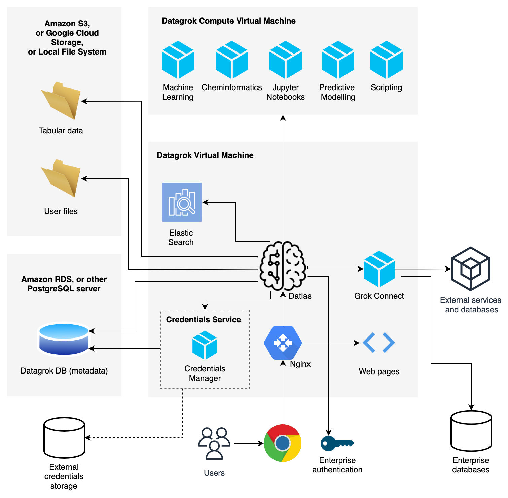

<!-- TITLE: Administration -->
<!-- SUBTITLE: -->

# Administration

The standard Datagrok AMI image comes with the production instance of Datagrok already configured, and we expect the
administration effort to be minimal if the default settings are used. However, there are plenty of parameter that can be
configured.

This document gives a brief overview of the platform's architecture, and describes the structure of the different
configuration files used by the platform.

## Overview



Datagrok AMI images consist of two virtual machines, "DatagrokVM" and "ComputeVM". DatagrokVM is a server that contains
everything necessary to run the platform. ComputeVM is a scalable service for scientific computations.

Datlas is the server-side part of the Datagrok platform. It is a Dart program that exposes a number of REST http
services used by the client part.

The client part is a single-page application (SPA) that runs in the browser, written in Dart and transpiled to
JavaScript. It gets loaded from the Nginx server located on the Datagrok machine. The same Nginx server also proxies
client's API calls to Datlas.

Datlas uses Postgresql database to store metadata. Tabular data and arbitrary files are stored on disk. Both storages
can be configured to use other implementations. Cloud services such as Amazon S3 can be used as storage, and managed
cloud database can be used instead of the local Postgresql instance. Documentation on that topic will be available soon.

For connectivity to 20+ databases, Grok Connect service is used. It is a Java program that resides on the Datagrok
machine, and exposes a REST endpoint that is used by Datlas.

Script execution, predictive modeling, scientific computations, and other computationally-intensive tasks are processed
on the ComputeVM machine(s). These machines have a number of specific tools and frameworks installed (such as Jupyter,
OpenCPU, H2O) and configured in a way to be used by Datlas and web client. ComputeVM is a stateless service, and can
therefore be easily scaled.

### Config files folder

Config files folder is a special folder where Datlas startup information is located. See config files description below.
GROK_CFG environment variable must point to the config folder, and server.config.json must be present.

On the standard Datagrok AMI image, this folder is /home/datagrok/cfg

### Data folder

A folder (pointed to by the GROK_ROOT variable) is used as an operational data storage. Also, it can be used as a
persistence storage for the project's tabular data, if Datlas is configured to use disk storage. Under the data folder,
there are folders corresponding to the server instances (typically dev/test/prod). Under these folders, server plugin
folders are located.

On the standard Datagrok AMI image, this folder is /home/datagrok/data

## Instance configuration

It is possible to run more than one instance of Datagrok, each one associated with its own database, storage, users,
configurations, etc. These instances are completely isolated from each other. Refer to
the [command-line interface](#command-line-interface) section for information on how to start a particular instance.

On the standard Datagrok AMI image, there is only one 'prod' instance. In cases if a company is doing custom development
on top of the Datagrok platform, it is common to have three environments:
dev, test, and prod.

Below is the explanation of the configuration fields in the "server.config.json" file. Note that comments are not part
of the file, and "*" means that a parameter is mandatory.

------------------------------------

| Field            | Default                   | Description                                                                                                                       |
|------------------|---------------------------|-----------------------------------------------------------------------------------------------------------------------------------|
| name             |                           | Instance name                                                                                                                     |
| port             | 8082                      | Port to listen                                                                                                                    |
| servicePort      | 8083                      | Service port that is used to control Datlas instance with command-line interface                                                  |
| useSSL           |                           |                                                                                                                                   |
| certPath         |                           | Path to the TLS certificate. See also [useSSL].                                                                                   |
| certKeyPath      |                           | Path to the TLS certificate key                                                                                                   |
| certKeyPwd       |                           | Password to the TLS certificate key                                                                                               |
| isolatesCount    | 1                         | Number of threads to use                                                                                           |
| dataDir          |                           | Name of the data folder under GROK_ROOT                                                                                           |
| storageCert      |                           | Access certificate to Google Cloud Storage. If set, GCS will be used for persistent data storage                                  |
| dbConfig         | Database config filename |                                                                                                                                   |
| deployConfig     |                           | Deployment steps configuration file                                                                                               |
| debug            | false                     | Extended logging and saving stack traces                                                                                          |
| webRoot          |                           | Http address to client-side, as users see it. Used for generating links in emails, etc.                                           |
| apiRoot          |                           | Http address to Datlas API, as client sees it.                                                                                    |
| packagesPath     |                           | Path to a folder where Datlas stores user-generated JavaScript packages. It must be exposed to the client-side as /grok_packages. |
| processSchedule  | false                     | Processing of scheduled tasks (such as DataJobs)                                                                                  |
| checkHealth      | false                     | Periodical self-health-check requests.                                                                                            |
| postTestTracking |                           | Post unit test results to public.datagrok.ai                                                                                      |
| postMetrics      |                           | Post metrics to public.datagrok.ai                                                                                                |

`db.admin.json` contains db connection credentials that are used to create a Datagrok database instance.

```
{
     "dbServer": "localhost",
     "db": "postgres",
     "login": "postgres",
     "password": "postgres",
     "port": 5432
   }
```

`email.json` is a config file to store email credentials:

```
{
  "host" : "smtp.mailgun.org",
  "port" : 465,
  "user" : "postmaster@m.datagrok.ai",
  "password" : "",
  "secured" : true
}
```

Every instance config section points to its own `db.<instance_name>.config.json` file that contains credentials for
connecting to the corresponding Postgres database.

## Tasks

Datlas has built-in ability to run various tasks, such as creating a database, deployment of sample datasets, batch
deployment of user credentials, etc.

Standard Datagrok AMI image ships with all necessary deployment tasks already executed. However, having the capability
to re-execute particular tasks could be useful.

Every instance points to the task configuration file: deploy.config.json. Tasks specified in that file get executed on
each server startup. Typically, only one "updateDb" step should be used for a normal startup.

All values have default "false" values.

---

| Parameter                 | Description                                                                                    |
|---------------------------|------------------------------------------------------------------------------------------------|
| createDb                  | Create a Postgres database with metadata that is needed for Datlas                             |
| updateDb                  | Update database schema                                                                         |
| buildResources            | Build plugins resources                                                                        |
| createAdminUser           | Add 'admin' user with all privileges                                                           |
| createTestUser            | Add a user that is used for unit testing                                                       |
| createSeleniumUser        | Add a user that will be used when executing selenium UI tests                                  |
| createBetaUsers           | Register users from the beta_users.csv file                                                    |
| createDatabaseTestJobs    | Create data jobs for connecting to various data sources, such as Oracle, SQL Server, or Hadoop |
| deleteDataFolder          | Delete data folder before deploying                                                            |
| importRDatasets           | Import 'r datasets' into the platform                                                          |
| importClinDatasets        | Import 'clinical datasets' into the platform                                                   |
| importMoleculeNetDatasets | Import 'moleculenet datasets' into the platform                                                |
| createDemoDatabases       | Import test databases (Chembl, Unichem, Northwind, World) in Postgres                          |
| dropDemoDatabases         | Drop demo databases in Postgres                                                                |
| deployFAQTopics           | Deploy FAQ topics                                                                              |
| deployDemoModels          | Deploy demo predictive models                                                                  |
| deployDemoScriptRuns      | Deploy demo script runs                                                                        |
| deployDemoProjects        | Deploy demo projects located under /db/demo/projects                                           |
| deployDemoActivity        | Deploy demo activity (such as sharing datasets, commenting, kicking off jobs, etc)             |
| heavyDeployConfig         | Config to deploy large number of entities (for load testing purposes)                          |
| importTablesFromFiles     | (used for upgrading datasets when d42 format gets changed)                                     |
| importChats               | Import exported chats                                                                          |
| clusterTables             | Set Postgres tables clusterization                                                             |

## Updates

To update to the latest production version of the platform, execute the following commands on the DatagrokVM:

```
sudo /home/datagrok/download_grokconnect.sh
sudo /home/datagrok/download_datagrok.sh
```

Either command downloads the corresponding zip file, stops the server, replaces the executables, and restarts the
server.

The update will affect platform only; existing objects, such as datasets or data connections, will not be affected.
Specifically, the following parts will be updated:

* Datlas executables
* Java-based data connectors
* Web client
* Documentation
* Standard resources that get shipped with the platform

At the first start after the update, the platform will detect the change, and perform all necessary actions (such as
upgrading database schema) if needed.

The current procedure for updating a ComputeVM is via spinning out a new AMI image.

In the future, we are planning to improve the update mechanism in a few ways:

* Web-based administration
* Automatic updates

## User management

Open `Admin | Users` to see a list of currently registered users. To add new users, use one of the following links
located on the left panel:

* `Add User...`, followed by `Set password` - create a user with the specified login/password.
* `Invite a Friend` - send an invitation email with the self-registration link.

For enterprise deployments, ActiveDirectory authentication is supported. Documentation on that will be available soon.

Please reach out to us regarding single sign on options, if this is your preferred authentication method.

## Command-line interface

---

| Action    | Command                             | Description                                     |
|-----------|-------------------------------------|-------------------------------------------------|
| Start     | dart server.dart start              | Datlas starts listening to incoming connections |
| Stop      | dart server.dart stop               |                                                 |
| Restart   | dart server.dart restart            |                                                 |
| Run tasks | dart server.dart deploy -c <config> |                                                 |

For instance, to start "prod" and "test" instances:

```
dart server.dart -c prod start
dart server.dart -c test start
```

To run deployment tasks:

```
dart server.dart deploy -c prod_deploy
```

See also:

* [Architecture](../develop/admin/architecture.md)