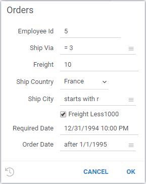

<!-- TITLE: Parameterized Queries -->
<!-- SUBTITLE: -->

# Parameterized Queries

A parameterized query is a query with one or more parameters. When the query is
executed from the UI, a user is prompted to enter parameters. It is also possible
to run a query programmatically with the specified parameters 
(see [code snippet](https://public.datagrok.ai/js/samples/data-access/parameterized-query)). 

## Creating a parameterized query

To create a parameterized query, open **File | Connect to Data**, right-click
on the connection, and select **Add Query**. After that, annotate parameter 
information in the query header. Below is an example of a simple query that
defines a "productName" parameter:

```$sql
--input: string productName
select * from products where name == '@productName'
```

## Syntax

The syntax for defining query parameters is based on [Scripting](../../compute/scripting.md), 
with some additions specific to queries.

### Header parameters

| Parameter   | Description                        |
|-------------|------------------------------------|
| name        | Name                               |
| description | Description                        |
| help        | Help URL                           |
| tags        | Tags                               |
| input       | Input parameter                    |

### Format template for 'input':

```
--input: <type> <name> = <value> {<option tag>:<value>; ...} [<description>]  
```

**type** - parameter type:

*   **int** \- integer scalar
*   **double** \- float scalar
*   **bool** \- boolean scalar
*   **string** \- string
*   **datetime** \- datetime

Comments style can be used '#' for Sparql.

### Options

Options for supported data typed are described in [Scripting](../../compute/scripting.md) section. 

| Option      | Description                              |
|-------------|------------------------------------------|
| choices     | Comma-separated list of choices  |
| suggestions | Name of the query to be called to generate suggestion as the user types the value  |     

"choices" option can be either a list, a name of the query, or the actual SQL query.

Examples:
```
--input: string shipCountry = France {choices: Query("SELECT DISTINCT shipCountry FROM Orders")}
--input: string shipCountry = France {choices: northwind:countries}
--input: string shipCountry = France {suggestions: northwind:countries}
```

This query can be used as a "suggestion" query. It accepts exactly one parameter,
which is what a user has typed in the input box so far:
```
--name: country
--input: string sub
SELECT DISTINCT shipCountry FROM Orders WHERE shipCountry LIKE '%' || @sub || '%'
```

#### Patterns

Sometime, we want to give users the possibility to enter the filtering criteria as 
a free text. On a server side, this query would be parsed and safely transformed to a proper
SQL clause. Check out [search Patterns](../../explore/data-search-patterns.md) for more details.

In this case, the input type has to be `string`, since the user will be entering 
free-text query, and the actual data type should be put in the `pattern` option. Then,
in the query, you would use `@<patternName>(columnName)` to specify a pattern that should
be evaluated against the specified column, like that:

```sql
--input: string orderDate = after 1/1/1995 {pattern: datetime}
select * from orders
where @orderDate(orderDate)
```

Patterns summary:

| Type             | Value       | Description/Example      |
|------------------|-------------|--------------------------| 
| num, int, double | =           | = 100                    |
|                  | >           | > 1.02                   |
|                  | >=          | >= 4.1                   |
|                  | <           | < 5                      |
|                  | <=          | <= 2                     |
|                  | in          | in (1, 3, 10.2)          |
|                  | min-max     | Range: 1.5-10.0          |
| string           | contains    | contains ea              |
|                  | starts with | starts with R            |
|                  | ends with   | ends with w              |
|                  | regex       | regex 1(\w+)1            |
|                  | in          | in (ab, "c d", "e\"f\"") |
| datetime         | anytime     |                          |
|                  | today       |                          |
|                  | this week   |                          |
|                  | this month  |                          |
|                  | this year   |                          |
|                  | yesterday   |                          |
|                  | last week   |                          |
|                  | last month  |                          |
|                  | last year   |                          |
|                  | before      | before July 1984         |
|                  | after       | after March 2001         |
|                  | min-max     | Range: 1941-1945         |


## Example

Here is an example of the parameterized query applicable to the "Northwind" database: 

```$sql
--input: int employeeId = 5
--input: string shipVia = = 3 {pattern: int}
--input: double freight = 10.0
--input: string shipCountry = France {choices: ["France", "Germany", "USA", "Finland"]}
--input: string shipCity = starts with r {pattern: string}
--input: bool freightLess1000 = true
--input: datetime requiredDate = 1/1/1995
--input: string orderDate = after 1/1/1995 {pattern: datetime}
SELECT * FROM Orders WHERE (employeeId = @employeeId)
   AND (freight >= @freight)
   AND @shipVia(shipVia)
   AND ((freight < 1000) OR NOT @freightLess1000)
   AND (shipCountry = @shipCountry)
   AND @shipCity(shipCity)
   AND @orderDate(orderDate)
   AND (requiredDate >= @requiredDate)
```

When this query is started, the following dialog with the auto-generated inputs appears.
Note that inputs marked as patters allow users to enter expressions like "> 5" for numbers,
"after 2019" for dates, and ""



Behind the scenes, Datagrok will parse the free-text query, and then execute a parameterized, safe, 
provider-specific SQL query on the backend.

See also:

  * [Data Query](../data-query.md)
  * [Search Patterns](../../explore/data-search-patterns.md)
  * [Function](../function.md)
  * [Scripting](../../compute/scripting.md)
