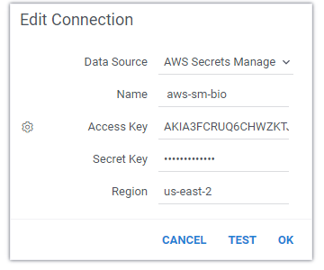
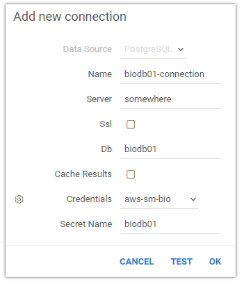
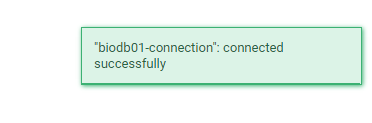

<!-- TITLE: Data connection credentials-->
<!-- SUBTITLE: -->

# Credentials

A data connection is associated with the access credentials (typically login/password). In Datagrok, these credentials
could be specified either manually by providing login/password (that gets stored in the
secure [Datagrok Credentials Management Service](../govern/security.md#credentials), or through integrating with the
Secrets Managers, such as AWS Secrets Manager.

## Specifying credentials manually

This basic option provides keeping encrypted credentials for any data sources in the protected service inside the
Datagrok platform.

## Secrets Managers

This option uses a Secret Manager to retrieve the actual credentials when needed. The primary purpose of a secret
management services is to allow you to decouple the storage of secrets from the code or configuration that consumes the
secrets. This decoupling supports centralization, revocation and rotation of passwords.

The Datagrok platform is integrated with storing secrets services:

* Amazon AWS Secrets Manager

The platform supports having several Secrets Managers Connection used by different groups. In these cases, specific
credentials for Data Source are stored in the Cloud Manager that is referenced by the specified Datagrok connection and
specified Secret Name. The specified Secret Name is defined in the AWS Secrets Manager.

## How to setup connection using AWS Secret Manager

Imagine that there is a Postgres database `biodb01` with the credentials `user01`/`password01`. First, let's create a
secret in AWS Secrets Manager, if it does not exist yet:

```shell
aws secretsmanager create-secret --name biodb01 --secret-string "{\"password\":\"password01\",\"login\":\"user01\"}"
```

Then, let's do the following in Datagrok:

1. Create connection `aws-sm-bio` to the AWS Secret Manager (later we can use this connection for other secret names)
   

2. Create a Postgres connection to database `biodb01` with name `biodb01-connection`. It is important to select
   `aws-sm-bio` created at the previous step and specify the correct secret name.
   

3. Click test to ensure that secret name is correct.
   

4. Click OK. This saves the connection, and you are ready to go!
