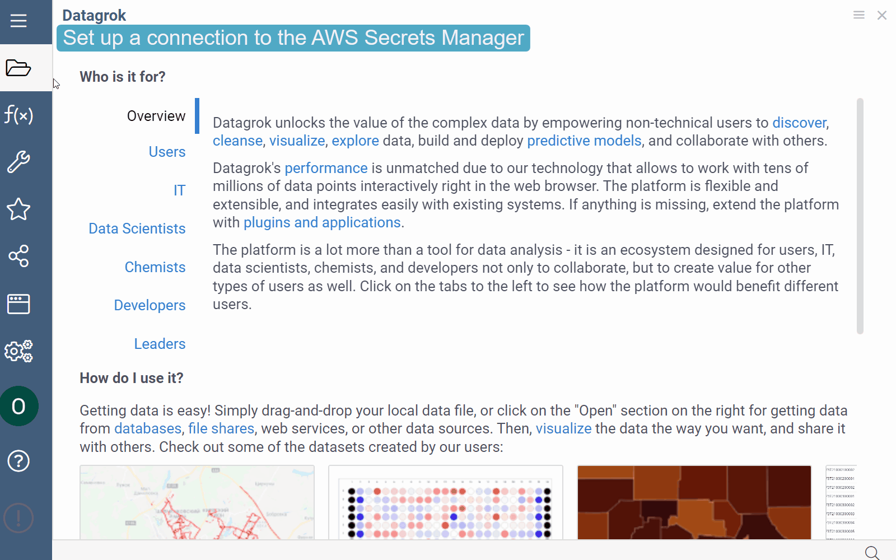

# Secrets Managers

When you [add a data connection](databases.md#adding-connection) you can use Amazon Web Services Secrets Manager to store, manage, and retrieve secrets. Alternatively, you can use the [Datagrok's Credentials Management Service](../govern/security.md#credentials).

## Setting up connection with AWS Secrets Manager

Prerequisites:

* In Datagrok:
  * A user role with _create connections_ and _edit connections_ privileges.
* In AWS:
  * An existing secret. For information on how to create a secret, see [Amazon's documentation](https://docs.aws.amazon.com/secretsmanager/latest/userguide/create_secret.html).
  * Permissions that allow you to view secrets in AWS Secrets Manager.

To use the AWS Secrets Manager in a database connection, follow these steps:

* _Step 1_. Set up a connection to the AWS Secrets Manager.
  1. Go to **Data > Databases**.
  1. In the **Toolbox** under **Actions**, select **Add new connection…** to open the **Add new connection** dialog.
  1. In the dialog under the **Data Source**, select **AWS** from the list of options.
  1. Paste the secret key and access key in the fields provided, name the connection, and fill in other connection parameters as appropriate.

   <!---->
  
  1. Click **TEST** to test the connection, then click **OK** to save it. If the connection fails, verify your secrets details.
* _Step 2_. Create a connection that will use the AWS Secrets Manager.
  1. Open the **Add new connection** dialog by repeating the actions described in Step 1 above.
  1. In the **Add new connection** dialog, under **Credentials**, select the name of the connection that you created in Step 1.
  1. Enter the Secret Name and other connection parameters in the fields provided.
  
  <!---->
  
  :::note

  You can set up connections to the AWS Secrets Managers for different user groups. Each connection has its own set of credentials which are stored in the Cloud Manager and which are identified by the specified Datagrok connection name and the Secret Name. The Secret Name is defined within the AWS Secrets Manager.

  :::

  1. Click **Test** to test the connection, then click **OK** to save it. If the connection fails, verify your connection details and that you added Datagrok's IP addresses to your allowlist.

For more information about using the AWS Secrets Manager, see the [Amazon Web Services Secrets Manager User Guide](https://docs.aws.amazon.com/secretsmanager/latest/userguide/introduction.html).

