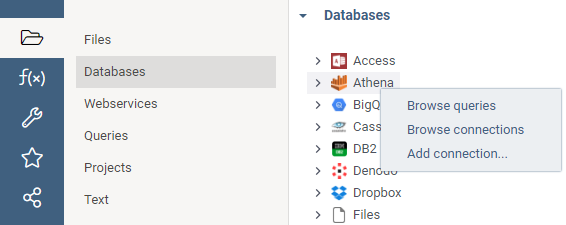
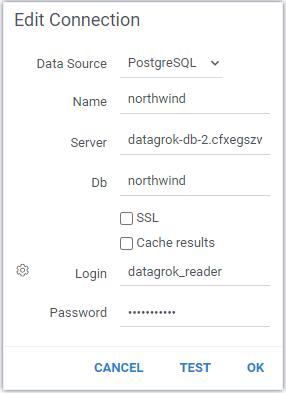

<!-- TITLE: Data connection -->
<!-- SUBTITLE: -->

# Data connection

Data connection is used for accessing data in a particular data source. Connection parameters depend on the data source.
Typically, you would need to provide server name and login credentials.

## Connectors

A connector could work with a database, an Excel file, a CSV file, a web service, or basically anything that is capable
of providing the data. We currently support over 20 different connectors, and the list is quickly growing. Most of our
data connectors are open-sourced and could be found on
[GitHub](https://github.com/datagrok-ai/public/tree/master/connectors) (MIT license).

| Name                                     | Type  |
|------------------------------------------|-------|
| [Access](connectors/access.md)           | JDBC  |
| [Athena](connectors/athena.md)           | JDBC  |
| [BigQuery](connectors/bigquery.md)       | JDBC  |
| [Cassandra](connectors/cassandra.md)     | JDBC  |
| [DB2](connectors/db2.md)                 | JDBC  |
| [Denodo](connectors/denodo.md)           | JDBC  |
| [DropBox](connectors/dropbox.md)         | Files |
| [Files](connectors/files.md)             | Files |
| [Firebird](connectors/firebird.md)       | JDBC  |
| [Git](connectors/git.md)                 | Files |
| [GoogleCloud](connectors/googlecloud.md) | Files |
| [HBase](connectors/hbase.md)             | JDBC  |
| [Hive](connectors/hive.md)               | JDBC  |
| [Hive2](connectors/hive2.md)             | JDBC  |
| [Impala](connectors/impala.md)           | JDBC  |
| [MariaDB](connectors/mariadb.md)         | JDBC  |
| [MongoDB](connectors/mongodb.md)         | JDBC  |
| [MS SQL](connectors/mssql.md)            | JDBC  |
| [MySql](connectors/mysql.md)             | JDBC  |
| [Neo4j](connectors/neo4j.md)             | JDBC  |
| [OData](connectors/odata.md)             |       |
| [Oracle](connectors/oracle.md)           | JDBC  |
| [Postgres](connectors/postgres.md)       | JDBC  |
| [Redshift](connectors/redshift.md)       | JDBC  |
| [S3](connectors/s3.md)                   | Files |
| [Snowflake](connectors/snowflake.md)     | JDBC  |
| [Socrata](connectors/socrata.md)         |       |
| [Sparql](connectors/sparql.md)           |       |
| [SQLite](connectors/sqlite.md)           | JDBC  |
| [Teradata](connectors/teradata.md)       | JDBC  |
| [Twitter](connectors/twitter.md)         |       |
| [Vertica](connectors/vertica.md)         | JDBC  |
| [Virtuoso](connectors/virtuoso.md)       | JDBC  |
| [Web](connectors/web.md)                 |       |

## Creating a connection

To create a new data connection, open the "Databases" pane (Open | Databases), right-click on the appropriate connector
in the tree, and choose "Add connection...". Alternatively, click on "New Connection" under the
"Actions" tab, and select the appropriate connector.



### Editing properties

Then, edit the connection attributes, and click on TEST to confirm that you've entered everything correctly. The set of
attributes you can edit depends on the connector. Typically, for JDBC-based connectors you can provide a custom
connection string (but do not enter login and password there, they will still be picked up from the corresponding
fields).



Once a connection is set up, you are ready to start creating queries. There are multiple ways to do so: manually or
programmatically.

Note that the platform supports [caching](#caching) of results.

## Credentials

Credentials required to access data sources should be defined in the setup connection.
Read more about credentials here: [Credentials](data-connection-credentials.md).

## Access control

Connections are first-class entities in the Datagrok platform, and as such are subjects to the standard checks and
routines performed against them whenever they are used in the specific context. Some of the most popular privileges
are: `view`, `edit`, `delete`, and `share`. Those privileges can be given to individual users, or
to [groups](../govern/group.md). For more information on the access privilege model, check
out [privileges](../govern/security.md#privileges).

Another “out of the box” feature that comes with connections being first-class entity is the audit trail for every
action performed against the connection. For details on that, check out [Audit](../govern/audit.md) page.

## Caching

You can force the platform to cache results of executing queries (taking into account parameters as well). This is
useful when a query executes slowly and returns relatively small results. A popular use case is caching the values that
are used for building the UI automatically
(typically this is some form of `select distinct <name> from <table>`) is a good idea.

You can turn caching on for either the whole connection, or for a particular query. For a connection, open
its [properties](#editing-properties), and check the "Cache Results" checkbox. When you check it, the "Invalidate On"
input becomes visible. Enter the
[cron expression](https://www.freeformatter.com/cron-expression-generator-quartz.html)
there to define cache invalidation timepoints (for instance, if a database refreshes overnight and you want to
invalidate it at 1am each night, enter `0 0 1 * * ?`). Leaving the field blank will make the cache stay forever.

If a connection gets created automatically as part of the package, you can specify the `cacheResults`
parameter in the connection json definition:

```json
{
  "name": "Northwind",
  "parameters": {
    "server": "dev.datagrok.ai",
    "port": 23306,
    "db": "Northwind",
    "cacheSchema": false,
    "cacheResults": true,
    "ssl": false,
    "connString": ""
  }
}
```

To cache results of individual queries, edit the query (either via Datagrok UI if a query already exists, or by editing
the corresponding .sql file of the package queries)
and specify the `meta.cache` and `meta.invalidate` fields:

```
--name: getProductNames
--input: string department
--meta.cache: true
--meta.invalidate: 0 0 1 * * ?
select distinct name from products p
where p.department = @department
```

## Filtering

You can use these fields to filter connections with [smart search](../overview/smart-search.md):

| Field       | Description                                 |
|-------------|---------------------------------------------|
| ID          |                                             |
| name        |                                             |
| server      |                                             |
| port        |                                             |
| db          |                                             |
| login       |                                             |
| dataSource  |                                             |
| description |                                             |
| createdOn   |                                             |
| updatedOn   |                                             |
| author      | [User](../govern/user.md) object            |
| starredBy   | [User](../govern/user.md) object            |
| commentedBy | [User](../govern/user.md) object            |
| usedBy      | [User](../govern/user.md) object            |

## JDBC connection

For some cases connection may require custom JDBC connection string. For this case, JDBC-based data connection has
parameter "Conn. string". If filled, it will be used for connection, and all other parameters will be ignored except
for "Login" and "Password".

## Videos

[](https://www.youtube.com/watch?v=dKrCk38A1m8&t=1048s)

See also:

* [Data pipeline](data-pipeline.md)
* [Data query](data-query.md)
* [Data job](data-job.md)
* [Function call](../overview/functions/function-call.md)
