# Databases

## Connecting to a database

> Key concept: [_Entity_](../datagrok/objects.md)
>
>Certain classes of objects in Datagrok have a standard set of operations that can apply to them. We call these
> objects _entities_. You can share _entities_, set permissions, annotate, reuse them in multiple ways, and more.
> Connections, queries, tables, and table columns are all Datagrok _entities_.
>
>Key concept: [_Function_](../datagrok/functions/function.md)
>
>Any action executed within Datagrok is a _function_. For example, a data query, a calculation, or sending an email are
> all _functions_. _Functions_ are scriptable and auditable, can be parameterized, used in automation workflows, and
> more.

### Database connection

A database connection lets you work with databases directly in Datagrok. You can connect to a supported database or a
relational database that uses a Java Database Connectivity (JDBC) driver.

Before you connect a database, the following prerequisites must be met:

* Datagrok has a connector to the data source. Out-of-the-box, Datagrok connects to all major databases. For the
  complete list of supported connectors, see [Connectors](supported-connectors.md).
  > Developers: You can create [custom connectors](https://github.com/datagrok-ai/public/tree/master/connectors).
  <!--need to create a How-to under Develop-->
* You must have the appropriate privileges to the database. If you don't have database privileges, contact the database
  administrator.
* You must be able to authenticate the connection (typically, with a username and password).

#### Add new connection

1. Go to **Data > Databases**.
2. In the **Database Explorer**, right-click the desired connector and select **Add connection…** A dialog opens.
3. Fill in the connection parameters.
   > Notes:
   >
   >For connections that support JDBC, you can use the _Conn. string_ parameter to enter a custom JDBC connection
   string. Leave all other parameter fields empty. You still need to enter credentials.
   >
   >You can enter credentials (typically, login/password) manually. When entered manually, Datagrok stores secrets in
   a [secure privilege management system](../govern/security.md/#credentials). You can also set up a connection using
   Datagrok's integration with the AWS Secrets Manager (
   see [Secrets Managers](data-connection-credentials.md/#secrets-managers) for details).
   >
   >To define who can change the connection credentials, select from the _Credential owner_ dropdown.
4. Click **TEST** to the connection, then click **OK** to save it.

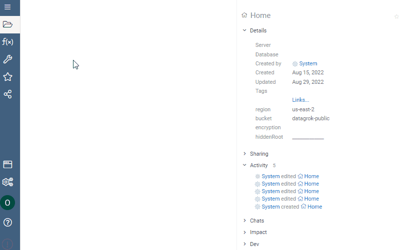

Once you connect a database, it appears in the **Database Explorer** under the data source it relates to. From there,
you can expand and view its content by double-clicking it.

### Modify a connection

1. Right-click the connection and select **Edit...** A dialog opens.
2. In the dialog, change the connection name, parameters, or credentials as needed.
3. Click **TEST** to test the connection, then click **OK** to save the changes.

> Tip: When you have the connection set up the way you want it, you can clone it and make additional changes as needed:
>
> 1. Right-click the connection and select **Clone...** A dialog opens.
> 2. Type in a name for the new connection and make other changes as needed.
> 3. Re-enter password or access keys.
> 4. Click **OK** to save the new connection.

## Database Explorer

Using **Database Explorer**, you can visually explore and inspect database connections and queries from within Datagrok.
In addition, where providers support it, you can browse and inspect schemas, tables, and table columns for relational
databases (double-click to expand).

**Database Explorer** works in tandem with context-driven _views_, such as **Context Pane** or **Help**, to provide
additional information: Clicking an object in **Database Explorer** updates the panes with object-specific details and
available actions. For example, when you click a table, you can see its metadata, dynamically preview the table's
content, run available queries and instantly preview the results, and do more.

> Note: A **Context Pane** is a key discovery _view_ in Datagrok. <!--TODO - move to a separate document-->
>
>Developers: **Context Pane** can be extended. You can add custom [info panels](../develop/how-to/add-info-panel.md)
> and [context actions](../develop/how-to/context-actions.md).

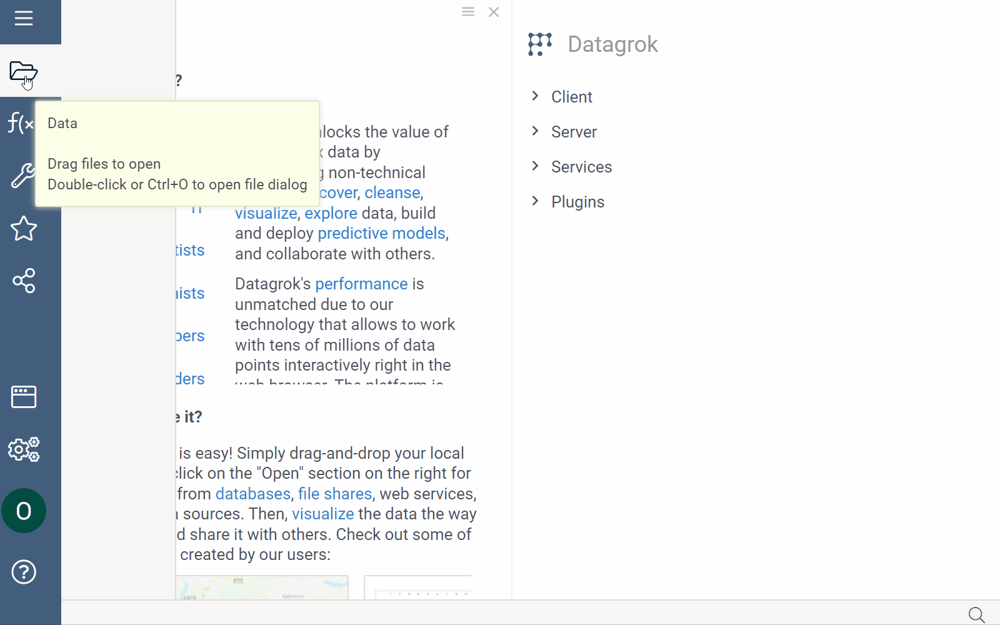

> Tip: You can reposition, resize, detach, or hide any pane. To learn more, see [Navigation](../datagrok/navigation.md).

See also:

* View<!--link out to a document when ready-->
* [Context Pane](../datagrok/navigation.md#properties).

### Schema Browser

**Schema Browser** provides a convenient way to simultaneously see all tables and associated columns. To open **Schema
Browser**, right-click the database connection and select **Browse schema**.

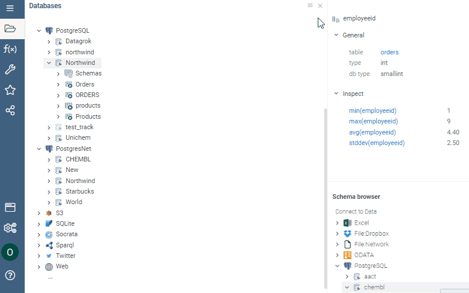

### Open schema as dataframe

You can explore a database schema from within Datagrok using an interactive spreadsheet. To do so, right-click the
database connection and select **Open schema as table**. This action opens the dataframe. You can further explore the
schema, cleanse and transform data, and more.

When you have the data set up the way you want it, you can persist the _layout_<!--add link when doc is ready--> or _
upload_ the dataframe<!--add a link to "Saving and sharing" when ready--> to the server for future use.

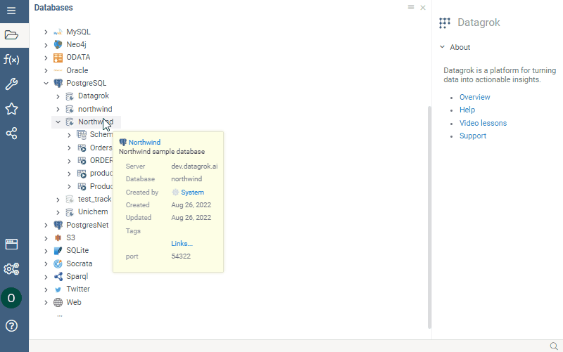

See also:

* [Dataframe](../datagrok/table.md)

## Querying databases

> Key concept: _Parameter_
>
>A _parameter_ is a piece of information you supply to a query right as you run it. Parameters can be used by themselves
> or as part of a larger expression to form a criterion in the query.
>
>Key concept: _Parameter pattern_ (or _Filter_)
>
>A _parameter pattern_ is a filtering criterion you add to a query to specify which items are returned when you run the
> query. Parameter patterns are similar to a formula — a string that may consist of field references, operators, and
> constants. To see the list of available patterns and learn how they work,
> see [Search patterns](../explore/data-search-patterns.md).

Once you have created a database connection, you can start querying it.

Datagrok provides several convenient interfaces for querying databases:

* [**Query View**](#query-view) is the primary interface for querying a database. Using **Query View**, you can write
  and edit SQL queries, add post-processing steps, and preview the results using an interactive spreadsheet.
* **Visual Query** is for querying tables. Use it to calculate, summarize, filter, and pivot table data (
  see [Create an aggregation query](#create-an-aggregation-query)).
* **Build Query** is also for querying tables. Use it to combine data from different tables (
  see [Create a join query](#create-a-join-query)).

> Note: Querying tables is provider-dependent and may not available for a given data source.

You can also use these built-in queries (available from the context menu):

* A **Get All** query retrieves all data.
* A **Get TOP 100** query retrieves the first 100 rows.

> Note: Context actions are also available from the **Context Pane**. To see the list of available actions, first,
> select a connection or table. Then, on the **Context Pane**, expand the **Actions** info panel. Alternatively, at the
> top of the **Context Pane**, locate the table name and click the **Down Arrow** control next to it.

Once you have created a query, it appears in the **Database Explorer** under the connection or table it relates to. You
can run it, share it with others, manage access, and more.

> Note: Context menus display actions available to you based on your permissions. If you don't see an action, contact
> your Datagrok administrator.
>
> Tip: While queries are mostly used to query databases, you can also query other data sources:
>
> | Data source          | Query                |
> |----------------------|----------------------|
> | Relational databases | SQL                  |
> | File share           | Filename             |
> | Excel file           | Sheet name           |
> | Linked data          | SPARQL               |
> | Box                  | Filename             |

### Query View

A **Query View** provides an interface for working with SQL queries. From the **Query View**, you can:

* Write and edit SQL queries.
* Add post-processing steps.
* Preview query output using an interactive spreadsheet or open the results as a table (
  see [Running queries](#running-queries)).
* Use **Context Pane** to get details on selected objects.
* Save the query for future use.

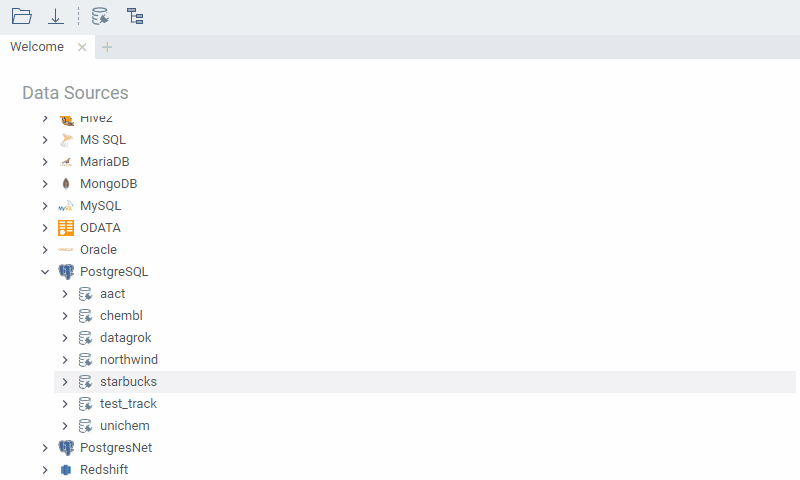

#### Open **Query View**

The **Query View** opens when you create or edit a query:

* To create a new query: (1) pight-click a database _connection_ and select **Add query** or (2) right click a _table_
  and select **New SQL Query...** (provider-dependent).
* To edit or clone an existing query, locate the query in the **Database Explorer** and right-click it to select **
  Edit...** or **Clone...**.
  > Tip: You can also search for queries using a built-in [smart search](../datagrok/smart-search.md) (go to **
  Data** > **Queries**).

#### Create and preview queries

Use the **Query** tab in the **Query View** to write a query. At any time, click the **Run** button on top to preview
the query output. Once the preview has been generated, it appears in the lower part of the **Query View**. You can
scroll through the dataframe, get details about objects, and more.

> Tip: You can also run a query by pressing the F5 key on a keyboard.

#### Add post-processing steps

On the **Transformations** tab:

1. Use the checkboxes provided to select the desired operation. When you select, a list of applicable functions appears
   to the right.
2. Click the desired function. A parameter dialog opens.
3. Set the parameters in the dialog, then click **OK**. The preview updates the output, and the transformation record
   appears in the **Transformation Log** on the left.

   > Tip: Use the menu ribbon to add or remove columns quickly.

4. Repeat steps 2 and 3 as needed.
   > Tip: To see the query output for each step, in the **Transformation Log**, click the associated transformation
   record. The preview area updates accordingly.
   >
   >To edit a transformation step, click the **Dropdown Arrow** control next to the transformation record and select
   from the menu.
   >
   >To remove the transformation record entirely, click the **Delete** icon.
5. When you have the query the way you want it, click **Save**.
   > Note: You can also open a query output in Datagrok to keep interrogating. To do so, in the bottom left corner of
   the **Query Tab**, click the **Dropdown Arrow** control and select **Add results to workspace**
   .<!--check about the tab, not sure-->

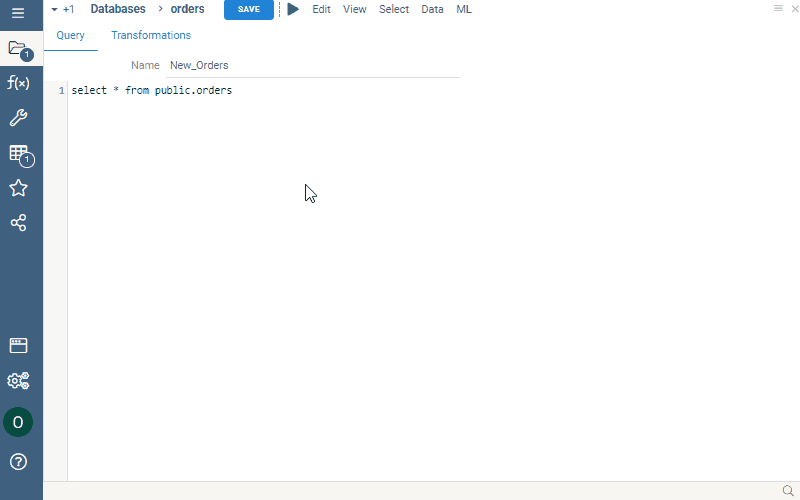

> Developers: You can create custom transformation functions in R, Python, or any other language.
> See [Scripting](../compute/scripting.md).

#### Create an aggregation query

An _aggregation_ query specifies which table columns you want and how to pivot and group them. To create an _
aggregation_ query, do the following:

1. From a table's context actions, select **Visual Query**. A **Visual Query** view opens.
2. First, specify the columns that remain the same to define the `GROUP BY` clause. Add them to _**Rows**_. These
   columns are keys, and their unique values become row identifiers.
3. Then, set the aggregation parameter to group and handle any non-unique data:
   * First, select the aggregation column: Next to **Measures**, click the **Add...** icon and select from the list.
   * Then, select the _aggregating function_: next to **Measures**, click the **Add...** icon again, and click **
     Aggregation...** to select from the list.
     > Note: The list of available functions may change depending on the provider and/or
     the [packages](../collaborate/public-repository.md) installed. If data source providers expose custom functions (for
     example, GIS functions exposed by PostreSQL), Datagrok makes them automatically available in the UI.
     >
     >Developers: You can [create custom aggregation functions](../compute/scripting.md).
   * Add additional parameters as needed. Each aggregation parameter takes its aggregating function. To edit or remove
     the parameter, right-click it and select the action from the context menu.
4. Finally, define the unique values you want to pivot from one column in the expression into multiple columns in the
   output. To do so, add the corresponding columns to _**Columns**_.
5. Optional. Add _**Filters**_ to specify which items are returned when you run a query.
6. As you work on your query, you can preview the results using a dynamic spreadsheet. When you have a query set up the
   way you want it, add the query **Name**, then click **Save**.

> Note: If you don't want to save a query, leave the **Visual Query** view without saving the query.

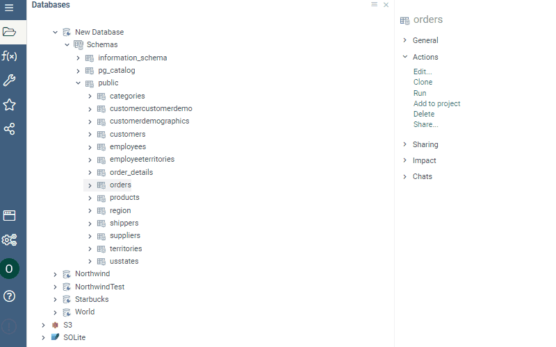

> Tip: At any time, open the query output as a dataframe for further inspection. To do so, click the **Run** button.

#### Create a join query

1. From a table's context actions, select **Query Builder**. A dialog opens. In the dialog, the platform displays a list
   of columns connected by keys.
2. Select the desired columns using the checkboxes provided. The platform generates an SQL query based on your selection
   and displays the query output in the preview box.
3. Optional. Manually edit the SQL query in the box provided. The preview of the query output updates automatically.
4. When you have a query set up the way you want it, edit the query **Name** if needed, then click **Save**.


> Tip: At any time, open the query output as a dataframe for further inspection. To do so, in the bottom left corner of
> the dialog, click the **Dropdown Arrow** control and select **Add results to workspace**.

### Parameterized queries

When you want a query to ask for input every time you run it, you can create a _parameterized query_. Doing so lets you
use the same query to retrieve data matching different criteria.

#### Query parameters

The syntax for defining query parameters is based on [scripting](../compute/scripting.md) with additions specific to
queries. All parameters are optional.

| Parameter      | Description, supported types                                                                                                                                   | Input template                                                              |
|----------------|----------------------------------------------------------------------------------------------------------------------------------------------------------------|-----------------------------------------------------------------------------|
| `name`         | Name                                                                                                                                                           |                                                                             |
| `friendlyName` | Friendly name                                                                                                                                                  |                                                                             |
| `description`  | Description                                                                                                                                                    |                                                                             |
| `help`         | Help URL                                                                                                                                                       |                                                                             |
| `tags`         | Tags                                                                                                                                                           |                                                                             |
| `input`        | `int` - integer number<br />`double`  - float number <br />`bool` - boolean<br />`string` - string<br />`datetime`- DateTime<br />`list<T>` - a list of type T | `--input: <type> <name> = <value> {<option>: <value>; ...} [<description>]` |
| `output`       | Output parameter                                                                                                                                               |                                                                             |

#### Add a parameter

1. Right-click a query and select **Edit**. A **Query View** opens.
2. In the **Query** tab, annotate parameters in the box provided using SQL/Sparql comments. Use `--` for SQL and `#` for
   Sparql.
   > Example:
   >
   >```sql
   >--input: string productName                                               
   >select * from products where productname = @productName
   >```

3. Click **Save**.

#### Input parameters

You have multiple options to define input parameters:

* Enter a single value.
* Use parameter _functions_:
  * **Choices**. _Choices_ are functions with no parameters that return a list of strings. To learn more about _choices_
    , see [Parameter choices](../compute/scripting.md/#parameter-choices). Example:

    ```sql
    --input: string shipCountry = "France" {choices: ['France', 'Italy', 'Germany']}
    ```

  * **Editors**. _Editors_ are functions that generate parameters from another _function's_ output. To learn more
    about _editors_, see [Parameter editors](../compute/scripting.md/). Example:

    ```sql
    --input: string shipCountry = "France" {choices: Query("SELECT DISTINCT shipCountry FROM Orders")}
    ```

  * **Suggestions**. _Suggestions_ are functions that take a string argument and return a list of matching strings. To
    learn more about _suggestions_, see [Parameter suggestions](../compute/scripting.md/#parameter-suggestions).
    Example:

    ```sql
    --input: string shipCountry = "France" {suggestions: Demo:northwind:countries}
    ```

  * **Validators**. _Validators_ are functions that take a value and check it against the specified criteria. When
    validation fails, _validators_ return a specified object and (optionally) an error message. To learn more about _
    validators_, see [Parameter validators](../compute/scripting.md/#parameter-validators).
* Reuse other parameters as parameter values. Example:

  ```sql
  --input: string firstLetter = "F"
  --input: string shipCountry = "France" {choices: Query("SELECT DISTINCT shipCountry FROM Orders WHERE shipCountry LIKE @firstLetter || '%')}
  SELECT * FROM Orders WHERE (shipCountry = @shipCountry)
  ```

* Use parameter _patterns_ to allow users enter free text to filter (supported for the `string` and `datetime`
  parameters only). Examples:

  Add filtering criteria for the column _freightValue_:

  ```sql
  --input: string freightValue = >= 10.0 {pattern: double}
  select * from Orders where @freightValue(freight)
  ```

  Add a filtering criteria for the column _orderDate_:

  ```sql
  --input: string orderDate = "after 1/1/1995" {pattern: datetime}
  select * from orders where @orderDate(orderDate)
  ```

> Note: You can persist the collected parameters to use them with more than one query.

### Running queries

Depending on your goals, use these methods to run a query:

* Run a query from within the **Query View**. Use this option to preview the query output when you write or modify
  queries.
* In all other cases, use the **Run** context action. The results are opened in Datagrok using a _dataframe_ or as
  otherwise specified by the output parameter. The context actions are available from the query's context menu or on
  the **Context Pane** under the **Actions** info panel.

> Note: When you need to return a value of a different data type, you can specify it in the output parameter.
>
> Example: Return a string with the semantic type `Molecule`:
>
> ```sql
> --output: string smiles {semType: Molecule}
> ```
>
> Developers: You can run a query programmatically (
> see [this code snippet](https://public.datagrok.ai/js/samples/data-access/parameterized-query?)).

When you run a _parameterized query_, Datagrok automatically generates a parameter dialog. For each input parameter,
there is an input control that prompts you to enter values (such as _calendar_ for dates, _checkbox_ for boolean, or it
can be a _button_ that launches a sketcher application to filter substructures). Datagrok automatically parses the entry
and executes a parameterized, secure, provider-specific SQL query on the backend.

> Example:
>
>```sql
>--input: int employeeId = 5
>--input: string shipVia = = 3 {pattern: int}
>--input: double freight = 10.0
>--input: string shipCountry = "France" {choices: Query("SELECT DISTINCT shipCountry FROM Orders")}
>--input: string shipCity = "starts with r" {pattern: string}
>--input: bool freightLess1000 = true
>--input: datetime requiredDate = "1/1/1995"
>--input: string orderDate = "after 1/1/1995" {pattern: datetime}
>SELECT * FROM Orders WHERE (employeeId = @employeeId)
>    AND (freight >= @freight)
>    AND @shipVia(shipVia)
>   AND ((freight < 1000) OR NOT @freightLess1000)
>    AND (shipCountry = @shipCountry)
>    AND @shipCity(shipCity)
>    AND @orderDate(orderDate)
>    AND (requiredDate >= @requiredDate)
>```
>
> 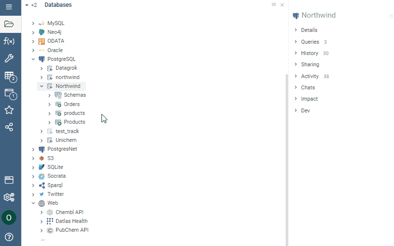
>
> Developers: You can expose the parameter dialog to end-users as an [application](../develop/how-to/create-package.md)
> .<!--Mention?: when the cartdridge is not deployed on that particular database, the query returns an error-->

## Access control and sharing

When you create a connection, it's visible to you only. Subject to your permissions, you can share connections with
others.

### Sharing and managing connections

To share a connection:

1. Right-click the connection and select **Share...** A dialog opens.
2. Enter the user or group you want to share with and set corresponding permissions.
3. Optional. Enter a description in the text field provided. You may also notify the users you share with. If you don’t
   want to send a notification, uncheck the **Send notification** checkbox.
   > Note: To send an email notification, enter the user's email in the identity/email field. The email notification
   contains a link to the shared item and entered description. If you enter a user or group name, they will be notified
   via the Datagrok interface.
4. Click **OK** to share. Once shared, the shared connection appears in the recipient's **Database Explorer**.

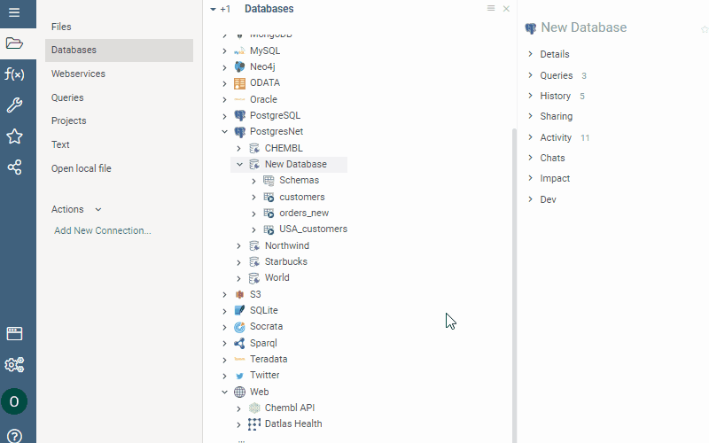

Subject to your privileges, you can use the **Context Pane** on the left to inspect and quickly adjust access
permissions to your databases, manage queries, view history and activity details, send comments to those you're sharing
with, and more.

1. First, select the database connection.
2. Then, navigate to the **Context Pane** on the left and expand the appropriate info panel (for example, expanding
   the **Share** info panels opens the list of users who can access the database).
3. Use the controls provided to manage users, access levels, and queries as needed.

> Tip: You can access the same list of actions from the connection's context menu. The context menu only displays
> actions available to you based on your permissions.

### Sharing and managing queries

To share a query, right-click the query and follow
the [steps for sharing database connections](databases.md/#sharing-and-managing-connections). Once shared, the shared
query appears in the recipient's **Database Explorer**. Use the **Context Pane** to manage access permissions, share
with more users, and more.

> Note: Datagrok query belongs to the database connection for which it's created. It means you can’t share a query
> without sharing a connection. Deleting a connection also deletes a query.

### Sharing query results as URL

To share query results as URL, first, run the query. Once the query is executed, copy the URL from the address bar.
Query parameters are encoded within the URL. Follow the link to _open_ the dataframe in Datagrok. To access the query
results from the link provided, users must have permissions to execute this query.

> Note: You can upload the dataframe to the server. When you do, you can store the data as a static snapshot.
> Alternatively, you can store it as a generation script, in which case the query is executed every time you open the
> project. To learn more about dynamic data updates in projects,
> see [Dynamic data](../datagrok/project.md/#dynamic-data).

<!--add gif-->

## Automation workflows

Datagrok provides a visual interface to automate manual, repetitive data ingestion, and data transformation tasks. For
more information on workflow automation, see [Data preparation pipeline](data-pipeline.md).

## See also

<!--* [Data sources](link)
* [Access control](link)
* [Customizations](link)-->

* [SPARQL query](sparql-query.md)
* [Socrata query](edit-socrata-query.md)

## Resources

* Videos
  * Database exploration
    * [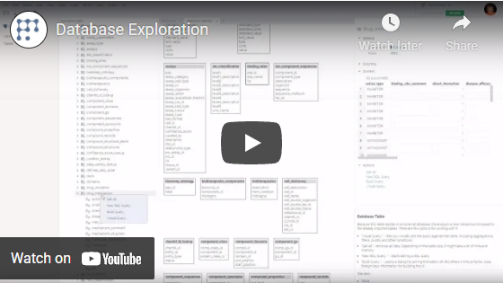](https://www.youtube.com/watch?v=YJmSvh3_uCM)
  * Parameterized queries
    * [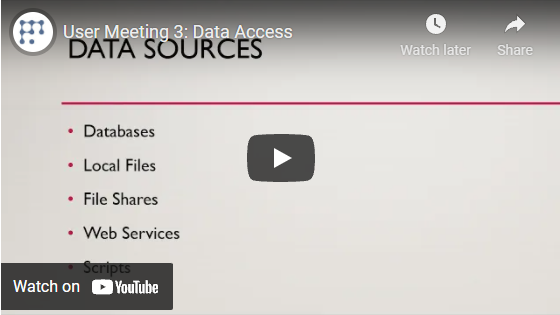](https://www.youtube.com/watch?v=dKrCk38A1m8&t=1980s)
    * [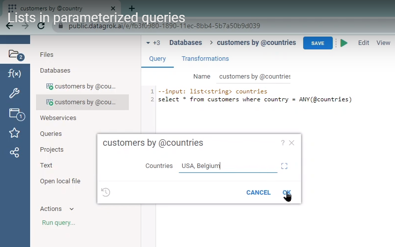](https://www.youtube.com/watch?v=meRAEF7ogtw)
    * [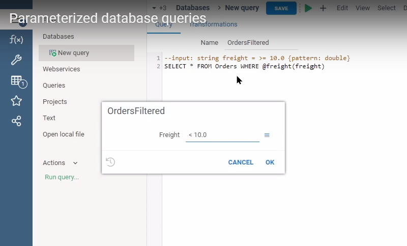](https://www.youtube.com/watch?v=sSJp5CXcYKQ)
* Tutorials
  * [Adding parameters to functions](../datagrok/functions/func-params-enhancement.md)
