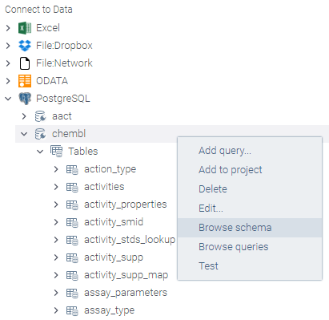

<!-- TITLE: DB exploration -->
<!-- SUBTITLE: -->

# DB exploration

Grok supports visual exploration of relational databases for some of the database providers, including PostgreSQL,
MySQL, MS SQL, Maria DB, and Oracle. If a provider supports it, you'll see '
Browse schema' command for the corresponding connection:

## Schema browser

Schema browser visualizes all tables with all columns at once, giving you a high-level overview of the database. Click
on a table to see its details in the property panel; it is also a good starting point for drill-downs and further
exploration. The following quick actions are there:

## Hierarchy browser

Grok lets you visually explore both database schema and database content. Simply click on the item (
such as connection, table, or column) in the "File | Connect to data" pane to bring up item's properties in
the [property panel](../overview/navigation.md#properties).

## Tips and tricks

### Context actions for db columns

In case you want to retrieve only some of the columns, select them (Shift+click) in the schema, and then use context
actions that appear in the property panel

### Videos

See also:

* [DB visual query](db-visual-query.md)
