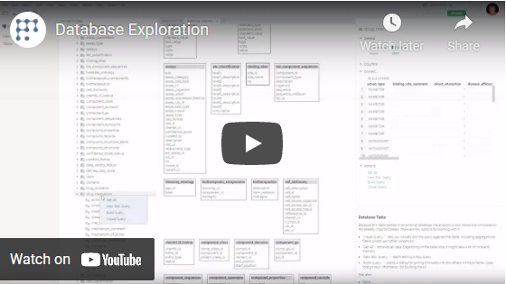

Use the standard [data aggregation tool](../transform/aggregate-rows.md) it to visually query datasets that reside in a
database. Note that the actual data aggregation will be performed on a server. This feature is supported for all
relational [data connectors](data-connection.md).

## Videos

See also:

* [Data query](data-query.md)
* [Query Builder](query-builder.md)
* [DB exploration](db-exploration.md)
* [DB Schema Browser](db-exploration.md#schema-browser)
