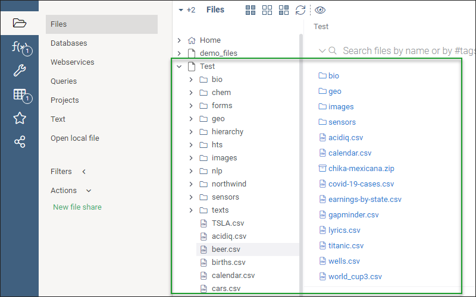
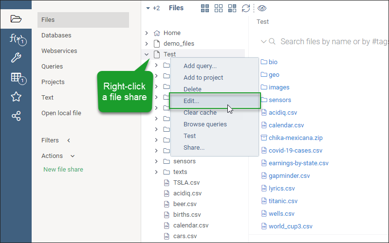
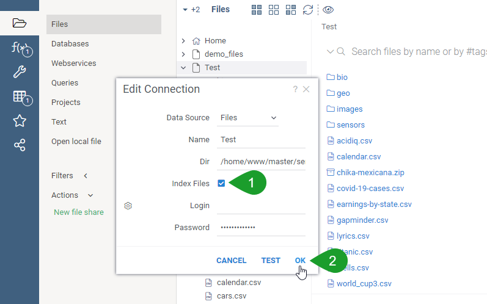
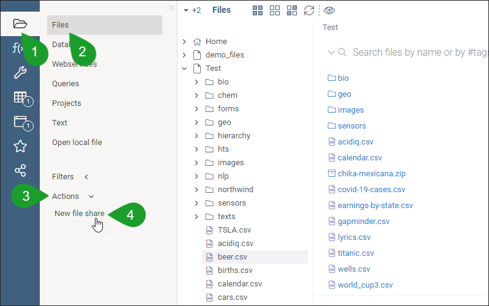
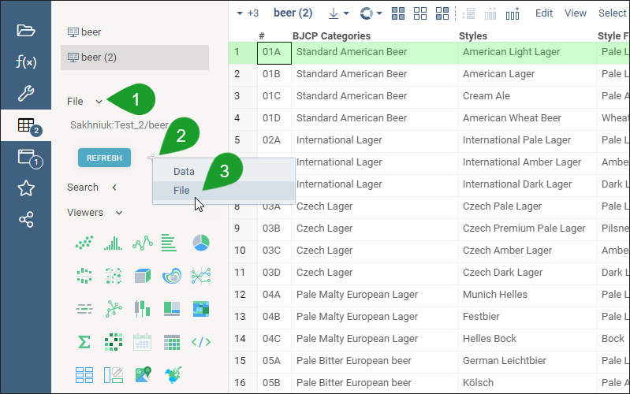
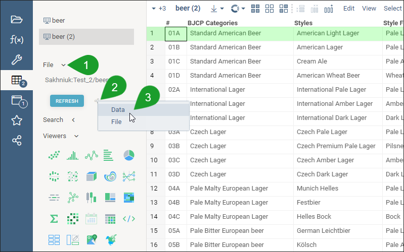

<!-- TITLE: File browsing and sharing -->
<!-- SUBTITLE: -->

# File browser and file shares

* [Overview](#overview)
* [File shares](#file-shares)
* [Security](#security)
* [Indexing](#indexing)
* [Adding a file share](#adding-a-file-share)
  * [File share options](#file-share-options)
* [Sharing a file](#sharing-a-file)
  * [Sharing a file as table (dataframe)](#sharing-a-file-as-a-table-dataframe)

## Overview

Datagrok features a File Browser to let you access the files that you uploaded or that were shared with you by other
users. The File Browser shows a tree view of folders with files.

Datagrok supports file uploading not only from your computer, but also from other data sources:

* Local file system (your computer)
* Dropbox
* Git
* GitHub
* Google Cloud (Storage)
* Amazon S3

After you configure and connect a data source, the selected folder with files from the data source will appear in the
File Browser. After that, you can double-click a file in that folder in Datagrok to view the content.

By default, Datagrok creates the root **Home** folder in the File Browser, but you can also create other folders.

## File shares

Put simply, a **File share** is a shared folder in the File Browser. Any folder in the File Browser can become a File
Share.

> **Advanced Info**: In Datagrok, a file share is a [data connection] &mdash; a set of configurations that define how
> you access data in a particular data source. Each supported data connection has its own configurations.

## Security

The files and folders that you connect to Datagrok from any data source are hidden from other users by default. You can
create a [dedicated file share] to let selected users or user groups access your files.

## Indexing

Datagrok indexes the files within a file share every hour to make sure that the files appear in search results, making
it easier for Datagrok users to search for datasets. For example, thanks to indexing, users can quickly browse columns
in an Excel file that resides within a .zip file.

It's also possible to search for tables based on [metadata] that was extracted from the file during indexing. For
example, you can search for tables that were created in the last month and have at least two columns &mdash; one column
containing molecules and another column named "activity". More than that, you can search across all or specified data
providers at once.

Datagrok extracts the following information from the indexed file:

* Filename
* File size, in bytes
* Number of rows and columns
* Column-level information such as name, data type, and [semantic type](../discover/semantic-types.md)

To turn on indexing for a file share, select **Index Files**
when [adding a file share](#adding-a-file-share). You can also turn on indexing later via the context menu:

1. In the File Browser, right-click a file share, and then select **Edit**.
   > **Note**: You can turn on indexing only for a file share, not for a folder inside a file share.
   

2. In the **Edit Connection** dialog, select **Index Files**, and then select **OK**.
   

### Supported tabular formats

Datagrok's indexing mechanism understands the following file formats:

| Extension  | Description                                      |
|------------|--------------------------------------------------|
| .txt       | Plain text                                       |
| .csv       | Comma-separated values                           |
| .tsv       | Tab-separated values                             |
| .xml       | Extensible Markup Language                       |
| .json      | JavaScript Object Notation                       |
| .HTML      | HyperText Markup Language                        |
| .xlsx      | Excel                                            |
| .edf       | European Data Format                             |
| .sas7bdat  | SAS database file                                |
| .kml, .kmz | Keyhole Markup Language (geographic annotations) |
| .rds, .rda | R Data Format                                    |
| .h5        | Hierarchical Data Format                         |
| .nc        | NetCDF                                           |
| .mat       | MATLAB MAT                                       |
| .d42       | Datagrok project                                 |
| .zip       | ZIP archive                                      |
| .gz, .gzip | gzip                                             |
| .tar       | Tape archive                                     |
| .ipynb     | Jupyter Notebook                                 |

## Adding a file share

While you *can* use the default **Home** folder as a file share, it's best that you create a dedicated, individual
folder to share your files. You can either create a sub-folder under the root **Home** or create a new file share next
to **Home**.

To create a new file share:

1. In the side panel on the left, select the **File** icon > **Files** > **Actions** > **New File Share**.
   

2. In the **New File Share** dialog, select the needed data source, enter a name for the file share, and then select
   **OK**.
   > **NOTE**: To verify if Datagrok has established the connection to the selected data source, select **Test**. In the
   > dedicated dialog, Datagrok will show if the connection was created.
   

Datagrok will add a new folder, and you can then create additional folders in it to structure your files.

### File share options

While each data source requires its own configuration, most of the configuration options are similar across data
sources. Refer to the next table for more information.

| Option      | Description                                                                        |
|-------------|------------------------------------------------------------------------------------|
| Data source | Source from which Datagrok creates a folder structure in the File Browser          |
| Name        | Name for the folder                                                                |
| Dir         | Directory from the data source that you want Datagrok to pull from the data source |
| Index files | Option to run indexing on the files                                                |
| Scope       | Datagrok user or group who can see credentials                                     |
| Login       | Login to the data source                                                           |
| Password    | Password to data source                                                            |

## Uploading a file

To upload a file from your computer to Datagrok:

1. In the sidebar on the left, select the **File** icon > **Files**, and then select the needed folder in the file
   browser.

2. From your computer, drag a file or files into the working area.

## Sharing a file

Datagrok lets you share any file from the File Browser as long as the file is located in a file share. There are two
ways to share a file:

* Share a file from the data source. In this case, you need to share a folder, where the file is located, then copy the
  direct link to the file, and send this link to the needed user. The user will obtain access to the file in data source
  via Datagrok.
* Share a file as table (a dataframe) from the Datagrok server. In this case, you only need to share a folder with
  another user, and Datagrok will send a direct link to the file in the folder. When the user follows the link, the file
  data will be loaded from the server.

> **Note**: Datagrok doesn't share a file directly &mdash; you need to share a connection (a file share or a folder within
> a file share) that contains the file. Avoid sharing the root **Home** folder, because the other Datagrok user will be
> able to access any files that you uploaded to Datagrok if you shared at least one file from **Home**.
> Instead, it's best to create a file share next to or under the root **Home**, upload files to that file share, and
> then share that folder with the users.

To share a file:

1. In the sidebar on the left, select the **File** icon > **Files**, open the needed folder, and then double-click the
   needed file.
   

2. In the sidebar on the left, select the **Share** icon, and then select **File**.
   

3. In the **Share file** dialog, select **Share folder as a new connection**, enter the email or name of the user or
   group (1) you will share the file with, select the **Can view** or **Can edit** permission (2), optionally, enter a
   description (3), and then select **OK** (4).
   > You can optionally select **Send notifications** so that the user or group will receive a message in Datagrok after
   > you shared a connection with them.
   

### Sharing a file as a table (dataframe)

Datagrok saves the files you uploaded to the server. When you share a file as table, Datagrok will send a link to the
user. After the user clicks on the link, the data from the file is automatically loaded to the browser from the Datagrok
server.

To share a file as table:

1. In the side panel on the left, select the **File** icon > **Files**, open the needed folder, and then select the file
   to share.
   

2. In the side panel on the left, select the **Share** icon, and then select **Data**.
   > **Note**: If you need to share your file as a data table, select the *Data* option.
   

3. In the **Upload project** dialog, select **OK**.
   > **Note**: You can also enter an optional description, remove the sheets or pages that you don't need to share, and
   > turn on **Data sync**.
   

4. In the **Share {document type}** dialog, enter the email or name of the user or group (1) you will share the file
   with, select the **Can view** or **Can edit** permission (2), enter an optional description of the file share (3),
   and then select **OK** (4).
   

## Videos

## Related topics

* [Data connection](data-connection.md)
* [Dedicated file share]
* [Data connection]
* [Uploading a project]

[Dedicated file share]: #file-shares

[Data connection]: https://datagrok.ai/help/access/data-connection

[Uploading a project]: https://datagrok.ai/help/datagrok/project#uploading-a-project
