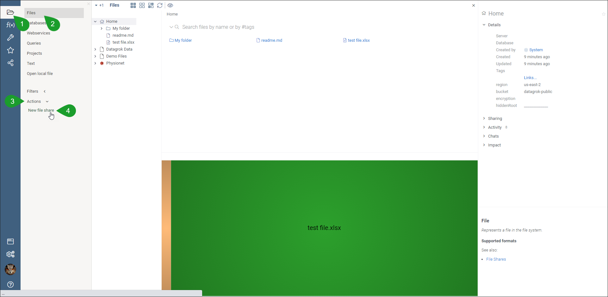
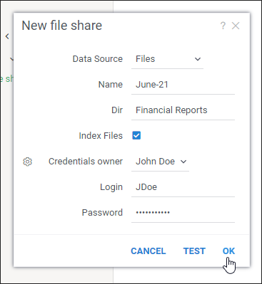
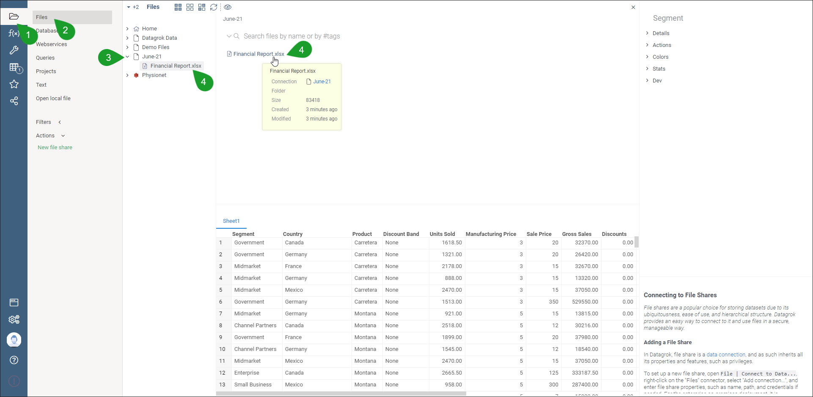
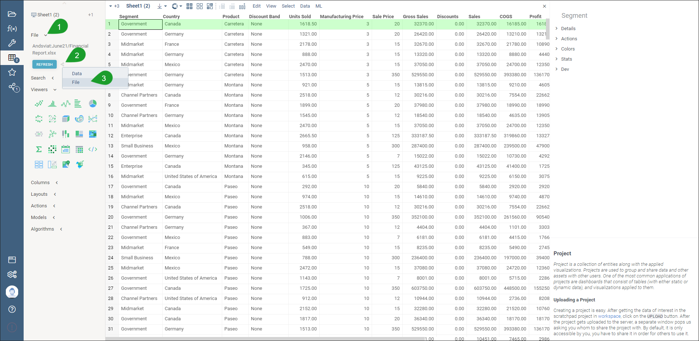
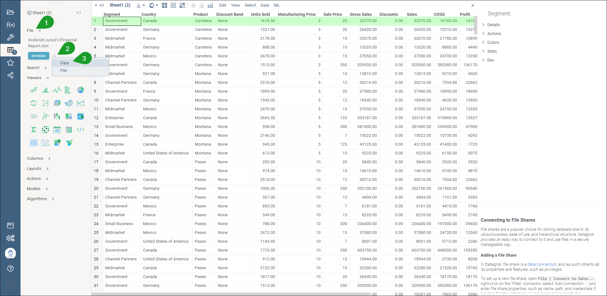
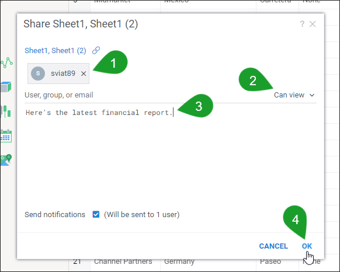

# File Browser

* [Overview](#overview)
* [Creating the File Storage](#creating-a-file-share-folder)
* [Sharing a File](#sharing-a-file)
    * [Sharing a File](#sharing-a-file)
    * [Sharing a File as Data Frame](#sharing-a-file-as-data-frame)

## Overview

Datagrok features a file browser to let you access the files that you uploaded to Datagrok or that were shared with you
by other users.

To upload your files to Datagrok, you only need to drag a file from your computer to the file browser. Additionally, you
can upload files not only from your computer but also from other data sources.

Overall, Datagrok supports the following data sources:

* Local file system (your computer)
* Dropbox
* Git
* GitHub
* Google Cloud (Storage)
* Amazon S3

After you connect Datagrok to a selected data source, the entire folder hierarchy from the data source will appear in
the file browser within Datagrok. You can then double-click the file of interest to view its content.

By default, Datagrok creates for you the root **Home** folder, but you can also create other folders to manage your
files.

## Creating a File Share (Folder)

While you _can_ use the default **Home** folder to store the files for sharing, it's best that you create a dedicated,
individual folder for that purpose. You can either create a folder under the root **Home** or create an entirely new folder
next to **Home**. If you opt for the second option, you need create a new _file share_ (a folder).

To create a new file share:

1. In the side panel on the left, select the **File** icon > **Files** > **Actions** > **New file share**.

2. In the **New file share** dialog, select the needed data source, enter a name for the file share, and then select **Ok**.
   >**NOTE**: To verify if Datagrok has established the connection to the selected data source, select **Test**. In the
   > dedicated dialog, the system will show if the connection is created.

Datagrok will add a new folder with the specified name next to the root **Home** folder, and you can then create
additional folders in this folder you created.

## Uploading a File

To upload a file from your computer to Datagrok:

1. In the side panel on the left, select the **File** icon > **Files**, and then select the needed folder in the file
   browser.
2. From your computer, drag the file or files into the working area.

## Sharing a File

Datagrok lets you share any file as _data_ or _file_ from the file browser.

> **Note**: Datagrok doesn't share a file directly&mdash;you need to share a connection (a folder) that contains the
> file. Avoid sharing the root **Home** folder, because the other user will be able to access any files that you
> uploaded to Datagrok. Instead, you can create a new file share (a folder) next to or under the root **Home**, upload
> your files to that folder, and then share that folder.

To share a file:

1. In the side panel on the left, select the **File** icon > **Files**, go to the folder where your file is located,
   and then double-click the needed file.

2. In side panel on the left, select the **Share** icon, and then select **File**.
   > If you need to share your file as a file, select the *File* option.

3. In the **Share file** dialog, select **Share folder as a new connection**, enter the email or name of the user or
   group (1) you will share the file with, select the **Can view** or **Can edit** permission level (2), enter an optional
   description (3), and then select **Ok** (4).
   > You can optionally enter a message that the user or group will receive after you share a connection with them.

### Sharing a File as Data Frame

To share a file as data:

1. In the side panel on the left, select the **File** icon > **Files**, open the needed folder, and then select the
   file to share.

2. In the side panel on the left, select the **Share** icon, and then select **Data**.
   > **Note**: If you need to share your file as a data table, select the *Data* option.

3. In the **Upload project** dialog, select **Ok**.
   > **Note**: You can also enter an optional description, remove the sheets or pages that you don't need to share, and turn on
   > **Data sync**.

4. In the **Share {document type}** dialog, enter the email or name of the user or group (1) you will share the file with,
   select the **Can view** or **Can edit** permission level (2), enter an optional description of the file share (3),
   and then select **Ok** (4).

