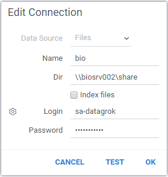

<!-- TITLE: File shares -->
<!-- SUBTITLE: -->

# Connecting to file shares

File shares are a popular choice for storing datasets due to its ubiquitousness, ease of use, and hierarchical
structure. Datagrok provides an easy way to connect to it and use files in a secure, manageable way.

## Adding a file share

In Datagrok, file share is a [data connection](data-connection.md), and as such inherits all its properties and
features, such as privileges.

To set up a new file share, open `File | Connect to Data...`, right-click on the
"Files" connector, select "Add connection...", and enter file share properties, such as name, path, and credentials if
needed. For the enterprise on-premises deployment, it is recommended to use a service account.

To make this folder [indexable](#indexing), select the `Index files` checkbox.

Once the connection to a file share is created, it is accessible by the creator only. To share it with others,
right-click on the connection, and select "Share...".

Expand the connection Node.js to browse files.

## Browsing files

There are multiple ways to browse file shares. Open `File | Connect to Data...`, and expand the corresponding connection
under the 'Files' section.

Double-click on CSV file to open it in the platform, or right-click to see additional options, such as downloading the
content as a ZIP file.

## Indexing

Indexing the content of a file share will let users find datasets of interest easier, as indexed files appear in the
file search results. The following information gets extracted from CSV files during the indexing:

* Filename
* File size in bytes
* Data dimensions (number of rows and columns)
* Column-level information (name, data type, [semantic type](../discover/semantic-types.md))

Internally, file share indexing is done as a recurrent [job](data-job.md).

To enable indexing, set the `Index files` flag in the
[connection properties](#adding-a-file-share).

## Videos

See also:

* [Data connection](data-connection.md)
* [Indexing file shares](files-indexer.md)
* [Data job](data-job.md)
