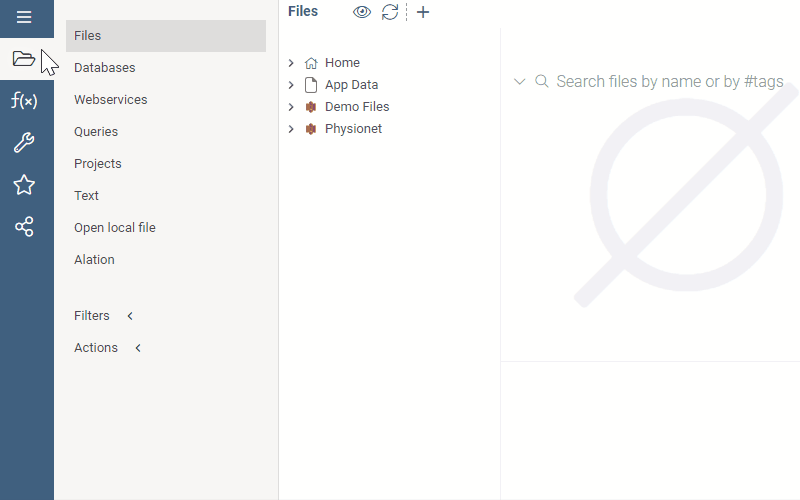
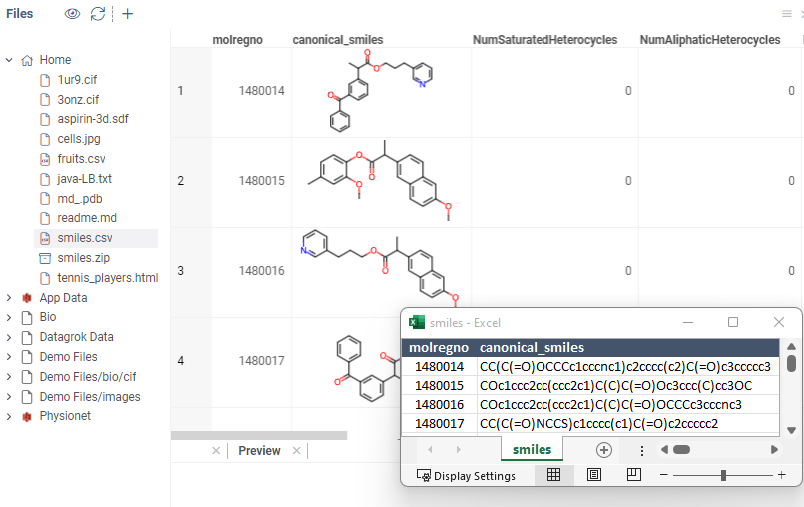
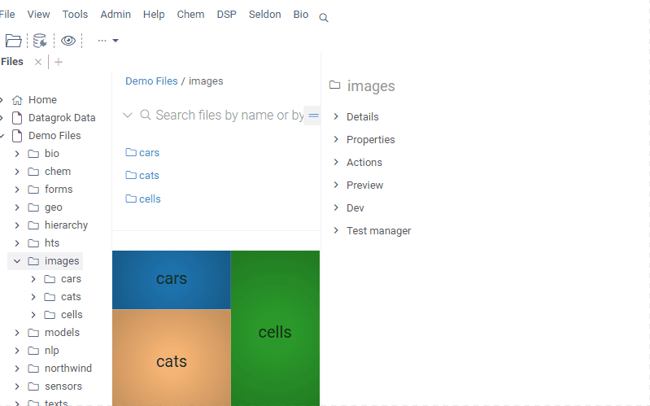
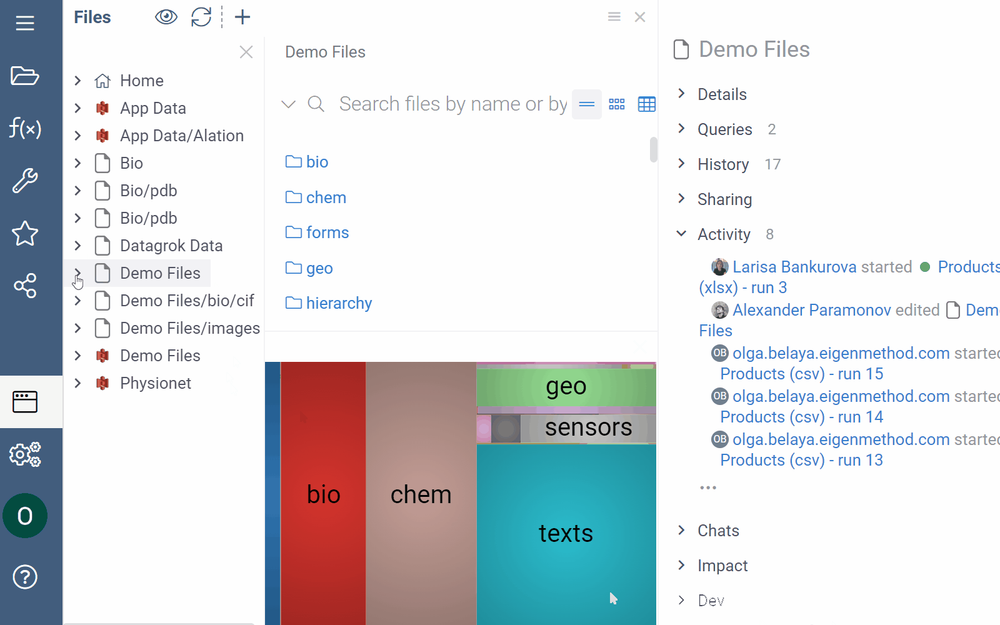

# File shares

```mdx-code-block
import Tabs from '@theme/Tabs';
import TabItem from '@theme/TabItem';
```

Datagrok provides a convenient interface for working with files. You can connect to [all popular file systems](supported-connectors.md), including the [Amazon S3 bucket](connectors/s3.md), [Dropbox](connectors/dropbox.md), [Google Drive](connectors/googlecloud.md), and [Git](connectors/git.md), as well as [Windows and Linux network shares](connectors/files.md).

:::note

Connecting to an SMB file storage is only available for on-premise deployment and is not available on the public Datagrok instance (public.datagrok.ai).

:::

:::note developers

You can [create custom connectors](../develop/how-to/access-data.md/#connections).

:::

In addition, each Datagrok user has a personal directory for uploading files using the drag-and-drop feature. This personal directory is accessible in the **File Manager** under the name _Home_. The **Home** directory is created automatically upon signup.

## Connecting to file storage



To connect to your file storage, follow these steps:

1. Go to **Data** > **Files**.
1. Open the **New file share** dialog (**Toolbox** > **Actions** > **New file share**). Alternatively, on the **Menu Ribbon**, click the **New file share** icon.
1. In the **New file share** dialog, choose the data source from the **Data Source** dropdown. The dialog updates with connection-specific parameters.
1. Set the parameters.
1. Click **TEST** to test the connection, then click **OK** to save it. A pop-up notification displays the connection status.

While many connection parameters are straightforward, some have unique characteristics:

* _Directory path_. When connecting to the root directory, leave the **Dir** field empty. Otherwise, enter a directory path.
* _Credentials_. You have two ways to specify credentials:
  * Manually. When entered manually, Datagrok stores secrets in
   a [secure privilege management system](../govern/security.md/#credentials). To specify who can change the connection credentials, click the **Gear** icon and select from the **Credential owner** dropdown.
  * Use the [Secrets Manager](data-connection-credentials.md), such as the AWS Secrets Manager.

  :::caution

  When connecting to _public buckets_ in AWS S3, always check the **Anonymous** checkbox.

  :::

After you've connected to a specific folder in your file system, the folder appears in the **File Manager** under the respective data source. We call this connection a _file share_. By expanding the _file share_, you can view its subfolders and files.

:::note

Like other objects in Datagrok, newly created connections are only visible to the user who created them. To let others access the file share, you must share it (right-click the connection and select **Share...** from the list of options).

:::

### Modifying connection

To modify a connection, right-click it and select **Edit...** from the list of options. To quickly create a connection similar to an existing one, right-click it and select **Clone...**

## File Manager

**File Manager** lets you manage connections to file systems, as well as browse and preview their content. You can perform standard file and folder actions such as open, download, delete, or rename. To access an object's context actions, right-click it. Alternatively, left-click the object and expand the **Actions** pane in the **Context Panel** on the left.

:::note

For files and folders shared with you, contact the _credentials owner_. If you are a _credentials owner_, contact the _data source_ owner.

:::

Clicking a file or a folder in the **File Manager** opens its preview, double-clicking a file opens it in Datagrok, and double-clicking a folder expands its content.

In addition to the hierarchical browsing, the **File Manager** offers an array of advanced preview and data augmentation features such as **Previewer**, **Directory**, and **Context Panel**.

:::tip

When working with the **File Manager**, you can reposition, resize, detach, or hide any pane. To learn more, see [Navigation](../datagrok/navigation.md). You can also hide the **Previewer** by clicking the **Toggle file preview** icon above the **File Manager**.

:::

### Previewer

The **Previewer** is a context-sensitive view that dynamically adjusts to the the selected object. When a folder is selected, the **Previewer** generates a [treemap](../visualize/viewers/tree-map.md) that highlights items occupying the most space. For files, the functionality varies based on the file's format and data properties. It includes custom viewers for [compatible formats](supported-formats.md), such as an interactive spreadsheet for displaying tabular data, multiple cell and image renderers, as well as chemical and biological structure viewers. You can also view the content of ZIP files and edit Markdown, TXT, and HTML files.


:::note

File preview is limited to files less than 10MB in size. The platform won't display bigger files. You can't preview unsupported file formats, but you can download such files.

:::

:::note developers
  
You can add custom formats via [package extensions](../develop/how-to/create-package.md) and create organization-specific previews.

<details>
<summary> Example: Create custom file viewers </summary>

In this example, a script is invoked against the folder content. If the folder contains files that match the file extension parameter PDB, the **Previewer** displays a custom ngl viewer to visualize the molecule.


To add a custom viewers, you have two options:

* JavaScript-based development using the [Datagrok JavaScript API](../develop/js-api.md).
* Use the visualizations available for popular programming languages like Python, R, or Julia.

To learn more about each option, see [Develop custom viewer](../develop/how-to/develop-custom-viewer.md).

</details>

<details>
<summary> Example: Create custom folder viewers </summary>

In this example, a [script](../develop/how-to/folder-content-preview.md) is invoked against the folder content. If the folder contains files matching the file extension parameter, the **Preview** shows a custom [widget](../visualize/widgets.md) (in this case - the application launch link) every time the folder is opened.


</details>
<details>
<summary> Example: Create custom cell renderers </summary>

In this example, a [script](/develop/how-to/custom-cell-renderers.md) is invoked against the [SMILES](https://en.wikipedia.org/wiki/Simplified_molecular-input_line-entry_system) strings within the CSV file. The script computes the structure graph and 2D positional data, and renders the structure graphically.



</details>

:::

### Directory

The **Directory** section shows the content of your current folder. It has three viewing modes (icons, cards, and grid) and is interactive. You can click an object to see its content in the **Previewer**, or right-click it to access available context actions.

Above can use the search bar above the **Directory** to search your current directory for the following:

* File/folder name
* File extension
* File/folder metadata.

[----gif placeholder----]

### Context Panel

The [**Context Panel**](../datagrok/navigation.md#properties) provides specific information about an object and offers context-based actions. It works with folders, files, and data contained within these files.

For example, when you click the CSV file, the **Previewer** displays the data as an interactive spreadsheet, while the **Context Panel** updates to show the file's metadata, available context actions, and other information. If you subsequently click any of the columns within the dataframe in the **Previewer**, the **Context Panel** updates once again to display information and actions specific for that column. This may include summary statistics for the column under **Stats**, or its data and semantic types under **Details**.


:::note developers

**Context Panel** can be extended. You can add custom [info panes](../develop/how-to/add-info-panel.md) and [context actions](../develop/how-to/context-actions.md).

<details>
<summary> Example: Image augmentation </summary>

In this example, a [Python script](/develop/how-to/create-custom-file-viewers.md) is used to create a custom _info pane_ called **Cell Imaging Segmentation**. The script is invoked during the indexing process against the JPEG and JPG files. It extracts custom metadata (number of cells) and executes predefined transformations (cell segmentation). When a user clicks the image, the **Context Panel** updates with the new info panel that displays the augmented file preview and the number of detected cell segments.



</details>

:::

## Access control and sharing

You have two sharing methods:

1. **Share files** with individual users and groups from within the **File Manager**. When you use this method, you create a _file share_ and
   can specify access privileges for each shared item (such as separate files and subfolders). Once the item is shared,
   it appears in the recipient's **File Manager**.
   >Note: When you share a file from a connected _data source_, you share _access_ to the file and not its _data_. The data in the file can change between the time you share the file and the time the recepient opens it. Similarly, any file or folder action you take from within Datgrok doesn't impact the corresponding file or folder in the data source.
1. **Share a URL**. Datagrok uses unique URLs for each file and folder. You can copy these URLs from the browser and use them as a quick
   way to point others to a file or reference the file on external websites.

    Unlike _sharing files_, when you distribute a _link_, you don't create a _file share_. Instead, anyone with the link can _open_ the file in Datagrok. From there, they can either download the file
    and then upload it to Datagrok, or save the file as a [project](/datagrok/create-project.md).

    > Note: The URL links never expire and can't be revoked. However, to access the file or folder from the link provided, users must have access privileges for this file or folder.

### Sharing and managing connections

[placeholder]
### Sharing and managing files and folders

When your access privileges allow it, you can share folders and files available to you. You have several options:

* Share a _connection_ (root folder) to give access to the entire directory.
* Share a _folder_ to give access to the content of individual folders in your directory.
* Share a _file_ to limit access to individual files.<!--future-looking-->

To share an item, do the following:

1. Right-click the item and select _share_ from the context menu. This action opens the **Share...** dialog.
2. Enter the user or user group you want to share it with.

   In the identity/email field, start typing a person’s name, username, email, or group name. Pick from the list of the
   matching identities.

3. From the respective dropdowns, select access privileges for either or both: (1) the connection and (2) individual
   files/folders. You can select any or all of the following options<!--TBU-->:

    * _Can view_: Users can view, open, and download
    * _Can edit_: Users can rename and edit
    * _Can delete_: Users can delete
    * _Can share_: Users can reshare with any other user or group.<!--how does it work with URL links? -->
    > Note: For each _file share_, Datagrok automatically assigns a _friendly name_ (a name displayed in the UI) that
    > specifies all the directory names starting from the root folder. If you can, avoid changing the _friendly name_. Changing the _friendly name_ changes the file share's unique
    > _namespace-qualified name_ and may cause broken URL links, script errors, and similar issues.

4. Optionally, enter a description in the text field provided. You may also notify the users you share with. If you
   don’t want to send a notification, uncheck the **Send notification** checkbox.

   > Note: To send an email notification, enter the user's email in the identity/email field. The email notification
   > contains a link to the shared item and entered description. If you enter a user or group name, they will be
   > notified via the Datagrok interface.

5. Click **OK** to share. Once shared, the shared item appears in the recipient's **Folder Tree**.

   

> Note: When you share a file or a folder, Datagrok automatically indexes folders and extracts basic metadata (like the date created or its size). File indexing is optional (to index
> files, toggle **Index Files** in the **Share...** dialog).

## Manage access to file shares

Subject to your privileges, you can use the **Context Pane** on the left to inspect and quickly adjust access permissions to your
file shares, send comments to those you're sharing with, and more.

1. First, select the connection, file, or folder.
1. Then navigate to **Context Pane** and expand the **Sharing** info panel to see the complete list of
   users with access and their privileges. From here, you can click any user or group to see their profile, your
   conversation history with them, send them a note, and more.
3. Use the buttons provided to share access with more users, revoke access, or edit permissions to the shared item.

   > Tip: The same actions are available from the context menu.

<!--TBD: GIF pending changes in the UI-->

### Sharing files as URL

To share query results as URL, first, open the file in Datagrok. Once the file is open, copy the URL from the address bar. Follow the link to _open_ the file in Datagrok. To access the file from the link provided, users must have permissions to open it.

>IMPORTANT: A file's _name_ and _namespace_ are encoded within the URL. When you rename a file (or it location), the link changes accordingly.

>Tip: For tabular formats, you can create dynamic dashboards and share them with others via URL. To learn more about dynamic data updates, see [Dynamic data](../datagrok/project.md/#dynamic-data).

## Automation workflows

Datagrok provides a visual interface to automate manual, repetitive data ingestion, and data transformation tasks. For more information on workflow automation, see [Data preparation pipeline](data-pipeline.md).

## See also

* [Data access](access.md)
<!--* [Databases](link)
*[Web services](link)
*[Context Pane](link)
*[Indexing](link)-->

## Resources

[](https://www.youtube.com/watch?v=dKrCk38A1m8&t=417s)
