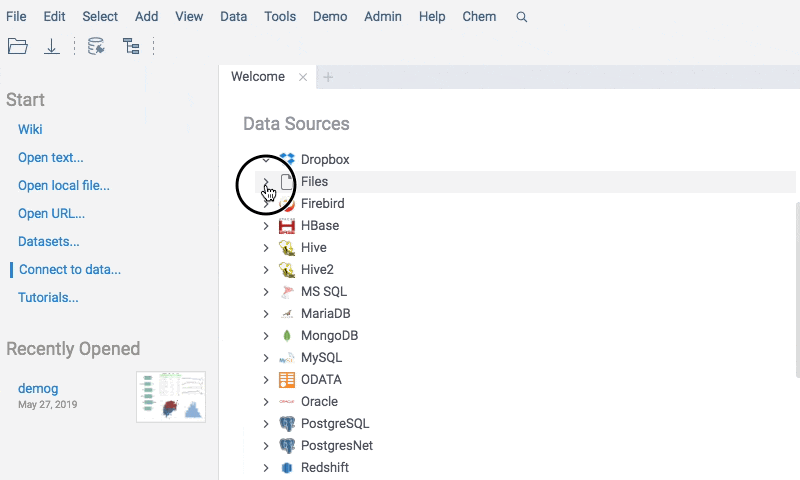
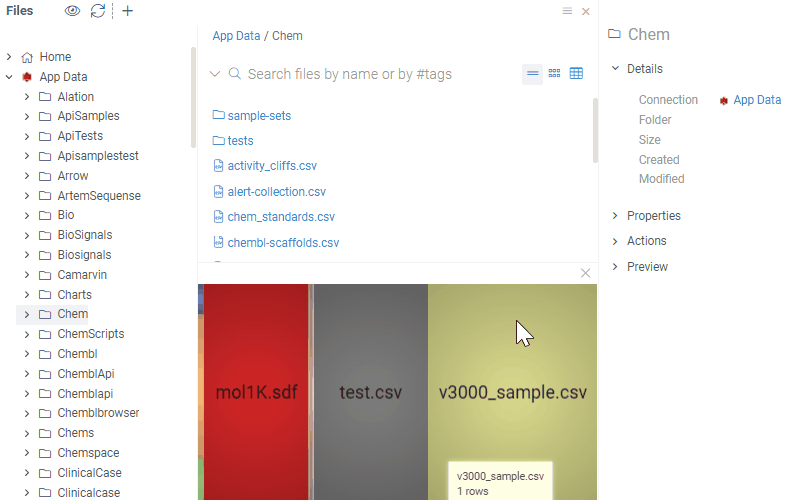
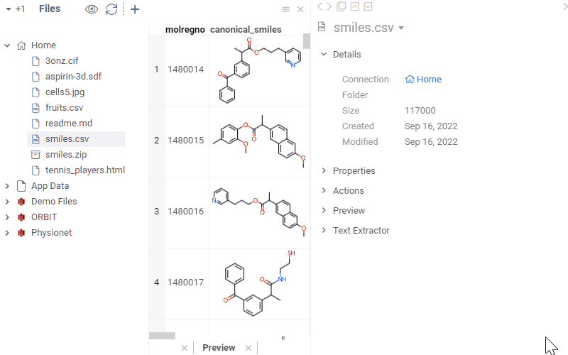
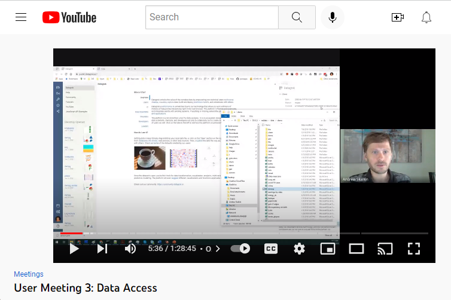

```mdx-code-block
import Tabs from '@theme/Tabs';
import TabItem from '@theme/TabItem';
```

Datagrok lets you work with files and directories right from the web browser. 
It supports all [popular file systems](shares/shares.md), 
including [S3](shares/s3.md),
[Dropbox](shares/dropbox.md), [Google Drive](shares/googlecloud.md), [Sharepoint](shares/sharepoint.md), 
[Azure](shares/azure.md), [CoreWeave](shares/coreweave.md), and
[Git](shares/git.md), as well as [Windows and Linux network shares](shares/files.md).

Once a connection is established, you can browse, preview, open, create, delete,
rename, download, clone, and share files and directories.

:::note

When you sign up for
Datagrok, a personal directory called **Home** is automatically created for you.

:::

:::note developers

You can [create custom connectors](../databases/create-custom-connectors.md) 
and [read files programmatically](../../develop/how-to/access-data.md#reading-files).

:::

## Connecting to file storage

To connect to your file storage, follow these steps:

1. Go to **Data** > **Files**.
2. Open the **New file share** dialog (**Toolbox** > **Actions** > **New file
   share**). Alternatively, click the **New file share** icon on the **Menu
   Ribbon**.
3. In the dialog, choose the data source from the **Data Source** dropdown. The
   dialog updates with connection-specific parameters.
4. Set the parameters.
5. Optionally configure [caching](#Caching files shares)
6. Click **TEST** to test the connection, then click **OK** to save it.

This file share will only be available to you, until you 
[share it](#file-sharing-and-access-control) with others users or groups.


Some connection parameters have unique characteristics, and it's important to
specify them correctly:

* _Directory path_. When connecting to the root directory, leave the **Dir**
  field empty. Otherwise, enter a directory path.
* _Credentials_. You can specify credentials manually or using the 
[Secrets Manager](../../govern/access-control/data-connection-credentials.md), such as the AWS Secrets Manager. 
When entered manually, Datagrok stores secrets in a 
[secure privilege management system](../../govern/access-control/access-control.md#credentials-management-system). 
To specify who can change the connection credentials, click the **Gear** icon 
and select from the **Credential owner** dropdown.

:::caution

When connecting to _public buckets_ in AWS S3, always check the **Anonymous** checkbox.

:::

Once you have established a connection to a folder in your file system, the
folder appears in the **File Manager** under the corresponding data source. This
connection is referred to as a _file share_. You can view the files and
subfolders within the _file share_ by expanding it.

:::note

Like other objects in Datagrok, newly created connections are only visible to
the user who created them. To let others access the file share, you must share
it (right-click the connection and select **Share...** from the list of
options).

:::

To modify a connection, right-click it and select **Edit...** from the list of
options. To quickly create a connection similar to an existing one, right-click
it and select **Clone...**

<!--

### File indexing
For file shares, Datagrok supports indexing of folders and 
[supported file formats](supported-formats.md), including archives such as .tar or .zip.

Connections and folders are indexed by default when you create a connection. 
File indexing is optional. To index files, select the **Index Files** option when creating a file share.

:::tip

You can enable file indexing at any time. Right-click the file share and select **Edit...** 
Then, check the **Index file** checkbox in the dialog that appears. Click **OK** to save.

:::

File indexing is a recurring data job that runs every hour. 
Datagrok extracts the following information from the indexed file:

* Filename
* File size, in bytes
* Number of rows and columns
* Column-level information such as name, data type, and [semantic type](../../govern/catalog/semantic-types.md).

For instance, with indexing, you can browse columns within a CSV file inside a ZIP file:



Indexing helps you find datasets quicker as indexed files appear in the search 
results based on metadata extracted. For example, you can search for dataframes 
matching the following criteria across specified or all data providers at once:

* Created in the last month
* Has a column that contains molecules, and
* Has a column named "activity."

:::note

To learn how searching works in Datagrok, see [Smart search](../../datagrok/navigation/views/table-view#search).

:::
-->

## File Manager

**File Manager** allows you to manage connections,
browse and preview file content, and perform standard actions
such as opening, downloading, deleting, and renaming. Right-click on an object to see
available context actions, or left-click and expand the **Actions** pane in
the **Context Panel** on the right. 
Click on an object to see its preview. 
Double-click to open the object in the workspace.

:::note

If you don't see a certain action, it may be due to insufficient permissions.
For files and folders shared with you, contact the credentials owner. If you are
a credentials owner, contact the data source owner.

:::

In addition to the hierarchical browsing, the **File Manager** offers advanced
preview and data augmentation capabilities using **Directory**, **Preview**, and
**Context Panel**.

The **Directory** section shows the contents of your current folder. Click a
file to see its preview and properties, or right-click it for more actions. Use
the search bar to search for files and folders within your current directory.
The search bar allows you to search for items by name, file extension, or
metadata.

For folders, the **Preview** generates a
[treemap](../../visualize/viewers/tree-map.md) that highlights the largest
items. For files, the functionality varies based on the file's format and data
properties. It includes custom viewers for [supported formats](supported-formats.md), such as interactive spreadsheets for displaying
tabular data, cell and image renderers, and chemical and biological structure
viewers. You can also view the content of ZIP files and edit Markdown, TXT, and
HTML files.


:::note

File preview is limited to files under 10MB. The platform won't display larger
files. Unsupported file formats cannot be previewed, but you can download them.

:::

:::note developers

You can develop custom file viewers, folder viewers, and content viewers 
[as plugins](../../develop/how-to/create-package.md). 

<details>
<summary>Example: Create custom file viewers</summary>

In this example, a script is executed against the folder content. 
If the folder contains files that match the file extension parameter PDB, 
the **Preview** displays a custom NGL viewer to visualize the molecule.


To add a custom viewer, you have two options:

* Develop in JavaScript using the [Datagrok JavaScript API](../../develop/packages/js-api.md).
* Use the visualizations available for popular programming languages like Python, R, or Julia.

To learn more about each option, see [Develop custom viewer](../../develop/how-to/develop-custom-viewer.md).

</details>

<details>
<summary>Example: Create custom folder viewers</summary>

In this example, a [script](../../develop/how-to/folder-content-preview.md) is
executed against the folder content. If the folder contains files matching the
file extension parameter, the **Preview** shows a custom
[widget](../../visualize/widgets.md) (in this case - the application launch
link) every time the folder is opened.



</details>
<details>
<summary>Example: Create custom cell renderers</summary>

In this example, a [script](../../develop/how-to/custom-cell-renderers.md) is executed 
against the [SMILES](https://en.wikipedia.org/wiki/Simplified_molecular-input_line-entry_system) 
strings within the CSV file. The script computes the structure graph and 2D positional data, 
and renders the structure graphically.


</details>

:::

The [Context Panel](../../datagrok/navigation/panels/panels.md#context-panel)
provides additional information about a selected file or folder, and the ability
to execute conext actions. For example, when you click a CSV file, the **Context
Panel** updates to show the file's metadata, available context actions, and
other relevant information. If you subsequently click any of the dataframe's
columns in the **Preview**, the **Context Panel** will update to display
information and actions specific to that column, such as summary statistics for
the column under **Stats**, or its data and semantic types under **Details**.



:::note developers

**Context Panel** can be extended. You can add custom 
[info panes](../../develop/how-to/add-info-panel.md) and 
[context actions](../../develop/how-to/context-actions.md).

<details>
<summary> Example: Image augmentation </summary>

In this example, a [Python script](../../develop/how-to/create-custom-file-viewers.md) 
creates a custom _info pane_ called **Cell Imaging Segmentation**. This script executes 
against JPEG and JPG files during the indexing process and extracts custom metadata 
(such as the number of cells) and performs predefined transformations (such as cell segmentation). 
When a user selects the corresponding image, the **Context Panel** shows a custom info panel that 
displays the augmented file preview and the number of detected cell segments.


</details>

:::

## File sharing and access control

Datagrok lets you control who can access file shares, and grant them read or write privileges.
You can share folders, including the root share, but not individual files.
To share a folder, right-click on it, select "Share folder", specify users or groups,
and the privilege (View / Edit). Once the folder is shared, it appears in the recipient's 
**Files** tree under Browse.

The specified privilege allows the grantee do the following:

* _Can view_: View, open, and download. 
* _Can edit_: Everything under "view", plus rename, edit, delete, and reshare


You can also share the folder's URL from the address bar with other users. This won't
give them the necessary privilege, but it might be a convenient way of sharing links
with people who already have proper privileges.

:::tip

To inspect or quickly adjust access permissions to your file shares, send
comments to those you're sharing with, and more, use the **Sharing** info pane
in the **Context Panel**.

:::

## Caching

You can cache file share content, and set invalidation (flushing)
schedule using [cron expressions](https://en.wikipedia.org/wiki/Cron#Cron_expression). Caching applies to all files reads and 
folder listings. Results are stored both in browser cache and server cache. 

As an example, let's imagine you open a large CSV file from the cached folder in the morning. 
The first time you did it, it might take some time since the content has to be parsed
and the data needs to be transferred over the network. The second time you open it later this day,
it opens instantaneously since the parsed file is already in your browser cache. You colleague
opens the file in the afternoon, and it opens faster than for you in the morning because the 
_parsed_ (as a highly efficient and compressed binary format) CSV is cached on the server.  

When the content of the folder is modified via the Datagrok API, the cache is flushed. You can also
flush the cache manually by right-clicking on the connection and choosing "Clear cache", or 
programmatically.

You can also configure cache individually per file or folder:

1. Right-click the connection, select **Cache...**.
2. Choose file or folder using **Path** field.
3. Input valid cron expression using **Cron expression** field. You can use [crontab.guru](https://crontab.guru/) to validate your expression.
4. Enable **Preflight** in order to perform additional check of file/folder version every time when it is accessed.

## Resources

[](https://www.youtube.com/watch?v=dKrCk38A1m8&t=417s)
