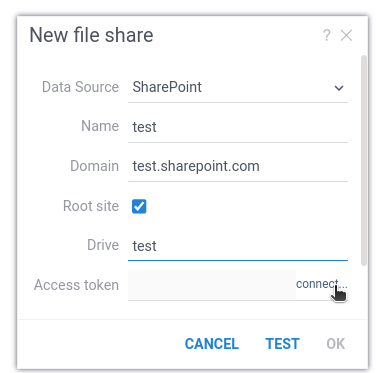

Provides access to [SharePoint](https://www.microsoft.com/en-us/microsoft-365/sharepoint) or [OneDrive](https://www.microsoft.com/en-us/microsoft-365/onedrive) as [file shares](../files.md).

## Application Settings

Datagrok connects to SharePoint through Microsoft Entra ID, which requires a registered application in Entra ID. Copy the application client ID and application secret from Entra ID to **Settings/Server/Connectors**.

## Configuration

The connector requires a **Domain**, which is the URL of a SharePoint instance. **Site** specifies which site under the SharePoint domain to use. Usually, this is the **root site**. For other sites, the site URL explicitly specifies the name in the format `https://test.sharepoint.com/sites/test` instead of the domain `https://iekonstantinamelichev.sharepoint.com` as-is. **Drive** is the name of the document library to use as a file share.

The SharePoint connector uses OAuth for authorization. When configuring the connection, click on the **"connect..."** link near the **Access token** field.



## OneDrive

The SharePoint connector supports OneDrive as well, when **Drive** is set to "OneDrive".

## Connection parameters

````json
{
  "parameters": {
    "domain": "",
    "root site": true,
    "site": "", // specify if not a root site
    "drive": "",
    "redirect url": "" // is set automatically
  },
  "credentials": {
    "parameters": {
      "access token": "", // is set automatically
      "refresh token": "", // is set automatically
    }
  }
}
````

See also:

* [File shares](../files.md)
* [Microsoft Entra ID](https://learn.microsoft.com/en-us/azure/databricks/dev-tools/app-aad-token)
* [SharePoint](https://www.microsoft.com/en-us/microsoft-365/sharepoint)
* [OneDrive](https://www.microsoft.com/en-us/microsoft-365/onedrive)
