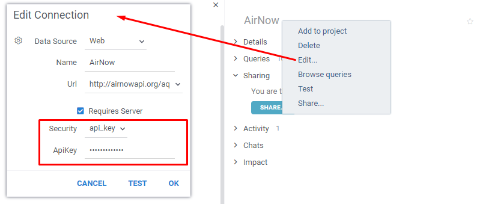
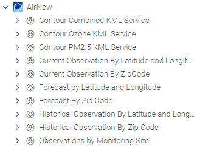
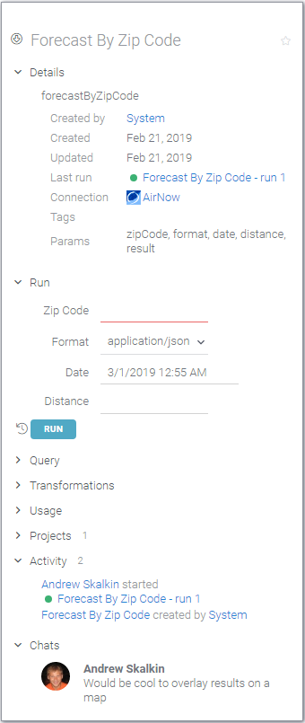
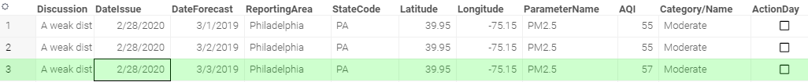

<!-- TITLE: OpenAPI -->
<!-- SUBTITLE: -->

# OpenAPI

[OpenAPI](https://swagger.io/docs/specification/about/), also known as swagger, is a popular format that describes the
structure of the server APIs so that machines can read the document and use the service.

Datagrok integrates with OpenAPI really well. Once a swagger file is imported
(you can simply drag-and-drop a `yaml` or `json` file into the app), its content gets translated to
[data connections](data-connection.md),
[queries](data-query.md), and
[functions](../overview/functions/function.md). All of them may be combined and used in [data jobs](data-job.md),
[calculations](../compute/compute.md),
[info panels](../discover/info-panels.md), executed from [console](../overview/navigation.md#console), etc.

You can find this connection in [Connections Tree](https://public.datagrok.ai/connect)
under the source "Web". There is a special view
[Web Services](https://public.datagrok.ai/webservices) in the Datagrok's UI, which displays only OpenAPI connections.
These connections may also be found in the "Data" section on the left sidebar next to "Databases".

Let's take a deeper look on the following example of the OpenAPI `yaml` file
(`json` is also supported):

```yaml
swagger: '2.0'
info:
  description: 'AirNow'
  title: AirNow
host: airnowapi.org
basePath: /aq
schemes:
  - http
paths:
  /observation/latLong/historical/:
    get:
      summary: Historical Observation By Latitude and Longitude
      operationId: historicalObservationByLatitudeAndLongitude
      produces:
        - text/csv
        - application/xml
        - application/json
      parameters:
        - name: date
          in: query
          required: false
          description: Date of forecast. If date is omitted, the current forecast is returned.
          type: string
          format: date-time
          grok-datetime-format: yyyy-MM-ddT00-0000
        - $ref: '#/parameters/latitude'
        - $ref: '#/parameters/longitude'
        - $ref: '#/parameters/distance'
      responses:
        '200':
          description: successful operation
          schema:
            type: array
            items:
              $ref: '#/definitions/Observation'
        '400':
          description: Invalid status value
grok-datetime-format: yyyy-MM-dd
parameters:
  distance:
    name: distance
    in: query
    required: false
    description: |
      If no reporting area is associated with the specified Zip Code, 
      return a forecast from a nearby reporting area within this distance (in miles).
    type: integer
    format: int32
  latitude:
    name: latitude
    in: query
    description: Latitude in decimal degrees.
    required: true
    type: number
    format: float
  longitude:
    name: longitude
    in: query
    required: true
    description: Longitude in decimal degrees.
    type: number
    format: float
securityDefinitions:
  api_key:
    type: apiKey
    name: API_KEY
    in: query
```

You can also find all connections created for OpenAPI in
the [Data Connections Browser](https://public.datagrok.ai/connections) ("Manage" section on side bar and then "
Connections" view).

Let's consider how Datagrok interprets individual attributes of a Swagger file:

| In Swagger File | In Datagrok                                          |
|-----------------|------------------------------------------------------|
| title           | [Data connection](data-connection.md) name           |
| description     | [Data connection](data-connection.md) description    |
| paths           | [Data query](data-query.md) is created for each path |
| summary         | [Data query](data-query.md) name                     |

In some cases, the standard attributes of Swagger format are not enough to import file to Datagrok.

For example, for the correct interpretation of datetime format in the corresponding parameters, an
additional `grok-datetime-format` field inside the Swagger file is used, which is not part of the standard Swagger
format, but is used only for correct import into Datagrok in some cases.

As we can see from the Swagger file example above, this field can be used at the level of entire Swagger file and be
redefined at the level of individual parameters within individual paths.

In the below example, it is defined at the level of the entire Swagger file:

```yaml
swagger: '2.0'
info:
  description: 'AirNow'
  title: AirNow
host: airnowapi.org
...

grok-datetime-format: yyyy-MM-dd
parameters:
...
```

Whereas below it is overridden at the level of an individual path (for "data" parameter):

```yaml
swagger: '2.0'
info:
  description: 'AirNow'
  title: AirNow
host: airnowapi.org
...
paths:
  /observation/latLong/historical/:
    get:
      summary: Historical Observation By Latitude and Longitude
      operationId: historicalObservationByLatitudeAndLongitude
      produces:
        - text/csv
        - application/xml
        - application/json
      parameters:
        - name: date
          in: query
          required: false
          description: Date of forecast. If date is omitted, the current forecast is returned.
          type: string
          format: date-time
          grok-datetime-format: yyyy-MM-ddT00-0000
  ...
```

## Parameters

Swagger format supports direct definition of parameters within each path and definition of parameters at the entire file
level and their further use in any other pathes.

Datagrok perfectly understands both options or their combination. In our AirNow example, the ```date``` parameter is
defined inside the path and the rest of parameters are placed to ```parameters:``` section at the level of entire file.

It is important to mention that Datagrok can work with both parameterized queries with and queries without parameters.

In addition, there are no restrictions in Datagrok on the use of parameters in different places, such as:

* path parameters, such as `/users/{id}`
* query parameters, such as `/users?role=admin`
* header parameters, such as `X-MyHeader: Value`

## Credentials

Your access parameters to an OpenAPI service are not defined inside the Swagger file. Swagger file only describes the
type and access parameters. The ```"securityDefinitions:``` section is used to determine the type and access parameters.

In the AirNow example, the `api_key` type is used with a parameter named `"API_KEY"` (external service itself provides
the parameter naming requirement):

```yaml
securityDefinitions:
  api_key:
    type: apiKey
    name: API_KEY
    in: query
```

Datagrok works great with all types of secret access that the Swagger format supports:

* Basic authentication
* API key (as a header or a query string parameter)
* OAuth 2 common flows (authorization code, implicit, resource owner password credentials, client credentials)

After you have imported the Swagger file into Datagrok, you need to specify your access in the settings of a
corresponding [data connection](data-connection.md). To do this, find your connection in the connections tree (or in
connection browser, special "Web Services" view, etc.) and open settings dialog for it:



Sometimes services don't require secret access. In situations like this, just don't specify the appropriate
block ```securityDefinitions:``` inside the Swagger file. An example of a Swagger file without security definitions can
be found in
our [public repository](https://github.com/datagrok-ai/public/blob/master/packages/Swaggers/swaggers/countries.yaml)
.

## Example

Let's see what happens after we drag-and-drop the Swagger for AirNow, a site that tells you how clean or polluted your
outdoor air is.

Once its Swagger file is imported (which takes a second), the following connection and queries appear in Grok:



Click on the query to bring up its details in the property panel on the right:



Note that it became a regular [Grok query](data-query.md), which means all the features of the platform are now
applicable to it. In fact, end users won't even have to know where the data is coming from, or what technology is used
there. All data governance capabilities, such as data lineage, history, and security, can be used. Query results can be
automatically transformed, and there is even a chat associated with it.

But of course, the most important thing is that it can be executed right from there. Let's fill in the required zip
code, hit RUN, and voila - the query is executed and results are shown in the table.



Is it important to understand that by using the OpenAPI Grok connector, it is possible to not only retrieve data from
external services, but do pretty much everything the service lets you to do. For instance, you can automatically
provision virtual machines via the Amazon AWS swagger, create Jira tickets, or purchase items on eBay.

## Packages

Swagger files can be imported into Datagrok not just from local storage by drag-and-drop. These files can be also stored
in external [packages](../develop/develop.md).

You can check out one of these packages [here](https://github.com/datagrok-ai/public/tree/master/packages/Swaggers).
This package contains our Swagger demo files. It contains enough Swagger examples for different services in different
formats (yaml, json).

In this variant of storing Swagger files, they will be imported to the platform (
new [data connections](data-connection.md) will appear) at the same time as the corresponding package is published.

## Troubleshooting

In case you can't discover a link to a Swagger JSON/yaml file, try to introspect the page of
a [Swagger-UI browser](https://swagger.io/tools/swagger-ui/) corresponding to the API service in question using a "
Network" tab of the Chrome Developer Tools. The desired file is usually hidden under a link including `/v1` or `/v2`. An
alternative is to try adding a suffix to the original service URI: to a `<URI>` append `/api/v2/api-docs`, which is a
default location for Swagger JSON data in Swagger-UI browsers.

Sometimes you may want to only keep a few pieces of the Swagger file originally provided by the service, or enhance the
file with some simpler queries not present in the original Swagger. In this case, we
advise [Postman](https://www.postman.com/) to manipulate the Swagger/OpenAPI spec files. Import a Swagger JSON/yaml into
Postman for introspection, manipulation and pruning with its "
Import" button. If you need to remove a few of the Swagger items, do it directly in Datagrok after loading the file
inside the platform.

Usually a Swagger file downloaded from the Swagger UI of the API service works well with Datagrok or Postman out of the
box. If problems with import occur, this often has to do with Swagger versions and their parsers deviations or mismatch.
Both Datagrok and Postman Swagger parsers are strict in this sense. If you encounter import errors, the following two
steps can help.

1. If Datagrok loads the Swagger file successfully, but the `basePath`or `host` aren't present along with the Swagger
   icon, add the following section to the file:

   ```
   "schemes": [
     "https",
     "http"
   ]
   ```

2. If Postman doesn't open the file, try changing `"swagger": "2.0"` to `"openapi": "2.0"`

3. If Postman or Datagrok cannot open the file, add a `"version"` section with an arbitrary version to the `"info"`
   section, if the `"version"` isn't present:

   ```
   "version": "1.0.0"
   ```

4. It's a good practice to include Swagger's name, if not present. It is under `"info" -> "title"`
   section.

## Videos

[](https://www.youtube.com/watch?v=dKrCk38A1m8&t=3121s)

See also:

* [Public datasets](public-datasets.md)
* [OpenAPI collection](https://apis.guru/browse-apis/)
* [Data query](data-query.md)
