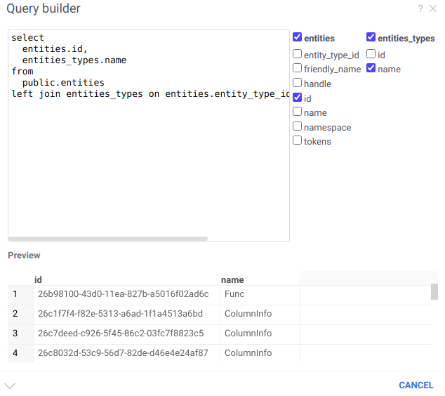

<!-- TITLE: Query Builder -->
<!-- SUBTITLE: -->

# Query Builder

This tool allows to build a query for multiple tables using visual interface.

The preview of results is generated on the fly. To save them to your workspace, click on the arrow at the bottom left.
There is an option to save the query as well.

## Videos

See also:

* [Data query](data-query.md)
* [Visual query](db-visual-query.md)
