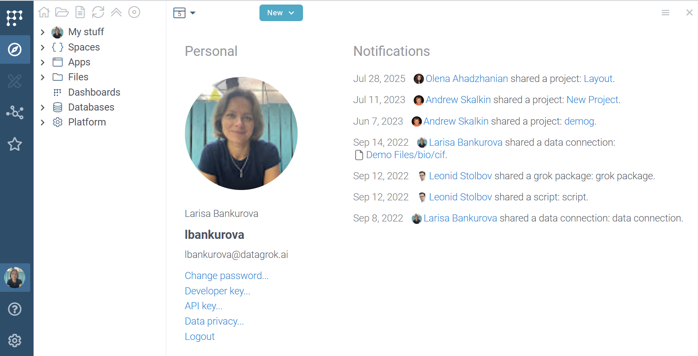

---

title: Seamless collaboration

---

Datagrok supports collaboration at every level:

* **Teams**: Coordinate analyses, troubleshoot together, and make decisions—right in your data
* **Company**: Break silos and work across roles, departments, and locations
* **Industry and scientific community**: Share knowledge, tools, and discoveries across organizations

Datagrok runs natively in the browser. [Sharing is fast, lightweight, and universal](../datagrok/navigation/basic-tasks/basic-tasks.md#share).

## Cross-pollination of knowledge

* Automatically suggests relevant datasets, scripts, and discussions
* Promotes re-use through metadata and context awareness
* Keeps conversations anchored to the exact data and state.

## Discussions

In Datagrok, any [entity](../datagrok/concepts/objects.md) can start a conversation:

* Queries, tables, scripts, dashboards, and even users
* Drag and drop objects into chat to reference them
* Use @mentions to bring in teammates

Start a discussion in the **Context Panel** under the **Chat** pane. Conversations are saved and accessible later.

## Notifications

Datagrok keeps you informed about relevant activity. The [User Profile View](../datagrok/navigation/views/user-profile-view.md) shows:

* Mentions
* Items shared with you
* Project updates
* Items requiring your action

Click the relevant link to jump directly to the context.

