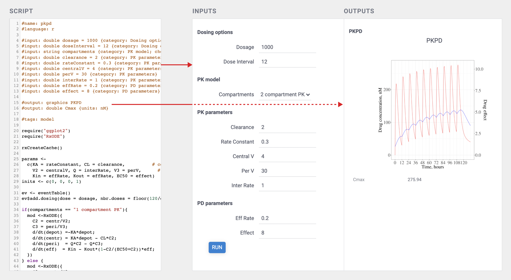
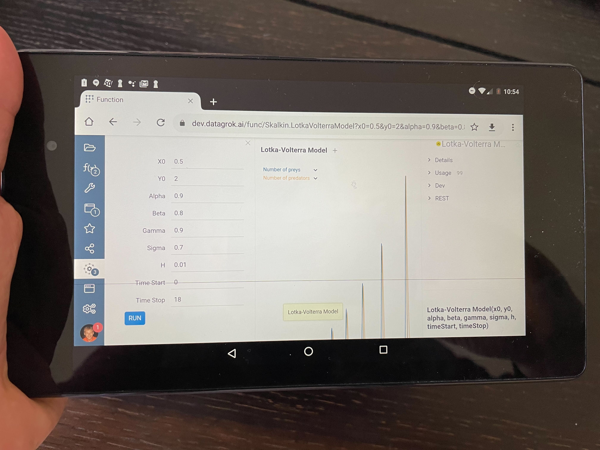
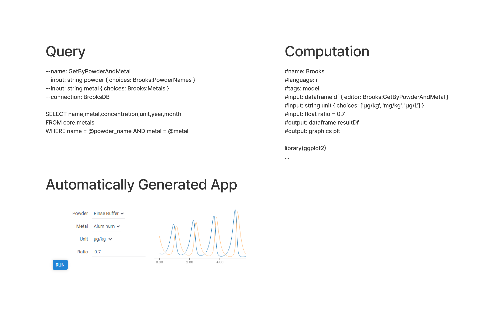
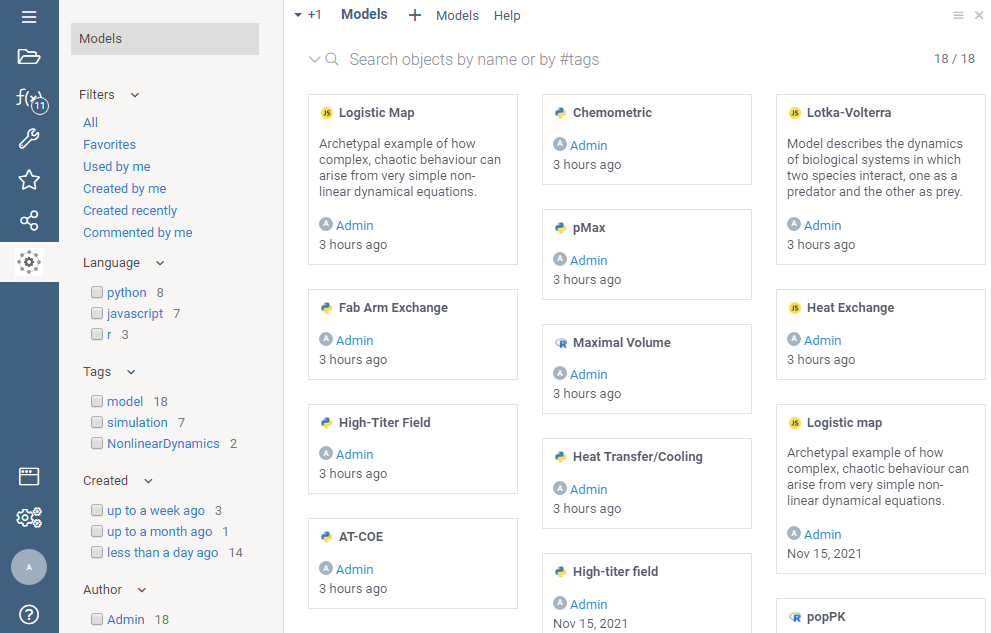
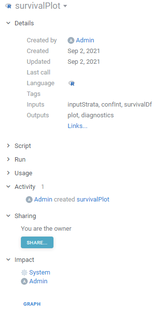
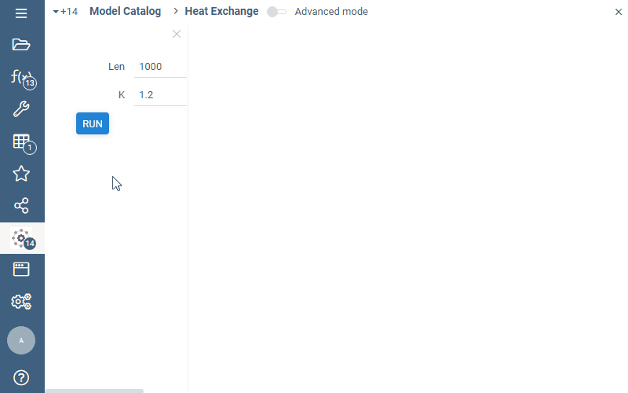
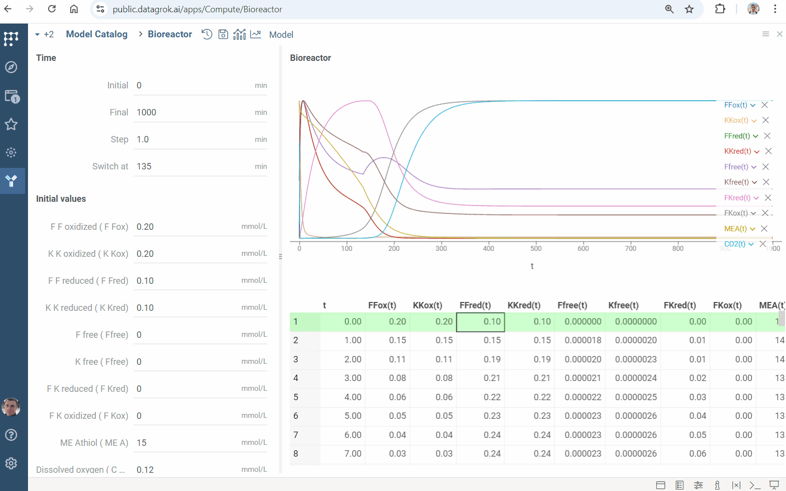
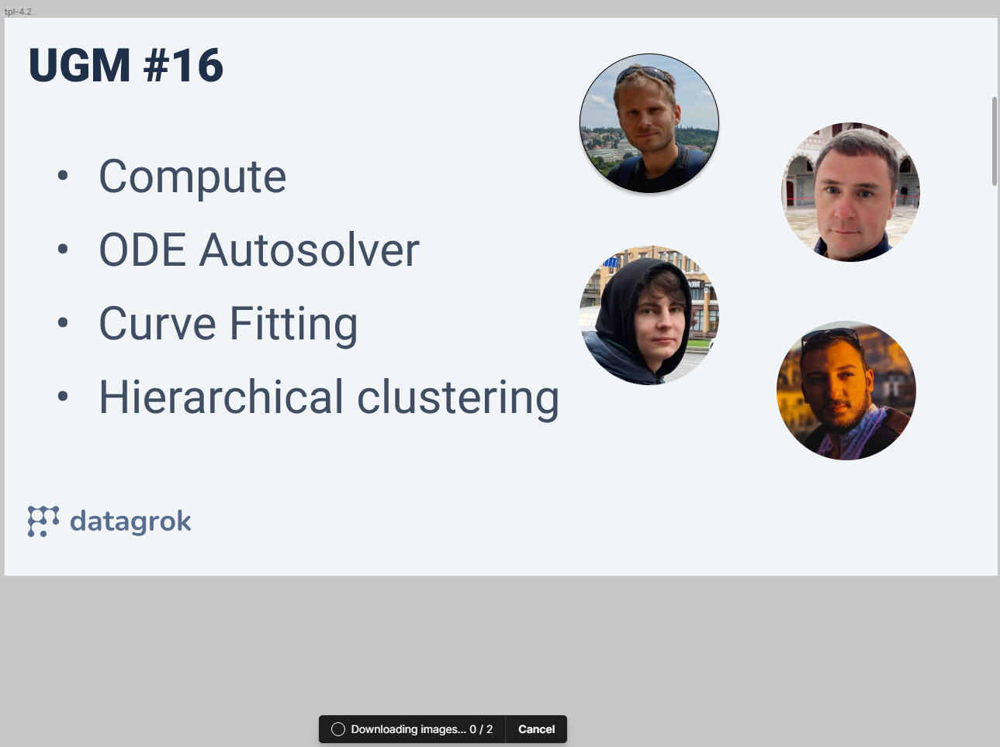

A next-generation environment for scientific computing that leverages core Datagrok features, such as
[in-memory data engine](../develop/under-the-hood/performance.md#in-memory-database),
[interactive visualizations](../datagrok/solutions/domains/use-cases/eda.md),
[data access](../access/access.md),
[machine learning](../learn/learn.md), and [enterprise features](../datagrok/datagrok.md#govern)
to enable developing, publishing, discovering, and using scientific applications:

1. [Functions and cross-language support](#functions-and-cross-language-support)
2. [Scalable](#scalable-computations) and [reproducible](#reproducible-computations) computations
3. [Web-based UI](#user-interface) that could be [autogenerated](#autogenerated-ui),
   [customized](#custom-ui), used on [mobile devices](#mobile-devices), and [shared as URL](#sharing)
4. Creating data analysis [Models](#models) with full development lifecycle:
    [create](#creating), [deploy](#deployment), [version](#versioning), [share](#sharing), use, validate, update.
5. Cross-language [Data access](#data-access)
6. [Metadata](#metadata) used by the [model browser](#model-browser)
7. Integration options: [REST API](scripting/scripting-features/call-via-rest.md), 
   JS API,
   [embedding as iframe](scripting/scripting-features/embed-as-iframe.mdx)
8. [Leveraging the platform](#leveraging-the-platform)
9. [Logging, audit, and traceability](#logging-audit-and-traceability)
10. [Privileges and visibility](#privileges-and-visibility)
11. Usage analysis
12. [Exploratory data analysis](#exploratory-data-analysis)
    and [Jupyter notebooks](jupyter-notebook.md)

Most of the foundational functionality is implemented in the Datagrok core. Compute-specific enhancement, different
function views, and analytical blocks are part of the
[Compute](https://github.com/datagrok-ai/public/tree/master/packages/Compute) package.

## Functions and cross-language support

[Data access](#data-access), [computations](#scalable-computations), and
[visualizations](#exploratory-data-analysis) are the cornerstones of scientific computing. In Datagrok, all of them
are [functions](../datagrok/concepts/functions/functions.md)
with the following features:

* Advanced support for input and output parameters
  * Typed (cross-language support for scalars, vectors, dataframes, images)
  * Introspectable
  * Metadata-annotated
* Dynamic discovery
* Polymorphic execution (the platform doesn't care which language the function is implemented in)
* Annotated with [metadata](#metadata) both on the function and on the parameter level
* Can be serialized and re-executed at a later point.

A [function](../datagrok/concepts/functions/functions.md)
could be written in [any language that Datagrok supports](scripting/scripting.mdx). Typically,
computations are developed in `Python`, `R`, `Julia`, `Matlab/Octave`, `JavaScript`, or `C++`. Data access usually
uses `SQL`, `SPARQL`, `OpenAPI`, or `JavaScript`.

Functions could either be registered manually, or published as part of a
[package](../develop/develop.md), which usually is kept under the source control system. Once a package is published,
its content is discoverable (subject to checking privileges).

This is an incredibly powerful concept that allows us to approach scientific computations in a novel way and unlock
plenty of interesting features covered below, such as
[scalable computations](#scalable-computations),
[reproducibility](#reproducible-computations),
[automatic UI generation](#autogenerated-ui),
[audit](#logging-audit-and-traceability),
[sensitivity analysis](#sensitivity-analysis), different [analytical blocks](#analytical-blocks) applicable to any function,
[optimization](#input-parameter-optimization), and others.

## Scalable computations

Depending on the underlying language, a function could be executed on the client side, server side, or both.

`JavaScript` and `C++` (compiled to [WebAssembly](https://webassembly.org/)) could be executed right in the browser. The
upside to that is unmatched responsiveness, data locality, and computation locality. The downside is that many of the
popular statistical and modeling methods are not currently available in these languages yet. Note that while the
computations are performed locally, the proper audit and traceability still works (both input and output parameters
could be sent to the server for historic reasons).

`R`, `Python`, `Julia`, `Matlab`, and `Octave` are powerful languages with the mature ecosystem of scientific libraries,
and existing models implemented previously inside the organization. They could only be executed on a server, and as such
the question of scalable computation arises. Datagrok takes care of that by using the
`message queue` architecture. When each server-based function is invoked, its parameters are saved to a queue; one of
the worker processes then picks a task (such as running a Python function), executes it, and puts the results back. This
architecture guarantees the following:

* The platform won't get overloaded by trying to execute too many tasks at once
* Scaling is as simple as adding more workers (which could be hosted externally if necessary)
* A queue serves as a basis for [logging, audit, and traceability](#logging-audit-and-traceability)

## User interface

Our goal is not computations for the sake of it, but rather helping **users** derive actionable insights, and support
the decision-making process. The UI should be as easy to use as possible, tailored to the user needs, and be specific
for the tasks. On the other hand, it should be clean, universal, and easy enough to be developed by a scientist without
a deep understanding of the Datagrok platform.

To satisfy these seemingly contradictory requirements, we developed a
hybrid approach to building the UI, where the model author has full control over choosing how custom the UI for the
specific model should be. In the most standard case, there is no need to write a single line of code, as the UI is
[automatically generated](#autogenerated-ui) based on the function signature. On the other end of the spectrum, you have
the possibility to take everything in your own hands and develop a completely [custom UI](#custom-ui). Anything in
between is also possible.

### Autogenerated UI

Very often, all that is needed for the model UI are the input fields for the corresponding function's parameters. In
this case, Datagrok generates the UI automatically by constructing the corresponding input fields and output area with
graphics and results, and bringing it to life by making it interactive. Additional parameters' metadata, such as units,
category, description, input type (slider/combo box/etc), and others are also taken into account.

The simple examples are available in the 
[adding viewers](scripting/scripting-features/add-viewers.mdx)
section of the [scripting](scripting/getting-started.md) tutorial.

The [RichFunctionView](scripting/advanced-scripting/advanced-scripting.mdx#enabling-richfunctionview-ui-editor)
editor allows you to create complex UI with parameter tabs and groups just by adding annotation comments.

The following picture demonstrates a working PK/PD model implemented in R with the autogenerated UI (look at the script
header area for details). While it looks very similar to the traditional Shiny app, the R script does not have to deal
with the UI at all, which not only simplifies the development and maintenance, but also provides for a uniform
experience.



See also: [auto-generating UI for dynamic data retrieval](#data-access).

### Custom UI

On the other side of the spectrum, if necessary, the UI could be developed from scratch without any limitations, using
either vanilla JavaScript, a framework of your choice such as React, or
[Datagrok UI toolkit](../develop/packages/js-api.md#ui). No matter what you choose,
Datagrok [JS API](../develop/packages/js-api.md) could always be used. For convenience, a repository of
commonly used UI templates is provided.

### Mobile devices

Datagrok UI is web-native, so it is possible to use the platform on mobile devices, including performing computations on
the client-side. Even in the current state with no mobile-specific UI optimizations performed, the platform is already
usable. This allows for a $100 tablet to be duct-taped on the instrument in the lab and run a simulation specific to
that instrument - literally a fit-for-purpose solution!

Here's Andrew running the client-side Lotka-Volterra Model on the underpowered Nexus 7 from 2012:



## Models

The **model** is some custom solution 
used to analyze data and predict the behavior of some real system.
Datagrok provides you extensive capabilities to develop and run custom models 
using the broad capabilities of the Datagrok platform. 

Typically, there would be three essential parts of a model: data access, computations, and visualization.

### Creating

The computational part of the model is a regular [Datagrok script](scripting/scripting.mdx)
written in `R`, `Python`, `Matlab` or any other language supported by Datagrok. 

### Visualization

No matter which dashboarding technology you use, untangling the computations from data access
and UI is a good idea anyway — not only it makes your code cleaner, but also allows you to reuse the logic. 
Even if you choose some other technology later, the effort won't be lost.
The [auto-generated UI](#autogenerated-ui) based on 
[functional annotations](../datagrok/concepts/functions/func-params-annotation.md)
makes this task as simple as possible.

This is what it looks like for the `PKPD` `R`-based model:

```python
#name: pkpd
#language: r
#tags: model
#meta.domain: PKPD
#input: double dosage = 1000 {category: Dosing options}
#input: string compartments {category: PK model; choices: ['2 compartment PK', '1 compartment PK']}
#input: double clearance = 2 {category: PK parameters}
#input: double interRate = 1 {category: PK parameters} [intercompartmental rate]
#input: double effRate = 0.2 {category: PD parameters} [effective compartment rate]
#input: double effect = 8 {category: PD parameters} [EC50]
#output: graphics PKPD
#output: double Cmax {units: nM}

require("ggplot2")
require("RxODE")
...
```

After that, let's proceed to [deploying](#deployment) this model.

### Deployment

In the simplest case, deploying a model is saving a script with the `#model` tag - the platform takes care of the rest.
It could be done either manually via the UI or automatically:

* **Manual** deployment: choose `Functions | Scripts | New R script`, paste the script in the editor area, and
  hit `SAVE`.
* **Automatic** deployment: save model as part of the [package](../develop/develop.md#packages), and publish it

Together with the [script versioning](#versioning) and [script environments](#environment) features outlined below, this
enables [reproducibility of results](#reproducible-computations).


### Versioning

As most Datagrok objects, models are versionable, meaning that all the sources for the previously used versions are
available, along with the [audit](#logging-audit-and-traceability) trail of the changes. The current and all previously
published versions are stored in the Datagrok metadata database.

Additionally, a source control system such as Git (or BitBucket) could be used as a source for publishing the packages.
It is a good idea to use source control anyway, and Datagrok allows to
publish [packages](../develop/develop.md#packages) that contain models directly from it.

### Environment

Model scripts could specify the required [environment](scripting/under-the-hood.mdx#environment-isolation), 
such as libraries used, their
versions, versions of the language interpreter, etc. We use
Conda environments for `Python`, and
Renv environments for `R`.

### Sharing

Sharing has two aspects — enabling access via privileges and providing a link to the model.

By default, a freshly onboarded model is accessible only to the author. To share it with others, use the
built-in [sharing](../datagrok/navigation/basic-tasks/basic-tasks.md#share) mechanism. If a model is part of the package, you can set the desired
audience there as well.

Providing a link is easy - each model could be shared via the URL. A model execution with the specific input parameters
could also be shared as URL 
(example: `https://dev.datagrok.ai/func/Skalkin.LotkaVolterra?x0=0.5&y0=2&alpha=0.9`).

### Data access

The platform lets you seamlessly [access](../access/access.md) any machine-readable data source, such
as [databases](../access/databases/databases.md),
[web services](../access/open-api.md),
[files](../access/files/files.md) (either on network shares or in S3). To make a model retrieve the
input data from the data source, annotate the input parameter with the
corresponding [parameterized query](../access/databases/databases.md#parameterized-queries). Since both queries and models are functions,
the platform can automatically generate the UI that would contain both input- and computation-specific parts.

By untangling the computation from the data access, implementing both of them as
pure [functions](../datagrok/concepts/functions/functions.md), and eliminating the hardcoded UI altogether, we
can now create powerful, interactive scientific application without having to write a single line of the UI code. These
applications also automatically benefit from all other cross-cutting features.

The following example illustrates it. Suppose we want to develop an R-based simulation against the freshest data from
the database. This would require two steps:
[creating a parameterized query](../access/databases/databases.md#parameterized-queries), and creating a computation script. Here are the
query, the computation, and the automatically generated end result:



Note that the `Powder` and `Metal` inputs above have lists of allowed values that were retrieved dynamically by
executing the specified `PowderNames` and `Metals` queries. If these queries slow the UI down,
consider [caching](../access/databases/databases.md#caching-data) the results.

Parameterized queries work via Datagrok's [data access](../access/access.md#data-connection) mechanism, allowing you to benefit
from other access-related features:

* [Result caching](../access/databases/databases.md#caching-data) (very useful when working with data that changes overnight)
* [Visual table query builder](../access/databases/databases.md#query-editor)
* [Visual schema query builder](../access/databases/databases.md#join-tables)
* [DB explorer](../access/databases/databases.md#database-manager)

## Reproducible computations

Detaching the computations from the data access, having versionable functions (both accessors and computations), and the
ability to persist snapshots of input and output parameters allows us to do any of the following:

* Run the model against the latest data
* See historical data (both inputs and outputs)
* Correlate historical results against changes in data accessors and computations
* Analyze longitudinal changes of the model output

## Metadata

As with any other objects in Datagrok, models could be annotated with [tags](../datagrok/concepts/objects.md#tags) (a single word such as `#chem`)
and [parameters](../datagrok/concepts/objects.md#parameters) (key-value pairs). Parameters could also be combined in schemas. This helps keep things organized and
discoverable. [Model browser](#model-browser) makes heavy use of this feature.

Tags and parameters could either be edited manually in the model's [Context Panel](../datagrok/navigation/panels/panels.md#context-panel), or specified along with the model
body. Here is the corresponding section from the Lotka-Volterra model
(full code [here](https://github.com/datagrok-ai/public/blob/master/packages/Compute/scripts/Lotka-Volterra.js)):

```js
//name: Lotka-Volterra
//tags: model, simulation
//meta.domain: Nonlinear dynamics
```

### Model browser

Model browser helps you easily discover and execute models. Similarly to modern file explorers, models could be rendered
either as a list, as a grid, or as tiles. On top, there is a free-text search field that allows you to search in the
following modes:

* by name (example: `logistic`)
* by tag (example: `#chem`)
* by meta parameter (example: `domain=bio`)
* by attributes (examples: `created > -4d`, )

To open a model, double-click on it.



Learn more about [navigation](../datagrok/navigation/views/browse.md) and [search](../datagrok/navigation/views/browse.md#entity-search).

## Analytical blocks

No matter which domain you are working with, which language your program in, or what type of model you build, quite
often you need the same set of tools (including visual tools) to efficiently work with data. Naturally, it makes sense
to implement these algorithms just once, and then use them everywhere. Here are some examples:

1. Imputation of missing values
2. Outlier detection
3. Multivariate analysis
4. Time series analysis
5. Validators

The fact that the typical analysis is an introspectable workflow consisting of functions passing the data helps us deal
with that in a declarative manner.

## Leveraging the platform

The computation engine utilizes the power of the Datagrok platform, which brings plenty of benefits:

* Not having to reimplement the wheel
* Users don't have to switch tools anymore

### Logging, audit, and traceability

Out-of-the-box, the platform provides audit and logging capabilities, and when the model is [deployed](#deployment), we
get the following automatically:

* See who created, edited, deployed, and used the model
* Analyze historical input and output parameters
* See how long computations took (and correlate with input parameters if needed)

All function invocation-specific data resides in the Datagrok metadata database (Postgres)
in a structured, machine-readable way. We can also tune what needs to be persisted and where on a per-model basis.



### Privileges and visibility

Datagrok has a built-in [role-based privileges system](../govern/access-control/access-control.md#authorization)
that is used to define who can see, execute, or edit models. The same mechanism is used for the data access control.

### Exploratory data analysis

Perhaps the most commonly used data structure in computing is [dataframe](../develop/advanced/data-frame.md). To analyze
either input or output dataframe, click the `+` ("Add to workspace")
icon. This action opens the dataframe in the [Table View](../datagrok/navigation/views/table-view.md)
mode, allowing to [visualize](../visualize/viewers/viewers.md) the data,
[transform](../transform/query-transformations.md)
or perform more in-depth exploration, such as multivariate analysis.

In the picture below, we are exploring the result of the model execution. While the default output is visualized via the
line chart, once we add the dataframe to the workspace, we can explore it in different ways, such as visualizing
it on a scatter plot, histogram, or correlation plot.



## Roadmap

### Open-source, curated repository of scientific methods

We will be creating and maintaining a
[repository of popular scientific methods](../collaborate/public-repository.md)
available to everyone under the MIT license.

WebAssembly-compiled pure functions (implemented in C++ or Rust) will be of particular interest, since this technology
unlocks efficient computations on either client or server sides (you can choose whether to move data to the algorithm,
or vice versa).

### Industry adoption

Datagrok already has plenty of unique features making it interesting for large biopharma companies that deal with
complex scientific data and complex IT landscape. A novel scientific computation engine is a value multiplier. Many of
the pure functions we have already developed in the areas of cheminformatics, bioinformatics, clinical data analysis,
biosignals, NLP, and machine learning could easily be converted to interactive models. Open-sourcing commonly used
models will help us with the adoption.

### UI Designer

Visual dashboard designer. The idea is to be able to drag-and-drop model inputs and outputs into a design surface, where
they would become inputs, plots, or widgets.

### Unit tests for computations

It would be nice to declaratively specify for a computation function a set of input parameters together with the
expected output parameters. This way, we would be able to automatically check the model for correctness each time it
changes.

### Input providers

Produce inputs to functions in-place as outputs of other functions (aka input providers), including:

* queries to databases
* dialog-based functions (outlier detection, data annotation)
* queries to OpenAPI and REST endpoints
* other computing functions with or without GUI

These may include UI parts as well. The input provider is specified as part of the Universal UI markup.

### Compute Analytical blocks

Part of the [Compute](https://github.com/datagrok-ai/public/tree/master/packages/Compute) package:

* Model browser
* Outlier selector tool
* Universal export tool
* Step-by-step wizard for onboarding new models
* Model renderers
* Function views
  * Function parameter grid

### Outlier detection

Automatic outliers detection Manual outliers markup and annotation Used as an input provider in other functions

## Design of experiment

### Sensitivity analysis

Sensitivity Analysis runs the computation multiple times with varying inputs,
and analyzes the relationship between inputs and outputs. Datagrok provides the following
methods:

* [Monte Carlo](https://en.wikipedia.org/wiki/Monte_Carlo_method) explores a function
at randomly taken points
* [Sobol](https://en.wikipedia.org/wiki/Variance-based_sensitivity_analysis)
decomposes output variance into fractions, which can be attributed to inputs
* **Grid** studies a function at the points of a grid with the specified step

To run the sensitivity analysis

1. Click the **Run sensitivity analysis** (<i class="grok-icon fal fa-analytics"></i>) icon on the top panel. A view opens.
2. In the view, choose a method, specify inputs and outputs.
3. Click **RUN** or <i class="fas fa-play"></i> on the top panel. The following analysis appears:



Learn more

* [Sensitivity analysis](function-analysis.md#sensitivity-analysis)

### Input parameter optimization

Solve an inverse problem: find input conditions leading to specified output constraints. It computes inputs minimizing deviation measured by [loss function](https://en.wikipedia.org/wiki/Loss_function).

* Click the "Fit inputs" icon <i class="grok-icon fal fa-chart-line"></i> on the top panel. A view opens
* Specify inputs to be found in the `Fit` block
* Set output constraints in the `Target` block
* In the `Using` block
  * Choose numerical optimization `method`
  * Set `loss` function type
  * Specify number of points to be found (in the `samples` field)
  * Set the maximum scaled deviation between similar fitted points (in the `similarity` field)
* Click the "Run" <i class="fas fa-play"></i> icon on the top panel to perform fitting. You will get a [grid](../visualize/viewers/grid) containing
  * loss function values and fitted inputs
  * viewers visualizing the goodness of fit
  * [line chart](../visualize/viewers/line-chart) showing the loss function minimization


Learn more

* [Parameter optimization](function-analysis.md#parameter-optimization)
* [Nelder-Mead method](https://en.wikipedia.org/wiki/Nelder%E2%80%93Mead_method)

### Miscellaneous

1. **Persistent, shareable historical runs**

   It is already possible to provide a link to a function (with specified input parameters in the URI), which will open
   a function view and run it.

   Once a certain version of a specific function is run with specific inputs, the result should be stored in the
   immutable database log along with the inputs. Later it will be used to verify the grounds for decisions made from
   these calculations.

2. **Scaling on demand**

3. **Export and reporting**

4. **Data annotation**

5. **Test data for functions**

6. **Functions versioning**

7. **Audit**

## Videos

[](https://www.youtube.com/watch?v=EAWkUG5anJQ&t=118s)
