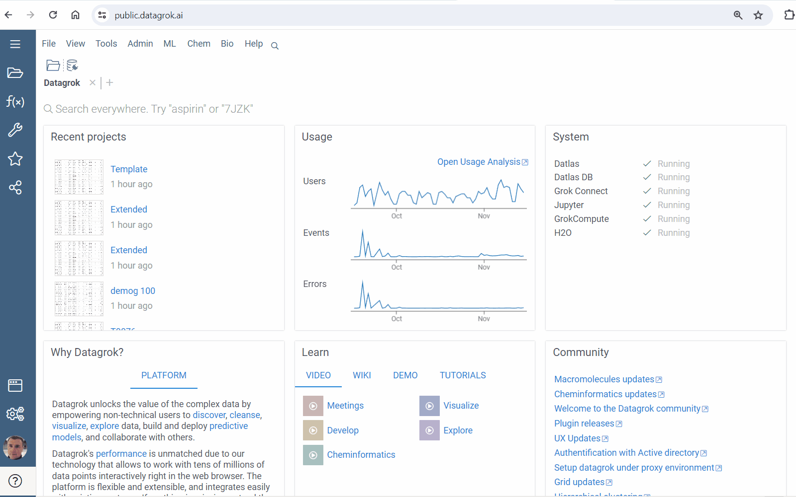
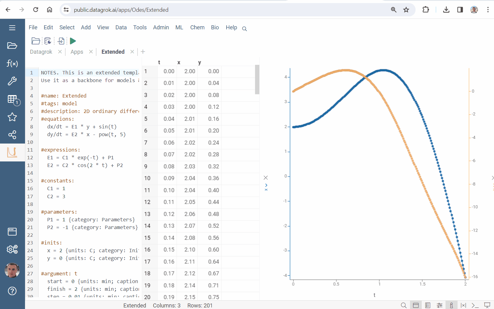
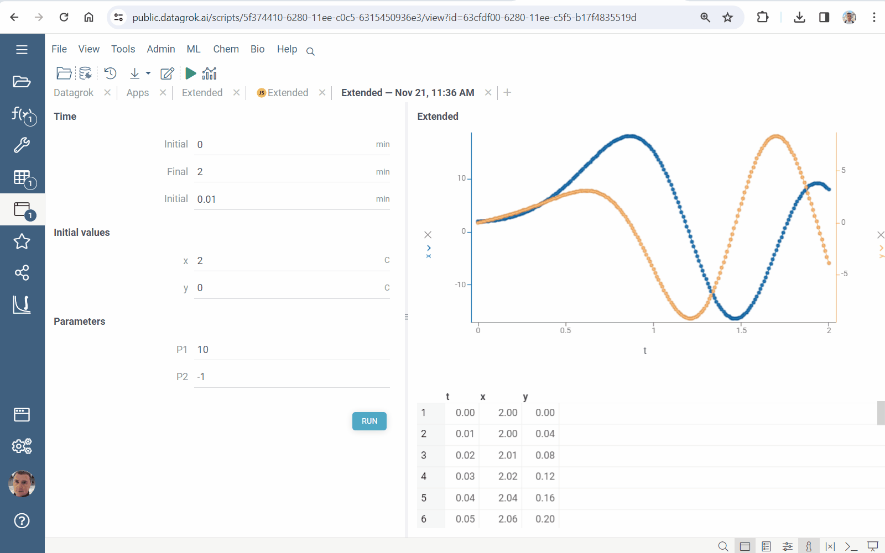
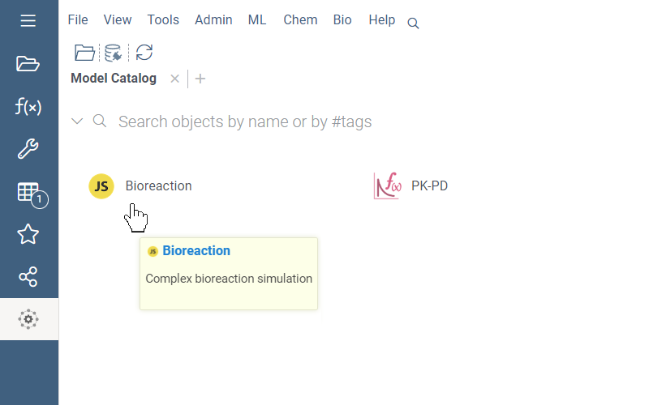
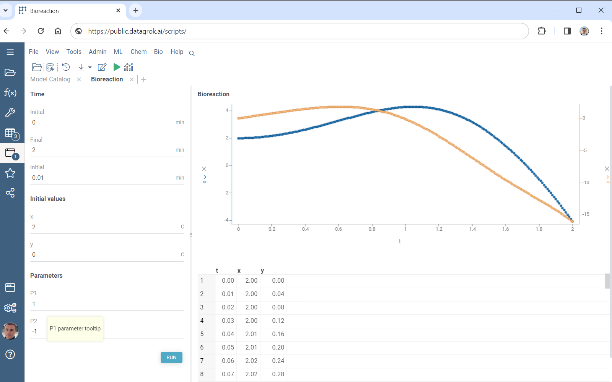

Datagrok provides the rapid creating models with an awesome UI.

Explore an extended template:

* Go to **Apps** and run **EquaSleek X**
* Right click and select **Templates > Extended...**
* Press <i class="fas fa-play"></i> **Run** button and check results



Create a model:

* Press <i class="fa-file-import"></i> **Export** button on the top panel
* Press **SAVE** button
* Press <i class="fas fa-play"></i> **Run**



Use the model obtained:

* Go to **Apps**
* Run **Model Catalog**
* Double click on the model



## Creating models

Each project can be exported to JavaScript script:

* Press <i class="fa-file-import"></i> **Export** button on the top panel
* Press **SAVE** button

The created script can be found in the platform `Scripts`.

Use `#tags: model` to add your model to `Model Catalog`. Provide a description in the `#description`-line:

```python
#name: Bioreaction
#tags: model
#description: Complex bioreaction simulation
```

It improves usability:



## Improvement

Apply annotations in your project to get better UI. Append them, when defining *parameters*, *initial values* and *argument*.

Group inputs by specifying their `category`:

```python
#parameters:
  P1 = 1 {category: Parameters}
  P2 = -1 {category: Parameters}
```

Add `units`:

```python
#inits:
  x = 2 {units: C; category: Initial values}
  y = 0 {units: C; category: Initial values}
```

Define the desired `caption`:

```python
#argument: t
  start = 0 {caption: Initial; units: min; category: Time}
  finish = 2 {caption: Final; units: min; category: Time}
  step = 0.01 {caption: Initial; units: min; category: Time}
```

Provide hints in brackets `[ ]`:

```python
  P1 = 1 {category: Parameters} [P1 parameter tooltip]
```

Datagrok transforms annotations to excellent UI:



## Pro features

The solver ensures rich capabilities for modeling complex processes and phenomena. Combine them with [scripting](../scripting.md) tools. Export your project to JavaScript script and add the desired functionality:

* results visualization
* non-elementary and special functions use
* Datagrok packages functions call

and a lot more.

See also

* [Use cases](use-cases.md)
* [Scripting](../scripting.md)
