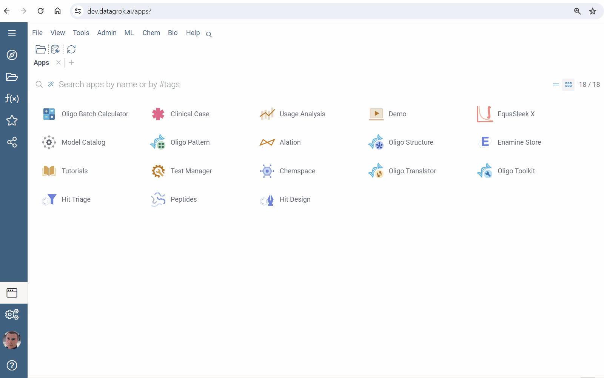
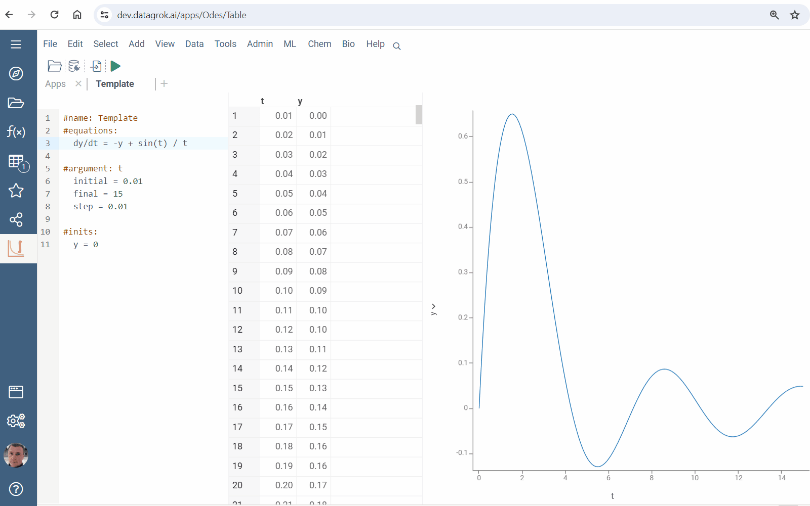
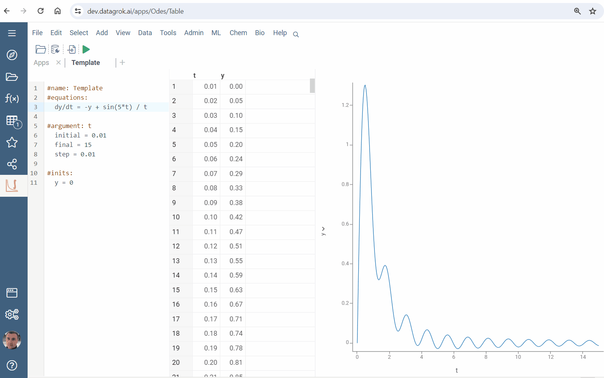

The platform ensures intuitive tools for the rapid solving systems of ordinary differential equations systems.

1. Run [solver](solver.md): 

* Go to **Apps**
* Run **EquaSleek X**
* Press <i class="fas fa-play"></i> **Run** button on the top panel

2. Modify a template:

* Edit formulas or add new ones
* Click **F5** or <i class="fas fa-play"></i> **Run** button

3. Use an advanced template:

* Rigth click and select **Templates > Advanced...**
* Modify formulas and click **F5**

4. Save formulas in a local file:

* Rigth click and select **Save...**
* Find the file in Downloads

5. Load equations from a local file:

* Rigth click and select **Load...**
* Select a file with formulas

Find more capabilities in developing [from scratch](from-scratch.md).

Learn [extensions](extensions.md) design for the no-code creating models with an awesome UI.
