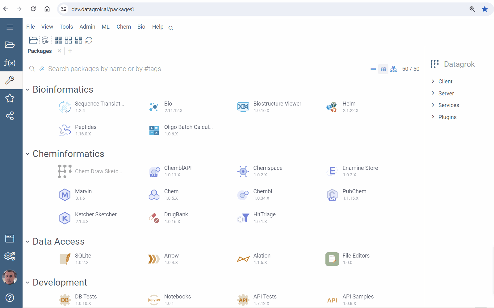

Datagrok provides in-browser tool for solving [initial value problem](https://en.wikipedia.org/wiki/Initial_value_problem) for ordinary differential equations systems. They are widely used, when modeling complex processes and phenomena.

* Go to **Apps**
* Run **EquaSleek X**
* Enter formulas or modify template
* Press <i class="fas fa-play"></i> **Run** button on the top panel

Learn more in

* [Quick start](quick-start.md)
