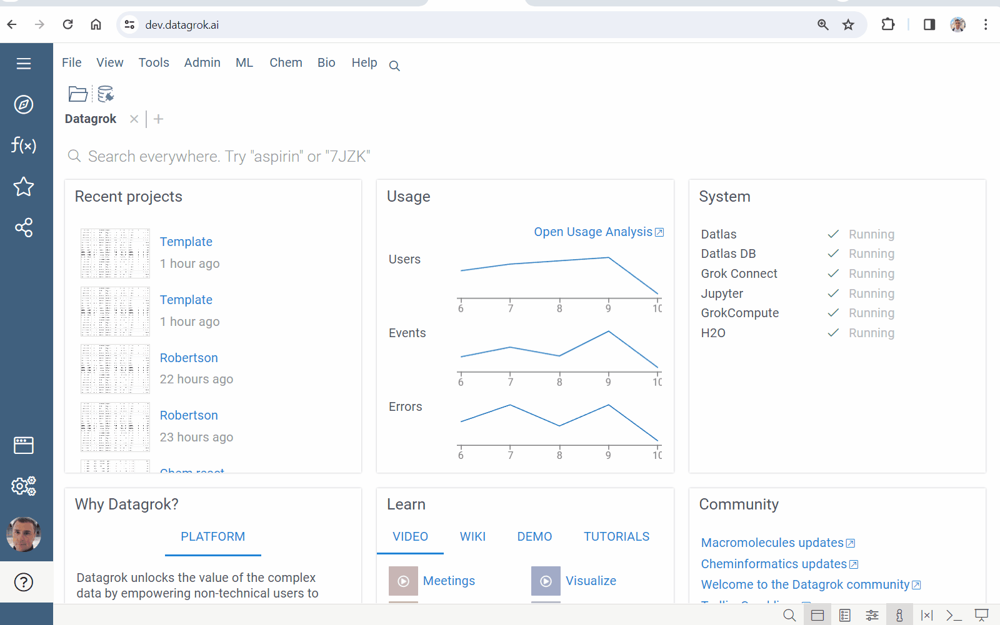
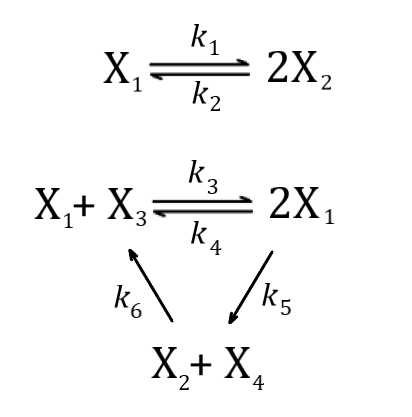
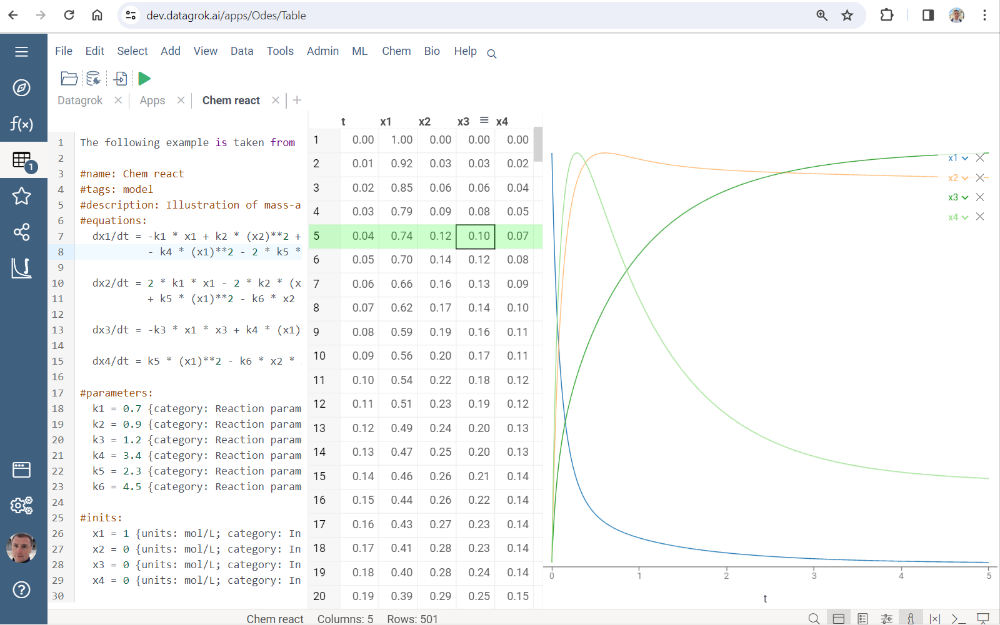
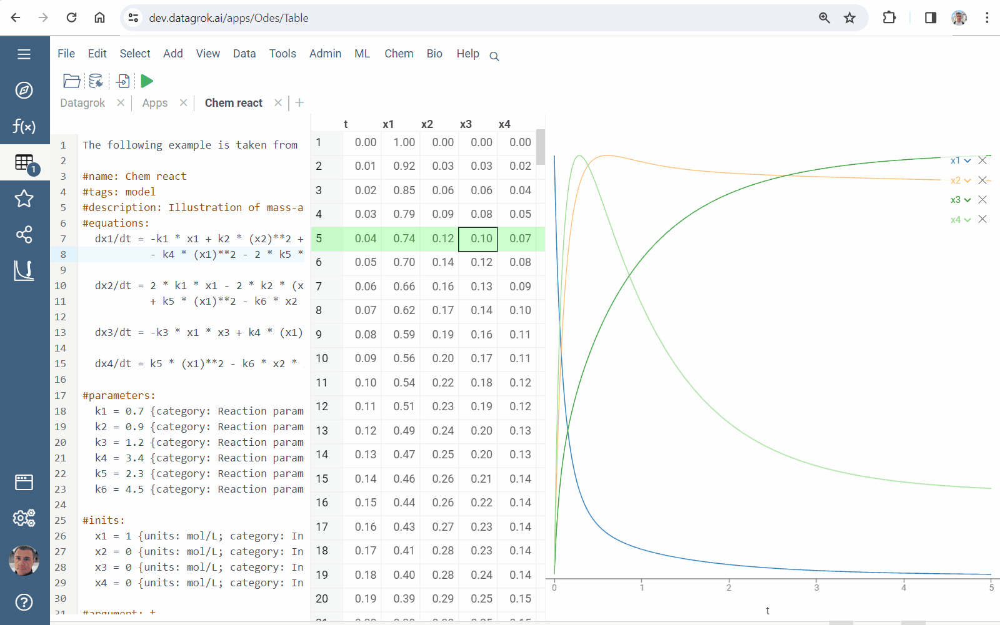
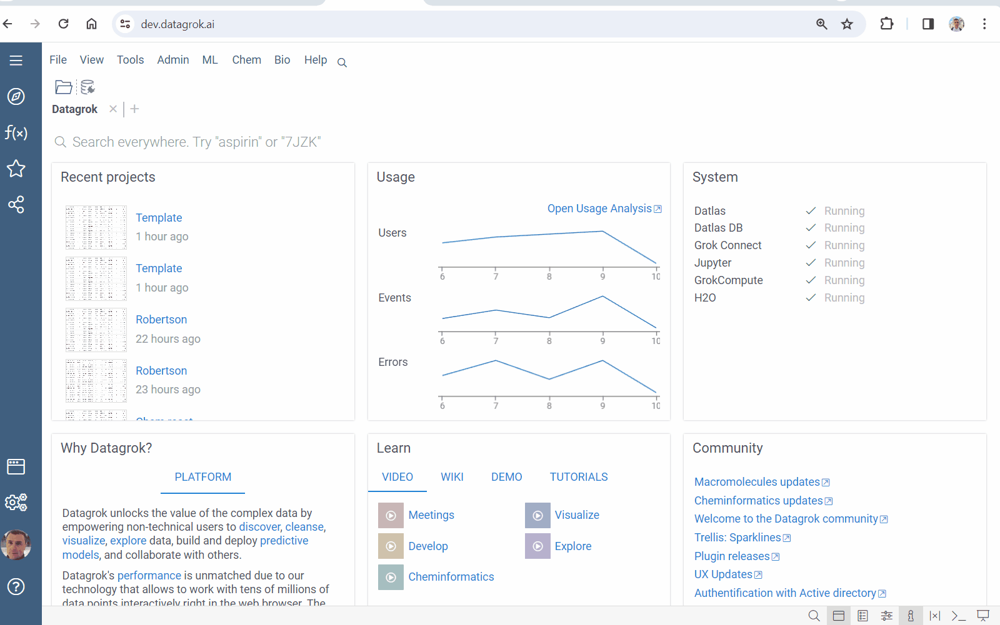
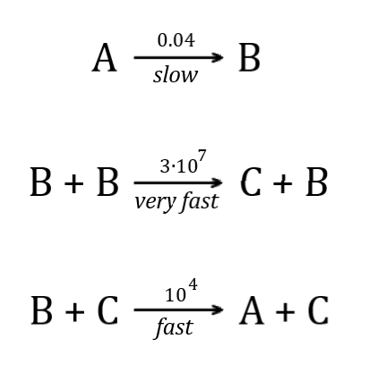
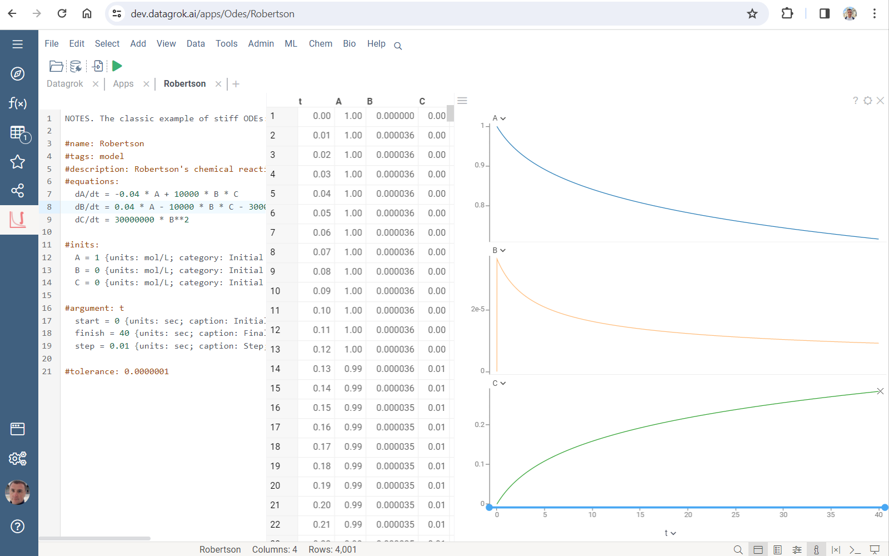
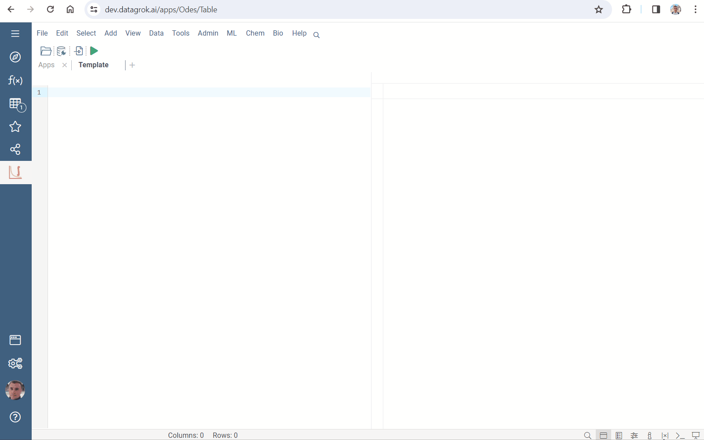

Datagrok [solver](solver.md) has a wide scope of application. The high-performance computations are ensured. Several clicks are needed to create modeling app with an awesome UI.

Explore built-in use cases:

* Go to **Apps** and run **EquaSleek X**
* Right click and select **Use cases**
* Choose a sample



## Chemical reactions

Deterministic [mass-action kinetics](https://en.wikipedia.org/wiki/Law_of_mass_action) models are defined by systems of nonlinear differential equations. The `Chem react` case simulates reactions given in the network



Press <i class="fas fa-play"></i> **Run** button on the top panel and get



Create model:

* Press <i class="fa-file-import"></i> **Export** button on the top panel
* Press **SAVE** button
* Press <i class="fas fa-play"></i> **Run** and check results



Find the model in `Model Catalog`:

* Go to **Apps**
* Double click on **Model Catalog**
* Run the model



See also

* [Law of mass action](https://en.wikipedia.org/wiki/Law_of_mass_action)
* [Chemical kinetics](https://en.wikipedia.org/wiki/Chemical_kinetics)

## Robertson model

Robertson’s chemical reaction model is a well-known example of [stiff equations](https://en.wikipedia.org/wiki/Stiff_equation). It describes the process:



The `Robertson's model` case computes



Numerical solution of stiff problems is a complicated task. Datagrok's ODEs suite has tools for such cases. Both stiff and non-stiff equations are easily solved.

See also

* [Stiff equations](https://en.wikipedia.org/wiki/Stiff_equation)
* [Numerical methods](https://en.wikipedia.org/wiki/Numerical_methods_for_ordinary_differential_equations)

## Fermentation

The kinetics of the biochemical reactions in [fermentation](https://en.wikipedia.org/wiki/Fermentation) is modelled by ordinary differential equations systems. The `Fermentation` case is an illustration.

Use [Compute](../compute.md) features to create a nifty app:

* Right click and select **Use cases > Fermentation...**
* Press <i class="fas fa-play"></i> **Run** and check results
* Press <i class="fa-file-import"></i> **Export** button
* Append annotation with

```javascript
//meta.runOnOpen: true
//meta.runOnInput: true
```

Save script and run the interactive model



Learn more

* [Fermentation](https://en.wikipedia.org/wiki/Fermentation)
* [Compute](../compute.md)
