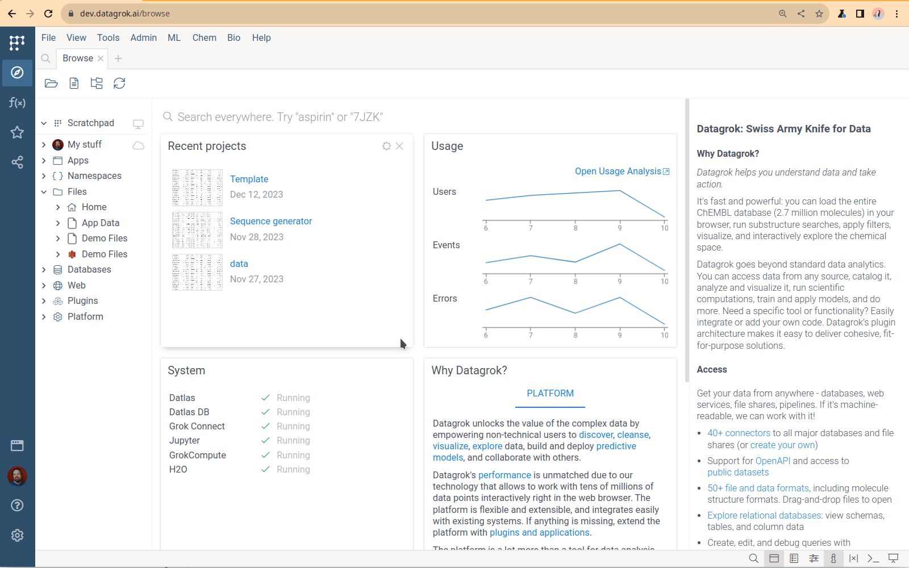
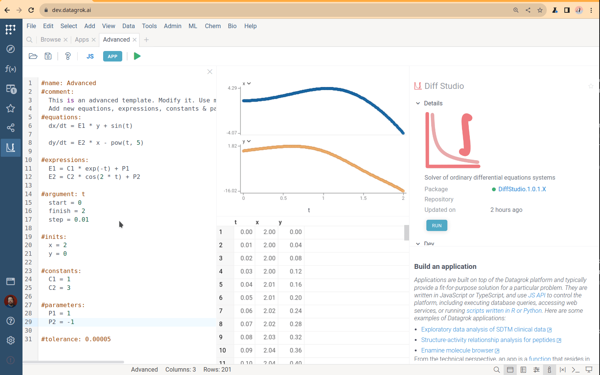
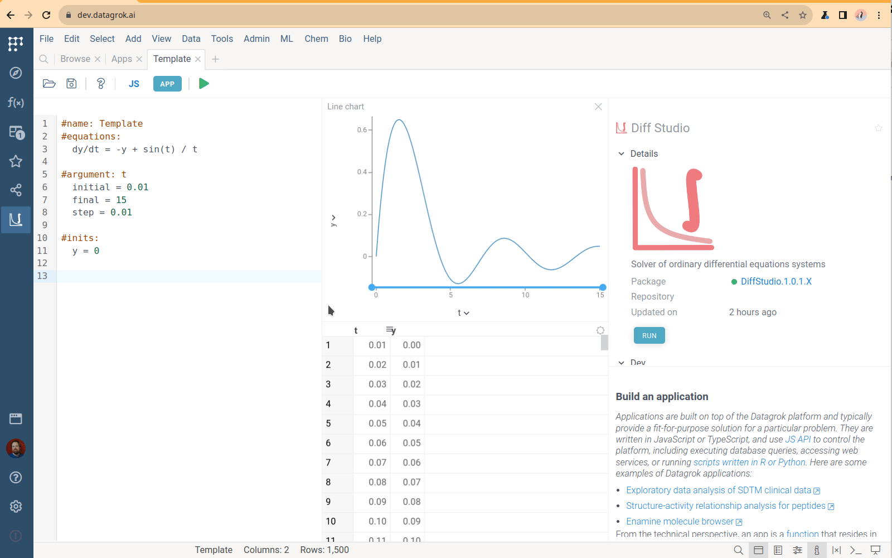
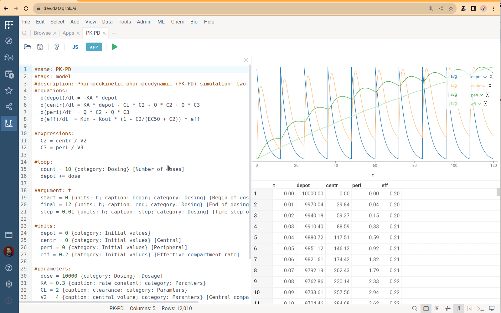
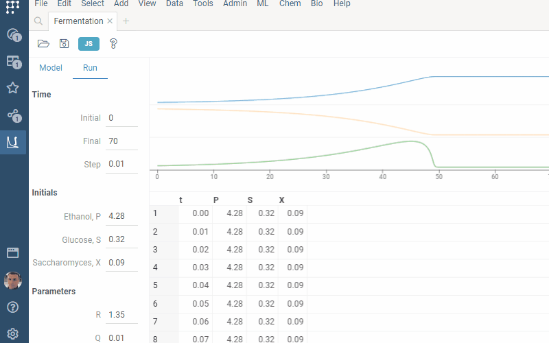
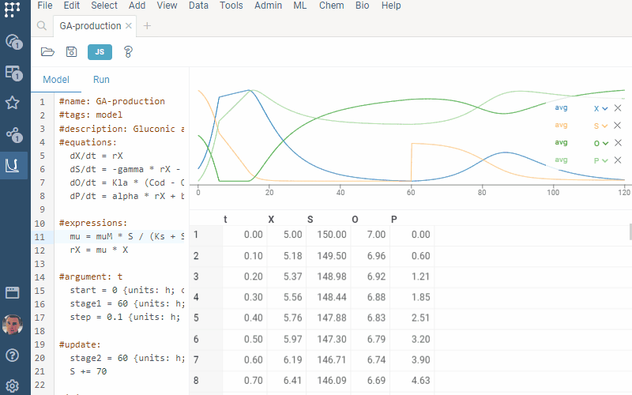

**Datagrok Diff Studio** is an innovative tool for solving [ordinary differential equations](https://en.wikipedia.org/wiki/Ordinary_differential_equation) (ODEs) right within your web browser. 

Differential equations play a crucial role in modeling complex systems in diverse fields, 
from chemical engineering and drug design to environmental studies and financial modeling. 

Using **Datagrok Diff Studio**, you can easily create mathematical models,
develop and optimize it, use interactive [visualizations](../visualize/viewers) 
and other features of the Datagrok platform.
Moreover, in a single click you can turn your model into the [Datagrok script](scripting.md),
run it as standalone data processing unit, or include in an [application](../develop/how-to/build-an-app.md).

**Key benefits and features of the Datagrok Diff Studio**:

* **Enhanced mathematical modeling:** Diff Studio can model and analyse complex multi-equation systems.
* **Ease of use:** The Diff Studio intuitive interface makes it accessible 
  and useful to both beginners and experts in mathematical modeling.
* **Rapid design:** The collection of built-in project templates and use cases speed up model design.
* **Streamlined Integration:** In just one click, you can convert formulas to the platform script, 
  implementing no-code development.
* **Broad application scope:** The Diff Studio usage ranges from [pharmacokinetics](https://en.wikipedia.org/wiki/Pharmacokinetics) 
  and [hybrid antibody formation](https://doi.org/10.1073/pnas.1220145110) simulation to [queues](https://en.wikipedia.org/wiki/Queueing_theory) modeling.

## Using Diff Studio

### Running Diff Studio

To run **Diff Studio**:

* Go to **Apps** and run **Diff Studio**. You will see the default code template with one simple differential equation.
* Go to **Run** tab and you will get UI for interactive model exploration.
* Go to **Model** tab, edit formulas or add new ones.
* Click **F5** or go to **Run** tab to re-run calculations and see updated data.



### Loading and saving data

* **To save formulas** in a local file, press the <i class="fas fa-save"></i> **Save** icon on the ribbon, and find the *ivp*-file in Downloads. You can open and edit this file using any text editor.
* **To load formulas** from a local file, press the <i class="fas fa-folder-open"></i> **Load...** on the ribbon, choose **From file...**
  option and choose a local file to upload.
* **Drag-n-drop** your *ivp*-file to Datagrok. Diff Studio will open it and load formulas. You can open *ivp*-files stored in the platform.

### Loading templates and examples

To load a template, press the <i class="fas fa-folder-open"></i> **Load...** on the ribbon, 
select **Templates** and choose one of the following templates:

| Template   | Features                                                                                    |
|------------|---------------------------------------------------------------------------------------------|
| `Basic`    | Minimum project with one differential equation                                              |
| `Advanced` | Extra math features: *expressions*, *constants*, *parameters* and *tolerance* specification |
| `Extended` | The *annotating* feature for extended UI generation                                         |

To load an example, press the <i class="fas fa-folder-open"></i> **Load...** on the ribbon, 
select **Examples** and choose a one.

## Creating a custom differential equation model

### Basic structure

A minimal project defining and solving ordinary differential equations (ODEs) contains
*name*, *differential equations*, *initial values* and *argument* specifications.

Use the `#name` keyword to define the name of your model:

```python
#name: Problem1
```

Place differential equations in the `#equations` block. You can add as many equations as you want. 
Diff Studio automatically recognizes all identifiers that you use.
You can use one-letter or multi-letter identifiers.

```python
#equations:
  dx/dt = x + y + exp(t)
  dy/dt = x - y - cos(t)
```

Define the argument, its *initial* value, *final* value, and grid *step* in the `#argument` block.
Datagrok provides a numerical solution within the range *[initial, final]* with the specified grid *step*.

```python
#argument: t
  initial = 0
  final = 1
  step = 0.01
```

Define initial values of the functions in the `#inits` block:

```python
#inits:
  x = 2
  y = 5
```

### Advances

Use the advanced features to improve your model:

Use `#comment` block to write a comment in any place of your 

```python
#comment:
  You can provide any text here. Diff Studio just ignores it.
```

Specify constants in the `#constants` block and parameters in the `#parameters` block.

Diff Studio treats `constants` and `parameters` exactly the same way.
However, when you [export equations](#platform-script-generation) to the platform script,
Diff Studio creates input UI only for `parameters` and leave `constants` hardcoded inside the script.

```python
#constants:
  C1 = 1
  C2 = 3

#parameters:
  P1 = 1
  P2 = -1
```

Define auxiliary computations in the `#expressions` block.
The **expression** is any mathematical function containing constants, parameters, argument, and other functions.
The only difference is that `expressions` functions are defined directly
and don't require solving of differential equations.
You can use expressions to separate part of the calculations and simplify your differential equations.

```python
#expressions:
  E1 = C1 * t + P1
  E2 = C2 * cos(2 * t) + P2
```

To customize the computation output, select columns and their captions in the `output` block:

```python
#output:
  t {caption: Time, h}
  A1 {caption: Central}
  A2 {caption: Periferal}
```



Set [tolerance](https://pythonnumericalmethods.berkeley.edu/notebooks/chapter19.02-Tolerance.html) of the numerical method in the `#tolerance`-line:

```python
#tolerance: 0.00005
```

### Multi-stage modeling

The multi-stage model is a model where parameters and function values can vary for different 
ranges of argument values.

Datagrok provides a special capabilities for multi-stage simulation. 

Use the `#loop` feature to specify several modeling cycles. 
Define the number of repetitions in the mandatory `count` variable and 
use any mathematical expression to modify functions and parameters.
You can set new values for parameters and change values for functions.

```python
#equations:
  dy/dt = -y + sin(N*t) / t

#parameters:
  N = 1
  
#loop:
  count = 3
  N += 2
```



Apply the `#update` feature to obtain acyclic simulation. 
Set the length of the new modeling stage in the mandatory `length` variable.
Inside you can use any mathematical expression to modify functions and parameters,
same as for the `#loop` section.

```python
#update:
  length = 6
  y = 1
```

Use any valid expression, when specifying the updates of inputs.

## Platform script generation

You can convert any Diff Studio project to the Datagrok script:

* Press the **JS** button on the top panel
* Press the **SAVE** button to save generated script

Find the created Javascript script in the platform `Scripts`.

The export feature provides an extension of your project with [scripting](scripting.md) tools. 

## Usability improvements

For all Diff Studio parameters, you can add annotations described in
[functional annotations](../datagrok/concepts/functions/func-params-annotation.md).
When you convert your model into the Datagrok script,
Diff Studio converts it to the script input annotations, 
allowing Datagrok to automatically create rich and self-explaining UI.

Use `#tags: model` to add your model to the `Model Catalog`. 
Provide a description in the `#description` line:

```python
#name: Bioreaction
#tags: model
#description: Complex bioreaction simulation
```

Define the desired captions for the input parameters.
If no caption is provided, Datagrok will use variable name.

```python
#argument: t
  start = 0 {caption: Initial time}
  finish = 2 {caption: Final time}
  step = 0.01 {caption: Calculation step}
```

Group inputs by specifying their `category`:

```python
#parameters:
  P1 = 1 {category: Parameters}
  P2 = -1 {category: Parameters}
```

Add `units`:

```python
#inits:
  x = 2 {units: C; category: Initial values}
  y = 0 {units: C; category: Initial values}
```

Provide tooltips in brackets `[ ]`:

```python
  P1 = 1 {category: Parameters} [P1 parameter tooltip]
```

Specify `min`, `max` and `step` values to get sliders and clickers for the rapid model exploration:

```python
#inits:
  x = 2 {min: 0; max: 5}
  y = 0 {min: -2; max: 2; step: 0.1}
```



## Examples

The Diff Studio has built-in examples. They cover all the Diff Studio capabilities. Get access to them 
via the <i class="fas fa-folder-open"></i> **Load...** button on the ribbon and use as a template.

### Chem reactions

The `Chem react` example simulates deterministic [mass-action kinetics](https://en.wikipedia.org/wiki/Law_of_mass_action) given in the network


This example illustrates annotation of model inputs.

### Robertson model

Robertson’s chemical reaction model is a well-known example of [stiff equations](https://en.wikipedia.org/wiki/Stiff_equation). It describes the process


Numerical solution of stiff problems is a complicated task. Diff Studio provides solution of both stiff and non-stiff equations.

### Fermentation

The `Fermentation` example illustrates the kinetics of the biochemical reactions in [fermentation](https://en.wikipedia.org/wiki/Fermentation).



### PK-PD

PK-PD modeling simulates pharmacokinetics (PK), pharmacodynamics (PD), and their [relationship](https://www.ncbi.nlm.nih.gov/pmc/articles/PMC7348046). It is used in drug discovery and development. The `PK-PD` example illustrates the usage of the `loop` feature for dosing specification


### Acid production

`Acid production` models gluconic acid [production](https://oatao.univ-toulouse.fr/9919/1/Elqotbi_9919.pdf) by Aspergillus niger. This example shows the usage of the `update` feature for multi-stage simulation



### Nimotuzumab

The `Nimotuzumab` example simulates population pharmacokinetic for [nimotuzumab](https://www.mdpi.com/1999-4923/12/12/1147). It demonstrates the `output` feature


Datagrok's ODEs suite has tools for solving both stiff and non-stiff equations. Combine the Diff Studio 
with [viewers](../visualize/viewers/viewers.md) and [compute](compute.md) tools to explore complex models.

See also

* [Numerical methods for ODEs](https://en.wikipedia.org/wiki/Numerical_methods_for_ordinary_differential_equations)
* [Stiff equations](https://en.wikipedia.org/wiki/Stiff_equation)
