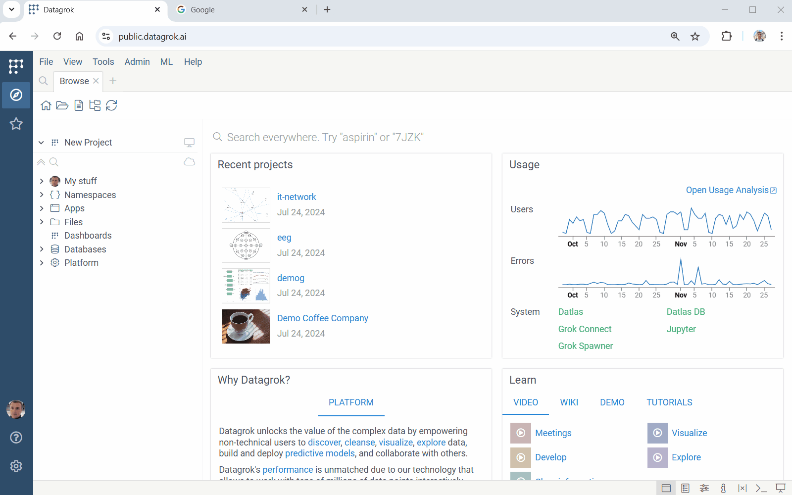
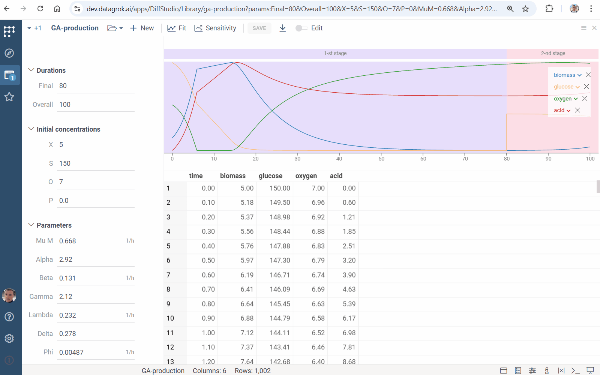
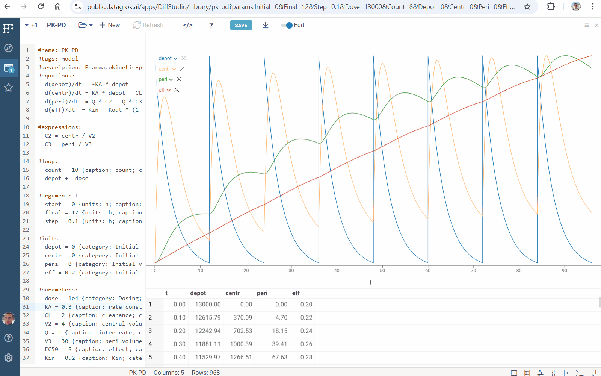
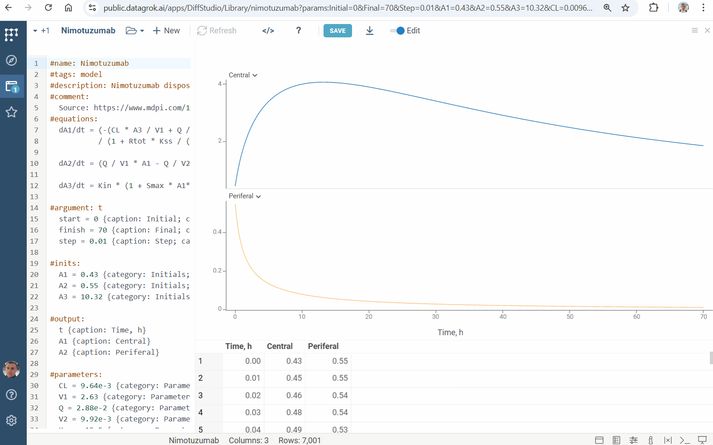
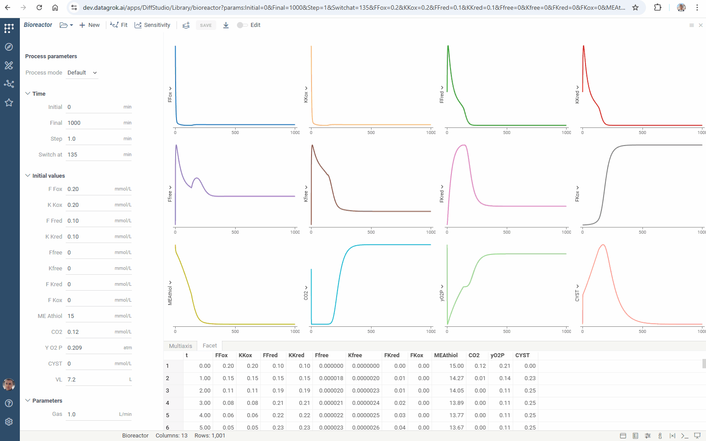

**Datagrok Diff Studio** solves [ordinary differential equations](https://en.wikipedia.org/wiki/Ordinary_differential_equation) (ODEs) right within your web browser, and provides interactive exploration of their solution.

Differential equations play a crucial role in modeling complex systems in diverse fields, from chemical engineering and drug design to environmental studies and financial modeling.

Using **Diff Studio**, you can create mathematical models, build interactive [visualizations](../visualize/viewers),
develop platform [applications](../develop/how-to/build-an-app.md) and combine them with other features of Datagrok.

**Key benefits and features**:

* **Enhanced mathematical modeling:** Diff Studio can model and analyse complex multi-equation systems.
* **Ease of use:** Diff Studio intuitive interface makes it accessible
  and useful to both beginners and experts in mathematical modeling.
* **Rapid design:** The collection of built-in model templates and examples speeds up model design.
* **Streamlined integration:** In a single click, you can convert formulas to the platform [script](scripting/scripting.mdx),
  implementing no-code development.
* **Broad application scope:** Diff Studio usage ranges from [pharmacokinetics](https://en.wikipedia.org/wiki/Pharmacokinetics)
  and [hybrid antibody formation](https://doi.org/10.1073/pnas.1220145110) simulation to [queues](https://en.wikipedia.org/wiki/Queueing_theory) modeling.

## Using Diff Studio

### Running Diff Studio

To run **Diff Studio**:

* Go to **Apps** and run **Diff Studio**. When you first use this application, you will see the default model.
* Modify inputs and check computations. Use sliders for the rapid model exploration.
* Turn on the **Edit** toggle on the top panel. Equations editor opens. Edit formulas or add new ones.
* Click <i class="fas fa-sync"></i> **Refresh** or press **F5** to apply changes.


### Loading and saving data

Click the **Save** button on the top panel to save model to your platform files (**Browse > Files > My files**)

* **To save model** to your platform files (**Browse > Files > My files**), click the **Save** button on the top panel.
* Click <i class="fas fa-arrow-to-bottom"></i> **Download** to save model to a local file. Find the *ivp*-file in Downloads. You can open and edit this file using any text editor.
* **To load model** from a local file, click <i class="fas fa-folder-open d4-combo-popup" style="min-width: 0px; cursor: default"></i> **Open**, choose **Import...** option and choose a local file to upload.
* **Drag-n-drop** your *ivp*-file to Datagrok. Diff Studio will open it and load formulas. You can open *ivp*-files stored in the platform.

### Browse and share models

Go to **Browse > Compute > Apps** and expand the **Diff Studio** group:

* Check model templates from **Templates**. Use them as a backbone of your model.
* Click **Library** and explore built-in models. They cover all Diff Studio capabilities.
* Find recently opened models in **Recent**.


In **Browse**, click any *ivp*-file. Model preview opens. Modify inputs and check results. Use URL to share computations:



By using a URL, you can share model runs from the **Templates**, **Examples** and **Recent** groups.

### Sensitivity analysis

Explore the relationship between inputs and outputs of your model using the [Sensitivity Analysis](function-analysis.md#sensitivity-analysis) feature. Run it directly from Diff Studio:

* Click <i class="fas fa-chart-line"></i> **Sensitivity** icon on the top panel
* Apply one of the following methods:
  * [Monte Carlo](function-analysis.md#monte-carlo)
  * [Sobol](function-analysis.md#sobol)
  * [Grid](function-analysis.md#grid)
* Analyze model evaluations



### Parameter Optimization

Find input conditions leading to the specified output constraints using the [Parameter Optimization](function-analysis.md#parameter-optimization) feature. It finds input values that minimize deviation measured by [loss function](https://en.wikipedia.org/wiki/Loss_function). Run it directly from Diff Studio:

* Click <i class="fas fa-wave-sine"></i> **Fit** icon on the top panel
* In the `Fit` block, use switchers to specify inputs to be found:
  * Set `min` and `max` values for each selected item. They define the variation range
  * Set values of all other inputs
* In the `Target` block, specify output constraints:
  * Set dataframe with expected output values (in the table input)
  * Set column with values of the independent variable (in the `argument` field)
* Specify settings of fitting:
  * Choose numerical optimization method (in the `method` field), and set loss function type (in the `loss` field)
  * Specify number of points to be found (in the `samples` field)
  * Set the maximum scaled deviation between similar fitted points (in the `similarity` field): the higher the value, the fewer points will be found
* Click <i class="fas fa-play"></i> **Run fitting** icon. You will get a [grid](../visualize/viewers/grid) containing
  * loss function values
  * fitted inputs
  * [line charts](../visualize/viewers/line-chart) visualizing the goodness of fit and showing the loss function minimization
* Open `Context panel` (F4). You will get the simulation run corresponding to the selected grid row


## Creating a custom differential equation model

### Basic model

A minimal model defining and solving ordinary differential equations contains
*name*, *differential equations*, *initial values* and *argument* specifications.

Use the `#name` keyword to define the name of your model:

```python
#name: Problem1
```

Place differential equations in the `#equations` block. You can add as many equations as you want.
Diff Studio automatically recognizes all identifiers that you use.
You can use one-letter or multi-letter identifiers.

```python
#equations:
  dx/dt = x + y + exp(t)
  dy/dt = x - y - cos(t)
```

Define the argument, its *initial* value, *final* value, and grid *step* in the `#argument` block.
Datagrok provides a numerical solution within the range *[initial, final]* with the specified grid *step*.

```python
#argument: t
  initial = 0
  final = 1
  step = 0.01
```

Define initial values of the functions in the `#inits` block:

```python
#inits:
  x = 2
  y = 5
```

### Advanced model

Use the advanced features to improve your model.

Use `#comment` block to write a comment in any place of your model

```python
#comment:
  You can provide any text here. Diff Studio just ignores it.
```

Place comments right in formulas using `//`

```python
#equations:
  dx/dt = x + y + exp(t) // 1-st equation
  dy/dt = x - y - cos(t) // 2-nd equation
```

Specify constants in the `#constants` block and parameters in the `#parameters` block.

Diff Studio treats `constants` and `parameters` exactly the same way.
However, when you [export equations](#platform-script-generation) to the platform script,
Diff Studio creates input UI only for `parameters` and leave `constants` hardcoded inside the script.

```python
#constants:
  C1 = 1
  C2 = 3

#parameters:
  P1 = 1
  P2 = -1
```

Define auxiliary computations in the `#expressions` block.
The **expression** is any mathematical function containing constants, parameters, argument, and other functions.
The only difference is that `expressions` functions are defined directly
and don't require solving of differential equations.
You can use expressions to separate part of the calculations and simplify your differential equations.

```python
#expressions:
  E1 = C1 * t + P1
  E2 = C2 * cos(2 * t) + P2
```

To customize the computation output, select columns and their captions in the `output` block:

```python
#output:
  t {caption: Time, h}
  A1 {caption: Central}
  A2 {caption: Periferal}
```


Set [tolerance](https://pythonnumericalmethods.berkeley.edu/notebooks/chapter19.02-Tolerance.html) of the numerical method in the `#tolerance`-line:

```python
#tolerance: 0.00005
```

### Cyclic process simulation

Datagrok provides special capabilities for modeling cyclic processes.

Use the `#loop` feature to specify several modeling cycles.
Define the number of repetitions in the mandatory `count` variable and
use any mathematical expression to modify functions and parameters.
You can set new values for parameters and change values for functions.

```python
#equations:
  dy/dt = -y + sin(N*t) / t

#parameters:
  N = 1
  
#loop:
  count = 3
  N += 2
```


### Multistage model

Use the `#update` feature to construct models with multiple sequential processes (stages).

Add name of the first stage in the `#argument` block:

```python
#argument: t, 1-st stage
  t0 = 0.01
  t1 = 15
  h = 0.01
```

Add the `#update` block. Enter name of the stage and set its duration. Add lines with model inputs updates. Use any valid mathematical expression to define them.

```python
#update: 2-nd stage
  duration = 23
  p = p * 2
```

You can add any number of `update` blocks. Simulation stages are marked with a color:


## Usability improvements

For all Diff Studio parameters, you can add annotations described in
[functional annotations](../datagrok/concepts/functions/func-params-annotation.md).
When you convert your model into the Datagrok script,
Diff Studio converts it to the script input annotations,
allowing Datagrok to automatically create rich and self-explaining UI.

Define the desired captions for the input parameters.
If no caption is provided, Datagrok will use variable name.

```python
#argument: t
  start = 0 {caption: Initial time}
  finish = 2 {caption: Final time}
  step = 0.01 {caption: Calculation step}
```

Group inputs by specifying their `category`:

```python
#parameters:
  P1 = 1 {category: Parameters}
  P2 = -1 {category: Parameters}
```

Add `units`:

```python
#inits:
  x = 2 {units: C; category: Initial values}
  y = 0 {units: C; category: Initial values}
```

Provide tooltips in brackets `[ ]`:

```python
  P1 = 1 {category: Parameters} [P1 parameter tooltip]
```

Specify `min`, `max` and `step` values to get sliders and clickers for the rapid model exploration:

```python
#inits:
  x = 2 {min: 0; max: 5}
  y = 0 {min: -2; max: 2; step: 0.1}
```


## Loading templates and examples

To load a template, click <i class="fas fa-folder-open d4-combo-popup" style="min-width: 0px; cursor: default"></i> **Open** on the ribbon, select **Templates** and choose one of the following templates:

| Template   | Features                                                                                    |
|------------|---------------------------------------------------------------------------------------------|
| `Basic`    | Minimum project with one differential equation                                              |
| `Advanced` | Extra math features: *expressions*, *constants*, *parameters* and *tolerance* specification |
| `Extended` | The *annotating* feature for extended UI generation                                         |

To load an example, click <i class="fas fa-folder-open d4-combo-popup" style="min-width: 0px; cursor: default"></i> **Open**,
select **Library** and choose a one.

## Examples

Diff Studio has built-in examples. They cover all Diff Studio capabilities. Get access to them
via the <i class="fas fa-folder-open d4-combo-popup" style="min-width: 0px; cursor: default"></i> **Open** icon on the ribbon and use as a template.

### Chem reactions

The `Chem react` example simulates deterministic [mass-action kinetics](https://en.wikipedia.org/wiki/Law_of_mass_action) given in the network


This example illustrates annotation of model inputs.

### Robertson model

Robertson’s chemical reaction model is a well-known example of [stiff equations](https://en.wikipedia.org/wiki/Stiff_equation). It describes the process


Numerical solution of stiff problems is a complicated task. Diff Studio provides solution of both stiff and non-stiff equations.

### Fermentation

The `Fermentation` example illustrates the kinetics of the biochemical reactions in [fermentation](https://en.wikipedia.org/wiki/Fermentation).


### PK

[Pharmacokinetics](https://en.wikipedia.org/wiki/Pharmacokinetics) (PK) studies how the body absorbs, distributes, metabolizes, and excretes drugs over time. The `PK` example simulates this process. It demonstrates the usage of the `meta.solver` feature for numerical [solver management](#solver-settings).


### PK-PD

PK-PD modeling simulates pharmacokinetics (PK), pharmacodynamics (PD), and their [relationship](https://www.ncbi.nlm.nih.gov/pmc/articles/PMC7348046). It is used in drug discovery and development. The `PK-PD` example illustrates the usage of the `loop` feature for dosing specification



### Acid production

`Acid production` models gluconic acid [production](https://oatao.univ-toulouse.fr/9919/1/Elqotbi_9919.pdf) by Aspergillus niger. This example shows the usage of the `update` feature for multistage simulation


### Nimotuzumab

The `Nimotuzumab` example simulates population pharmacokinetic for [nimotuzumab](https://www.mdpi.com/1999-4923/12/12/1147). It demonstrates the `output` feature



### Bioreactor

The `Bioreactor` example models the [kinetic mechanism](https://doi.org/10.1074/jbc.RA117.000303) of controlled Fab-arm exchange for the formation of bispecific immunoglobulin G1 antibodies. It shows how to use the `meta.inputs` feature to specify a table with pre-defined model inputs.


### Pollution

The `Pollution` example describes a chemical reaction part of the air [pollution model](https://archimede.uniba.it/~testset/problems/pollu.php). It consists of 25 reaction and 20 reacting compounds. This example illustrates the capability of Diff Studio to solve large systems of [stiff equations](https://en.wikipedia.org/wiki/Stiff_equation).


Datagrok's ODEs suite has tools for solving both stiff and non-stiff equations. Combine Diff Studio
with [viewers](../visualize/viewers/viewers.md) and [compute](compute.md) tools to explore complex models.

## Platform script generation

You can convert any Diff Studio project to the Datagrok script:

1. Turn on the **Edit** toggle on the top panel.
2. Click **</>** icon. Script editor opens in a new view.
3. Click the **SAVE** button.
4. Script is created, and can be found in the "Scripts" section of the platform.

Find the created JavaScript script in the platform `Scripts` (**Browse > Platform > Functions > Scripts**).

Use `#tags: model` to add your model to the `Model Catalog`.
Provide a description in the `#description` line:

```python
#name: Bioreaction
#tags: model
#description: Complex bioreaction simulation
```

The export feature provides an extension of your project with [scripting](scripting/scripting.mdx) tools. Apply it to get:

* non-elementary and special functions' use
* Datagrok packages' functions call

## Solver settings

Manage the solver of ODEs to improve performance. Specify its settings in the `#meta.solver`-line:

* the numerical method (`method`)
* the maximum number of iterations (`maxIterations`)
* the maximum computation time (`maxTimeMs`)

Diff Studio implements the following [Rosenbrock–Wanner](https://doi.org/10.1016/j.cam.2015.03.010) methods for solving ODEs:

|Method|Value|
|-------------|--------|
|The modified Rosenbrock triple|`'mrt'`|
|The ROS3PRw method|`'ros3prw'`|
|The ROS34PRw method|`'ros34prw'`|

By default, Diff Studio uses ROS34PRw and alerts you if computations take too long. The default time limit is 5 seconds. To customize it, set the maximum computation time (in milliseconds):

```python
#meta.solver: {method: 'mrt'; maxTimeMs: 50}
```

Set the maximum number of iterations to debug formulas in complex models.

## Lookup tables

Lookup tables are pre-defined sets of model input values. They're organized as follows:

||x|y|...|
|-----|-----|-----|---|
|Set 1|1|2|...|
|Set 2|3|4|...|

To use a lookup table:

* Create a CSV file with your table and add it to your project
* Add the `#meta.inputs`-line to your model and specify a CSV file with a lookup table:

```python
#meta.inputs: table {choices: OpenFile("System:AppData/DiffStudio/inputs.csv")}
```

* To improve usability, define `caption`, `category` and a tooltip:

```python
#meta.inputs: table {choices: OpenFile("System:AppData/DiffStudio/inputs.csv"); caption: Mode; category: Settings} [Hint]
```

Use the interface to select inputs and compare model runs:



## Syntax

Diff Studio lets you define model in a declarative form using simple syntax:

|Keyword|Specifies|
|-|-|
|**#name**|Model name|
|**#equations**|Ordinary differential equations ([ODEs](https://en.wikipedia.org/wiki/Ordinary_differential_equation))|
|**#inits**|[Initial conditions](https://en.wikipedia.org/wiki/Initial_value_problem)|
|**#argument**|The independent variable, its range, and the solution time step|
|**#expressions**|Additional computations|
|**#parameters**|Model parameters (Diff Studio creates UI inputs for them)|
|**#constants**|Model constants|
|**#loop**|Multiple simulation [cycles](#cyclic-process-simulation)|
|**#update**|Additional modeling [stage](#multistage-model)|
|**#output**|Customized model output|
|**#tolerance**|[Tolerance](https://pythonnumericalmethods.berkeley.edu/notebooks/chapter19.02-Tolerance.html) of the numerical method|
|**#meta.inputs**|CSV file with inputs [lookup table](#lookup-tables)|
|**#meta.solver**|ODEs solver [settings](#solver-settings)|
|**#comment**|Explanations, notes, remarks, etc.|
|**#tags**|The platform [script](#platform-script-generation) tags|
|**#description**|The platform [script](#platform-script-generation) tooltip|

To improve [usability](#usability-improvements), you can annotate model inputs using:

|Option|Specifies|
|-|-|
|**caption**|Input caption|
|**category**|Input category. Items belonging to the same category are grouped together in the UI|
|**units**|Input measure units|
|**min**, **max**|Input min and max values, respectively. Use them to get sliders for UI input|

## See also

* [Stiff equations](https://en.wikipedia.org/wiki/Stiff_equation)
* [Numerical methods for ODEs](https://en.wikipedia.org/wiki/Numerical_methods_for_ordinary_differential_equations)
* [Rosenbrock–Wanner method](https://doi.org/10.1016/j.cam.2015.03.010)
