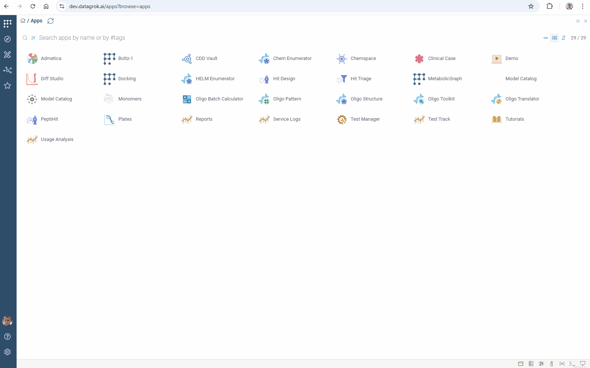
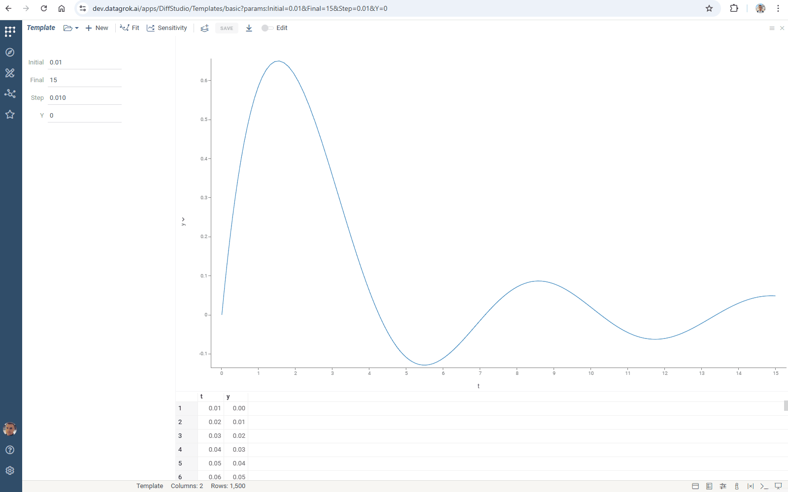
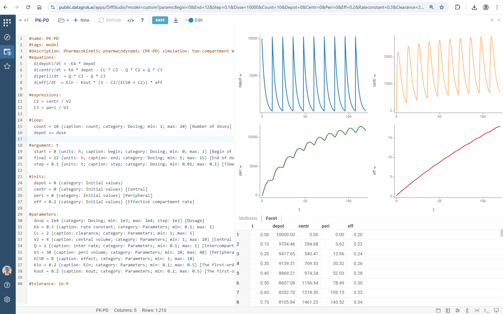

Differential equations are crucial in modeling complex systems - from pharmacology and drug manufacturing to financial modeling and environmental studies.

Datagrok Diff Studio solves [initial value problems](https://en.wikipedia.org/wiki/Initial_value_problem) for
[ordinary differential equations](https://en.wikipedia.org/wiki/Ordinary_differential_equation) (ODEs) and visualizes solutions in real time, 
turning complex math into interactive visual models.

Key benefits:

* **For model users**
  * Instantly see how parameter changes affect your system
  * Find optimal parameter values that match your target data
  * Explore model behavior using Monte Carlo, Sobol, and other methods
* **For model creators**
  * Focus on the math - the platform handles visualization and interface
  * Start quick with pre-built models  
  * Solve both stiff and non-stiff equations
  * Handle complex multi-equation ODE systems
  * Debug equations easily
* **For organizations**
  * Store and share all ODE models in one, centralized hub
  * Convert models to scripts to extend functionality or integrate with other Datagrok tools
  * Build specialized scientific applications

## Working with models

Launch Diff Studio from **Apps** > **Diff Studio**. The app opens with your recent model, or a default template if it's your first time.

To load an existing model, click the <i class="fas fa-folder-open d4-combo-popup" style="min-width: 0px; cursor: default"></i> **Open** icon and choose:

* **Import...** to import local IVP files (or simply drag-and-drop)
* **Library** to open a production model from the [catalog](models.md#ordinary-differential-equations)
* **Templates** to start with a model template
* **My Models** to open a model from your platform files (**Browse > Files > My files**)
* **Recent** to open your recent models

Once loaded, explore models by adjusting parameters, [fitting to experimental data](#parameter-fitting), or [running sensitivity analysis](#sensitivity-analysis). Share specific model runs by copying and sharing the URL with colleagues.



Download models using the <i class="fas fa-arrow-to-bottom"></i> **Download** icon as IVP files, which you can edit in any text editor. To store a model in Datagrok, click the **SAVE** button and specify the location.

### Parameter fitting

To find input conditions that satisfy output constraints, in the top ribbon, click the **Fit** icon. This [parameter optimization](function-analysis.md#parameter-optimization) feature minimizes the deviation between model output and target data using [loss functions](https://en.wikipedia.org/wiki/Loss_function).

In the fitting view, configure:

1. Under **Fit**, select parameters to optimize:
   * Toggle parameters to include in optimization
   * Set search range (`min` and `max` values)
   * Set fixed values for other parameters

2. Under **Target**, define output constraints:
   * Select data table (**Table**)
   * Set independent variable columns (**Argument**)

3. Under **Using**, configure optimization:
   * Choose optimization method (**method**) and loss function type (**loss**). Diff Studio uses [Nelder-Mead method](https://en.wikipedia.org/wiki/Nelder%E2%80%93Mead_method) to minimize loss functions like MAD and RMSE
   * Specify number of fitted points to find (**samples**)
   * Specify maximum deviation between fitted points (**similarity**) - higher values yield fewer points
4. On the top ribbon, click **Run** to generate a [grid](../visualize/viewers/grid) showing loss function values, fitted parameters, and [line charts](../visualize/viewers/line-chart) of fit quality

To view the simulation for any selected result, open the **Context Panel** (F4).


### Sensitivity analysis

Explore the relationship between inputs and outputs of your model using the [Sensitivity Analysis](function-analysis.md#sensitivity-analysis) feature. Run it directly from Diff Studio:

1. Click the **Sensitivity** icon on the top panel. **Sensitivity Analysis View** opens
2. Apply one of the following methods:
   * [Monte Carlo](function-analysis.md#monte-carlo)
   * [Sobol](function-analysis.md#sobol)
   * [Grid](function-analysis.md#grid)
3. Analyze model evaluations. Open `Context panel` (F4). You get the simulation run corresponding to the selected grid row


## Creating models

Turn on the **Edit** toggle on the top panel. Equations editor opens. Edit formulas or add new ones.
Click <i class="fas fa-sync"></i> **Refresh** or press **F5** to apply changes.



### Syntax and templates

A minimal model defining and solving ordinary differential equations contains
*name*, *differential equations*, *initial values* and *argument* specifications.

Use the `#name` keyword to define the name of your model:

```python
#name: Problem 1
```

Place differential equations in the `#equations` block. You can add as many equations as you want.
Diff Studio automatically recognizes all identifiers that you use.
You can use one-letter or multi-letter identifiers.

```python
#equations:
  dx/dt = x + y + exp(t)
  dy/dt = x - y - cos(t)
```

Define the argument, its *initial* value, *final* value, and grid *step* in the `#argument` block.
Datagrok provides a numerical solution within the range *[initial, final]* with the specified grid *step*.

```python
#argument: t
  initial = 0
  final = 1
  step = 0.01
```

Define initial values of the functions in the `#inits` block:

```python
#inits:
  x = 2
  y = 5
```

Use `#comment` block to write a comment in any place of your model

```python
#comment:
  You can provide any text here. Diff Studio just ignores it.
```

Place comments right in formulas using `//`

```python
#equations:
  dx/dt = x + y + exp(t) // 1-st equation
  dy/dt = x - y - cos(t) // 2-nd equation
```

Specify constants in the `#constants` block and parameters in the `#parameters` block.

Diff Studio treats `constants` and `parameters` exactly the same way.
However, when you [export equations](#platform-script-generation) to the platform script,
Diff Studio creates input UI only for `parameters` and leave `constants` hardcoded inside the script.

```python
#constants:
  C1 = 1
  C2 = 3

#parameters:
  P1 = 1
  P2 = -1
```

Define auxiliary computations in the `#expressions` block.
The **expression** is any mathematical function containing constants, parameters, argument, and other functions.
The only difference is that `expressions` functions are defined directly
and don't require solving of differential equations.
You can use expressions to separate part of the calculations and simplify your differential equations.

```python
#expressions:
  E1 = C1 * t + P1
  E2 = C2 * cos(2 * t) + P2
```

To customize the computation output, select columns and their captions in the `output` block:

```python
#output:
  t {caption: Time, h}
  A1 {caption: Central}
  A2 {caption: Periferal}
```


#### Cyclic process simulation

Datagrok provides special capabilities for modeling cyclic processes.

Use the `#loop` feature to specify several modeling cycles.
Define the number of repetitions in the mandatory `count` variable and
use any mathematical expression to modify functions and parameters.
You can set new values for parameters and change values for functions.

```python
#equations:
  dy/dt = -y + sin(N*t) / t

#parameters:
  N = 1
  
#loop:
  count = 3
  N += 2
```


#### Multistage model

Use the `#update` feature to construct models with multiple sequential processes (stages).

Add name of the first stage in the `#argument` block:

```python
#argument: t, 1-st stage
  t0 = 0.01
  t1 = 15
  h = 0.01
```

Add the `#update` block. Enter name of the stage and set its duration. Add lines with model inputs updates. Use any valid mathematical expression to define them.

```python
#update: 2-nd stage
  duration = 23
  p = p * 2
```

You can add any number of `update` blocks. Simulation stages are marked with a color:


#### Solver settings

Manage the solver of ODEs to improve performance. Specify its settings in the `#meta.solver`-line:

* the numerical method (`method`)
* the maximum number of iterations (`maxIterations`)
* the maximum computation time (`maxTimeMs`)

Diff Studio implements the following [Rosenbrock–Wanner](https://doi.org/10.1016/j.cam.2015.03.010) methods for solving ODEs:

|Method|Value|
|-------------|--------|
|The modified Rosenbrock triple|`'mrt'`|
|The ROS3PRw method|`'ros3prw'`|
|The ROS34PRw method|`'ros34prw'`|

By default, Diff Studio uses ROS34PRw and alerts you if computations take too long. The default time limit is 5 seconds. To customize it, set the maximum computation time (in milliseconds):

```python
#meta.solver: {method: 'mrt'; maxTimeMs: 50}
```

Set the maximum number of iterations to debug formulas in complex models.

Set [tolerance](https://pythonnumericalmethods.berkeley.edu/notebooks/chapter19.02-Tolerance.html) of the numerical method in the `#tolerance`-line:

```python
#tolerance: 0.00005
```

#### Lookup tables

Lookup tables are pre-defined sets of model input values. They're organized as follows:

||x|y|...|
|-----|-----|-----|---|
|Set 1|1|2|...|
|Set 2|3|4|...|

To use a lookup table:

* Create a CSV file with your table and add it to your project
* Add the `#meta.inputs`-line to your model and specify a CSV file with a lookup table:

```python
#meta.inputs: table {choices: OpenFile("System:AppData/DiffStudio/inputs.csv")}
```

* To improve usability, define `caption`, `category` and a tooltip:

```python
#meta.inputs: table {choices: OpenFile("System:AppData/DiffStudio/inputs.csv"); caption: Mode; category: Settings} [Hint]
```

Use the interface to select inputs and compare model runs:


### Input options

Diff Studio automatically creates UI. Annotate model inputs to improve usability.

Define the desired captions for the input parameters. If no caption is provided, Diff Studio uses variable name.

```python
#argument: t
  start = 0 {caption: Initial time}
  finish = 2 {caption: Final time}
  step = 0.01 {caption: Calculation step}
```

Group inputs by specifying their `category`:

```python
#parameters:
  P1 = 1 {category: Parameters}
  P2 = -1 {category: Parameters}
```

Add `units`:

```python
#inits:
  x = 2 {units: C; category: Initial values}
  y = 0 {units: C; category: Initial values}
```

Provide tooltips in brackets `[ ]`:

```python
  P1 = 1 {category: Parameters} [P1 parameter tooltip]
```

Specify `min`, `max` and `step` values to get sliders and clickers for the rapid model exploration:

```python
#inits:
  x = 2 {min: 0; max: 5}
  y = 0 {min: -2; max: 2; step: 0.1}
```



## Syntax reference

Diff Studio lets you define model in a declarative form using simple syntax:

|Keyword|Specifies|Example|
|-|-|-|
|**#name**|Model name|[Basic](https://public.datagrok.ai/files/system.appdata/diffstudio/templates/basic.ivp) template, [Robertson's](https://public.datagrok.ai/files/system.appdata/diffstudio/library/robertson.ivp) model|
|**#equations**|Ordinary differential equations ([ODEs](https://en.wikipedia.org/wiki/Ordinary_differential_equation))|[Basic](https://public.datagrok.ai/files/system.appdata/diffstudio/templates/basic.ivp) template, [mass-action](https://public.datagrok.ai/files/system.appdata/diffstudio/library/chem-react.ivp) kinetics simulation|
|**#inits**|[Initial conditions](https://en.wikipedia.org/wiki/Initial_value_problem)|[Basic](https://public.datagrok.ai/files/system.appdata/diffstudio/templates/basic.ivp) template, [fermentation](https://public.datagrok.ai/files/system.appdata/diffstudio/library/fermentation.ivp) modeling|
|**#argument**|The independent variable, its range, and the solution time step|[Basic](https://public.datagrok.ai/files/system.appdata/diffstudio/templates/basic.ivp) template, [pollution](https://public.datagrok.ai/files/system.appdata/diffstudio/library/pollution.ivp) model|
|**#expressions**|Additional computations|[Advanced](https://public.datagrok.ai/files/system.appdata/diffstudio/templates/advanced.ivp) template, [pharmacokinetics](https://public.datagrok.ai/files/system.appdata/diffstudio/library/pk.ivp) simulation|
|**#parameters**|Model parameters (Diff Studio creates UI inputs for them)|[Advanced](https://public.datagrok.ai/files/system.appdata/diffstudio/templates/advanced.ivp) template, [chemical reactions](https://public.datagrok.ai/files/system.appdata/diffstudio/library/chem-react.ivp) modeling|
|**#constants**|Model constants|[Advanced](https://public.datagrok.ai/files/system.appdata/diffstudio/templates/advanced.ivp) template, [bioreactor](https://public.datagrok.ai/files/system.appdata/diffstudio/library/bioreactor.ivp) model|
|**#loop**|Multiple simulation [cycles](#cyclic-process-simulation)|[Pharmacokinetic-pharmacodynamic](https://public.datagrok.ai/files/system.appdata/diffstudio/library/pk-pd.ivp) simulation|
|**#update**|Additional modeling [stage](#multistage-model)|[Gluconic acid](https://public.datagrok.ai/files/system.appdata/diffstudio/library/ga-production.ivp) production modeling|
|**#output**|Customized model output|[Nimotuzumab](https://public.datagrok.ai/files/system.appdata/diffstudio/library/nimotuzumab.ivp) disposition model|
|**#tolerance**|[Tolerance](https://pythonnumericalmethods.berkeley.edu/notebooks/chapter19.02-Tolerance.html) of the numerical method|[Advanced](https://public.datagrok.ai/files/system.appdata/diffstudio/templates/advanced.ivp) template, [pollution](https://public.datagrok.ai/files/system.appdata/diffstudio/library/pollution.ivp) model|
|**#meta.inputs**|CSV file with inputs [lookup table](#lookup-tables)|[Bioreactor](https://public.datagrok.ai/files/system.appdata/diffstudio/library/bioreactor.ivp) model|
|**#meta.solver**|ODEs solver [settings](#solver-settings)|[Pharmacokinetics](https://public.datagrok.ai/files/system.appdata/diffstudio/library/pk.ivp) simulation|
|**#comment**|Explanations, notes, remarks, etc.|[Advanced](https://public.datagrok.ai/files/system.appdata/diffstudio/templates/advanced.ivp) template|
|**#tags**|The platform [script](#platform-script-generation) tags|[Extended](https://public.datagrok.ai/files/system.appdata/diffstudio/templates/extended.ivp) template|
|**#description**|The platform [script](#platform-script-generation) tooltip|[Extended](https://public.datagrok.ai/files/system.appdata/diffstudio/templates/extended.ivp) template|

To improve UI, annotate model inputs using:

|Option|Specifies|Example|
|-|-|-|
|**caption**|Input caption|[Extended](https://public.datagrok.ai/files/system.appdata/diffstudio/templates/extended.ivp) template|
|**category**|Input category. Items belonging to the same category are grouped together in the UI|[Extended](https://public.datagrok.ai/files/system.appdata/diffstudio/templates/extended.ivp) template|
|**units**|Input measure units|[Mass-action](https://public.datagrok.ai/files/system.appdata/diffstudio/library/chem-react.ivp) kinetics simulation|
|**min**, **max**|Input min and max values, respectively. Use them to get sliders for UI input|[Extended](https://public.datagrok.ai/files/system.appdata/diffstudio/templates/extended.ivp) template|

## Platform script generation

For all Diff Studio parameters, you can add annotations described in

When you convert your model into the Datagrok script,
Diff Studio converts it to the script input annotations,
allowing Datagrok to automatically create rich and self-explaining UI.

You can convert any Diff Studio model to the Datagrok script:

1. Turn on the **Edit** toggle on the top panel.
2. Click **</>** icon. Script editor opens in a new view.
3. Click the **SAVE** button.
4. Script is created, and can be found in the "Scripts" section of the platform.

Find the created JavaScript script in the platform `Scripts` (**Browse > Platform > Functions > Scripts**).

Use `#tags: model` to add your model to the `Model Catalog`.
Provide a description in the `#description` line:

```python
#name: Bioreaction
#tags: model
#description: Complex bioreaction simulation
```

The export feature provides an extension of your project with [scripting](scripting/scripting.mdx) tools. Apply it to get:

* non-elementary and special functions' use
* Datagrok packages' functions call

## Videos

[](https://www.youtube.com/watch?v=RS163zKe7s8&t=160s)

See also

* [Compute](compute.md)
* [Function annotations](../datagrok/concepts/functions/func-params-annotation.md)
