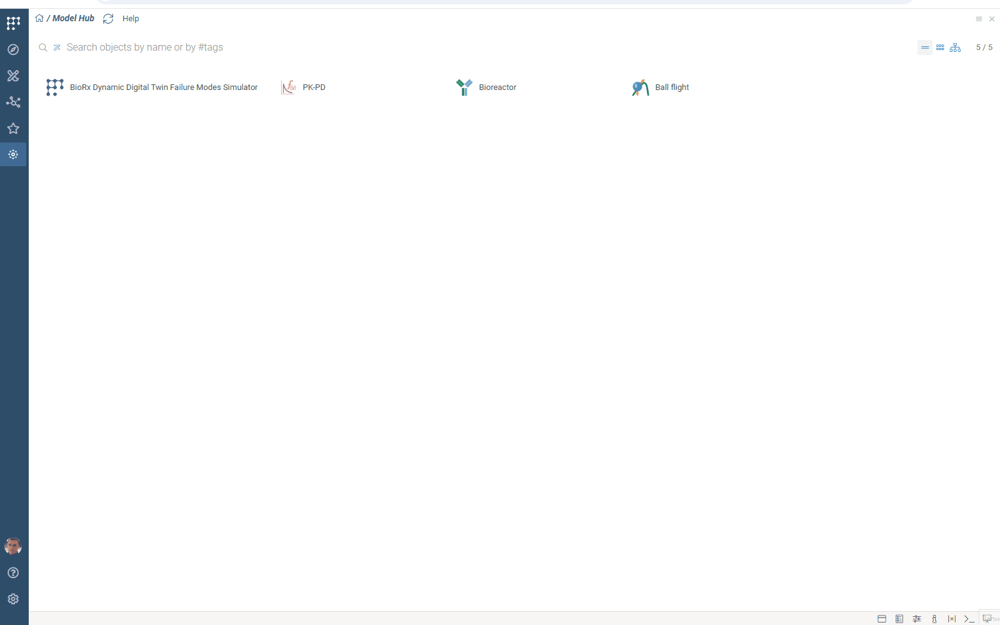

Datagrok provides parameter optimization and sensitivity analysis tools designed for [ODE models](models.md) and other computational systems.

Key capabilities:

**Parameter optimization**:

* Automated parameter fitting to match observed data
* Multi-parameter optimization with constraints
* Interactive visualization of convergence

**Sensitivity analysis**:

* Quantitative assessment using Monte Carlo, Sobol, and Grid methods
* Interactive visualization of system response

## Parameter optimization

Parameter optimization lets you improve your model performance by finding input values that generate a specified model output. The optimization process uses [loss functions](https://en.wikipedia.org/wiki/Loss_function) to minimize the gap between model output and target data.

To run parameter optimization, first open your model. Then, in the top ribbon, click <i class="grok-icon fal fa-chart-line"></i> **Fit parameters**. A fitting view opens.

In the fitting view, configure:

* Under **Fit**, select parameters to optimize:
  * Toggle parameters to include in optimization
  * Set search range (min and max values)
  * Set fixed values for other parameters
* Under **Target**, define output constraints:
  * Toggle target outputs
  * Select data table (**Table**)
  * Set independent variable columns (**Argument**)
* Under **Using**, configure optimization:
  * Choose optimization method (**method**) and loss function type (**loss**). Datagrok uses [Nelder-Mead](https://en.wikipedia.org/wiki/Nelder%E2%80%93Mead_method) method to minimize loss functions like MAD and RMSE
  * Specify number of fitted points to find (**samples**)
  * Specify maximum deviation between fitted points (**similarity**) - higher values yield fewer points
* On the top ribbon, click <i class="fas fa-play"></i> **Run** to generate a grid showing loss function values, fitted parameters, and line charts of fit quality


To view the details for any result, click a grid row and open the Context Panel (F4). The Context Panel shows the model run details for your current row.


:::note developers

To enable parameter optimization for a function, add the following metadata in the [RichFunctionView](https://datagrok.ai/help/compute/scripting/advanced-scripting/) editor: `meta.features: {"fitting": true}`:

```javascript
//name: Test
//language: javascript
//input: double x
//output: double y
//editor: Compute:RichFunctionViewEditor
//meta.features: {"fitting": true}

let y = x * x;
```

:::

## Sensitivity analysis

Sensitivity analysis helps you understand how changes in input parameters affect your model outputs by running multiple computations with varying inputs. Datagrok offers three analysis methods:

* [Monte Carlo](https://en.wikipedia.org/wiki/Monte_Carlo_method): explores a function at randomly taken points
* [Sobol](https://en.wikipedia.org/wiki/Variance-based_sensitivity_analysis): performs [variance-based sensitivity analysis](https://en.wikipedia.org/wiki/Variance-based_sensitivity_analysis) and decomposes output variance into fractions, which can be attributed to inputs
* **Grid**: studies a function at the points of a grid with the specified step.

To run sensitivity analysis, first open your model. Then, in the top ribbon, click <i class="grok-icon fal fa-analytics"></i> **Run sensitivity analysis**. A sensitivity analysis view opens.

In the sensitivity analysis view:

1. Select your preferred method (**Method**)
1. For Monte Carlo and Sobol methods, enter the number of samples  (**samples**)
1. Toggle inputs to vary and outputs to analyze
1. Click the **Run** button. The platform generates a set of interactive visualizations with results:
    * [Correlation plot](../visualize/viewers/correlation-plot.md) showing relationships between inputs and outputs
    * [PC plot](../visualize/viewers/pc-plot.md) for multivariate data visualization
    * Depending on the number of inputs, [line chart](../visualize/viewers/line-chart.md) or [scatterplot](../visualize/viewers/scatter-plot.md) showing behavior for each output
    * Table view with inputs and outputs for each function evaluation
    * (For Sobol only) [Bar charts](../visualize/viewers/bar-chart.md) showing Sobol indices
      * **First-order indices**: Show how much of the output variance can be attributed to each input variable independently
      * **Total-order indices**: Capture both the direct effect of each input and all its interaction effects with other variables, helping identify inputs involved in important interactions

To view the details for any result, click a table row with the required inputs and outputs, and open the Context Panel (F4). The Context Panel shows the function run details for your current row.



:::note developers

To enable parameter optimization for a function, add the following metadata in the [RichFunctionView](https://datagrok.ai/help/compute/scripting/advanced-scripting/) editor: `meta.features: {"sens-analysis": true}`:

```javascript
//name: Test
//language: javascript
//input: double x
//output: double y
//editor: Compute:RichFunctionViewEditor
//meta.features: {"sens-analysis": true}

let y = x + 3;
```

:::
