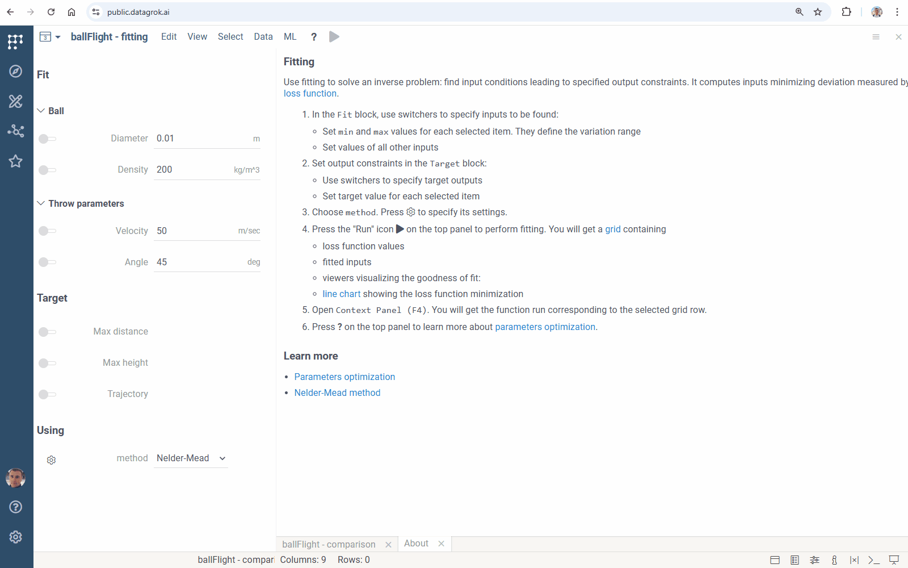

## Parameter optimization

Parameter optimization solves an inverse problem: finding the input conditions that lead to a specified output of the model. It computes inputs minimizing deviation measured by [loss function](https://en.wikipedia.org/wiki/Loss_function).

Using Datagrok fitting feature, you can improve performance and accuracy of a model.

### Usage

To run parameter optimization:

* Click the "Fit inputs" icon <i class="grok-icon fal fa-chart-line"></i> on the top panel. **Fitting View** opens.

* In the `Fit` block, use switchers to specify inputs to be found:

  * Set `min` and `max` values for each selected item. They define the variation range
  * Set values of all other inputs

* Set output constraints in the `Target` block:
  * Use switchers to specify target outputs
  * Set target value for each selected item

* Specify settings of fitting:
  * Choose numerical optimization method (in the `method` field). Click the gear icon <i class="grok-icon fal fa-cog"></i> to specify its settings
  * Set loss function type (in the `loss` field)
  * Specify number of points to be found (in the `samples` field)
  * Set the maximum scaled deviation between similar fitted points (in the `similarity` field): the higher the value, the fewer points will be found

* Click the "Run" <i class="fas fa-play"></i> icon on the top panel to perform fitting. You will get a
[grid](../visualize/viewers/grid) containing

  * loss function values and fitted inputs
  * viewers visualizing the goodness of fit
  * [line chart](../visualize/viewers/line-chart) showing the loss function minimization


An inverse problem may have several solutions. Specify their expected number in the `samples` field. To filter fitted points, set `similarity`:

* it is the maximum scaled deviation between "similar" points
* the higher the value, the fewer points will be displayed


### Table output

Apply the feature to models with table outputs as well:

* Specify the target dataframe in the table input
* Set dataframe column with values of independent variable (in the `argument` choice input)



Open `Context Panel` (F4). You will get the model run corresponding to the selected grid row:


### Platform function annotaion

Apply parameter optimization to any function with the [RichFunctionView](https://datagrok.ai/help/compute/scripting/advanced-scripting/) editor. Add `meta.features: {"fitting": true}` to enable it:

```javascript
//name: Test
//language: javascript
//input: double x
//output: double y
//editor: Compute:RichFunctionViewEditor
//meta.features: {"fitting": true}

let y = x * x;
```

### See also

* [Optimization](https://en.wikipedia.org/wiki/Mathematical_optimization)
* [Nelder-Mead method](https://en.wikipedia.org/wiki/Nelder%E2%80%93Mead_method)
* [Scripting](https://datagrok.ai/help/compute/scripting/)

## Sensitivity analysis

Sensitivity Analysis runs the computation multiple times with varying inputs,
and analyzes the relationship between inputs and outputs. Datagrok provides the following
methods:

* [Monte Carlo](https://en.wikipedia.org/wiki/Monte_Carlo_method) explores a function
at randomly taken points
* [Sobol](https://en.wikipedia.org/wiki/Variance-based_sensitivity_analysis)
decomposes output variance into fractions, which can be attributed to inputs
* **Grid** studies a function at the points of a grid with the specified step

To run the sensitivity analysis, click the **Run sensitivity analysis** (<i class="grok-icon fal fa-analytics"></i>) icon on the top panel,
choose a method, specify inputs and outputs, and click **RUN**.

### Monte Carlo

Once you've chosen it in `Method`

* Set in `Samples` the number of random points
* Use switchers to specify varied inputs and outputs to be analyzed
* Press **RUN** or <i class="fas fa-play"></i> on the top panel. You will get
  * [Correlation plot](../visualize/viewers/correlation-plot.md) for exploring
correlations between varied inputs and the specified outputs
  * [PC plot](../visualize/viewers/pc-plot.md) visualizing multivariate data
and providing variations of the selected inputs & outputs
  * [Line chart](../visualize/viewers/line-chart.md) or
[Scatterplot](../visualize/viewers/scatter-plot.md) (dependently on the varied
inputs count) showing a behavior of each output separately
  * [Grid](../visualize/viewers/grid.md) containing inputs and outputs values
of each function evaluation


Use the sliders in the [PC plot](../visualize/viewers/pc-plot.md) to filter the model evaluations:


When exploring complex models, some evaluations may be of particular interest. To get them:

* Click on grid row with the required input and output values
* Open `Context Panel` (F4). You will get the function run corresponding to the selected row


### Sobol

This method performs
[variance-based sensitivity analysis](https://en.wikipedia.org/wiki/Variance-based_sensitivity_analysis) and decomposes the output variance into fractions, which can be attributed to inputs. It provides the same visualizations
as **Monte Carlo** and [bar charts](../visualize/viewers/bar-chart.md) showing
Sobol' indices:

* First-order indices indicate the contribution to the output variance of varying each input alone
* Total-order indices measure the contribution to the output variance of each input,
 including all variance caused by its interactions with any other inputs


### Grid

This method evaluates a function at the points of uniform grid within the specified ranges. It provides the same visualizations
as **Monte Carlo**:


Sensitivity Analysis can be applied to any function with the [RichFunctionView](scripting/advanced-scripting/advanced-scripting.mdx) editor. Add `meta.features: {"sens-analysis": true}` to enable it:

```javascript
//name: Test
//language: javascript
//input: double x
//output: double y
//editor: Compute:RichFunctionViewEditor
//meta.features: {"sens-analysis": true}

let y = x + 3;
```

### Learn more

* [Sensitivity analysis](https://en.wikipedia.org/wiki/Sensitivity_analysis)
* [Variance-based sensitivity analysis](https://en.wikipedia.org/wiki/Variance-based_sensitivity_analysis)
