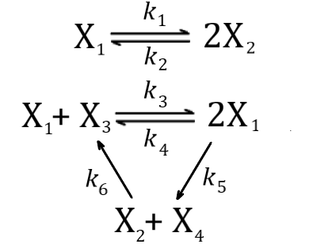
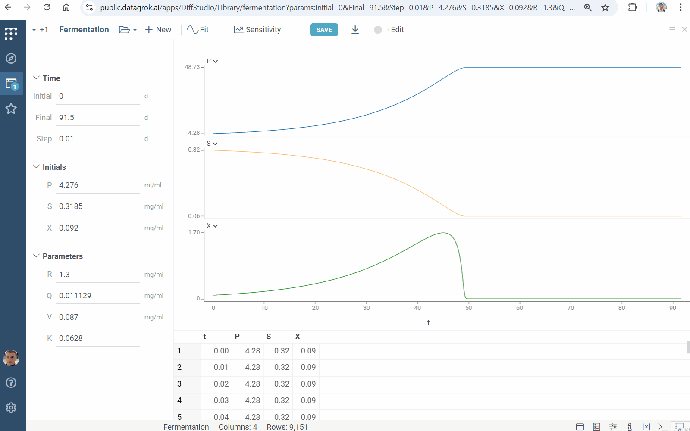
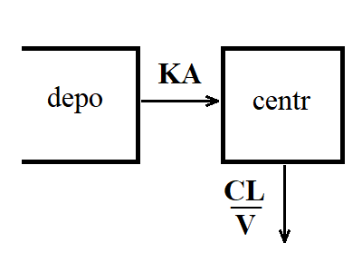
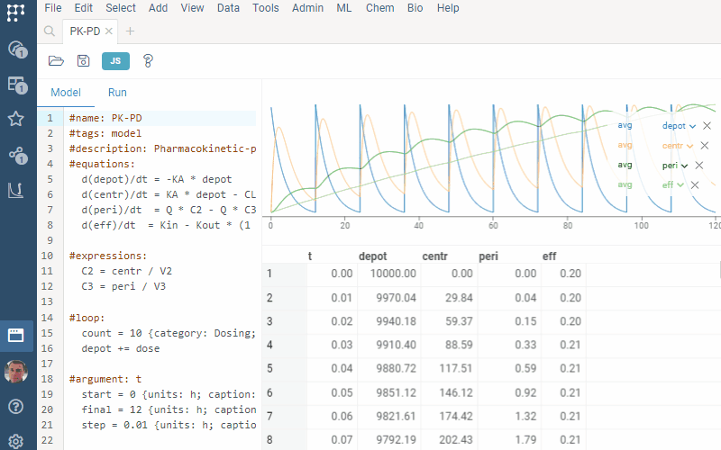
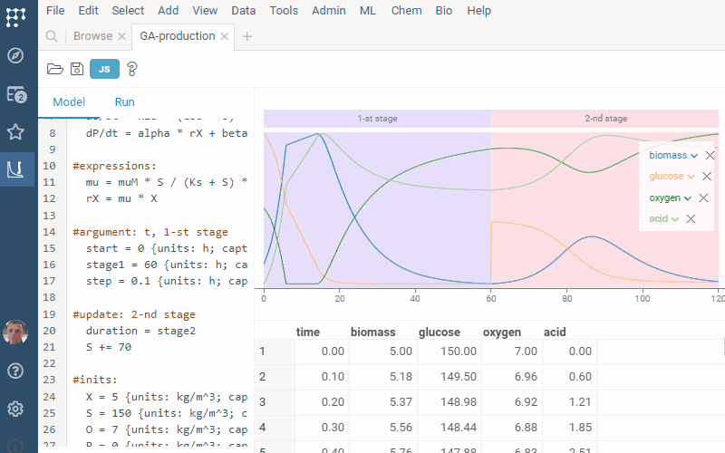
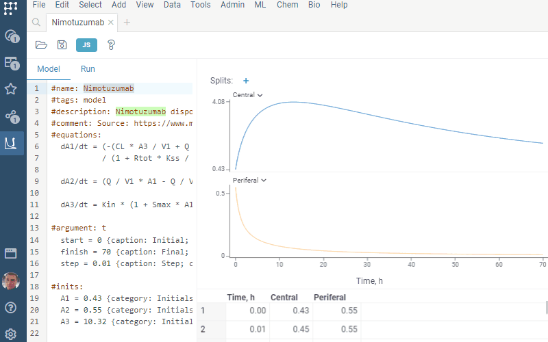
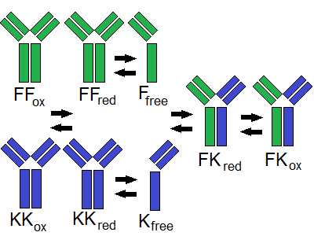
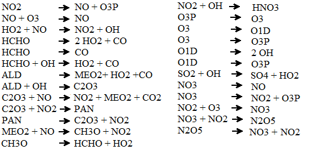

## Ordinary differential equations

### Chem reactions

The `Chem react` example simulates deterministic [mass-action kinetics](https://en.wikipedia.org/wiki/Law_of_mass_action) given in the network

This example illustrates annotation of model inputs.

### Robertson model

Robertson’s chemical reaction model is a well-known example of [stiff equations](https://en.wikipedia.org/wiki/Stiff_equation). It describes the process

Numerical solution of stiff problems is a complicated task. Diff Studio provides solution of both stiff and non-stiff equations.

### Fermentation

The `Fermentation` example illustrates the kinetics of the biochemical reactions in [fermentation](https://en.wikipedia.org/wiki/Fermentation).

### PK

[Pharmacokinetics](https://en.wikipedia.org/wiki/Pharmacokinetics) (PK) studies how the body absorbs, distributes, metabolizes, and excretes drugs over time. The `PK` example simulates this process. It demonstrates the usage of the `meta.solver` feature for numerical [solver management](#solver-settings).

### PK-PD

PK-PD modeling simulates pharmacokinetics (PK), pharmacodynamics (PD), and their [relationship](https://www.ncbi.nlm.nih.gov/pmc/articles/PMC7348046). It is used in drug discovery and development. The `PK-PD` example illustrates the usage of the `loop` feature for dosing specification

### Acid production

`Acid production` models gluconic acid [production](https://oatao.univ-toulouse.fr/9919/1/Elqotbi_9919.pdf) by Aspergillus niger. This example shows the usage of the `update` feature for multistage simulation

### Nimotuzumab

The `Nimotuzumab` example simulates population pharmacokinetic for [nimotuzumab](https://www.mdpi.com/1999-4923/12/12/1147). It demonstrates the `output` feature

### Bioreactor

The `Bioreactor` example models the [kinetic mechanism](https://doi.org/10.1074/jbc.RA117.000303) of controlled Fab-arm exchange for the formation of bispecific immunoglobulin G1 antibodies. It shows how to use the `meta.inputs` feature to specify a table with pre-defined model inputs.

### Pollution

The `Pollution` example describes a chemical reaction part of the air [pollution model](https://archimede.uniba.it/~testset/problems/pollu.php). It consists of 25 reaction and 20 reacting compounds. This example illustrates the capability of Diff Studio to solve large systems of [stiff equations](https://en.wikipedia.org/wiki/Stiff_equation).

