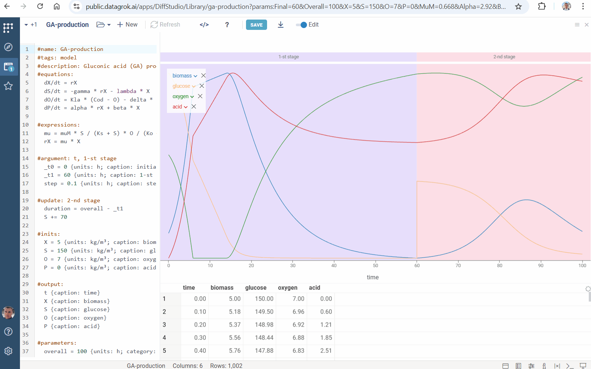

Datagrok [Diff Studio](diff-studio.md) enables modeling complex processes defined by [ordinary differential equations](https://en.wikipedia.org/wiki/Ordinary_differential_equation). The examples below showcase its full range of capabilities.

### Chem reactions

The [Chem react](https://public.datagrok.ai/files/system.appdata/diffstudio/library/chem-react.ivp) example simulates deterministic [mass-action kinetics](https://en.wikipedia.org/wiki/Law_of_mass_action) given in the network

This example illustrates [annotation](diff-studio.md#input-options) of model inputs for UI improvement.

### Robertson model

[Robertson’s](https://public.datagrok.ai/files/system.appdata/diffstudio/library/robertson.ivp) chemical reaction model is a well-known example of [stiff equations](https://en.wikipedia.org/wiki/Stiff_equation). It describes the process

Numerical solution of stiff problems is a complicated task. Diff Studio provides solution of both stiff and non-stiff equations.

### Fermentation

The [Fermentation](https://public.datagrok.ai/files/system.appdata/diffstudio/library/fermentation.ivp) example illustrates the kinetics of the biochemical reactions in [fermentation](https://en.wikipedia.org/wiki/Fermentation).

### PK

[Pharmacokinetics](https://en.wikipedia.org/wiki/Pharmacokinetics) (PK) studies how the body absorbs, distributes, metabolizes, and excretes drugs over time. The [PK](https://public.datagrok.ai/files/system.appdata/diffstudio/library/pk.ivp) example simulates this process. It demonstrates the numerical [method](diff-studio.md#solver-settings) choice and show how to prevent long computations.

### PK-PD

PK-PD modeling simulates pharmacokinetics (PK), pharmacodynamics (PD), and their [relationship](https://www.ncbi.nlm.nih.gov/pmc/articles/PMC7348046). It is used in drug discovery and development. The [PK-PD](https://public.datagrok.ai/files/system.appdata/diffstudio/library/pk-pd.ivp) example illustrates the usage of the [loop](diff-studio.md#cyclic-process-simulation) feature for dosing specification.

### Acid production

[Acid production](https://public.datagrok.ai/files/system.appdata/diffstudio/library/ga-production.ivp) models gluconic acid [production](https://oatao.univ-toulouse.fr/9919/1/Elqotbi_9919.pdf) by Aspergillus niger. This example shows the usage of the [update](diff-studio.md#multistage-model) feature for multistage simulation

### Nimotuzumab

The [Nimotuzumab](https://public.datagrok.ai/files/system.appdata/diffstudio/library/nimotuzumab.ivp) example simulates population pharmacokinetic for [nimotuzumab](https://www.mdpi.com/1999-4923/12/12/1147). It demonstrates how to specify models [output](diff-studio.md#creating-models).

### Bioreactor

The [Bioreactor](https://public.datagrok.ai/files/system.appdata/diffstudio/library/bioreactor.ivp) example models the [kinetic mechanism](https://doi.org/10.1074/jbc.RA117.000303) of controlled Fab-arm exchange for the formation of bispecific immunoglobulin G1 antibodies. It shows how to set [lookup table](diff-studio.md#lookup-tables) with pre-defined model inputs. This feature allows users to switch between sets of model inputs with just a few clicks.

### Pollution

The [Pollution](https://public.datagrok.ai/files/system.appdata/diffstudio/library/pollution.ivp) example describes a chemical reaction part of the air [pollution model](https://archimede.uniba.it/~testset/problems/pollu.php). It consists of 25 reaction and 20 reacting compounds. This example illustrates the capability of Diff Studio to solve large systems of [stiff equations](https://en.wikipedia.org/wiki/Stiff_equation).

See also

* [Compute](compute.md)
* [Parameter optimization](function-analysis.md#parameter-optimization)
* [Sensitivity analysis](function-analysis.md#sensitivity-analysis)
