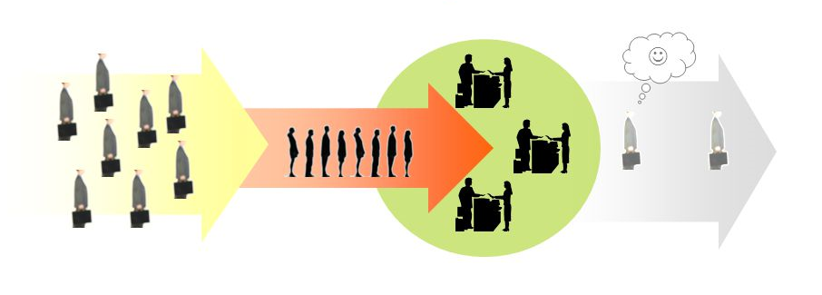
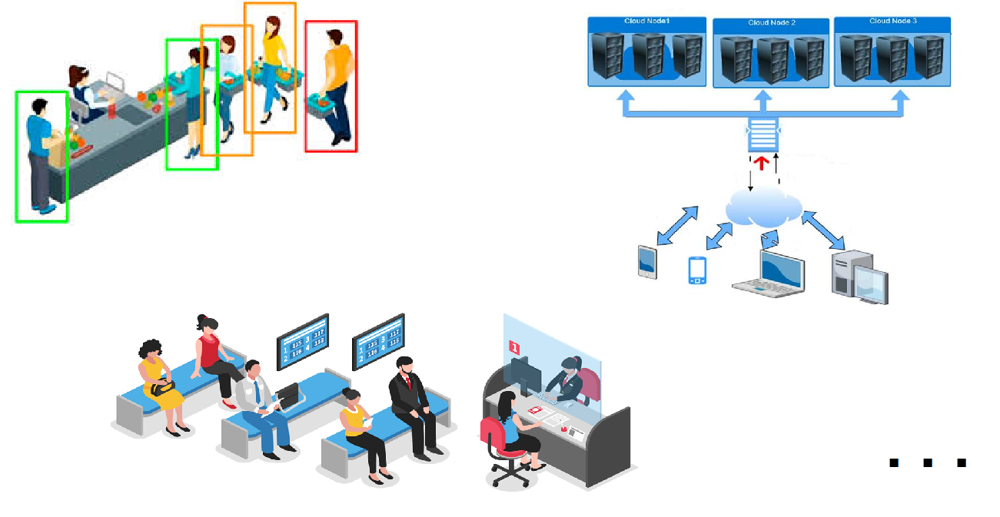
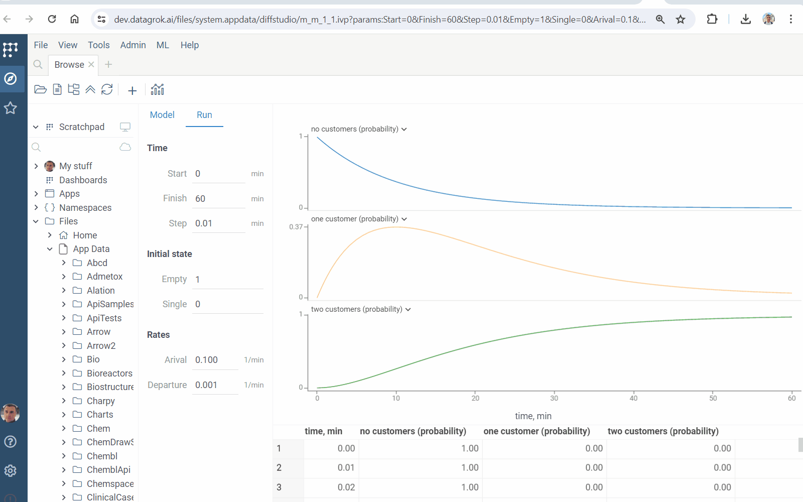
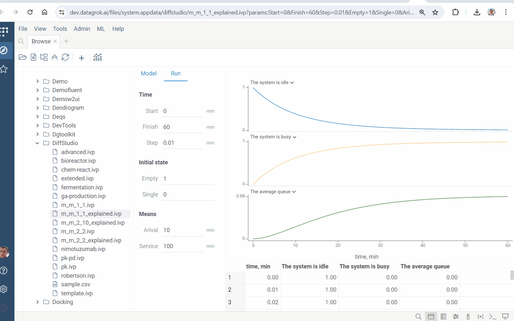
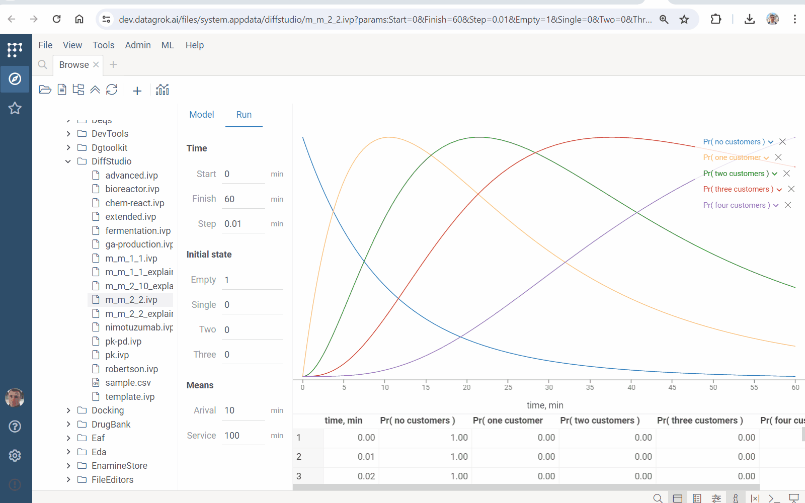
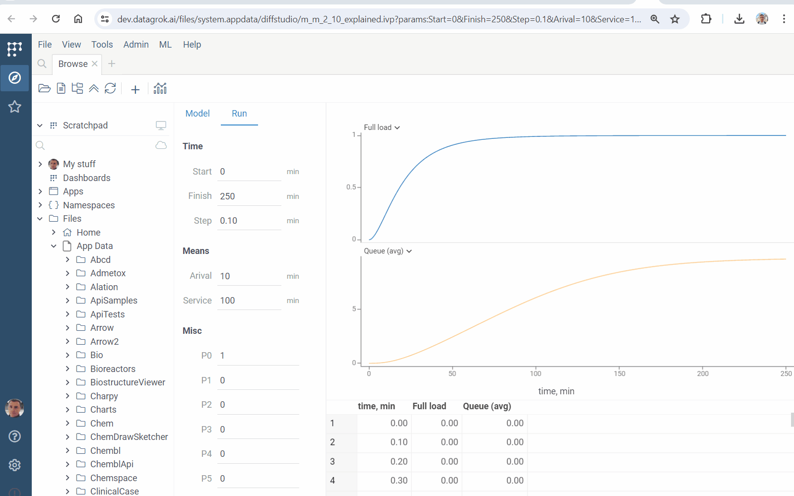

# Queues

There are many mass service systems:

* shops
* service centers
* cloud data centers
* ...

[Queueing theory](https://en.wikipedia.org/wiki/Queueing_theory) studies them. It operates with the **probabilities** of the system's states (and not only).

## 1-1 example

Go to Datagrok and run [this](https://dev.datagrok.ai/files/system.appdata/diffstudio/m_m_1_1.ivp?params:Start=0&Finish=60&Step=0.01&Empty=1&Single=0&Arival=0.1&Departure=0.001) model. It simulates the system with *one* server and *one* waiting place. Play with its inputs:

* `Arival` and `Departure` rates
* `Finish` time

Explore the behavior of states' probabilities:

Let's add more interpretations. Run [this](https://dev.datagrok.ai/files/system.appdata/diffstudio/m_m_1_1_explained.ivp?params:Start=0&Finish=60&Step=0.01&Empty=1&Single=0&Arival=10&Service=100) model. It simulates the same system, but with modified inputs & outputs:

* instead of rates, it uses mean arival time (`Arival`) and mean service time (`Service`)
* states' probabilities are transformed to:

  * idle & busy probabilities
  * average queue

Check performance of the system. Play with `Arival` and mean service time `Service`: **they rule all!**

## 2-2 example

Explore the system with *two* servers and *two* waiting places. Run [this](https://dev.datagrok.ai/files/system.appdata/diffstudio/m_m_2_2.ivp?params:Start=0&Finish=60&Step=0.01&Empty=1&Single=0&Two=0&Three=0&Arival=10&Service=100) model and its [explained version](https://dev.datagrok.ai/files/system.appdata/diffstudio/m_m_2_2_explained.ivp?params:Start=0&Finish=60&Step=0.01&Empty=1&Single=0&Two=0&Three=0&Arival=10&Service=100). There are more states. Check the impact of `Arival` and `Service`:

## 2-10 example

Explore the system with *two* servers and *ten* waiting places. Run [this](https://dev.datagrok.ai/files/system.appdata/diffstudio/m_m_2_10_explained.ivp?params:Start=0&Finish=250&Step=0.1&Arival=10&Service=100&P0=1&P1=0&P2=0&P3=0&P4=0&P5=0&P6=0&P7=0&P8=0&P9=0&P10=0&P11=0) model. It provides:

* `Full load` - probability that each server works
* `Queue (avg)` - mean number of customers waiting for the service

Play with `Arival` (mean arival time) and `Service` (mean service time). Check their **ratio** impact:

Depending on servers count & their performance and the intensity of incoming jobs, the system may or may not handle the workload. And еhe queue may or may not be huge.

## In addition

Modeling queueing systems provides their performance forecast. It ensures their better design & management. The [1-1](#1-1-example), [2-2](#2-2-example) and [2-10](#2-2-example) examples belongs to [M | M](https://en.wikipedia.org/wiki/M/M/c_queue)-models. They can be described by systems of ordinary differential equations, and Datagrok [Diff Studio](https://datagrok.ai/help/compute/diff-studio) solves them.

Learn more:

* [Diff Studio](https://datagrok.ai/help/compute/diff-studio)
* [Queueing theory](https://en.wikipedia.org/wiki/Queueing_theory)
* [M | M-queue](https://en.wikipedia.org/wiki/M/M/c_queue)
