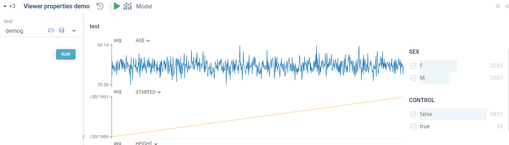
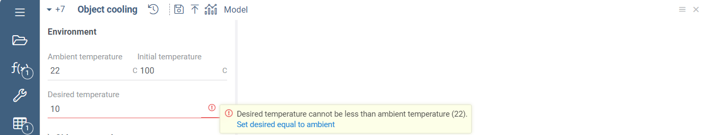
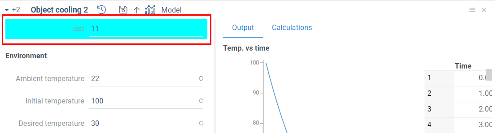
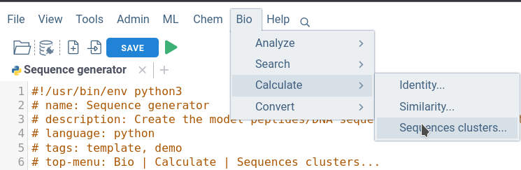
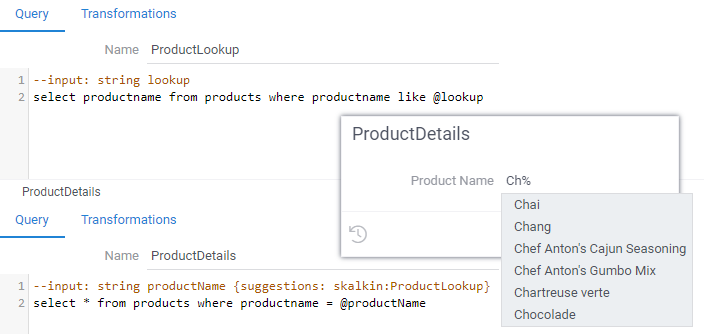

```mdx-code-block
import Tabs from '@theme/Tabs';
import TabItem from '@theme/TabItem';
```

## Output values validation

Datagrok functions return zero, one or more typed arguments.
Datagrok expects that all output values are assigned in the script code
 so that they are defined by the end of the script.
If this doesn't happen, the two things will follow:

1. The unset output values will be returned as `null`-s.
2. A warning `Output value ${output.param.name} was not set` will be printed in the 
   [Datagrok Console](../datagrok/navigation/navigation.md#console) (open it with `Ctrl-~`).

In this script, the value `c3` is missed to be set:

```R
#name: TestMissingInputsR
#language: r
#output: int c1
#output: int c2
#output: int c3
c1 <- 12
c2 <- 15
```

Running the script produces the following output to the console:

```R
Output value c3 was not set
  c1: 12
  c2: 15
  c3: null
```

We recommend using the Datagrok Console while validating your scripts.

## Environments

### Conda environments

Each script can use a specific environment configuration under which it will run, 
including the language version and a set of libraries. 

Datagrok uses [Conda](https://docs.conda.io/en/latest/)
as the environment management system. 
A Conda environment gives a sandboxed, controlled area for running scripts,
and only takes time to be pre-created.  
Later, the script uses the pre-created environment with no delay for resolving dependencies
and installing language versions.

In Datagrok, Conda environment configuration can be specified either right inside the script, 
or as part of
a [package](../develop/develop.md#packages). 
The package can be both the one containing the script or any other deployed
package available under your current user with a specified environment.

#### Specify environment in-place

Set an `environment` parameter of the script to a one-liner YAML 
following the standard Conda YAML config, but omitting
its name and enclosing braces `{}`. For example, we need to use the following Conda yaml config:

```yaml
name: envtest01
channels:
  - conda-forge
dependencies:
  - python=3.8
  - glom
  - pip:
      - requests
```

To use it in any script, specify it as follows:

```python
# name: EnvTestInline
# environment: channels: [conda-forge], dependencies: [python=3.8, glom, {pip: [requests]}]
# language: python
# output: string result

import re, requests
from glom import glom
import pandas as pd

target = {'a': {'b': {'c': 'd'}}}
result = glom(target, 'a.b.c')  # returns 'd'
```

When the script runs the first time, Datagrok creates the environment on
the [Compute Virtual Machine](../develop/under-the-hood/infrastructure.md#compute-components), 
which may take some time, up to several minutes. 
For all next script runs, Datagrok will reuse this environment. 

Datagrok handles in-pace environments using MD5 hashes of their body strings.
Therefore, if you change the environment string to another previously created environment 
(even in some other script), 
Datagrok will pick it up and reuse it. 

#### Specify the environment in a package

Configurations are stored in conda YAML format in the same repository with the script 
in the folder `environments` under the repository root. 
You can create an environment YAML
[manually](https://docs.conda.io/projects/conda/en/latest/user-guide/tasks/manage-environments.html#create-env-file-manually)
or
[export it](https://docs.conda.io/projects/conda/en/latest/user-guide/tasks/manage-environments.html#creating-an-environment-from-an-environment-yml-file)
form your existing Conda environment.
If the `#environment` tag in the script header is not specified, the script uses the configuration defined in
[`default.yaml`](https://github.com/datagrok-ai/public/blob/master/environments/default.yaml).

Here is an
[example of configuration](https://github.com/datagrok-ai/public/tree/master/environments)
for the [Datagrok public repository](https://github.com/datagrok-ai/public). 
Also, a package can define its own
configurations as well ([see examples](https://github.com/datagrok-ai/public/tree/master/packages/Demo/scripts)).

This is how to define the "Chemprop" environment in the script header:

```python
#environment: Chemprop
```

In this case, the environment `Chemprop` should be specified in a file
`environments/Chemprop.yaml` inside the package where this script belongs.

Datagrok identifies and resolves environments by their names. 
If an environment referred in a script wasn't previously
used, Datagrok will create it on the
[Compute Virtual Machine](../develop/under-the-hood/infrastructure.md#compute-components). 
This operation can take up to several minutes.
Datagrok will reuse a previously created environment for all subsequent runs 
with no delay.

#### Reference an environment from another package

An environment `SomeEnv` specified in a package `SomePackage` 
is available from all scripts in the platform for
referencing as `SomePackage:SomeEnv`. 
If the package `SomePackage` is available to the current user, the reference will
work. 

Such environment reference is available in both package and ad-hoc scripts.

#### Global environments

Environment referencing is a handy way to organize global (organization-wide) environments. 
You can version such common environments through a dedicated package, 
and one physical environment will be re-used by many users, which is more space- and time-efficient.

To achieve it, do the following steps:

1. Choose one package, say, `GlobalEnvs`, which will contain global environments.
2. Choose a common prefix to name these global environments with, say, `Global`
3. Name all global environments in this package with the chosen prefix: `Global<ENVIRONMENT_NAME>`
4. Publish `GlobalEnvs` package as `--release` to the platform and share it with the `All Users` group 
   or with the specific group of users you want to have access to these environments
5. Let other users know these environments are now available as
   `GlobalEnvs:Global<ENVIRONMENT_NAME>`

In the future, for the `# environment:` property, the Datagrok script editor will
show all available environments for the current user and the current script in a dropdown list.

#### Conda and Pip custom repositories

By default, conda uses conda-forge and pypi repositories to install packages. 
It is possible to specify custom conda and pip repositories in environments. 
For example, to use `http://my-repo/custom/` as Conda repository 
and `https://mirrors.sustech.edu.cn/pypi/simple` as PIP repository use the following code:

```python
# environment: channels: [http://my-repo/custom/], dependencies: [python=3.8, glom, {pip: [--index-url https://mirrors.sustech.edu.cn/pypi/simple, requests]}]
```

#### Common issues with Conda environments

It is a [known](https://github.com/conda/conda/issues/8051#issuecomment-464199791)
[issue](https://github.com/conda/conda/issues/8051#issuecomment-631862928)
[of Conda](https://github.com/conda/conda/issues/8051#issuecomment-808789923) 
that sometimes it takes a large
time to resolve (set up) an environment. 
Datagrok will interrupt Conda environment creation if it takes more than 5
minutes.

We can recommend a way forward if you encounter a timing
problem with your Conda environment. 
It is often possible to find an equivalent set of packages from `pip` repositories.
Using `pip` via Conda environments doesn't have timing issues, 
and we advise you to use the `pip` section of Conda YAML spec
to set up your libraries of interest.

### Renv environments

[_Renv_](https://rstudio.github.io/renv/articles/renv.html) environments are natively supported. 
Datagrok runs each R
script in a temporary folder with a unique name. This folder becomes an
_renv_ project folder for the current run of the script.

Start using _renv_ by initializing it and installing packages (see a
[full example](https://github.com/datagrok-ai/public/blob/master/packages/Demo/scripts/r/renv_spelling.R)):

```R
#language: r

renv::init()
renv::install("hunspell@3.0.1")
```

An _renv_ session only impacts the R environment for this one single run.
No other R scripts are aware of this local script environment.

_Renv_ uses a global package cache. 
It caches a package requested once with `renv::install` and re-uses it whenever it is
requested. 

However, in case the latest package version is requested, 
such as in `renv::install("hunspell")`, 
_renv_ connects to remote R package repositories 
assuring if the cached package needs to be updated to the newer version.
This may introduce a significant delay in the script run, several seconds in practice. 
To avoid this, we recommend
installing a specific version of the package, such as in `renv::install("hunspell@3.0.1")`.

_Note_. At the R script's start and finish, 
Datagrok calls `renv::deactivate()` to assure the script's body isolation.
Therefore, the script's author doesn't need to call
`renv::deactivate()` manually.

We are planning to support [_renv_ lockfiles](https://rstudio.github.io/renv/articles/lockfile.html)
shipped with packages similar to how it works now for Conda `yaml` files.


## Advanced ways to execute scripts

First of all, a script can be executed right from the script editor,
as described in [run script section](scripting-for-non-developers#how-to-run-a-script).

Other ways involve saving the script as a part of a [package](../develop/develop.md#packages). 
In this case, it gets registered in the platform as a
[function](../datagrok/concepts/functions/functions.md), and can be invoked in different ways:

* From the [console](../datagrok/navigation/navigation.md#console)
* From the data job
* From the [transformations editor](../transform/recipe-editor.md)
* From the [function browser](https://public.datagrok.ai/functions)

Registered scripts can be called via [JavaScript API](../develop/packages/js-api.md) in the following manner:

```javascript
grok.functions.call(`${packageName}:${scriptName}`, { params });
```

To see it in action, open this
[code snippet](https://public.datagrok.ai/js/samples/scripting/scripting) from our samples gallery. 
There, you can find more examples, such as
[adding a progress indicator](https://public.datagrok.ai/js/samples/functions/progress) to the user interface.

Scripts that have multiple output parameters may require a different approach. The
`grok.functions.call` method returns only the first output value. 
To get all values, you should work with a function call:

```javascript
let f = await grok.functions.eval(`${packageName}:${scriptName}`);
let call = f.prepare({ params });
await call.call();
call.getParamValue('paramName');
```

In the first line we evaluate an expression and get the function that corresponds to our script. 
After passing the input parameters and executing the script, 
we can retrieve any output value by the parameter's name.

## Using RichFunctionView input control

The **RichFunctionView** is an advanced input control,
allowing you to create a complex full-featured interface for your script.

It has all the features of the basic script view, such as
[captions](scripting-for-non-developers.mdx#input-captions),
[viewers for outputs](scripting-for-non-developers.mdx#adding-viewers-for-output-dataframes)
etc.

In addition to it, you can use:

* [Viewers for input dataframes](#adding-input-dataframes-viewers)
* Grouping [inputs](#grouping-inputs) and [outputs](#grouping-outputs)
* [File parsing](#file-upload)
* [Immediate function run](#running-on-opening--on-input)
* [Uploading experimental data](#uploading-experimental-data) 
* [Validating inputs](#validating-inputs)
* [Automatic export](#exporting-to-a-file)
* Using [custom inputs](#using-custom-inputs)
* Saving and accessing [history](#accessing-history)

To enable it, add `editor: Compute:RichFunctionViewEditor` tag to your following code as it is shown:

```mdx-code-block
<Tabs>
<TabItem value="python" label="Python" default>
```

```python
# name: RichFunctionView Demo
# language: python
# editor: Compute:RichFunctionViewEditor
```

```mdx-code-block
</TabItem>
<TabItem value="js" label="Javascript">
```

```javascript
//name: RichFunctionView Demo
//language: javascript
//editor: Compute:RichFunctionViewEditor
```

```mdx-code-block
</TabItem>
<TabItem value="result" label="Result">
```


```mdx-code-block
</TabItem>
</Tabs>
```


:::warning Package dependency

The `RichFunctionViewEditor` is a part of `Compute` package.
Ensure that `Compute` package is installed before working with `RichFunctionViewEditor`

:::

:::tip

Use the RichFunctionView only when you are sure that the script works as expected.
Features of the RichFunctionView affect GUI only and do not affect computations.

:::

### Adding input dataframes viewers

You can add viewers for input dataframes. Using them, you can review your input data before starting computations.

```mdx-code-block
<Tabs>
<TabItem value="short" label="Short sample">
```

```javascript
//input: dataframe test { viewer: Line chart | Grid }
```

```mdx-code-block
</TabItem>
<TabItem value="full" label="Full sample">
```

```javascript
//input: dataframe test { viewer: Line chart | Grid }
```

```mdx-code-block
</TabItem>
<TabItem value="result" label="Result">
```


```mdx-code-block
</TabItem>
</Tabs>
```

### Viewers customization

You may specify viewers' properties to control their appearance. 
Viewers' properties are listed in the braces right after the viewer's name. 
A full list of the viewer's properties may be found by right-clicking on it and selecting the `Properties...` menu item.

In addition, RichFunctionView supports the `block` option. You may use it to control the viewer's width. 
By default, any viewer takes full available space. 

You may customize both input and output viewers.

```mdx-code-block
<Tabs>
<TabItem value="short" label="Short sample">
```

```javascript
//input: dataframe test { viewer: Line chart(block: 75) | Filters(block: 25) }
```

```mdx-code-block
</TabItem>
<TabItem value="full" label="Full sample">
```

```javascript
//name: Viewer properties demo
//language: javascript
//input: dataframe test { viewer: Line chart(block: 75) | Filters(block: 25) }
//output: dataframe test2 { viewer: ScatterPlot(x: "age", y: "weight", showRegressionLine: true) | ScatterPlot(x: "height", y: "weight", showRegressionLine: true) }
//editor: Compute:RichFunctionViewEditor
test2 = test.clone();
```

```mdx-code-block
</TabItem>
<TabItem value="result" label="Result">
```



```mdx-code-block
</TabItem>
</Tabs>
```

### Grouping inputs

You can group script inputs into categories using the `category` tag.
RichFunctionView renders categories as separate blocks of the input form.

```mdx-code-block
<Tabs>
<TabItem value="short" label="Short sample">
```

```javascript
//input: dataframe tempData { caption: Temperature data; category: Experimental data }
//input: double desiredPressure { caption: Goal pressure; category: Goals }
```

```mdx-code-block
</TabItem>
<TabItem value="full" label="Full sample">
```

```javascript
//input: dataframe tempData { caption: Temperature data; category: Experimental data }
//input: double initialPressure { caption: Initial pressure; category: Experimental data }
//input: double desiredPressure { caption: Goal pressure; category: Goals }
//input: double desiredHumidity { caption: Goal humidity; category: Goals }
//editor: Compute:RichFunctionViewEditor
```

```mdx-code-block
</TabItem>
<TabItem value="result" label="Result">
```


```mdx-code-block
</TabItem>
</Tabs>
```

:::tip

Here, we also use `caption` tag to control input fields' labels.

:::

### Grouping outputs

You also can specify categories for output parameters.
In the case of output parameters, the `category` tag will specify 
the output tab used to show the output parameters value.
The following code will generate UI with three output tabs:

```mdx-code-block
<Tabs>
<TabItem value="short" label="Short sample">
```

```javascript
//output: dataframe tempOnTime4 { viewer: Line chart; category: Experimental data }
//output: dataframe tempOnTime5 { viewer: Line chart | Line chart; category: Simulation data }
//output: double IC3 { category: Tab #3}
//output: double IC4 { category: Tab #3}
```

```mdx-code-block
</TabItem>
<TabItem value="full" label="Full sample">
```

```javascript
//name: Grouping outputs
//language: javascript
//input: dataframe test { viewer: Line chart }
//input: double S1 = 50 { caption: S1 }
//output: dataframe tempOnTime4 { viewer: Line chart; category: Experimental data }
//output: double IC1 { category: Experimental data }
//output: dataframe tempOnTime5 { viewer: Line chart | Line chart; category: Simulation data }
//output: double IC2 { category: Simulation data }
//output: double IC3 { category: Tab #3 }
//output: double IC4 { category: Tab #3 }
//editor: Compute:RichFunctionViewEditor

tempOnTime4 = test;
tempOnTime5 = test;

IC1 = 10;
IC2 = 20;
IC3 = test.rowCount * 2;
IC4 = test.rowCount;
```

:::tip

View includes 4 tabs in total since there is a separate tab for input dataframe viewers.

:::

```mdx-code-block
</TabItem>
<TabItem value="result" label="Result">
```


```mdx-code-block
</TabItem>
</Tabs>
```

### File upload

You may use a file as an function input via RichFunctionView. To do this, specify the input type as `file`. 
Generated input allows you to choose any local file or drag'n'drop it directly. The chosen file will be available in the
code as JS' [File](https://developer.mozilla.org/en-US/docs/Web/API/File) object.

:::caution

Only JavaScript functions support `file` input type.

:::

### Running on opening & on input

Scripts could be forced to run automatically on opening and/or on any input change. 
This feature is useful for fast prototyping. We recommend using it on very fast scripts only to avoid
accidental runs of computational-heavy code.

Such function calls are not saved automatically, so you must press **Save** button manually when needed.

```mdx-code-block
<Tabs>
<TabItem value="short" label="Short sample">
```

```javascript
//meta.runOnOpen: true
//meta.runOnInput: true 
```

```mdx-code-block
</TabItem>
<TabItem value="full" label="Full sample">
```

```javascript
//name: Data stats
//language: javascript
//tags: demo
//input: dataframe inputDf {caption: Input dataframe; viewer: Grid(); category: Input data}
//output: dataframe outputDf {caption: Output dataframe; viewer: Line chart(block: 50) | Scatter plot(block: 50) | Statistics(block: 100); category: Stats}
//editor: Compute:RichFunctionViewEditor
//meta.runOnOpen: true
//meta.runOnInput: true


outputDf = inputDf.clone();

```

```mdx-code-block
</TabItem>
<TabItem value="result" label="Result">
```


```mdx-code-block
</TabItem>
</Tabs>
```

### Uploading experimental data

You may store your experimental data in Datagrok as you do it with simulations' data. To enable this feature,
add `//meta.uploadMode: true` tag to your script. 

This will add the <i class="fas fa-upload"></i> **Upload mode** button to the generated GUI. Using this mode, 
you may upload the outputs of the function in addition to the inputs. Saved historical run will have the `experimental` tag.

```mdx-code-block
<Tabs>
<TabItem value="short" label="Short sample">
```

```javascript
//meta.uploadMode: true
```

```mdx-code-block
</TabItem>
<TabItem value="full" label="Full sample">
```

```javascript
//name: Object cooling
//description: Uses Newton's law of cooling to simulate object cooling process. Default values are for cube of boiling water in air.
//language: javascript
//tags: simulation, demo
//input: double ambTemp = 22 {caption: Ambient temperature; units: C; category: Environment; block: 50; validator: Compute:AmbTempValidator; }
//input: double initTemp = 100 {caption: Initial temperature; units: C; category: Environment; block: 50; validator: Compute:InitialTempValidator; }
//input: double desiredTemp = 30 {caption: Desired temperature; units: C; category: Environment; validator: Compute:DesiredTempValidator; }
//input: double area = 0.06 {caption: Surface area; units: m²; category: Object properties}
//input: double heatCap = 4200 {caption: Heat capacity; units: J/C; category: Object properties; validator: Compute:HeatCapValidator; }
//input: double heatTransferCoeff = 8.3 {caption: Heat transfer coefficient; units: W/(m² * C); category: Object properties}
//input: int simTime = 21600 {caption: Simulation time; units: sec; category: Simulation; validator: Compute:SimTimeValidator; validatorOptions: { "reasonableMin": 10800, "reasonableMax": 100000} }
//output: dataframe simulation {caption: Temp. vs time; category: Output; viewer: Line chart(block: 75) | Grid(block: 25)}
//output: double timeToCool {caption: Time to cool; units: sec.; category: Output}
//output: double coolingFactor {caption: Cooling factor; units: 1 / sec.; category: Calculations}
//output: double tempDiff {caption: Temperature difference; units: C; category: Calculations}
//editor: Compute:RichFunctionViewEditor
//meta.uploadMode: true
//meta.foldedCategories: ["Object properties"]

timeToCool = undefined;

const tempDiff = initTemp - ambTemp;
const coolingFactor = heatTransferCoeff * area / heatCap;

const timeStamps = new Float32Array(simTime).map((_, idx) => idx);
const simulatedTemp = timeStamps.map((timeStamp) => {
  const currentTemp = ambTemp + (tempDiff * (Math.E ** -(coolingFactor * timeStamp)));

  if (!timeToCool && currentTemp < desiredTemp) {
    timeToCool = timeStamp;
  }

  return currentTemp;
});

simulation = DG.DataFrame.fromColumns([
  DG.Column.fromFloat32Array('Time', timeStamps),
  DG.Column.fromFloat32Array('Temperature', simulatedTemp),
]);


```

```mdx-code-block
</TabItem>
</Tabs>
```

### Validating inputs

You may create functions to validate inputs. Validation functions have full access to the 
UI and to the context of the script. For example, you may create a function to validate min-max values, 
assuring that the minimum value is less than the maximum value.

:::caution

Validation functions should be written in JavaScript. It is the best choice for performance reasons.

:::

Validation functions have a single input and a single output.
- `params` object may have arbitrary data for the validator to behave differently in certain situations.
- `validator` object is a JS function (e.g. arrow function) that actually will be called each time the input is changed.

Here is an example used in the default [Object cooling](https://public.datagrok.ai/scripts?q=object+cooling) script.  

```mdx-code-block
<Tabs>
<TabItem value="validator" label="Validator function">
```

```javascript
//name: DesiredTempValidator
//input: object params
//output: object validator
export function DesiredTempValidator(params: any) {
  return (val: number, info: ValidationInfo) => {
    const ambTemp = info.funcCall.inputs['ambTemp'];
    const initTemp = info.funcCall.inputs['initTemp'];
    return makeValidationResult({
      errors: [
        ...(val < ambTemp) ? [makeAdvice(`Desired temperature cannot be less than ambient temperature (${ambTemp}). \n`, [
          {actionName: 'Set desired equal to ambient', action: () => info.funcCall.inputs['desiredTemp'] = ambTemp }
        ])]: [],
        ...(val > initTemp) ? [`Desired temperature cannot be higher than initial temperature (${initTemp})`]: [],
      ]
    });
  };
}
```

```mdx-code-block
</TabItem>
<TabItem value="usage" label="Assigning validator to an input">
```

```javascript
//input: double desiredTemp = 30 {caption: Desired temperature; units: C; category: Environment; validator: Compute:DesiredTempValidator; }
```

```mdx-code-block
</TabItem>
<TabItem value="result" label="Result">
```



```mdx-code-block
</TabItem>
</Tabs>
```

This function accesses other inputs' values via the `info` object. 
It compares the validated input using contextual information.
If validation fails, it returns an error and possible action to make validation pass 
(structure with `actionName` and `action` fields). You may make your validation interactive 
and educational using such errors, warnings, and proposed actions.

:::tip

You may use package functions instead of scripts for easier code management.

:::

### Using custom inputs

RichFunctionView supports custom inputs usage. You can create your own input and use it via the special `input` tag.
Much like a validator function, custom input also should be returned by Datagrok function.

:::caution

Validation functions should be written in JavaScript.

:::

Here is an example of a custom input for string values. It behaves exactly the same as the default string input
but has `aqua` background color. 

```mdx-code-block
<Tabs>
<TabItem value="validator" label="Custom input">
```

```javascript
//name: CustomStringInput
//input: object params
//output: object input
export function CustomStringInput(params: any) {
  const defaultInput = ui.stringInput('Custom input', '');
  defaultInput.root.style.backgroundColor = 'aqua';
  defaultInput.input.style.backgroundColor = 'aqua';
  return defaultInput;
}
```

```mdx-code-block
</TabItem>
<TabItem value="usage" label="Using a custom input">
```

```javascript
//input: string test {input: Compute:CustomStringInput }
```

```mdx-code-block
</TabItem>
<TabItem value="result" label="Result">
```



```mdx-code-block
</TabItem>
</Tabs>
```

### Exporting to a file

You may use the one-click export feature to save the entire script run data to a local file.
To generate the export file,
Select <i class="fas fa-arrow-to-bottom"></i> **Export** icon on the top panel.
Automatic export saves all input and output values with their captions,
units, and even viewers' screenshots.
This feature is available for all scripts using the RichFunctionView.

<details>
<summary> Export file example </summary>
<div>


</div>
</details>

### Accessing history

Each script run is saved on the server. The saved script run includes both the input and output values of the run.
To review the history of runs, click on the <i class="fas fa-history"></i> **History** button on the top panel.

The history panel appears on the right side. To load the run into the UI, click on the corresponding card.
The historical runs are immutable. Thus, if you load a historical run, 
change input values, and then rerun it,
the platform will create a new historical run.


## Converting your script to the application

A [Datagrok application](../develop/how-to/build-an-app.md)
is a fit-for-purpose solution build on top of the Datagrok platform.
Applications have its own section in the Datagrok UI and a start icon.

You can convert your script in the application, regardless of the script language.
Briefly, you need to do the follows:

1. Create a TypeScript [package](../develop/packages).
   ```shell
   grok init package_name --ts
   ```
2. Install required NodeJs modules:
   ```shell
   npm install
   ```
3. Add your script to the package. 
   * If you are writing in Javascript/Typescript, 
     you can convert your script to the JS function, annotate it, and add directly to `src` folder:
     ```typescript
     //name: DemoScript
     //tags: demo
     //language: javascript
     //input: int input1
     ...
     export async function DemoScript(input1: int, ...) {
     ...
     }
     ```
   * Alternatively, create the `scripts` folder in your package directory and place your script file in it. 
     This approach works for all script languages.
4. Add the application function to the `src/package.ts`:
   ```typescript
   //name: ApplicationFromScript
   //tags: app, demo
   //description: Demo application created from a script
   //language: javascript
   export async function DemoAppCreate() {
     const func = await grok.functions.eval(`${_package.name}:DemoScript`);
     const call = func.prepare(); 
     call.edit(); 
   }
   ```
    Substitute the `DemoScript` in the `grok.functions.eval` call with the name of your script
    (what you used in the `//name:` annotation, not the file name).
5. Compile and [publish](../develop/develop.md#publishing) the package:
   ```shell
   npm run build && grok publish your_environment
   ```
   If you want to make your package publicly available, use the `--release` [publishing mode](../develop/develop.md#publishing-modes).
   ```shell
   npm run build && grok publish your_environment --release
   ```

That's all.
Now you can run your application from the **Functions > Apps** section
of the Datagrok UI.

## Integration

Datagrok is designed to be as extensible and as easy to integrate as possible.
So, out of the box, we get many platform integration capabilities such as authentication, data access, 
and many others. 
In addition to that,
there are some capabilities specific for developers: [REST API](#rest-api) and
[embedding as iframe](#embedding-as-iframe).

### Datagrok platform UI integration

The [functional annotations](../datagrok/concepts/functions/func-params-annotation.md)
provide you with several integration options that you can use with any function of script.
Here are some useful examples.

#### Top menu

To add your function to the top menu, add the `top-menu` annotation tag
and specify the element location in the menu.
Save your script and reload the page to see the new element in the top menu.

```python
#top-menu: Bio | Generate | Sequences clusters...
```


#### Info panel

Add your function to the [info panel](../explore/data-augmentation/info-panels)
to display custom information for your data.
To do this, specify [semantic type](scripting-for-non-developers.mdx#semantic-types), 
for the script input, add `panel` tag and `condition` annotation.
Read the detailed instruction in the corresponding 
[developer's howto sections](../develop/how-to/add-info-panel#scripts).


### REST API

Once registered, each function gets assigned a REST API endpoint 
that allows external code to execute it by passing the
input parameters, along with the authentication token. 
This allows instantaneous deployment of scientific methods for
external consumption. To find out how to use it:

- Select the script in [Scripts section](https://public.datagrok.ai/scripts).
- Press F4 to open the context panel on the right.
- Expand the `REST` pane on it.

Both JavaScript and Curl samples are provided.

<details>
<summary> REST API panel </summary>
<div>


</div>
</details>

### JS API

JavaScript-based apps have access to the whole Datagrok platform via the 
[JS API](../develop/packages/js-api.md).

### Embedding as iframe

Sometimes, an app has to be included in the external web page.
The simplest way to achieve it is via the [iframe](https://www.w3schools.com/tags/tag_iframe.ASP) element. 
To embed a model, click on the hamburger icon in the top left corner and choose `Embed...`.
You will see a dialog with the HTML code on top that you can use to embed this into an external site. 
Note that you can change parameter values right in the URL.

<details>
<summary> Embedded iframe preview </summary>
<div>


</div>
</details>

### JavaScript examples

The set of [script examples](https://public.datagrok.ai/js/samples) is available publicly.
Feel free to play around with them to explore different Datagrok capabilities.

You may use debugging output and write messages:

* into DG interface (use `grok.shell.info()` / `grok.shell.warning()` / `grok.shell.error()`)
* into the console (use `console.log()` and developer console available by F12)

In addition, you can use the built-in Inspector to see what's happening "under the hood" of the platform. 
To open Inspector, use the `Alt+I` hotkey.
For example, the Inspector provides information about triggered events.


<!---

This block is mostly a copy of the https://datagrok.ai/help/datagrok/concepts/functions/func-params-annotation page
need to move this code to it.


## Parameters

### Parameter validators

Validators check whether the value falls in the expected range, and provide visual cue if it does not. To add a
validator to a parameter, provide a comma-separated list of functions that will be invoked each time a value is changed.
A null indicates that the value is valid, anything else indicates an error which gets shown to the user.

A validator is a function that accepts one parameter of any type and returns a string. Choice providers are applicable
only to string parameters.

The following example adds a "containsLettersOnly" function to the "col" parameter:

```
#input: string s {validators: ["containslettersonly"]}
#input: column col {validators: ["containsmissingvalues"]}
```

```js
grok.functions.register({
    signature: 'List<String> jsVal1(int input)',
    run: (input) => input < 11 ? null : "Error val1" });

grok.functions.register({
    signature: 'List<String> jsVal2(int input)',
    run: (input) => input > 9 ? null : "Error val2" });
```

```python
# name: Numbers
# language: python
# input: int count1 {validators: ["jsval1", "jsval2"]} [Number of cells in table]
# input: int count2 {validators: ["jsval1"]} [Number of cells in table]
# input: int count3 {validators: ["jsval2"]} [Number of cells in table]
```


### Parameter choices

Use choices to provide the editor a list of values to choose from. When choices are provided, the editor becomes a combo
box. Choices can be either a fixed list, or a function that returns a list.

A choice provider is a function with no parameters that returns a list of strings.

The following example demonstrates two ways of defining choices:

```
#input: string fruit {choices: ["apple", "banana"]}
#input: string vegetable {choices: jsveggies}
```

Here is a possible implementation of the "jsTypes" function used in the example:

```javascript
grok.functions.register({
    signature: 'List<String> jsVeggies()',
    run: () => ["Cucumber", "Cauliflower"]});
```


### Parameter suggestions

Use parameter suggestions to help users enter a correct value. For instance, when entering a product name, it might make
sense to dynamically query a database for values starting with the already entered text, and suggest to auto-complete
the value.

Suggestions are functions that take one string argument, and return a list of strings to be suggested to user.
Suggestions work only for string parameters.

The following example helps user enter a country name by dynamically retrieving a list of names from a web service:

```python
# name: Sales by country
# language: python
# input: string country = uk {suggestions: jsSuggestCountryName}
```

```js
grok.functions.register({
  signature: 'List<String> jsSuggestCountryName(String text)',
  isAsync: true,
  run: async function(text) {
    let response = await fetch('https://restcountries.eu/rest/v2/name/' + text);
    return response.status === 200 ? (await response.json()).map(country => country['name']) : [];
  }
});
```


#### Auto-complete via SQL

The same concept could be used for SQL queries:



### Parameter editors

Use parameter editor to set the output of another function to the parameter value. All function parameters will be
seamlessly integrated to the function call form.

```
//input: dataframe table {editor: Package:DataQuery}
//input: dataframe table {editor: Package:DataQuery(1, "France")}
```

Here, Datagrok will execute the `Package:DataQuery` function right before your script and pass the output table to the
script as an input parameter.

```
//input: dataframe table {editor: PowerPack:DataQuery; editor-button: Outliers...}
```

Specify the `editor-button` parameter to add a button that executes your subfunction separately and allows the user to
check the output before starting the script.

### Examples

```
#input: dataframe t1 {columns:numerical} [first input data table]
#input: dataframe t2 {columns:numerical} [second input data table]
#input: column x {type:numerical; table:t1} [x axis column name]
#input: column y {type:numerical} [y axis column name]
#input: column date {type:datetime; format:mm/dd/yyyy} [date column name]
#input: column_list numdata {type:numerical; table:t1} [numerical columns names]
#input: int numcomp = 2 {range:2-7} [number of components]
#input: bool center = true [number of components]
#input: string type = high {choices: ["high", "low"]} [type of filter]
#output: dataframe result {action:join(t1)} [pca components]
#output: graphics scatter [scatter plot]
```

--->

