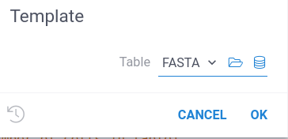
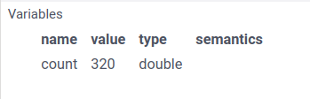
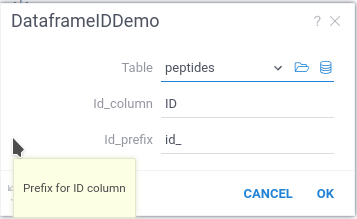
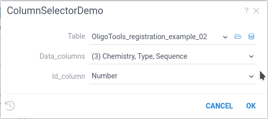
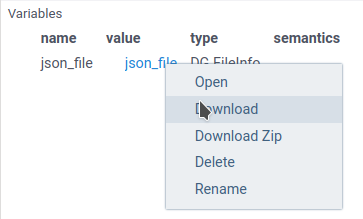
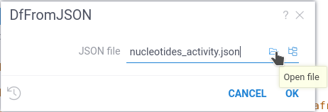
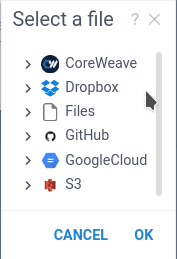
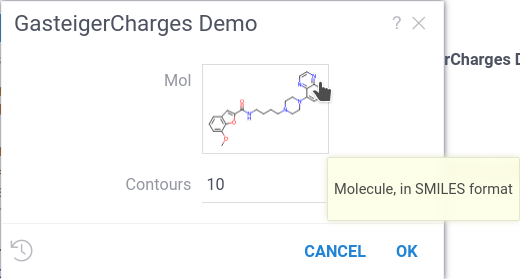
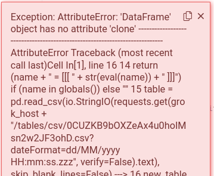

```mdx-code-block
import Tabs from '@theme/Tabs';
import TabItem from '@theme/TabItem';
```

## Prerequisites

* Sign up and log in to [public server of Datagrok](https://public.datagrok.ai/).
* Alternatively, set up a [local Datagrok environment](../deploy/docker-compose/docker-compose.mdx).

## Datagrok scripting essentials

This section explains the basic concepts of scripting in Datagrok.
Code examples are provided in **Python** and **R**.

:::tip Pro tip

In Datagrok, JavaScript offers unique benefits compared to traditional 
data science languages like Python or R:

* JavaScript script executes right in your browser, 
  leading to shorter spin-up time and more responsive interaction with user actions.
* Datagrok provides an extensive JavaScript API, 
  giving you detailed control over viewer parameters, 
  access to core Datagrok functions, and other sophisticated capabilities.

For these reasons, we suggest trying JavaScript for advanced scripting in Datagrok.

:::

### How to create a script

You can create a script directly on the platform in two ways:

```mdx-code-block
<Tabs>
<TabItem value="fast" label="Fast way" default>
```

* Open Datagrok (e.g. [public homepage](https://public.datagrok.ai/))
* Select `Functions` icon on the right toolbar.
* Select Datagrok's [Scripts section](https://public.datagrok.ai/scripts).
* Hover over the taskbar on the left side. Toolbox appears.
* Open the **Actions** submenu and create a new script in your preferred language.


```mdx-code-block
</TabItem>
<TabItem value="advanced" label="Advanced way">
```

* Enable extended **Main menu** in the **Window** icon on the right toolbar
* Open **Main manu > Tools > Scripting**.
* Choose the language for the script

```mdx-code-block
</TabItem>
</Tabs>
```

The code editor appears with the code inside.

```mdx-code-block
<Tabs>
<TabItem value="python" label="Python" default>
```

```python
#name: Template
#description: Calculates the number of cells in the table
#language: python
#tags: template, demo
#sample: cars.csv
#input: dataframe table [Data table]
#output: int count [Number of cells in the table]
count = table.shape[0] * table.shape[1]
```

```mdx-code-block
</TabItem>
<TabItem value="r" label="R">
```

```r
#name: Template
#description: Calculates the number of cells in the table
#language: r
#tags: template, demo
#sample: cars.csv
#input: dataframe table [Data table]
#output: int count [Number of cells in the table]
count <- nrow(table) * ncol(table)
```

```mdx-code-block
</TabItem>
</Tabs>
```

Congratulations, you've just written a script in Datagrok!
Let's explore how it works.

### Script header

Each Datagrok script has the **header** that contains **header parameters** \-
special comment strings used by Datagrok to determine script name and language,
pass to the script input parameters, and capture script output.  

The template script has the following ones:

* `# name: Template`: The short name of the script.
* `# description: Calculates the number of cells in the table`: The human-readable description.
* `# language: python`: The script language.
* `# tags: template, demo`: The list of tags used to organize and search scripts.
* `# input: dataframe table [Data table]`: Specification of the input parameter.
   The `table` is the parameter name, and `dataframe` is the parameter type.
   See the [supported parameter types](../datagrok/concepts/functions/func-params-annotation#inputs-and-outputs) for details.
* `# output: int count [Number of cells in the table]`: Specification of the output parameter:
   The `int` variable with the name `count`.

For more details, refer to the [functions parameter annotation](../datagrok/concepts/functions/func-params-annotation).

### Supported Languages

| Language header parameter| Language       |
|--------------------------|----------------|
| r                        | R              |
| python                   | Python         |
| octave                   | Octave         |
| julia                    | Julia          |
| grok                     | Grok Scripting |
| JavaScript               | JavaScript     |

For each language, Datagrok uses a custom header and set of pre-installed packages.

<details>
<summary> Python </summary>
<div>

Here is a script header that is prepended to your script:

```python
import os
import io
import json
import pandas as pd
import requests
from datetime import datetime, timedelta
```

</div>
</details>


<details>
<summary> Octave </summary>
<div>


Octave scripts run in a separate container on server. This container includes following Octave packages:

- [symbolic](https://gnu-octave.github.io/packages/symbolic/)
- [optim](https://gnu-octave.github.io/packages/optim/)

Always provide `pkg load %PACKAGE_NAME%` in your scripts, since script runs are fully independent.

</div>
</details>

### Input and output parameters

The script header's most important part is the specification of input and output parameters (variables).
Each parameter is specified either as input or output.
Datagrok automatically injects _input_ parameters before the script starts
and captures _output_ parameters when the script finishes.

Datagrok supports all standard types of scalar parameters (integer, float, boolean, string)
In addition, Datagrok offers high-level parameters designed to interact with dataframes.
You can pass to the script the whole dataframe, dataframe column, list of columns,
or a binary file.

Find the full list and description of supported parameters in the
[Input and output parameters](../datagrok/concepts/functions/func-params-annotation#inputs-and-outputs) section.

### How to run a script

Let's save the script and see how it works.
The built-in editor has the **Run** button on the top panel.
Press it to run a script. You will see the following window:



When you run a script, 
Datagrok analyzes header parameters
to create an input form and show the outputs.

Provide a dataframe for the script and press **Ok** to run it.
You can choose an already opened dataframe,
open a dataframe from a file, or retrieve it via SQL query.

After the script finishes, Datagrok collects all output parameters and displays them.
In the provided example, this is a single scalar value shown in the **Variables** panel.
You will see the following output:



:::tip Pro tip

Depending on the metadata associated with the parameters, the editor can be
enriched by [validators](scripting-advanced#parameter-validators), [choices](scripting-advanced#parameter-choices),
and [suggestions](scripting-advanced#parameter-suggestions). Validators, choices, and suggestions are
[functions](../datagrok/concepts/functions/functions.md), that means they can be implemented in different ways 
(db query, script, etc), and reused.

:::

### Running previously saved scripts

To run the previously saved script, find it in the **Scripts** section and execute it.


For additional capabilities of the Datagrok script editor, see the
[Working with Datagrok script editor](#working-with-datagrok-script-editor) section.


## Datagrok scripting in details

### Parameters: scalars and dataframes

Datagrok natively supports standard scalar data types: 
`int`, `double`, `bool`, `string`.
Also, Datagrok supports `datetime` as a specific parameter type.

For table data, Datagrok supports **Dataframe** as input/output parameters.
For [Python](https://www.python.org/) this parameter
is a [Pandas](https://pandas.pydata.org/)
[dataframe](https://pandas.pydata.org/docs/reference/api/pandas.DataFrame.html).
[R](https://www.r-project.org/) supports dataframes natively.

Let's modify the default example accept and return both dataframes and scalars.
We copy the original dataframe and add a new ID column to it.
Also, we return the number of rows in the table.

```mdx-code-block
<Tabs>
<TabItem value="python" label="Python" default>
```

```python
#name: DataframeIdDemo
#description: Adding ID column to a dataframe
#language: python
#tags: demo, dataframe
#input: dataframe table [Data table]
#input: string id_column = 'ID' [Name of ID column]
#input: string id_prefix = 'id_' [Prefix for ID column]
#output: dataframe new_table [New table with additional column]
#output: int last_row [number of last row]

new_table = table.copy()
l = len(new_table)
new_table[id_column] = [f"{id_prefix}{n:04}" for n in range(l)]
last_row = len(new_table)
```

```mdx-code-block
</TabItem>
<TabItem value="r" label="R">
```

```r
#name: DataframeDemo
#description: Adding a new column to a dataframe
#language: r
#tags: demo, dataframe
#input: dataframe table [Data table]
#input: string id_column = 'ID' [Name of ID column]
#input: string id_prefix = 'id_' [Prefix for ID column]
#output: dataframe new_table [New table with additional column]
#output: int last_row [number of last row]

new_table <- table
new_table[id_column] <- paste0(id_prefix, 1:nrow(new_table))
last_row <- nrow(new_table)
```

```mdx-code-block
</TabItem>
</Tabs>
```

When you run the script, you will see the following dialog:



Datagrok created the script UI,
populated default values, and created popups with help text.

After running this script, 
Datagrok automatically catches and opens the new dataframe.
It will contain an additional column **ID** with the generated row ID.

### Using column inputs

For the dataframe, Datagrok provides you special data input to select one or multiple columns.
* The `column` input parameter allows you to select one column from the dataframe. 
  In the script it will be a string variable containing column ID
* The `column_list` input parameter allows you to select multiple columns.
  In the script it will be a list of strings, containing column IDs

Both of these selectors require at least one **Dataframe** input 
to choose a dataframe for column selection.

```python
#name: ColumnSelectorDemo
#description: Using column selectors
#language: python
#tags: demo, dataframe, column_selector
#input: dataframe table [Data table]
#input: column id_column [Fill this column with auto-d=generated ID]
#input: column_list data_columns [Keep this column and drom all others]
#output: dataframe new_table [New table with additional column]

new_table = table.copy()
l = len(new_table)
new_table[id_column] = [f"id_{n:04}" for n in range(l)]
new_table = new_table[ [id_column] + data_columns ]
```



### File I/O

You can exchange raw files between a Datagrok script and your computer
using `file` and `blob` annotations.

The `file` annotation allows you to load and save any binary file.
Inside the `Python`/`R` script this parameter will be a string variable 
containing path to the local file.

For example, let's save a dataframe to a JSON file:

```python
#name: DfToJSON
#description: Saves a dataframe to JSON file
#language: python
#tags: template, demo, FileIo
#input: dataframe df [Dataframe to convert to JSON]
#output: file json_file

df.to_json(json_file)
```

When you run this script, Datagrok will return to you the `FileInfo` object in the scalar variables panel.
To save the file, right-click on the highlighted file link and choose the **Download** option.
The file name always matches the output variable name.
Therefore, for scripts, there is no possibility to provide a custom name or extension to the generated file.



When you use the `file` annotation for the input parameter,
Datagrok creates an interface to load file.

```python
#name: DfFromJSON
#description: Loads a dataframe from JSON file
#language: python
#tags: template, demo, FileIo
#input: file json_file {caption:JSON file} [A JSON file to load a dataframe]
#output: dataframe df 

df = pd.read_json(json_file)
```



You can upload the file from your computer, choose it from Datagrok file storage,
or use any of the file connectors supported by Datagrok.



The `blob` input works in a very similar way, but provides the binary stream instead of a file name.

```python
#name: BlobTest
#description: Example of Blob usage
#language: python
#tags: template, demo
#input: blob array_blob 
#output: string typeofblob

typeofblob = type(array_blob)
```

You can use this capability to effectively transfer a large set of data 
from one Datagrok function/script to another. 

### Semantic types

The Datagrok [semantic types](../govern/catalog/semantic-types) is a very powerful concept,
allowing you to define the _meaning_ of your data,
For example, you can specify that a particular string contains a chemical molecule in SMILES format, 
E-mail, or URL-address. 

For example, let's explore the **Gasteiger partial charges** script, 
that takes a molecule in SMILES format as input
and calculates the Gasteiger charges distribution.
The script is provided with the `Chem` package.

```python
#name: GasteigerCharges Demo
#description: Calculates Gasteiger charge distribution
#language: python
#tags: demo, chem, rdkit
#input: string mol = "COc1cccc2cc(C(=O)NCCCCN3CCN(c4cccc5nccnc54)CC3)oc21" {semType: Molecule} [Molecule, in SMILES format]
#input: int contours = 10
#output: graphics charges [The Gasteiger partial charges]

from rdkit import Chem
from rdkit.Chem import AllChem
from rdkit.Chem.Draw import SimilarityMaps

mol = Chem.MolFromMolBlock(mol) if ("M  END" in mol) else Chem.MolFromSmiles(mol)
if mol is not None:
    AllChem.ComputeGasteigerCharges(mol)
    contribs = [float(mol.GetAtomWithIdx(i).GetProp('_GasteigerCharge')) for i in range(mol.GetNumAtoms())]
    charges = SimilarityMaps.GetSimilarityMapFromWeights(mol, contribs, contourLines=contours)
```

The script takes as an input the string variable `mol` with the semantic annotation `Molecule`.
When you run the script, you will see the following:



Datagrok recognised the `Molecule` semantic types and created the custom UI displaying molecule formula.
Click on it to open 
[chemical sketcher](../datagrok/solutions/domains/chem/chem.md#sketching)
and draw your own molecule.
Datagrok has outstanding [chemoinforamtics support](../datagrok/solutions/domains/chem/chem.md),
so almost all UI elements provide you special viewing and editing options for chemical structures.

You can assign a semantic type to output variables in the same way.
The semantic types annotation has no benefits for simple scalar output, 
but it is extremely helpful when you integrate your script with the Datagrok platform.

#### Semantic types for columns

Similarly, you can specify the sematic type for a dataframe columns.
For example, let `column` or `column_list` selectors accept only 
columns containing chemical molecules.

```python
#input: dataframe df {caption: Dataframe}
#input: column mol {semType:Molecule; caption: Molecules} [Molecules to analyze]
```

### Graphics output

The script in the [previous section](#semantic-types) 
returns the `graphics` object. 
This is a special data type to transfer graphs from scripts to Datagrok.
For `Python`, this variable can contain any graph created by the
`Matplotlib` library (the `matplotlib.figure.Fugure` class).
When you run the script manually, Datagrok captures the graphics object 
and creates a separate tab to view the results.
Datagrok can also save the `graphics` output in a dataframe, 
or display it in the cell properties.

:::tip Datagrok Viewers
Out-of-the-box Datagrok contains many flexible interactive 
[viewers](../visualize/viewers/viewers.md),
suitable for almost all data visualization tasks. 

We suggest you exploring it before implementing custom graphs.
:::


## Enhancing script input view

You may customize the script view using additional GUI-related options.
Most of them are hints to improve the interface for your scripts.
You should list options in curly braces in corresponding header lines.
The order of the hints makes no difference. All options are optional.

#### Input captions

You can add an arbitrary caption for an input parameter. 
Proper caption helps the user to understand the meaning of the parameter.

```mdx-code-block
<Tabs>
<TabItem value="input" label="Input" default>
```

```python
# input: double V1 { caption: Initial volume of liquid }
```

```mdx-code-block
</TabItem>
<TabItem value="result" label="Result">
```


```mdx-code-block
</TabItem>
</Tabs>
```

#### Units

You can add a proper unit label for an input parameter. 
The unit label will appear in the input form next to the input field.

```mdx-code-block
<Tabs>
<TabItem value="input" label="Input" default>
```

```python
# input: double initialTemp { units: °С }
```

```mdx-code-block
</TabItem>
<TabItem value="result" label="Result">
```


```mdx-code-block
</TabItem>
</Tabs>
```

#### Adding viewers for output dataframes

You can specify viewers to review output dataframes in a human-friendly way.
Each dataframe parameter may have a list of viewers.
For instance, the following code adds `Scatter plot`
and `Line chart` viewers on the input dataframe.

You may see all available viewers opening 
[demo dataframe](https://public.datagrok.ai/f/Demo.TestJobs.Files.DemoFiles/demog.csv)
and opening the toolbox on the left.

<details>
<summary> Fantastic viewers and where to find them </summary>
<div>


</div>
</details>

```mdx-code-block
<Tabs>
<TabItem value="input" label="Input">
```

```python
# name: Adding viewer on output dataframe
# language: python
# input: dataframe inputDF
# output: dataframe outputDF { viewer: Line chart | Scatter plot }

outputDF = inputDF
outputDF.name = "DF with linechart"
```

```mdx-code-block
</TabItem>
<TabItem value="result" label="Result">
```


```mdx-code-block
</TabItem>
</Tabs>
```

:::tip

The default script view supports viewers for _output_ dataframes only.
You may specify viewers _input_ dataframes using
[Rich function view](scripting-advanced.mdx#using-richfunctionview-input-control)

:::

#### Customizing viewers

Each viewer has a list of customizable properties.
They change how the viewer is rendered and how it behaves.
For instance, you may specify the dataframe column used as the X-axis on the scatter plot.

The list of available properties differs for each type of viewer.
You may right-click on the viewer and select `Properties` item in the context menu.
In the `viewer` option, you can specify any property listed in the opened property panel.
For example, the following code:

* specifies marker type and size for linechart
* enables regression line rendering for scatterplot

:::tip

You should enter the viewer property in camelCase format.
For example, here "Show regression line" property
of the scatterplot becomes `showRegressionLine`.

:::

```mdx-code-block
<Tabs>
<TabItem value="input" label="Input">
```

```python
# name: Viewers customization
# language: python
# input: dataframe tempData
# output: dataframe dummyData { viewer: Line chart(markerType: star, markerSize: 15) | Scatter plot(showRegressionLine: true) }
```

```mdx-code-block
</TabItem>
<TabItem value="result" label="Result">
```


```mdx-code-block
</TabItem>
</Tabs>
```

The [RichFunctionView](scripting-advanced.mdx#using-richfunctionview-input-control)
control allows you to create much more complex

## Working with Datagrok script editor

### How to open and edit a script

To edit an existing script:

* Find it in the [Scripts section](https://public.datagrok.ai/scripts).
* Right-click on the script card. The context menu appears.
* Choose the **Edit** action. Built-in editor with script code opens.

#### Scripts search and filtering

You can use these fields to filter scripts with [smart search](../explore/search-filter-select/smart-search.md):

| Field       | Description                                                       |
|-------------|-------------------------------------------------------------------|
| ID          |                                                                   |
| name        |                                                                   |
| runs        | list of [FuncCall](../datagrok/concepts/functions/function-call.md) object |
| createdOn   |                                                                   |
| updatedOn   |                                                                   |
| author      | [User](../govern/user.md) object                                  |
| starredBy   | [User](../govern/user.md) object                                  |
| commentedBy | [User](../govern/user.md) object                                  |
| usedBy      | [User](../govern/user.md) object                                  |


### How to debug a script

Currently, Datagrok has limited debugging capabilities.
All scripts except Javascript are executed in isolated environments,
and the only way of communication between the script and Datagrok is output parameters.

If the script throws an unhandled exception, Datagrok catches it and displays an error popup:



Now, there is no convenient way to access regular script output.

For big and complicated scripts, we recommend you develop it locally in your IDE,
and then integrate it into Datagrok.

### How to share a script

At that point, your script is only visible to you.
You can also
make it available to the whole community!

All sharing features are in the **Sharing** dialog.

* To open it, find your script in [Scripts section](https://public.datagrok.ai/scripts) and right-click on it.
* Choose the "Share..." option in the context menu. 
In the dialog, you will see groups and users with their privileges.
* You may edit the list of collaborators and grant or revoke privileges at any moment.

<details>
<summary> Sharing step-by-step </summary>
<div>


</div>
</details>

### How to delete a script

* Find your script in [Scripts section](https://public.datagrok.ai/scripts).
* Right-click on it. The context menu opens.
* Choose **Delete** option.

:::caution

This action is irreversible!
Your collaborators will lose access to it, and all historical runs will become inaccessible.

:::
