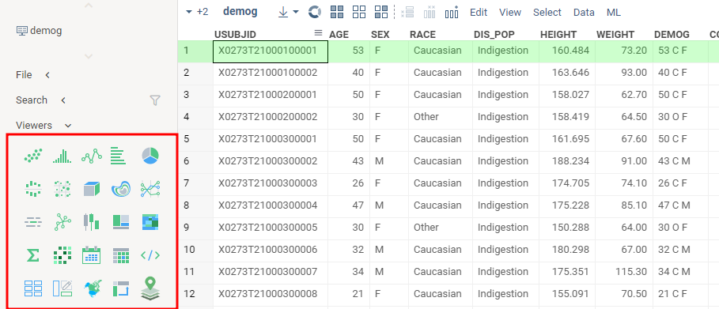
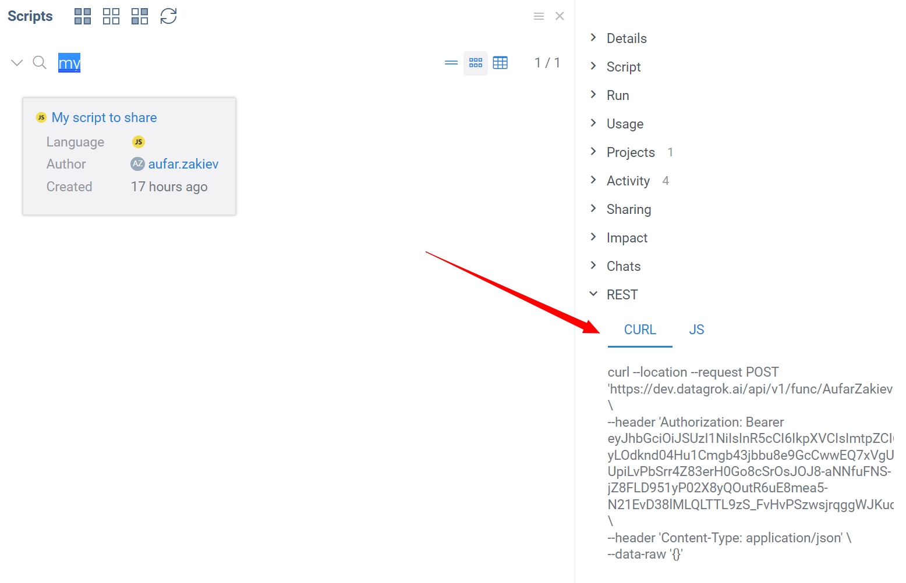

```mdx-code-block
import Tabs from '@theme/Tabs';
import TabItem from '@theme/TabItem';
```

This article describes Datagrok scripting feature. Datagrok allows to deploy scripts on platform and control their lifecycle.
For deployed scripts you can:

- use different languages
- generate graphical user interface (GUI)
- access computations history
- control sharing
- integrate them into external systems

## Prerequisites

Sign up and login to [public server of Datagrok](https://public.datagrok.ai/). After successful login, you should see welcome screen:


## How to create a script

You can create a script directly on the platform in two ways:

```mdx-code-block
<Tabs>
<TabItem value="fast" label="Fast way" default>
```

- Open Datagrok's [Scripts section](https://public.datagrok.ai/scripts).
- Hover over the taskbar on the left side. Toolbox appears.
- Select `New Javascript Script` action on the bottom of toolbox.


```mdx-code-block
</TabItem>
<TabItem value="advanced" label="Advanced way">
```

- Open Datagrok (e.g. [public homepage](https://public.datagrok.ai/))
- Select `Functions` icon on the right toolbar.
- Select `Scripts` icon on the opened toolbox.
- Select `New Javascript Script` action on the bottom of toolbox. 


```mdx-code-block
</TabItem>
</Tabs>
```

The code editor appears with the Javascript code inside. 

<details>
<summary> Your first script </summary>
<div>

```javascript
//name: Template
//description: Hello world script
//language: javascript

alert('Hello World!');
```

</div>
</details>

:::tip Pro tip

You may create and store scripts locally (as any other code) using [packages](https://datagrok.ai/help/develop/#packages) feature.

:::

## How to edit and save a script

You can edit the script directly on the platform using built-in editor. 

- Built-in editor opens for newly created scripts (see [how to create a script](#how-to-create-a-script))
- To edit an existing script:
  - Find it in [Scripts secton](https://public.datagrok.ai/scripts). 
  - Right click on script card. Context menu appears.
  - Choose **Edit** action. Built-in editor with script code opens.

## How to run a script

After the script is created, you can run it:

- Built-in editor has <i class="fas fa-play"></i> **Run** button  on the top panel
- To run an existing script:
  - Find it in [Scripts secton](https://public.datagrok.ai/scripts).
  - Right click on script card. Context menu appears.
  - Choose **Run** action. Run dialog opens.
  - Fill out the input form. Select **Run** action to start computations.

## How to debug a script

Datagrok supports several languages for [scripting](scripting.md#supported-languages). We recommend you to JavaScript scripts for learning purposes:
- Datagrok has wide range of JS API
- JS scripts run locally in the browser, so you can start them faster

### JavaScript

There is the set of [script examples](https://public.datagrok.ai/js/samples) available publicly. Feel free to play around with them to explore different Datagrok capabilities.

You may to use debugging output. Output could be written:
- into DG interface (use `grok.shell.info()` / `grok.shell.warning()` / `grok.shell.error()`)
- into the console (use `console.log()` and developer console available by F12)

In addition, you can use built-in Inspector to see what's happening "under the hood" of the platform. To open Inspector, use `Alt+I` hotkey. 
For example, Inspector provides an information about triggered events.

### Octave

Octave scripts are run in a separate container on server. This container includes following Octave packages:
- [symbolic](https://gnu-octave.github.io/packages/symbolic/)
- [optim](https://gnu-octave.github.io/packages/optim/)

Always provide `pkg load %PACKAGE_NAME%` in your scripts, since script runs are fully independent.

### Python

See [Conda environments](scripting.md#conda-environments) for details.

### R

See [Renv environments](scripting.md#renv-environments) for details.

## How to enhance a script view

Datagrok automatically creates a graphical user interface for your scripts. It uses [script header](scripting.md#header) to create an input form and properly show the outputs.
You may specify different [options](https://datagrok.ai/help/compute/scripting#options) in header. 

You may customize script view using additional GUI-related options. These options are, basically, hints to create more user-friendly interface for your scripts. 
Options should be listed in curly braces in corresponding header lines. The order of the hints makes no difference. All options are optional.

### Input captions

You can add an arbitrary caption for an input parameter. Proper caption helps user to understand the meaning of the parameter.

```mdx-code-block
<Tabs>
<TabItem value="short" label="Short sample" default>
```

```javascript
//input: double V1 { caption: Initial volume of liquid }
```

```mdx-code-block
</TabItem>
<TabItem value="full" label="Full sample">
```

```javascript
//name: Captions sample
//language: javascript
//input: double V1 { caption: Initial volume of liquid }

grok.shell.info(`V1 equals ${V1}`);
```

```mdx-code-block
</TabItem>
<TabItem value="result" label="Result">
```


```mdx-code-block
</TabItem>
</Tabs>
```

### Units

You can add a proper unit label for an input parameter. Unit label will appear in the input form next to the input field.

```mdx-code-block
<Tabs>
<TabItem value="short" label="Short sample" default>
```

```javascript
//input: double initialTemp { units: °С }
```

```mdx-code-block
</TabItem>
<TabItem value="full" label="Full sample">
```

```javascript
//name: Units sample
//language: javascript
//input: double initialTemp { units: °С }

grok.shell.info(`Initial temperature equals ${initialTemp}`);
```

```mdx-code-block
</TabItem>
<TabItem value="result" label="Result">
```


```mdx-code-block
</TabItem>
</Tabs>
```

### Adding viewers for output dataframes

You can specify viewers to review output dataframes in human-friendly way. Each dataframe parameter may have a list of viewers. 
For instance, the following code adds `Scatter plot` and `Line chart` viewers on input dataframe.

You may see all available viewers opening [demo dataframe](https://public.datagrok.ai/f/Demo.TestJobs.Files.DemoFiles/demog.csv) and opening toolbox on the left.

<details>
<summary> Fantastic viewers and where to find them </summary>
<div>



</div>
</details>

```mdx-code-block
<Tabs>
<TabItem value="short" label="Short sample">
```

```javascript
//output: dataframe outputDF { viewer: Line chart | Scatter plot }
```

```mdx-code-block
</TabItem>
<TabItem value="full" label="Full sample">
```

```javascript
//name: Adding viewer on output dataframe
//language: javascript
//input: dataframe inputDF
//output: dataframe outputDF { viewer: Line chart | Scatter plot }

outputDF = inputDF
outputDF.name = "DF with linechart"
```

```mdx-code-block
</TabItem>
<TabItem value="result" label="Result">
```


```mdx-code-block
</TabItem>
</Tabs>
```

:::tip

Default script view supports viewers for *output* dataframes only. You may specify viewers *input* dataframes using [Rich function view](#Adding input dataframes viewers)

:::

### Customizing dataframes viewers

Each viewer has a list of customizable properties. They change how the viewer is rendered and how it behaves. 
For instance, you may specify dataframe column used as X axis on scatter plot. 

List of available properties differs for each type of viewer. You may right click on viewer and select `Properties` item in the context menu. 
Any of properties listed in the opened property panel could be specified in `viewer` option. For example, the following code:
- specifies marker type and size for linechart
- enables regression line rendering for scatterplot

:::tip 

Viewer property should be entered in camelCase format. For example, here "Show regression line" property of scatteplot becomes `showRegressionLine`.

:::

```mdx-code-block
<Tabs>
<TabItem value="short" label="Short sample">
```

```javascript
//output: dataframe dummyData { viewer: Line chart(markerType: star, markerSize: 15) | Scatter plot(showRegressionLine: true) }
```

```mdx-code-block
</TabItem>
<TabItem value="full" label="Full sample">
```

```javascript
//name: Viewers customization
//language: javascript
//input: dataframe tempData
//output: dataframe dummyData { viewer: Line chart(markerType: star, markerSize: 15) | Scatter plot(showRegressionLine: true) }

dummyData = tempData.clone();
grok.shell.info(`Data row count: ${dummyData.rowCount}`);
```

```mdx-code-block
</TabItem>
<TabItem value="result" label="Result">
```


```mdx-code-block
</TabItem>
</Tabs>
```

### Validating inputs

You can add custom validation on input values of your script. By default, the input form only validates that value is presented and has expected type.
A validator is a JS-function that accepts one parameter of any type and returns `null` (if validation passes) or error string (if valdiation fails).
You can add multiple validators on each input value.

```mdx-code-block
<Tabs>
<TabItem value="short" label="Short sample">
```

```javascript
//input: int rowCount {validators: ["isPositive"]} 

grok.functions.register({
  signature: 'List<String> isPositive(int input)',
  run: (input) => input > 0 ? null : "Should be positive" 
});
```

```mdx-code-block
</TabItem>
<TabItem value="full" label="Full sample">
```

```javascript
//name: Custom validation sample
//description: Hello world script
//language: javascript
//input: int rowCount {validators: ["isPositive"]} 

grok.functions.register({
  signature: 'List<String> isPositive(int input)',
  run: (input) => input > 0 ? null : "Should be positive" 
});
```

```mdx-code-block
</TabItem>
<TabItem value="result" label="Result">
```


```mdx-code-block
</TabItem>
</Tabs>
```

## How to use the Rich script view

You can use Rich function view feature to use advanced features. 
It has all the features of basic script view, such as 
[captions](#input-captions), 
[viewers for outputs](#adding-viewers-for-output-dataframes) or 
[input validators](#validating-inputs). 

Advanced features include:

- [Viewers for input dataframes](#adding-input-dataframes-viewers)
- Grouping [inputs](#grouping-inputs) and [outputs](#grouping-outputs)
- Automatic [export](#exporting-to-a-file)
- Saving and accessing [history](#accessing-history)

To enable it, add following code to your script header:

```mdx-code-block
<Tabs>
<TabItem value="short" label="Short sample">
```

```javascript
//editor: Compute:RichFunctionViewEditor 
```

```mdx-code-block
</TabItem>
<TabItem value="full" label="Full sample">
```

```javascript
//name: RichFunctionView Demo
//language: javascript
//input: double S1 = 1 {caption: S1; units: ft² * BTU / hr °F; category: Category1}
//input: double S2 = 100 {caption: Initial scalar; units: L/min; category: Category1}
//input: double S3 = -2 {caption: Dummy scalar.; units: °C; category: Category1}
//input: double S4 = 5 {caption: Final S4; units: cells/mL; category: Category2}
//input: double S5 = 210.5 {caption: Final Volume; units: L; category: Category2}
//input: double S = 31.1 {caption: Temp.; units: °C; category: Category2}
//output: dataframe tempOnTime { viewer: Line chart(block: 50, x: "Time (hours)", y: "Temperature (°C)", showSplitSelector: false) | Statistics(block: 50); category: CoolingRate }
//output: dataframe tempOnTime2 { viewer: Line chart(block: 25, x: "Time (hours)", y: "Temperature (°C)", showSplitSelector: false) | Grid(block: 75); category: CoolingRate2 }
//output: double O1 {caption: Temp 1.; units: °C; category: CoolingRate2 }
//output: dataframe tempOnTime3 { caption: "My lovely caption"; viewer: Line chart(block: 75, x: "Time (hours)", y: "Temperature (°C)", showSplitSelector: false) | Grid(block: 25); category: CoolingRate2 }
//output: double O2 {caption: Temp 2.; units: °C; category: CoolingRate3 }
//output: double O3 {caption: Temp 3.; units: °C; category: CoolingRate3 }
//output: double O4 {caption: Temp 4.; units: °C; category: CoolingRate3 }
//output: double O5 {caption: Temp 5.; units: °C; category: CoolingRate3 }
//editor: Compute:RichFunctionViewEditor

const tt = [...Array(S2).keys()]
const Sol = [...Array(S2).keys()].map((x) => x*2)

tempOnTime = DG.DataFrame.fromColumns([
    DG.Column.float("Time (hours)", S2).init((i) => tt[i]),
    DG.Column.float("Temperature (°C)", S2).init((i) => Sol[i]),
])
tempOnTime2 = tempOnTime
tempOnTime3 = tempOnTime

O1 = S2
O2 = S2
O3 = S2
O4 = S2
O5 = S2
```

```mdx-code-block
</TabItem>
<TabItem value="result" label="Result">
```


```mdx-code-block
</TabItem>
</Tabs>
```

:::tip

Use Rich function view only when you are sure that the script works as expected. Features of Rich function view affect GUI only and have no effect on computations.

:::

### Adding input dataframes viewers

You can add viewers for input dataframes. Using them, you can review your input data before starting computations.

```mdx-code-block
<Tabs>
<TabItem value="short" label="Short sample">
```

```javascript
//input: dataframe test { viewer: Line chart | Grid }
```

```mdx-code-block
</TabItem>
<TabItem value="full" label="Full sample">
```

```javascript
//name: Input DF viewers demo
//language: javascript
//input: dataframe test { viewer: Line chart | Grid }
//output: double rowCount
//editor: Compute:RichFunctionViewEditor

rowCount = test.rowCount
```

```mdx-code-block
</TabItem>
<TabItem value="result" label="Result">
```


```mdx-code-block
</TabItem>
</Tabs>
```

### Grouping inputs

You can group script inputs into categories using the `category` tag. Specified categories are rendered as separate blocks of the input form.

```mdx-code-block
<Tabs>
<TabItem value="short" label="Short sample">
```

```javascript
//input: dataframe tempData { category: Experimental data }
//input: double initialPressure { category: Experimental data }
//input: double desiredPressure { category: Goals }
//input: double desiredHumidity { category: Goals }
```

```mdx-code-block
</TabItem>
<TabItem value="full" label="Full sample">
```

```javascript
//name: Input categories demo
//language: javascript
//input: dataframe tempData { caption: Temperature data; category: Experimental data }
//input: double initialPressure { caption: Initial pressure; category: Experimental data }
//input: double desiredPressure { caption: Goal pressure; category: Goals }
//input: double desiredHumidity { caption: Goal humidity; category: Goals }
//editor: Compute:RichFunctionViewEditor

grok.shell.info(`Initial pressure: ${initialPressure}`);
grok.shell.info(`Temperature data row count: ${tempData.rowCount}`);
```

:::tip

Here we also use `caption` tag to control input fields' labels.

:::

```mdx-code-block
</TabItem>
<TabItem value="result" label="Result">
```


```mdx-code-block
</TabItem>
</Tabs>
```

### Grouping outputs

You also can specify categories for output parameters. 
In case of output parameters, `category` tag will specify the output tab used to show output parameters value.
Following code will generate UI with 3 output tabs:

```mdx-code-block
<Tabs>
<TabItem value="short" label="Short sample">
```

```javascript
//output: dataframe tempOnTime4 { viewer: Line chart; category: Experimental data }
//output: dataframe tempOnTime5 { viewer: Line chart | Line chart; category: Simulation data }
//output: double IC3 { category: Tab #3}
//output: double IC4 { category: Tab #3}
```

```mdx-code-block
</TabItem>
<TabItem value="full" label="Full sample">
```

```javascript
//name: Grouping outputs
//language: javascript
//input: dataframe test { viewer: Line chart }
//input: double S1 = 50 { caption: S1 }
//output: dataframe tempOnTime4 { viewer: Line chart; category: Experimental data }
//output: double IC1 { category: Experimental data }
//output: dataframe tempOnTime5 { viewer: Line chart | Line chart; category: Simulation data }
//output: double IC2 { category: Simulation data }
//output: double IC3 { category: Tab #3 }
//output: double IC4 { category: Tab #3 }
//editor: Compute:RichFunctionViewEditor

tempOnTime4 = test;
tempOnTime5 = test;

IC1 = 10;
IC2 = 20;
IC3 = test.rowCount * 2;
IC4 = test.rowCount;
```

:::tip

View includes 4 tabs in total since there is a separate tab for input dataframe viewers.

:::

```mdx-code-block
</TabItem>
<TabItem value="result" label="Result">
```


```mdx-code-block
</TabItem>
</Tabs>
```

### Exporting to a file

You may use one-click export feature to save entire script run data to a local file. To generate export file, Select <i class="fas fa-arrow-to-bottom"></i> **Export** icon on the top panel. 
Automatic export saves all input and output values with their captions, units and even viewers' screenshots. This feature is available for all scripts using Rich function view by default.

<details>
<summary> Export file example </summary>
<div>


</div>
</details>

### Accessing history

Each script run is saved on the server. Saved script run includes both input and output values of the run. 
To review the history of runs, click on the <i class="fas fa-history"></i> **History** button on the top panel.

History panel appears on the right side. To load the run into the UI, click on the corresponding card.
The historical runs are immutable. Thus, if you load historical run and then run it again changing input values,
the platform will create a new historical run.

This is a feature of the Rich function view.

## How to share a script

You may control access rights to your scripts. All sharing features are located in the Sharing dialog. 
- To open it, find your script in [Scripts section](https://public.datagrok.ai/scripts) and right click on it. 
- Choose "Share..." option in the context menu. In the opened dialog you will see groups and users with their privileges. 
- You may edit list of collaborators, grant or revoke privileges at any moment.

<details>
<summary> Sharing step-by-step </summary>
<div>


</div>
</details>

## How to integrate script into third-party software

Datagrok was designed to be as extensible and easy to integrate with as possible, so out-of-the box
we get many platform integration capabilities such as authentication, data access, and many others. In addition to that,
there are some capabilities specific to models: [REST API](#rest-api) and
[embedding as iframe](#embedding-as-iframe).

### REST API

Once registered, each function gets assigned a REST API endpoint that allows external code to execute it by passing the
input parameters, along with the authentication token. This allows instantaneous deployment of scientific methods for
external consumption. To find our how to use it:
- Select the script in [Scripts section](https://public.datagrok.ai/scripts).
- Press F4 to open the context panel on the right.
- Expand the `REST` pane on it.

Both JavaScript and Curl samples are provided.

<details>
<summary> REST API panel </summary>
<div>



</div>
</details>

### JS API

JavaScript-based apps have access to the whole Datagrok platform via the [JS API](../develop/js-api.md).

### Embedding as iframe

Sometimes, an app has to be included in the external web page.
The simplest way to achieve it is via the [iframe](https://www.w3schools.com/tags/tag_iframe.ASP) element. To embed a model, click on the hamburger icon in the top left corner, and choose `Embed...`. 
You will see a dialog with the HTML code on top that you can use to embed this into external site. Note that you can change parameter values right in the URL.

<details>
<summary> Embedded iframe preview </summary>
<div>


</div>
</details>

## How to delete a script

- Find your script in [Scripts section](https://public.datagrok.ai/scripts).
- Right click on it. Context menu opens.
- Choose "Delete" option.

:::caution

This action is irreversible! Your collaborators will lose access to it and all historical runs will become inaccessible.

:::
