```mdx-code-block
import Tabs from '@theme/Tabs';
import TabItem from '@theme/TabItem';
```

This article describes Datagrok scripting feature. Techniques described here are useful for users with no prior experience in software development. 
Scripting on Datagrok allows to deploy scripts on Datagrok platform. For deployed scripts you can:

- use different languages
- fastly generate graphical user interface (GUI)
- access computations history
- control sharing
- integrate them into external systems

## Prerequisites

Sign up and login to [public server of Datagrok](https://public.datagrok.ai/). After successful login, you should see welcome screen:

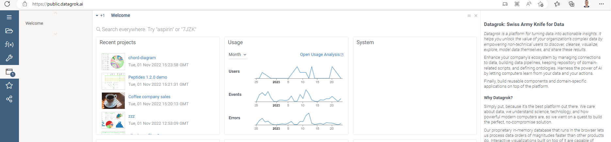

## How to create

You can create a script directly on the platform in two ways:

```mdx-code-block
<Tabs>
<TabItem value="fast" label="Fast way" default>
```

- Open Datagrok's [Scripts section](https://public.datagrok.ai/scripts)
- Hover over the taskbar on the left side. Toolbox will appear.
- Click on `New Javascript Script` action on the bottom of toolbox 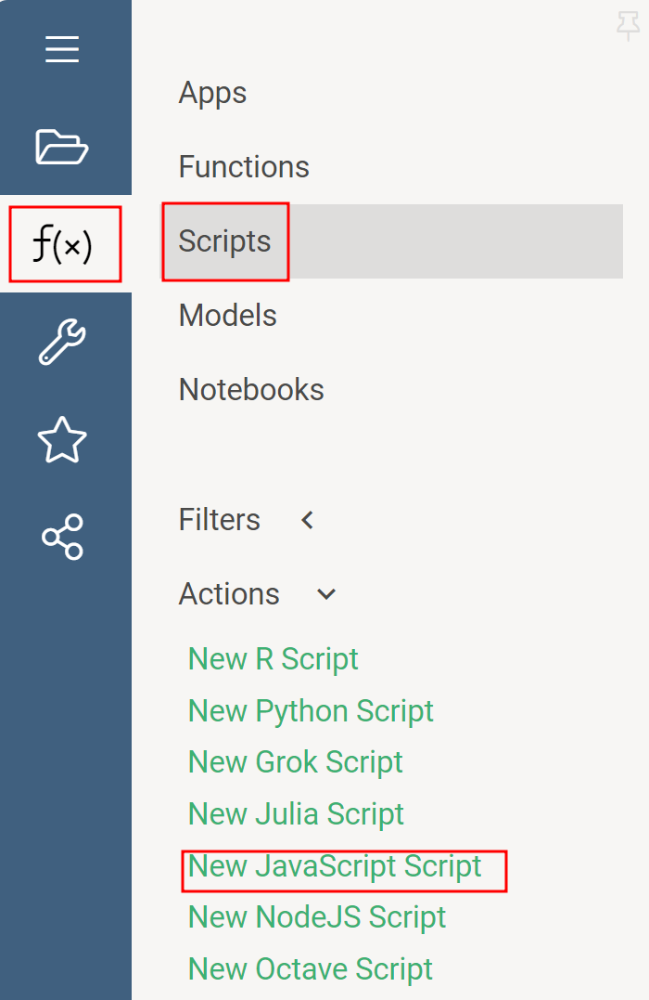

```mdx-code-block
</TabItem>
<TabItem value="advanced" label="Advanced way">
```

- Open Datagrok (e.g. [public homepage](https://public.datagrok.ai/))
- Click on `Functions` icon on the right toolbar
- Click on `Scripts` icon on the opened toolbox 
- Click on `New Javascript Script` action on the bottom of toolbox 

```mdx-code-block
</TabItem>
</Tabs>
```

If everything is OK, you should see the code editor with the Javascript code inside. 

<details>
<summary> Your first script </summary>
<div>

```javascript
//name: Template
//description: Hello world script
//language: javascript

alert('Hello World!');
```

</div>
</details>

## How to edit and save the script

You can edit the script directly on the platform using built-in editor. 

- Freshly created scripts are opened in the editor automatically
- To edit an existing script, find it in [Scripts secton](https://public.datagrok.ai/scripts), right click on script card and choose `Edit` action

## How to run script

After the script is created, you can run it:

- Built-in editor has <i class="fas fa-play"></i> "Run" button  on the top panel
- To edit an existing script, find it in [Scripts secton](https://public.datagrok.ai/scripts), right click on script card and choose `Run` action

## How to enhance basic script view

Datagrok automatically creates a graphical user interface for your scripts. It uses script header to create an input form and properly show the outputs after running the script.
Header could have additional GUI-related hints. You can use these hints to create more user-friendly interface for your scripts. 
Hints should be listed in curly braces in corresponding header lines. The order of the hints makes no difference; all the hints are optional.

### Input captions

You can add a specific caption for an input parameter. Proper caption gives to a script user an additional context about input parameter meaning.

```mdx-code-block
<Tabs>
<TabItem value="short" label="Short sample" default>
```

```javascript
//input: double S1 { caption: Initial volume of liquid }
```

```mdx-code-block
</TabItem>
<TabItem value="full" label="Full sample">
```

```javascript
//name: Captions sample
//language: javascript
//input: double S1 { caption: Initial volume of liquid }

grok.shell.info(`S1 equals ${S1}`);
```

```mdx-code-block
</TabItem>
<TabItem value="result" label="Result">
```


```mdx-code-block
</TabItem>
</Tabs>
```

### Input units

You can add corresponding unit for an input parameter. Unit will appear in the input form next to the input field.

```mdx-code-block
<Tabs>
<TabItem value="short" label="Short sample" default>
```

```javascript
//input: double initial_temp { units: °С }
```

```mdx-code-block
</TabItem>
<TabItem value="full" label="Full sample">
```

```javascript
//name: Units sample
//language: javascript
//input: double initial_temp { units: °С }

grok.shell.info(`Initial temperature equals ${initial_temp}`);
```

```mdx-code-block
</TabItem>
<TabItem value="result" label="Result">
```


```mdx-code-block
</TabItem>
</Tabs>
```

### Adding viewers for output dataframes

You can specify viewers to review dataframes in human-friendly way. Each dataframe parameter may have a list of viewers. 
For instance, the following code adds `Scatter plot` and `Line chart` viewers on input dataframe

```mdx-code-block
<Tabs>
<TabItem value="short" label="Short sample">
```

```javascript
//output: dataframe tempOnTime { viewer: Line chart | Scatter plot }
```

```mdx-code-block
</TabItem>
<TabItem value="full" label="Full sample">
```

```javascript
//name: Adding viewer on output dataframe
//language: javascript
//input: dataframe test
//output: dataframe tempOnTime { viewer: Line chart | Scatter plot }

tempOnTime = test
tempOnTime.name = "DF with linechart"
```

```mdx-code-block
</TabItem>
<TabItem value="result" label="Result">
```

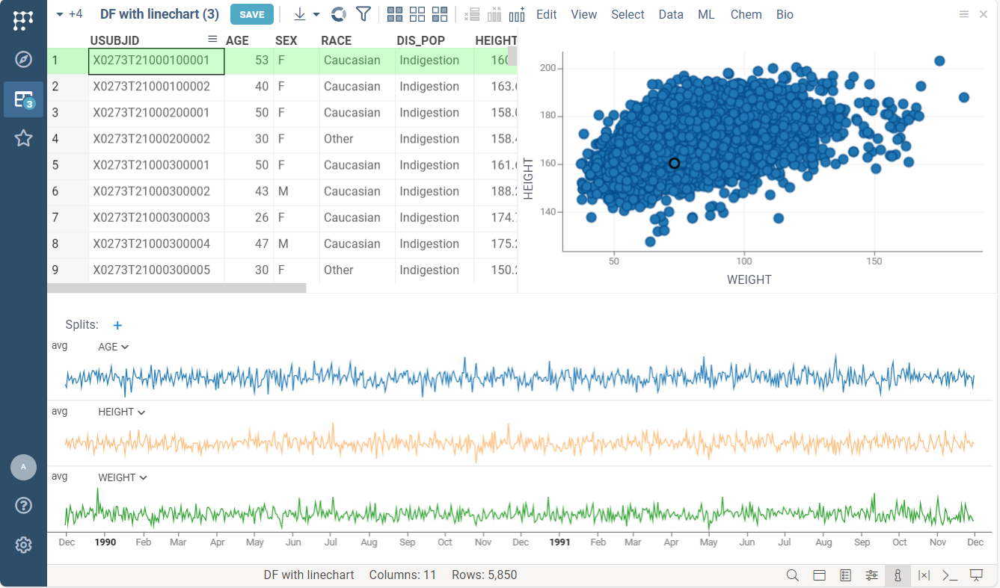

```mdx-code-block
</TabItem>
</Tabs>
```

### Customizing dataframes viewers

Each viewer has a list of properties used for rendering and changing its' behaviour. For instance, you may specify dataframe column used as X axis on scatter plot. 

List of available properties differs for each type of viewer. You may tight click on viewer and select `Properties` item in the context menu. 
Any of properties listed in the opened property panel could be customized. For example, the following code:
- specifies column used for X axis values for line chart
- specifies row height for grid
- sets the width value for both viewers to 100% (using `block` property)

```mdx-code-block
<Tabs>
<TabItem value="short" label="Short sample">
```

```javascript
//output: dataframe dumb_data { viewer: Line chart(markerType: star, markerSize: 15) | Scatter plot(showRegressionLine: true) }
```

```mdx-code-block
</TabItem>
<TabItem value="full" label="Full sample">
```

```javascript
//name: Viewers customization
//language: javascript
//input: dataframe temp_data
//output: dataframe dumb_data { viewer: Line chart(markerType: star, markerSize: 15) | Scatter plot(showRegressionLine: true) }

dumb_data = temp_data.clone();
grok.shell.info(`Data row count: ${dumb_data.rowCount}`);
```

```mdx-code-block
</TabItem>
<TabItem value="result" label="Result">
```

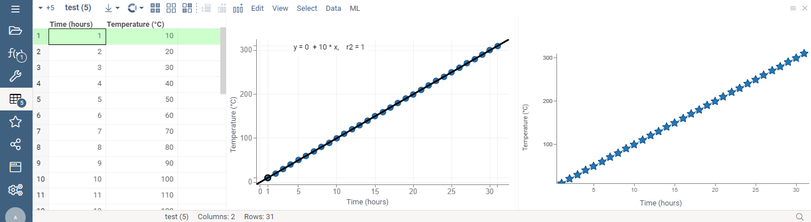

```mdx-code-block
</TabItem>
</Tabs>
```

### Validating inputs

You can add custom validation on input values of your script. By default, the input form only validates the value presence and type validity.
A validator is a JS-function that accepts one parameter of any type and returns null (if validation passes) or error string (if valdiation fails).
You can add multiple validators on each input value.

```mdx-code-block
<Tabs>
<TabItem value="short" label="Short sample">
```

```javascript
//input: int row_count {validators: ["isPositive"]} 

grok.functions.register({
  signature: 'List<String> isPositive(int input)',
  run: (input) => input > 0 ? null : "Should be positive" 
});
```

```mdx-code-block
</TabItem>
<TabItem value="full" label="Full sample">
```

```javascript
//name: Custom validation sample
//description: Hello world script
//language: javascript
//input: int row_count {validators: ["isPositive"]} 

grok.functions.register({
  signature: 'List<String> isPositive(int input)',
  run: (input) => input > 0 ? null : "Should be positive" 
});
```

```mdx-code-block
</TabItem>
<TabItem value="result" label="Result">
```

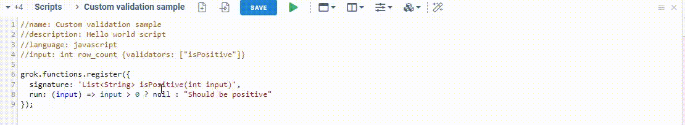

```mdx-code-block
</TabItem>
</Tabs>
```

## How to use advanced script view

You can use so called `RichFunctionView` feature to access to advanced features. 
It has all the features of basic script view, such as 
[captions](#input-captions), 
[viewers for outputs](#adding-viewers-for-output-dataframes) or 
[input validators](#validating-inputs). 
Advanced features include:

- [Viewers for input dataframes](#adding-input-dataframes-viewers)
- Grouping [inputs](#grouping-inputs) and [outputs](#grouping-outputs)
- Automatic [export](#exporting-to-a-file)
- Saving and accessing [history](#accessing-history)

To enable it, add following code to your script header:

```mdx-code-block
<Tabs>
<TabItem value="short" label="Short sample">
```

```javascript
//editor: Compute:RichFunctionViewEditor 
```

```mdx-code-block
</TabItem>
<TabItem value="full" label="Full sample">
```

```javascript
//name: RichFunctionView Demo
//language: javascript
//input: double S1 = 1 {caption: S1; units: ft² * BTU / hr °F; category: Category1}
//input: double S2 = 100 {caption: Initial scalar; units: L/min; category: Category1}
//input: double S3 = -2 {caption: Dummy scalar.; units: °C; category: Category1}
//input: double S4 = 5 {caption: Final S4; units: cells/mL; category: Category2}
//input: double S5 = 210.5 {caption: Final Volume; units: L; category: Category2}
//input: double S = 31.1 {caption: Temp.; units: °C; category: Category2}
//output: dataframe tempOnTime { viewer: Line chart(block: 50, x: "Time (hours)", y: "Temperature (°C)", showSplitSelector: false) | Statistics(block: 50); category: CoolingRate }
//output: dataframe tempOnTime2 { viewer: Line chart(block: 25, x: "Time (hours)", y: "Temperature (°C)", showSplitSelector: false) | Grid(block: 75); category: CoolingRate2 }
//output: double O1 {caption: Temp 1.; units: °C; category: CoolingRate2 }
//output: dataframe tempOnTime3 { caption: "My lovely caption"; viewer: Line chart(block: 75, x: "Time (hours)", y: "Temperature (°C)", showSplitSelector: false) | Grid(block: 25); category: CoolingRate2 }
//output: double O2 {caption: Temp 2.; units: °C; category: CoolingRate3 }
//output: double O3 {caption: Temp 3.; units: °C; category: CoolingRate3 }
//output: double O4 {caption: Temp 4.; units: °C; category: CoolingRate3 }
//output: double O5 {caption: Temp 5.; units: °C; category: CoolingRate3 }
//editor: Compute:RichFunctionViewEditor

const tt = [...Array(S2).keys()]
const Sol = [...Array(S2).keys()].map((x) => x*2)

tempOnTime = DG.DataFrame.fromColumns([
    DG.Column.float("Time (hours)", S2).init((i) => tt[i]),
    DG.Column.float("Temperature (°C)", S2).init((i) => Sol[i]),
])
tempOnTime2 = tempOnTime
tempOnTime3 = tempOnTime

O1 = S2
O2 = S2
O3 = S2
O4 = S2
O5 = S2
```

```mdx-code-block
</TabItem>
<TabItem value="result" label="Result">
```

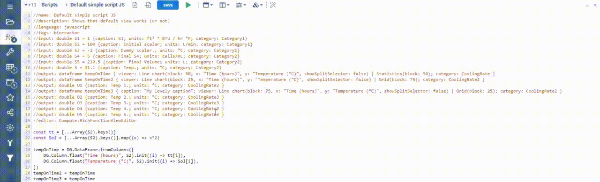

```mdx-code-block
</TabItem>
</Tabs>
```

### Adding input dataframes viewers

You can add viewers for input dataframes. Using them, you can review your input data before starting actual computations.

```mdx-code-block
<Tabs>
<TabItem value="short" label="Short sample">
```

```javascript
//input: dataframe test { viewer: Line chart | Grid }
```

```mdx-code-block
</TabItem>
<TabItem value="full" label="Full sample">
```

```javascript
//name: Input DF viewers demo
//language: javascript
//input: dataframe test { viewer: Line chart | Grid }
//output: double rowCount
//editor: Compute:RichFunctionViewEditor

rowCount = test.rowCount
```

```mdx-code-block
</TabItem>
<TabItem value="result" label="Result">
```

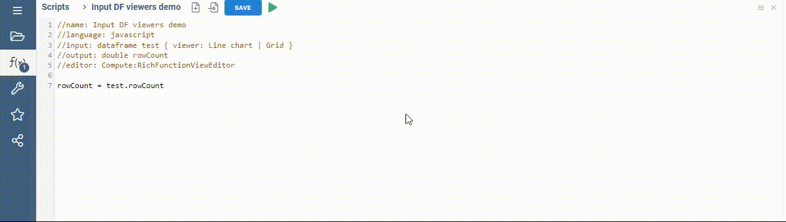

```mdx-code-block
</TabItem>
</Tabs>
```

### Grouping inputs

You can group script inputs into categories using `category` tag. Specified categories are rendered as separate blocks of the input form.

```mdx-code-block
<Tabs>
<TabItem value="short" label="Short sample">
```

```javascript
//input: dataframe temp_data { category: Experimental data }
//input: double initial_pressure { category: Experimental data }
//input: double desired_pressure { category: Goals }
//input: double desired_humidity { category: Goals }
```

```mdx-code-block
</TabItem>
<TabItem value="full" label="Full sample">
```

```javascript
//name: Input categories demo
//language: javascript
//input: dataframe temp_data { caption: Temperature data; category: Experimental data }
//input: double initial_pressure { caption: Initial pressure; category: Experimental data }
//input: double desired_pressure { caption: Goal pressure; category: Goals }
//input: double desired_humidity { caption: Goal humidity; category: Goals }
//editor: Compute:RichFunctionViewEditor

grok.shell.info(`Initial pressure: ${initial_pressure}`);
grok.shell.info(`Temperature data row count: ${temp_data.rowCount}`);
```

:::tip

Here we also use "caption" tag to control inputs' labels.

:::

```mdx-code-block
</TabItem>
<TabItem value="result" label="Result">
```

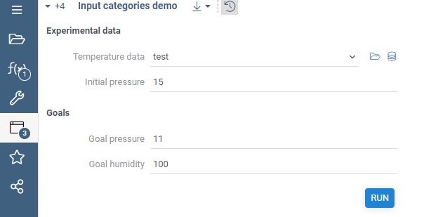

```mdx-code-block
</TabItem>
</Tabs>
```

### Grouping outputs

You also can specify categories for output parameters. 
In case of output parameters, `category` tag will specify which output tab will be used to show output parameters value.
Following code will generate UI with 3 output tabs:

```mdx-code-block
<Tabs>
<TabItem value="short" label="Short sample">
```

```javascript
//output: dataframe tempOnTime4 { viewer: Line chart; category: Experimental data }
//output: dataframe tempOnTime5 { viewer: Line chart | Line chart; category: Simulation data }
//output: double IC3 { category: Tab #3}
//output: double IC4 { category: Tab #3}
```

```mdx-code-block
</TabItem>
<TabItem value="full" label="Full sample">
```

```javascript
//name: Grouping outputs
//language: javascript
//input: dataframe test { viewer: Line chart }
//input: double S1 = 50 { caption: S1 }
//output: dataframe tempOnTime4 { viewer: Line chart; category: Experimental data }
//output: double IC1 { category: Experimental data }
//output: dataframe tempOnTime5 { viewer: Line chart | Line chart; category: Simulation data }
//output: double IC2 { category: Simulation data }
//output: double IC3 { category: Tab #3 }
//output: double IC4 { category: Tab #3 }
//editor: Compute:RichFunctionViewEditor

tempOnTime4 = test;
tempOnTime5 = test;

IC1 = 10;
IC2 = 20;
IC3 = test.rowCount * 2;
IC4 = test.rowCount;
```

:::tip

Here we also specify default value for `S1` parameter

:::

```mdx-code-block
</TabItem>
<TabItem value="result" label="Result">
```

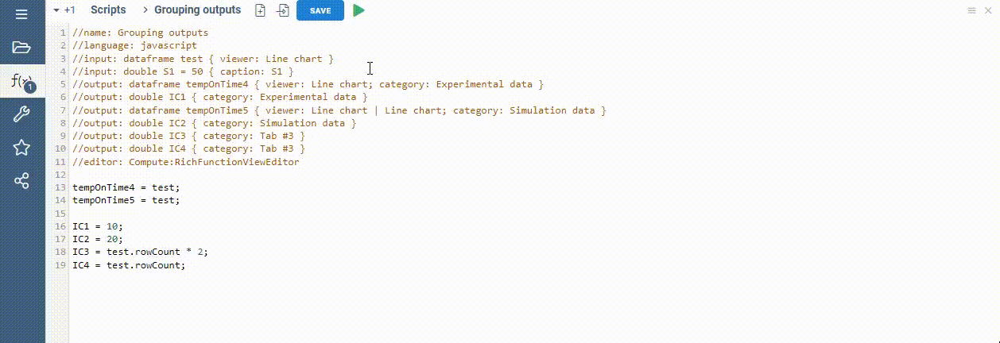

```mdx-code-block
</TabItem>
</Tabs>
```

### Exporting to a file

You may use one-click export feature to save entire script run data to a local file. To generate export file, click on <i class="fas fa-arrow-to-bottom"></i> "Export" icon on the top panel. 
Automatic export saves all input and output values with their captions, units and even viewers' screenshots. This feature is available for all scripts using `RichFunctionView` by default.

<details>
<summary> Export file example </summary>
<div>


</div>
</details>

### Accessing history

Each script run is saved on the server. Saved script run includes both input and output values of the run. 
You may review the history of runs clicking on the <i class="fas fa-history"></i> "History" button on the top panel.

History panel will appear on the right side. Clicking on any of cards will load the historical run into the UI.
The historical runs are immutable. Thus, if you load historical run and then run it again with different input values, the platofrm will create new historical run.
This feature is available for all scripts using `RichFunctionView` by default.

## How to share a script

You may control access rights to your scripts. All sharing features are located in Sharing dialog. To open it, find your script in [Scripts section](https://public.datagrok.ai/scripts) and right click on it. 
Choose "Share..." option in the context menu. In the opened dialog you will see groups and users with their privileges. You may edit list of collaborators, grant or revoke privileges at any moment.

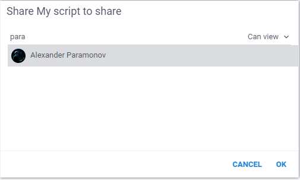 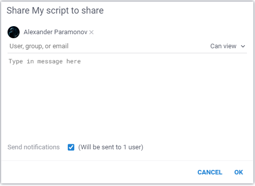 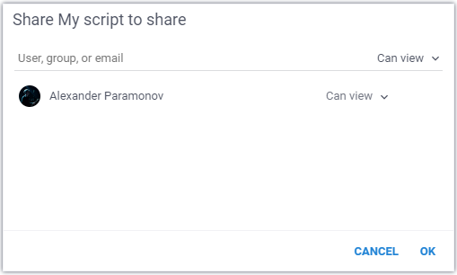


## How to integrate script into third-party software

Datagrok was designed with the design goal to be as extensible and easy to integrate with as possible, so out-of-the box
we get many platform integration capabilities such as authentication, data access, and many others. In addition to that,
there are some capabilities specific to models: [REST API](#rest-api) and
[embedding as iframe](#embedding-as-iframe).

### REST API

Once registered, each function gets assigned a REST API endpoint that allows external code to execute it by passing the
input parameters, along with the authentication token. This allows instantaneous deployment of scientific methods for
external consumption. To find our how to use it, click on the function and expand the `REST` pane on the context panel
on the right. Both JavaScript and Curl samples are provided.

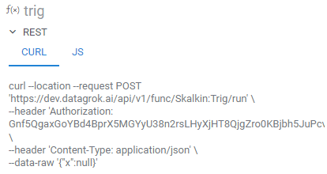

### JS API

JavaScript-based apps have access to the whole Datagrok platform via the
[JS API](../develop/js-api.md).

### Embedding as iframe

Sometimes, an app has to be included in the external web page. The simplest way to achieve it is via
the [iframe](https://www.w3schools.com/tags/tag_iframe.ASP)
element. To embed a model, click on the hamburger icon in the top left corner, and choose `Embed...`
. You will see a dialog with the HTML code on top that you can use to embed this into external site. Note that you can
change parameter values right in the URL.

On the bottom, you see a preview of the result ()

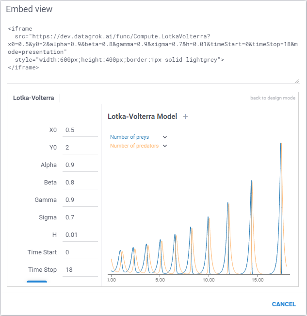

## How to delete a script

At any moment of the time you can delete a script. To do that, you need to find to in [Scripts section](https://public.datagrok.ai/scripts), right click on it and choose "Delete" option. 

:::caution

This action is irreversable! Your collaborators will lose access to it and all historical runs will become inaccessible. 

:::
