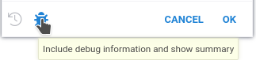

```mdx-code-block
import Tabs from '@theme/Tabs';
import TabItem from '@theme/TabItem';
import BrowserWindow from '@site/src/components/browser-window';
```

<div style = {{maxWidth: '680px'}}>

## Prerequisites

* Sign up and log in to [public server of Datagrok](https://public.datagrok.ai/).
* Alternatively, set up a [local Datagrok environment](../deploy/docker-compose/docker-compose.mdx).

## Datagrok scripting essentials

This section explains the basic concepts of scripting in Datagrok.
Code examples are provided in **Python**, **R**, and **JavaScript**.

:::tip Consider JavaScript

In Datagrok, JavaScript offers unique benefits compared to traditional
data science languages like Python or R.

JavaScript script executes right in your browser, leading to:

* shorter spin-up time,
* and better debugging experience.

Datagrok provides an extensive JavaScript API, giving you:

* detailed control over viewer parameters,
* access to core Datagrok functions.

:::

### How to create a script

You can create a script directly on the platform in two ways:

```mdx-code-block
<Tabs>
<TabItem value="fast" label="Fast way" default>
```

<div style = {{ display: 'flex' }}>

<div style = {{ width: '50%' }}>

* Open Datagrok (e.g. [public homepage](https://public.datagrok.ai/))
* Select `Browse` icon on the left toolbar.
* Select Datagrok's [Scripts section](https://public.datagrok.ai/scripts).
* Click on the "New" button and create a new script in your preferred language.

</div>

<div style = {{ width: '50%', display: 'flex', 'justify-content': 'end' }}>

```mdx-code-block
<BrowserWindow url="" bodyStyle={{'padding': '0px'}}>
```


```mdx-code-block
</BrowserWindow>
```

</div>

</div>

```mdx-code-block
</TabItem>
<TabItem value="advanced" label="Advanced way">
```

* Enable extended **Main menu** in the **Window** icon on the right toolbar
* Open **Main manu > Tools > Scripting**.
* Choose the language for the script

```mdx-code-block
</TabItem>
</Tabs>
```

The code editor appears with the code inside.

```mdx-code-block
<Tabs>
<TabItem value="python" label="Python" default>
```

```python
#name: Template
#description: Calculates the number of cells in the table
#language: python
#tags: template, demo
#sample: cars.csv
#input: dataframe table [Data table]
#output: int count [Number of cells in the table]
count = table.shape[0] * table.shape[1]
```

```mdx-code-block
</TabItem>
<TabItem value="r" label="R">
```

```r
#name: Template
#description: Calculates the number of cells in the table
#language: r
#tags: template, demo
#sample: cars.csv
#input: dataframe table [Data table]
#output: int count [Number of cells in the table]
count <- nrow(table) * ncol(table)
```

```mdx-code-block
</TabItem>

<TabItem value="javascript" label="JavaScript">
```

```javascript
//name: Template
//description: Hello world script
//language: javascript

alert('Hello World!');
```

```mdx-code-block
</TabItem>

</Tabs>
```

Congratulations, you've just written a script in Datagrok!
Let's explore how it works.

### Script header

Each Datagrok script has a **header**. A header contains **header parameters** \-
special comment strings used by Datagrok to determine script name and language,
pass to the script input parameters, and capture script output.  

The template script has the following ones:

* `name: Template`: The short name of the script.
* `description: Calculates the number of cells in the table`: The human-readable description.
* `language: python`: The script language. Supported: *R*, *Python*, *Octave*, *Julia*, *JavaScript*.
* `tags: template, demo`: The list of the tags used to organize and search scripts.
* `input: dataframe table [Data table]`: The input parameter specification.
   The `table` is the parameter name, and `dataframe` is the parameter type.
   See the [supported parameter types](../datagrok/concepts/functions/func-params-annotation#inputs-and-outputs) for details.
* `output: int count [Number of cells in the table]`: The output parameter specification:
   The `int` variable with the name `count`.

For more details, refer to the [functions parameter annotation](../datagrok/concepts/functions/func-params-annotation).

### Runtime environment

For each language, Datagrok uses a predefined header and creates an environment with the set of pre-installed packages.

```mdx-code-block
<Tabs>
<TabItem value="python" label="Python" default>
```

```python
import os
import io
import json
import pandas as pd
import requests
from datetime import datetime, timedelta
```

```mdx-code-block
</TabItem>

<TabItem value="r" label="R">
```

```r
require(httr)
require(repr)
require(data.table)
require(R.utils)
```

```mdx-code-block
</TabItem>

<TabItem value="octave" label="Octave">
```

Octave scripts run in a separate container on server. This container has following Octave packages pre-installed:

* [symbolic](https://gnu-octave.github.io/packages/symbolic/)
* [optim](https://gnu-octave.github.io/packages/optim/)

Always provide `pkg load %PACKAGE_NAME%` in your scripts, since script runs are fully independent.

```mdx-code-block
</TabItem>

<TabItem value="julia" label="Julia">
```

```julia
using HTTP
using DataFrames
using CSV
using Compat
using MbedTLS
using Dates
using JSON
```

```mdx-code-block
</TabItem>

<TabItem value="javascript" label="JavaScript">
```

```javascript
import * as grok from 'datagrok-api/grok';
import * as ui from 'datagrok-api/ui';
import * as DG from 'datagrok-api/dg';
import * as OCL from 'openchemlib/full.js';
import * as rxjs from 'rxjs';
import * as rxjs.operators from 'rxjs/operators';
import * as $ from 'cash-dom';
import * as dayjs from 'dayjs';
import * as wu from 'wu';
import * as exceljs from 'ExcelJS';
import * as html2canvas from 'html2canvas';
```

```mdx-code-block
</TabItem>

</Tabs>
```

### How to run a script

Let's save the script and see how it works.
The built-in editor has the **Run** <i class="fas fa-play"></i> button on the top panel.
Press it to run a script. You will see the following window:

```mdx-code-block
<BrowserWindow url=''>
```

<div style={{'text-align': 'center'}}>


</div>

```mdx-code-block
</BrowserWindow>
```

When you run a script,
Datagrok analyzes header parameters
to create an input form and show the outputs.

Provide a dataframe for the script and press **OK** to run it.
You can choose an already opened dataframe,
open a dataframe from a file, or retrieve it via SQL query.

After the script finishes, Datagrok collects all output parameters and displays them.
In the provided example, this is a single scalar value shown in the **Variables** panel.
You will see the following output:

```mdx-code-block
<BrowserWindow url=''>
```

<div style={{'text-align': 'center'}}>


</div>

```mdx-code-block
</BrowserWindow>
```

:::tip Pro tip

Depending on the metadata associated with the parameters, the editor can be
enriched by [validators](./scripting-advanced#parameter-validators), [choices](scripting-advanced#parameter-choices),
and [suggestions](scripting-advanced#parameter-suggestions). Validators, choices, and suggestions are
[functions](../datagrok/concepts/functions/functions.md), that means they can be implemented in different ways
(database query, script, etc.), and reused.

:::

### Running previously saved scripts

To run the previously saved script, find it in the **Scripts** section and execute it.

```mdx-code-block
<BrowserWindow bodyStyle={{'padding': '0px'}} url=''>
```


```mdx-code-block
</BrowserWindow>
```

For additional capabilities of the Datagrok script editor, see the
[Working with Datagrok script editor](#working-with-datagrok-script-editor) section.

## Datagrok scripting in details

### Input and output parameters

Each script should specify its' input and output parameters.
Datagrok automatically injects *input* parameters' values before the script starts
and captures *output* parameters' values when the script finishes.

Datagrok natively supports standard scalar data types:
`int`, `double`, `bool`, `string`.

For table data, Datagrok supports **Dataframe** as input/output parameters.
You can pass to the script the whole dataframe (`dataframe` type), dataframe column (`column`), list of columns (`column_list`),
or a binary file (`file`, `blob`).

:::note

Datagrok's dataframe converts to:
* Pandas [dataframe](https://pandas.pydata.org/docs/reference/api/pandas.DataFrame.html) for Python,
* Native [data frames](https://www.rdocumentation.org/packages/base/versions/3.6.2/topics/data.frame) for R,
* [Cell arrays](https://docs.octave.org/v8.4.0/Cell-Arrays.html) for Octave
* [DataFrame](https://dataframes.juliadata.org/stable/man/getting_started/#The-DataFrame-Type) for Julia
* [DG.DataFrame](https://datagrok.ai/help/develop/advanced/data-frame) for JavaScript

:::

Let's modify the default example to accept and return both dataframes and scalars.
We copy the original dataframe and add a new ID column to it.
Also, we return the number of rows in the table.

```mdx-code-block
<Tabs>
<TabItem value="result" label="Result" default>
```

When you run the script, you will see the following dialog:

```mdx-code-block
<BrowserWindow url=''>
```

<div style={{'text-align': 'center'}}>


</div>

```mdx-code-block
</BrowserWindow>
```

```mdx-code-block
</TabItem>
<TabItem value="r" label="R">
```

```r
#name: DataframeDemo
#description: Adding a new column to a dataframe
#language: r
#tags: demo, dataframe
#input: dataframe table [Data table]
#input: string id_column = 'ID' [Name of ID column]
#input: string id_prefix = 'id_' [Prefix for ID column]
#output: dataframe new_table [New table with additional column]
#output: int last_row [number of last row]

new_table <- table
new_table[id_column] <- paste0(id_prefix, 1:nrow(new_table))
last_row <- nrow(new_table)
```

```mdx-code-block
</TabItem>
<TabItem value="python" label="Python">
```

```python
#name: DataframeIdDemo
#description: Adding ID column to a dataframe
#language: python
#tags: demo, dataframe
#input: dataframe table [Data table]
#input: string id_column = 'ID' [Name of ID column]
#input: string id_prefix = 'id_' [Prefix for ID column]
#output: dataframe new_table [New table with additional column]
#output: int last_row [number of last row]

new_table = table.copy()
l = len(new_table)
new_table[id_column] = [f"{id_prefix}{n:04}" for n in range(l)]
last_row = len(new_table)
```

```mdx-code-block
</TabItem>
<TabItem value="javascript" label="JavaScript">
```

```javascript
//name: DataframeIdDemo
//description: Adding ID column to a dataframe
//language: javascript
//tags: demo, dataframe
//sample: cars.csv
//input: dataframe table [Data table]
//input: string id_column = 'model' [Name of ID column]
//input: string id_prefix = 'id_' [Prefix for ID column]
//output: dataframe new_table [New table with additional column]
//output: int last_row [number of last row]

const new_table = table.clone();
const last_row = new_table.rowCount;
new_table.col(id_column).init((i) => `${id_prefix}${i}`);
```

```mdx-code-block
</TabItem>
</Tabs>
```

Datagrok created the script UI,
populated default values, and created popups with help text.

After running this script, Datagrok automatically opens the new dataframe.
It will contain an additional column **ID** with the generated row ID.

:::warning Case-insensitive column names

In Datagrok, unlike `Python`/`R` dataframes, column names are case-insensitive.
If you return a dataframe with columns whose names differ only by letter case,
Datagrok will automatically add a number to the column header to differentiate them.

To prevent any confusion or issues with column names,
we recommend using unique names that are distinct regardless of case.

:::

### Using column inputs

Datagrok provides you with data inputs to select one or multiple columns from a dataframe.

* The `column` input parameter allows you to select one column from the dataframe.
  In the script, the `column` parameter is a string variable containing header name of the selected column.
* The `column_list` input parameter allows you to select multiple columns from the dataframe.
  In the script, the `column_list` parameter is a list of strings containing header names of the selected columns.

Both of these selectors require at least one **Dataframe** input
to choose a dataframe.

```mdx-code-block
<Tabs>
<TabItem value="result" label="Result" default>
```

```mdx-code-block
<BrowserWindow url=''>
```

<div style={{'text-align': 'center'}}>


</div>

```mdx-code-block
</BrowserWindow>
```

```mdx-code-block
</TabItem>
<TabItem value="python" label="Python">
```

```python
#name: ColumnSelectorDemo
#description: Using column selectors
#language: python
#tags: demo, dataframe, column_selector
#input: dataframe table [Data table]
#input: column id_column [Fill this column with auto-d=generated ID]
#input: column_list data_columns [Keep this column and drom all others]
#output: dataframe new_table [New table with additional column]

new_table = table.copy()
l = len(new_table)
new_table[id_column] = [f"id_{n:04}" for n in range(l)]
new_table = new_table[ [id_column] + data_columns ]
```

```mdx-code-block
</TabItem>
<TabItem value="javascript" label="JavaScript">
```

```javascript
//name: ColumnSelectorDemo
//description: Using column selectors
//language: javascript
//tags: demo, dataframe, column_selector
//input: dataframe table [Data table]
//input: column id_column [Fill this column with auto-d=generated ID]
//input: column_list data_columns [Keep this column and drom all others]
//output: dataframe new_table [New table with additional column]

const new_table = table.clone();
const l = new_table.rowCount;
new_table.col('model').init((i) => `${id_column.get(i)}_${i}`);
```

```mdx-code-block
</TabItem>
</Tabs>
```

### File input

When you use the `file` annotation for the input parameter,
Datagrok creates an interface to load file.

```mdx-code-block
<Tabs>
<TabItem value="result" label="Result" default>
```

```mdx-code-block
<BrowserWindow url=''>
```

<div style={{'text-align': 'center'}}>


</div>

```mdx-code-block
</BrowserWindow>
```

```mdx-code-block
</TabItem>
<TabItem value="python" label="Python">
```

```python
#name: DfFromJSON
#description: Loads a dataframe from JSON file
#language: python
#tags: template, demo, FileIo
#input: file json_file {caption:JSON file} [A JSON file to load a dataframe]
#output: dataframe df 

df = pd.read_json(json_file)
```

```mdx-code-block
</TabItem>
<TabItem value="javascript" label="JavaScript">
```

```javascript
//name: DfFromJSON
//description: Loads a file and returns first sheet name
//language: javascript
//tags: template, demo, FileIo
//input: file uploadedFile {caption:Excel file}
//output: string first_sheet_name 

const importWb = new ExcelJS.Workbook();
await importWb.xlsx.load(uploadedFile.data);

first_sheet_name = importWb.worksheets[0].name;
```

```mdx-code-block
</TabItem>
</Tabs>
```

<div style = {{ display: 'flex' }}>

<div style = {{ width: '50%' }}>

You can upload the file from your computer, choose it from Datagrok file storage,
or use any of the file connectors supported by Datagrok.

</div>

<div style = {{ width: '50%' }}>

```mdx-code-block
<BrowserWindow url="File I/O connectors">
```


```mdx-code-block
</BrowserWindow>
```

</div>

</div>

The `blob` input works in a very similar way, but provides the binary stream instead of a file name.

```python
#name: BlobTest
#description: Example of Blob usage
#language: python
#tags: template, demo
#input: blob array_blob 
#output: string typeofblob

typeofblob = type(array_blob)
```

You can use this capability to effectively transfer a large set of data
from one Datagrok function/script to another.

### File output

You can use files as input or output parameters
using `file` and `blob` annotations.

The `file` parameter type allows you to read and write a file.
Inside the `Python`/`R` script this parameter will be a string variable
containing a path to the local file.

For example, let's save a dataframe to a JSON file:

```mdx-code-block
<Tabs>
<TabItem value="result" label="Result" default>
```

```mdx-code-block
<BrowserWindow url=''>
```

<div style={{'text-align': 'center'}}>


</div>

```mdx-code-block
</BrowserWindow>
```

```mdx-code-block
</TabItem>
<TabItem value="python" label="Python">
```

```python
#name: DfToJSON
#description: Saves a dataframe to JSON file
#language: python
#tags: template, demo, FileIo
#input: dataframe df [Dataframe to convert to JSON]
#output: file json_file

df.to_json(json_file)
```

```mdx-code-block
</TabItem>
</Tabs>
```

When you run this script, Datagrok will return the `FileInfo` object in the scalar variables panel.
To save the file, right-click on the highlighted file link and choose the **Download** option.
The file name always matches the output variable name.
Therefore, for scripts, there is no possibility to provide a custom name or extension to the generated file.

:::info
Some Python functions
(for example, Numpy [Save](https://numpy.org/doc/stable/reference/generated/numpy.save.html))
automatically add an extension to the file name if it is provided without an extension.
In this case, Datagrok won't be able to locate output file,
and you'll see empty file in the Datagrok output.

To override this behavior, you can open the file via the Python `open` function,
and use the file object instead of the file name.

```python
#output: file array_file_binary
...
with open(array_file_binary, 'wb') as npfile:
 np.save(npfile, array)
...
```

:::

### Semantic types

The Datagrok [semantic types](../govern/catalog/semantic-types) is a very powerful concept,
allowing you to define the *meaning* of your data,
For example, you can specify that a particular string contains a chemical molecule in SMILES format,
E-mail, or URL address.

For example, let's explore the **Gasteiger partial charges** script,
which takes a molecule in SMILES format as input
and calculates the Gasteiger charges distribution.
The script is provided with the `Chem` package.

The script takes as an input the string variable `mol` with the semantic annotation `Molecule`.
When you run the script, you will see the following:

```mdx-code-block
<Tabs>
<TabItem value="result" label="Result">
```

```mdx-code-block
<BrowserWindow url=''>
```

<div style={{'text-align': 'center'}}>


</div>

```mdx-code-block
</BrowserWindow>
```

```mdx-code-block
</TabItem>
<TabItem value="python" label="Python">
```

```python
#name: GasteigerCharges Demo
#description: Calculates Gasteiger charge distribution
#language: python
#tags: demo, chem, rdkit
#input: string mol = "COc1cccc2cc(C(=O)NCCCCN3CCN(c4cccc5nccnc54)CC3)oc21" {semType: Molecule} [Molecule, in SMILES format]
#input: int contours = 10
#output: graphics charges [The Gasteiger partial charges]

from rdkit import Chem
from rdkit.Chem import AllChem
from rdkit.Chem.Draw import SimilarityMaps

mol = Chem.MolFromMolBlock(mol) if ("M  END" in mol) else Chem.MolFromSmiles(mol)
if mol is not None:
    AllChem.ComputeGasteigerCharges(mol)
    contribs = [float(mol.GetAtomWithIdx(i).GetProp('_GasteigerCharge')) for i in range(mol.GetNumAtoms())]
    charges = SimilarityMaps.GetSimilarityMapFromWeights(mol, contribs, contourLines=contours)
```

```mdx-code-block
</TabItem>
</Tabs>
```

Datagrok recognized the `Molecule` semantic types and created the custom UI displaying molecule formula.
Click on it to open
[chemical sketcher](../datagrok/solutions/domains/chem/chem.md#sketching)
and draw your own molecule.
Datagrok has outstanding [chemoinformatics support](../datagrok/solutions/domains/chem/chem.md),
so almost all UI elements provide you special viewing and editing options for chemical structures.

You can assign a semantic type to output variables in the same way.
The semantic types annotation has no benefits for simple scalar output,
but it is extremely helpful when you integrate your script with the Datagrok platform.

#### Semantic types for columns

Similarly, you can specify the semantic type for dataframe columns.
For example, let `column` or `column_list` selectors accept only
columns containing chemical molecules.

```python
#input: dataframe df {caption: Dataframe}
#input: column mol {semType:Molecule; caption: Molecules} [Molecules to analyze]
```

### Graphics output

The script in the [previous section](#semantic-types)
returns the `graphics` object.
This is a special data type to transfer graphs from scripts to Datagrok.
For `Python`, this variable can contain any graph created by the
`Matplotlib` library (the `matplotlib.figure.Fugure` class).
When you run the script manually, Datagrok captures the graphics object
and creates a separate tab to view the results.
Datagrok can also save the `graphics` output in a dataframe,
or display it in the cell properties.

:::tip Datagrok Viewers
Out-of-the-box Datagrok contains many flexible interactive
[viewers](../visualize/viewers/viewers.md),
suitable for almost all data visualization tasks.

We suggest you exploring it before implementing custom graphs.
:::

## Enhancing script input view

You may customize the script view using additional GUI-related options.
Most of them are hints to improve the interface for your scripts.
You should list options in curly braces in corresponding header lines.
The order of the hints makes no difference. All options are optional.

### Input captions and hints

You can add an arbitrary caption for an input parameter.
Proper caption helps the user to understand the meaning of the parameter.

To add a hint to the input parameter, place the hint text in the square brackets
after the parameter annotation.

```mdx-code-block
<Tabs>
<TabItem value="result" label="Result">
```

```mdx-code-block
<BrowserWindow bodyStyle={{'padding': '0px'}} url=''>
```


```mdx-code-block
</BrowserWindow>
```

```mdx-code-block
</TabItem>
<TabItem value="input" label="Input" default>
```

```python
#input: double V1 { caption: Initial volume of liquid } [Used to calculate the initial concentration and the volume change]
```

```mdx-code-block
</TabItem>
</Tabs>
```

### Units

You can add a proper unit label for an input parameter.
The unit label will appear in the input form next to the input field.

```mdx-code-block
<Tabs>
<TabItem value="result" label="Result">
```

```mdx-code-block
<BrowserWindow bodyStyle={{'padding': '0px'}} url=''>
```


```mdx-code-block
</BrowserWindow>
```

```mdx-code-block
</TabItem>
<TabItem value="input" label="Input" default>
```

```python
#input: double initialTemp { units: °С }
```

```mdx-code-block
</TabItem>
</Tabs>
```

### Grouping inputs

You can group script inputs into categories using the `category` tag.
RichFunctionView renders categories as separate blocks of the input form.

```mdx-code-block
<Tabs>
<TabItem value="result" label="Result">
```

```mdx-code-block
<BrowserWindow url=''>
```

<div style={{'text-align': 'center'}}>


</div>

```mdx-code-block
</BrowserWindow>
```

```mdx-code-block
</TabItem>
<TabItem value="short" label="Short sample">
```

```python
#input: double initialPressure { caption: Initial pressure; category: Experimental data }
#input: double desiredPressure { caption: Goal pressure; category: Goals }
```

```mdx-code-block
</TabItem>
<TabItem value="full" label="Full sample">
```

```python
#name: InputGroupingDemo
#language: python
#input: dataframe tempData { caption: Temperature data; category: Experimental data }
#input: double initialPressure { caption: Initial pressure; category: Experimental data }
#input: double desiredPressure { caption: Goal pressure; category: Goals }
#input: double desiredHumidity { caption: Goal humidity; category: Goals }
```

```mdx-code-block
</TabItem>
</Tabs>
```

### Adding viewers for output dataframes

You can specify viewers to review output dataframes in a human-friendly way.
Each dataframe parameter may have a list of viewers.
For instance, the following code adds `Scatter plot`
and `Line chart` viewers on the input dataframe.

You may see all available viewers opening
[demo dataframe](https://public.datagrok.ai/f/Demo.TestJobs.Files.DemoFiles/demog.csv)
and opening the toolbox on the left.

<details>
<summary> Fantastic viewers and where to find them </summary>
<div>

```mdx-code-block
<BrowserWindow bodyStyle={{'padding': '0px'}} url=''>
```


```mdx-code-block
</BrowserWindow>
```

</div>
</details>

```mdx-code-block
<Tabs>
<TabItem value="result" label="Result">
```

```mdx-code-block
<BrowserWindow bodyStyle={{'padding': '0px'}} url=''>
```


```mdx-code-block
</BrowserWindow>
```

```mdx-code-block
</TabItem>
<TabItem value="input" label="Input">
```

```javascript
//name: Adding viewer on output dataframe
//language: javascript
//sample: demog.csv
//input: dataframe inputDF
//output: dataframe outputDF { viewer: Line chart | Scatter plot }

outputDF = inputDF
outputDF.name = "DF with linechart"
```

```mdx-code-block
</TabItem>
</Tabs>
```

:::tip

The default script view supports viewers for *output* dataframes only.
You may specify viewers *input* dataframes using
[Rich function view](scripting-advanced.mdx#using-richfunctionview-input-control)

:::

### Customizing viewers

Each viewer has a list of customizable properties.
They change how the viewer is rendered and how it behaves.
For instance, you may specify the dataframe column used as the X-axis on the scatter plot.

The list of available properties differs for each type of viewer.
You may right-click on the viewer and select `Properties` item in the context menu.
In the `viewer` option, you can specify any property listed in the opened property panel.
For example, the following code:

* specifies marker type and size for linechart
* enables regression line rendering for scatterplot

:::tip

You should enter the viewer property in camelCase format.
For example, here "Show regression line" property
of the scatterplot becomes `showRegressionLine`.

:::

```mdx-code-block
<Tabs>
<TabItem value="result" label="Result">
```

```mdx-code-block
<BrowserWindow bodyStyle={{'padding': '0px'}} url=''>
```


```mdx-code-block
</BrowserWindow>
```

```mdx-code-block
</TabItem>
<TabItem value="input" label="Input">
```

```javascript
//name: Viewers customization
//language: javascript
//sample: cars.csv
//input: dataframe inputDF
//output: dataframe outputDF { viewer: Scatter plot(y: "model", markerType: star, markerSize: 15) | Scatter plot(showRegressionLine: true) }

outputDF = inputDF
outputDF.name = "DF with customized viewers"
```

```mdx-code-block
</TabItem>
</Tabs>
```

The [RichFunctionView](scripting-advanced.mdx#using-richfunctionview-input-control)
control allows you to create much more complex

## Working with Datagrok script editor

### How to find and edit a script

To edit an existing script:

* Find it in the [Scripts section](https://public.datagrok.ai/scripts).
* Right-click on the script card. The context menu appears.
* Choose the **Edit** action. Built-in editor with script code opens.

You can use [smart search](../explore/search-filter-select/smart-search.md) to filter scripts.

### How to debug a script

<div style = {{ display: 'flex' }}>

<div style = {{ width: '50%' }}>

Datagrok has limited debugging capabilities.
All scripts except Javascript are executed in isolated environments,
and the only ways of communication between the script and Datagrok are
console log and the script output parameters.

When you run a script, Datagrok catches all log messages
and displays it in the log panel below the script.
If the script throws an unhandled exception,
Datagrok catches it and displays an error popup (shown on the right).

To include additional debug information in the log,
run the script using **Debug script** button in the ribbon menu.
Alternatively, run the script normally and press the
**Debug** button on the bottom part of the input parameter window.



For big and complicated scripts, we recommend you develop them locally in your IDE,
and then integrate them into Datagrok.

</div>

<div style = {{ width: '50%' }}>

```mdx-code-block
<BrowserWindow url=''>
```

<div style={{'text-align': 'center'}}>


</div>

```mdx-code-block
</BrowserWindow>
```

</div>

</div>

### How to share a script

At that point, your script is only visible to you.
You can also
make it available to the whole community!

All sharing features are in the **Sharing** dialog.

* To open it, find your script in [Scripts section](https://public.datagrok.ai/scripts) and right-click on it.
* Choose the "Share..." option in the context menu.
In the dialog, you will see groups and users with their privileges.
* You may edit the list of collaborators and grant or revoke privileges at any moment.

<details>
<summary> Sharing step-by-step </summary>
<div>

```mdx-code-block
<BrowserWindow url=''>
```

<div style={{'text-align': 'center'}}>


</div>

```mdx-code-block
</BrowserWindow>
```

</div>
</details>

### How to delete a script

* Find your script in [Scripts section](https://public.datagrok.ai/scripts).
* Right-click on it. The context menu opens.
* Choose **Delete** option.

:::caution

This action is irreversible!
Your collaborators will lose access to it, and all historical runs will become inaccessible.

:::

</div>
