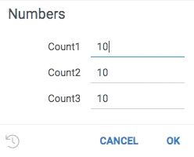
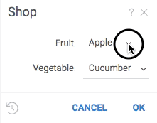
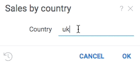

<!-- TITLE: Scripting -->
<!-- SUBTITLE: -->

# Scripting

Scripting is an integration mechanism with languages for statistical/mathematical computing. Scripting combines fast
interactive visualizations and other features of the Datagrok platform with thousands of statistical packages and
visualizations available in
[R](https://www.r-project.org/about.html), [Python](https://www.python.org),
[Octave](https://octave.org/), [Julia](https://julialang.org), or
[JavaScript](https://www.javascript.com).

## Header

Each script should have a header that contains some metadata, along with the information on input and output parameters.
See all available
[header parameters](#header-parameters). Each line starts with a comment.

Let's take a look at a simple R script that returns a square of the input parameter:

```
#name: RSquare
#language: r
#input: double x
#output: double result

result = x * x
```

In order to register a script, open `Functions | Scripts | New R Script`, paste the code above, and click `Save`.
Congratulations, you've just written and published an R script! At that point, it is only visible to you. You can also
make it available to the whole community! To do that, right-click on script's name in the `Scripts` part of the left
panel and select `Share...`, then type in `All Users` and confirm. (You may want to uncheck the `Send notifications`
box).

Use [Console](../overview/navigation.md#console) to execute it. Simply type
`<YOUR_USER_NAME>:RSquare(3)`:

```
 > RSquare(3)
   result: 9
```

The syntax for invoking the scripts is the same, regardless of the language used. In the same way, you can call Grok
Functions. See [Grok Scripting](../overview/grok-script.md) for more details.

### Output values validation

Datagrok functions return zero, one or more typed arguments. Any single run of the function shall
always return as many output values as specified in the header, all having corresponding types. It
is expected that the output values would be assigned throughout the script code, so that they are
defined by the end of the script. If for some reason this doesn't happen, the two things will
follow:

1. The unset output values would still be returned, but valued as `null`-s.

2. A warning `Output value ${output.param.name} was not set` will be print to
[Datagrok Console](../overview/navigation.md#console) (open it with `Ctrl-~`).

In this script the value `c3` is missed to be set:

```
#name: TestMissingInputsR
#language: r
#output: int c1
#output: int c2
#output: int c3
c1 <- 12
c2 <- 15
```

Running the script produces the following output to the console:

```
Output value c3 was not set
  c1: 12
  c2: 15
  c3: null
```

We recommend using the Datagrok Console while validating your scripts.

## Running a script

First of all, a script can be executed right from the script editor (see picture below).

Other ways involve saving the script as a part of a [package](../develop/develop.md#packages). In this case, it gets
registered in the platform as a
[function](../overview/functions/function.md), and can be invoked in different ways:

* From the [console](../overview/navigation.md#console)
* From the [data job](../access/data-job.md)
* From the [transformations editor](../transform/recipe-editor.md)
* From the [function browser](https://public.datagrok.ai/functions)


When a function is invoked with no explicitly specified parameters, a dialog is shown. The UI is automatically generated
by creating editors for each parameter. Depending on the metadata associated with the parameters, the editor can be
enriched by [validators](#validators), [choices](#choices), and [suggestions](#suggestions). Validators, choices, and
suggestions are
[functions](../overview/functions/function.md), that means they can be implemented in different ways (db query, script,
etc), and reused.

Registered scripts can be called via [JavaScript API](../develop/js-api.md) in the following manner:

```javascript
grok.functions.call(`${packageName}:${scriptName}`, { params });
```

To see it in action, open this
[code snippet](https://public.datagrok.ai/js/samples/scripting/scripting) from our samples gallery. There you can find
more examples, such as
[adding a progress indicator](https://public.datagrok.ai/js/samples/functions/progress) to the user interface.

Scripts that have multiple output parameters may require a different approach. The
`grok.functions.call` method returns only the first output value, thus, in order to get all of them, you should work
with a function call:

```javascript
let f = await grok.functions.eval(`${packageName}:${scriptName}`);
let call = f.prepare({ params });
await call.call();
call.getParamValue('paramName');
```

In the first line we evaluate an expression and get the function that corresponds to our script. After passing the input
parameters and executing the script, we can retrieve any output value by the parameter's name.

## Environments

### Conda environments

Each script can be given a specific environment configuration under which it will run, including the language verison
and a set of libraries. [Conda](https://docs.conda.io/en/latest/)
is used as the environment management system. Conda environment is specified as a yaml configuration file or a string.

The benefit of using a Conda environment is that it gives a completely sandboxed, controlled area for running scripts,
and only takes time once to be pre-created and later be re-used by a reference with no delay for resolving dependencies
and installing language versions.

In Datagrok, Conda environment confinugration can be specified either right inside the script, or as part of
a [package](../develop/develop.md#packages). The package can be both the one containing the script or any other deployed
package with specified environment and available under your current user.

#### Specify environment in a package

Environment configuration is stored in the default Conda yaml format and can be
[exported](https://docs.conda.io/projects/conda/en/latest/user-guide/tasks/manage-environments.html#creating-an-environment-from-an-environment-yml-file)
or [created manually](https://docs.conda.io/projects/conda/en/latest/user-guide/tasks/manage-environments.html#create-env-file-manually)
.

Configurations are stored in the same repository with the script, in the folder called
`environments` located under the repository root. Here is an
[example of such configuration](https://github.com/datagrok-ai/public/tree/master/environments)
for the [Datagrok public repository](https://github.com/datagrok-ai/public). Also, a package can define its own
configurations as well (
[see examples](https://github.com/datagrok-ai/public/tree/master/packages/Demo/projects/scripts)).

If the `#environment` tag in the script header is not specified, the script uses the configuration defined in
[`default.yaml`](https://github.com/datagrok-ai/public/blob/master/environments/default.yaml).

This is how to define the "Chemprop" environment in the script header:

```
#environment: Chemprop
```

In this case, the environment `Chemprop` should be specified in a file
`environments/Chemprop.yaml` inside the package where this script belongs.

Datagrok identifies and resolves environments by their names. If an environment referred in a script wasn't previously
used, it will first be created on the
[Compute Virtual Machine](../develop/admin/infrastructure.md#compute-components). This may take up to several
minutes. If it was used at least once, a previously created environment will be re-used with no delay to run the script.

#### Specify environment in-place

Set an `environment` parameter of the script to a one-liner yaml specifying the standard Conda yaml config, but omitting
its name and enclosing braces `{}`. For example, we need to use the following Conda yaml config:

```yaml
name: envtest01
channels:
  - conda-forge
dependencies:
  - python=3.8
  - glom
  - pip:
      - requests
```

To use it in any script, specify it as follows:

```python
#name: EnvTestInline
#environment: channels: [conda-forge], dependencies: [python=3.8, glom, {pip: [requests]}]
#language: python
#output: string result

import re, requests
from glom import glom
import pandas as pd

target = {'a': {'b': {'c': 'd'}}}
result = glom(target, 'a.b.c')  # returns 'd'
```

When the script runs first time, the environment will be created on
the [Compute Virtual Machine](../develop/admin/infrastructure.md#compute-components), which may take some
time, up to several minutes. However, on the second run and onwards this environment will simply be reused. If the
environment string is changed in this script to some other environment which was previously created in same way even in
some other script, this environment will also be picked up and reused. These environments are handeled by Datagrok using
MD5 hashes of their body strings.

#### Reference an environment from another package

An environment `SomeEnv` specified in a package `SomePackage` is available from all scripts in the platform for
referencing as `SomePackage:SomeEnv`. If the package `SomePackage` is available to the current user, the reference will
work. Such environment reference is abailable in both package scripts and ad-hoc scripts created in the platform UI.

#### Global environments

Environment referencing is a handy way to organize global (organization-wide) environments. This will let an
administrator version such common environments through a dedicated package, and exactly one physical environment will be
re-used by many users, which is more space and time efficient.

Do the following steps:

1. Agree that one package, say, `GlobalEnvs` will now contain global environments
2. Choose a common prefix to name these global environments with, say, `Global`
3. Name all global environments in this package with the chosen prefix: `Global<ENVIRONMENT_NAME>`
4. Publish `GlobalEnvs` platform as `--release` to the platform and share it to `All Users`, or to the group of users
   you want to have access to these environments
5. Let other users know these environments are now available as
   `GlobalEnvs:Global<ENVIRONMENT_NAME>`

In the future, a script editor will be provided in Datagrok. For the property `#environment:` of the script, it will
enumerate in a dropdown list all available environments for the current user and the current script.

#### Common practices with Conda environments

It is a [known](https://github.com/conda/conda/issues/8051#issuecomment-464199791)
[issue](https://github.com/conda/conda/issues/8051#issuecomment-631862928)
[of Conda](https://github.com/conda/conda/issues/8051#issuecomment-808789923) that it tends to sometimes take a large
time to resolve (set up) an environment. Datagrok will interrupt Conda environment creation if it takes more than 5
minutes.

While we haven't found a workaround to this feature of Conda, we can recommend a way forward if you encounter a timing
problem with your Conda environment. It is often possible to find an equivalent set of packages from `pip` repositories.
Using `pip` via Conda environments doesn't have timing issues, and we advise to use the `pip` section of Conda yaml spec
to set up your libraries of interest.

### Renv environments

[_Renv_](https://rstudio.github.io/renv/articles/renv.html) environments are natively supported. Datagrok runs each R
script in a temporary folder with a unique name. This folder becomes an
_renv_ project folder for the current run of the script.

Start using _renv_ by initializing it and installing packages (see a
[full example](https://github.com/datagrok-ai/public/blob/master/packages/Demo/projects/scripts/projects/r/scripts/renv_spelling.R)):

```
#language: r
...
renv::init()
renv::install("hunspell@3.0.1")
...
```

An _renv_ session only impacts the R environment for this one single run, and no other R scripts running in parallel by
the users of the platform are aware of this local script environment.
_Renv_ uses a global package cache. It caches a package requested once with `renv::install` and re-uses whenever it is
requested onward. However, in case the latest package version is requested, such as in `renv::install("hunspell")`, _
renv_ connects to remote R package repositories assuring if the cached package needs to be updated to the newer version.
This may introduce a significant delay into the script, several seconds in practice. To avoid this, we recommend
installing a specific version of the package, such as in `renv::install("hunspell@3.0.1")`.

_Note_. At the R script's start and finish, Datagrok calls `renv::deactivate()` to assure the script's body isolation.
Therefore, the script's author doesn't need to call
`renv::deactivate()` manually.

We are planning to support [_renv_ lockfiles](https://rstudio.github.io/renv/articles/lockfile.html)
shipped with packages similarly to how it works now for Conda `yaml` files.

## Parameters

### Parameter validators

Validators check whether the value falls in the expected range, and provide visual cue if it does not. To add a
validator to a parameter, provide a comma-separated list of functions that will be invoked each time a value is changed.
A null indicates that the value is valid, anything else indicates an error which gets shown to the user.

A validator is a function that accepts one parameter of any type and returns a string. Choice providers are applicable
only to string parameters.

The following example adds a "containsLettersOnly" function to the "col" parameter:

```
#input: string s {validators: ["containslettersonly"]}
#input: column col {validators: ["containsmissingvalues"]}
```

```js
grok.functions.register({
    signature: 'List<String> jsVal1(int input)',
    run: (input) => input < 11 ? null : "Error val1" });

grok.functions.register({
    signature: 'List<String> jsVal2(int input)',
    run: (input) => input > 9 ? null : "Error val2" });
```

```python
# name: Numbers
# language: python
# input: int count1 {validators: ["jsval1", "jsval2"]} [Number of cells in table]
# input: int count2 {validators: ["jsval1"]} [Number of cells in table]
# input: int count3 {validators: ["jsval2"]} [Number of cells in table]
```



### Parameter choices

Use choices to provide the editor a list of values to choose from. When choices are provided, the editor becomes a combo
box. Choices can be either a fixed list, or a function that returns a list.

A choice provider is a function with no parameters that returns a list of strings.

The following example demonstrates two ways of defining choices:

```
#input: string fruit {choices: ["apple", "banana"]}
#input: string vegetable {choices: jsveggies}
```

Here is a possible implementation of the "jsTypes" function used in the example:

```javascript
grok.functions.register({
    signature: 'List<String> jsVeggies()',
    run: () => ["Cucumber", "Cauliflower"]});
```



### Parameter suggestions

Use parameter suggestions to help users enter a correct value. For instance, when entering a product name, it might make
sense to dynamically query a database for values starting with the already entered text, and suggest to auto-complete
the value.

Suggestions are functions that take one string argument, and return a list of strings to be suggested to user.
Suggestions work only for string parameters.

The following example helps user enter a country name by dynamically retrieving a list of names from a web service:

```python
# name: Sales by country
# language: python
# input: string country = uk {suggestions: jsSuggestCountryName}
```

```js
grok.functions.register({
  signature: 'List<String> jsSuggestCountryName(String text)',
  isAsync: true,
  run: async function(text) {
    let response = await fetch('https://restcountries.eu/rest/v2/name/' + text);
    return response.status === 200 ? (await response.json()).map(country => country['name']) : [];
  }
});
```



### Parameter editors

Use parameter editor to set the output of another function to the parameter value. All function parameters will be
seamlessly integrated to the function call form.

```
//input: dataframe table {editor: Package:DataQuery}
//input: dataframe table {editor: Package:DataQuery(1, "France")}
```

Here, Datagrok will execute the `Package:DataQuery` function right before your script and pass the output table to the
script as an input parameter.

```
//input: dataframe table {editor: PowerPack:DataQuery; editor-button: Outliers...}
```

Specify the `editor-button` parameter to add a button that executes your subfunction separately and allows the user to
check the output before starting the script.

## Header parameters

| Parameter   | Description                                                                         |
|-------------|-------------------------------------------------------------------------------------|
| name        | Name                                                                                |
| description | Description                                                                         |
| language    | Script language (see the [list of supported languages](#supported-languages) below) |
| help-url    | Datagrok's Wiki URL                                                                 |
| reference   | Reference to a research paper, Wikipedia article, Git repository, etc.              |
| top-menu    | Top menu path separated with pipes (`\|`)                                           |
| tags        | Tags                                                                                |
| sample      | Name of a sample file                                                               |
| input       | Input parameter                                                                     |
| output      | Output parameter                                                                    |
| environment | Environment name                                                                    |
| condition   | Script applicability conditions                                                     |

Also it is possible to add custom parameter using "meta." prefix.

### Supported Languages

| Language parameter value | Description    |
|--------------------------|----------------|
| r                        | R              |
| python                   | Python         |
| octave                   | Octave         |
| julia                    | Julia          |
| grok                     | Grok Scripting |
| JavaScript               | JavaScript     |

### Format template for 'input' and 'output'

```
#<direction>: <type> <name> = <value> {<option tag>:<value>; ...} [<description>]
```

**direction** - parameter direction:

* input
* output

**type** - parameter type:

* **dataframe** \- data frame
* **int** \- integer scalar
* **double** \- float scalar
* **bool** \- boolean scalar
* **graphics** \- graphics
* **string** \- string
* **column** \- column from selected table
* **column_list** \- list of columns from selected table
* **datetime** \- datetime
* **file** \- file, variable in script contains path to file
* **blob** \- blob, variable in script contains path to binary file

**name** - parameter name that will be used in script. Optional for graphical output.

**value** - used for scalar inputs as value and graphics outputs as index of graphical element. Optional.

**option tag** - list of default UI options for parameter. Optional.

**description** - parameter brief description, text. Optional.

### Options

#### Common

| Option      | Value                     | Description              |
|-------------|---------------------------|--------------------------|
| validators  | List separated with comma | List of named validators |
| caption     | Text string               | Custom field caption     |
| postfix     | Text string               | Field postfix            |
| units       | Same as postfix           |                          |

Named validators:

* containsMissingValues
* columnName - checks if table contains current column name
* columnIsNumerical
* columnIsCategorical

Validator also can be any function that that returns "null" if validation is right, or string with error message
otherwise.

#### For "dataframe" type

| Option      | Value       | Description                             |
|-------------|-------------|-----------------------------------------|
| columns     | numerical   | Only numerical columns will be loaded   |
| categorical | categorical | Only categorical columns will be loaded |

#### For "column" and "column_list" types

| Option     | Value                           | Description                                                                 |
|------------|---------------------------------|-----------------------------------------------------------------------------|
| type       | numerical                       | In dialog will be showed only numerical types columns                       |
| type       | categorical                     | In dialog will be showed only categorical types columns                     |
| type       | dateTime                        | In dialog will be showed only dateTime columns                              |
| format     | MM/dd/yyyy                      | Datetime format, for dateTime columns and datetime type only                |
| allowNulls | true/false                      | Adds validation of missing values presents                                  |
| action     | join("table parameter name")    | Joins result to specified table, for output parameters only                 |
| action     | replace("table parameter name") | Replaces result with columns in specified table, for output parameters only |

#### For "string" type

| Option      | Value                                                                                      | Description                              |
|-------------|--------------------------------------------------------------------------------------------|------------------------------------------|
| choices     | List separated with comma, or function name that returns list of strings                   | List of choices for string parameter     |
| suggestions | Function name that returns list of strings with string input corresponding to script input | List of suggestions for string parameter |

Header line examples:

```
#input: string choices = int {choices: ["string", "int", "bool"]}
#input: string choices = int {choices: jstypes}

#input: string option = int {suggestions: jssuggesttype}
```

### Examples

```
#input: dataframe t1 {columns:numerical} [first input data table]
#input: dataframe t2 {columns:numerical} [second input data table]
#input: column x {type:numerical; table:t1} [x axis column name]
#input: column y {type:numerical} [y axis column name]
#input: column date {type:datetime; format:mm/dd/yyyy} [date column name]
#input: column_list numdata {type:numerical; table:t1} [numerical columns names]
#input: int numcomp = 2 {range:2-7} [number of components]
#input: bool center = true [number of components]
#input: string type = high {choices: ["high", "low"]} [type of filter]
#output: dataframe result {action:join(t1)} [pca components]
#output: graphics scatter [scatter plot]
```

## Filtering

You can use these fields to filter scripts with [smart search](../overview/smart-search.md):

| Field       | Description                                                       |
|-------------|-------------------------------------------------------------------|
| ID          |                                                                   |
| name        |                                                                   |
| runs        | list of [FuncCall](../overview/functions/function-call.md) object |
| createdOn   |                                                                   |
| updatedOn   |                                                                   |
| author      | [User](../govern/user.md) object                                  |
| starredBy   | [User](../govern/user.md) object                                  |
| commentedBy | [User](../govern/user.md) object                                  |
| usedBy      | [User](../govern/user.md) object                                  |

## Videos

[Dev Meeting 1: Getting Started — Cross Language Support](https://www.youtube.com/watch?v=p7_qOU_IzLM&t=954s)

See also:

* [Grok scripting](../overview/grok-script.md)
* [R](https://www.r-project.org/about.html)
* [Python](https://www.python.org)
* [Octave](https://octave.org/)
* [Julia](https://julialang.org)
* [JavaScript](https://www.javascript.com)
* [Packages](../develop/develop.md#packages)
* [JavaScript API](../develop/js-api.md)
* [Functions](../overview/functions/function.md)
* [Function call](../overview/functions/function-call.md)
