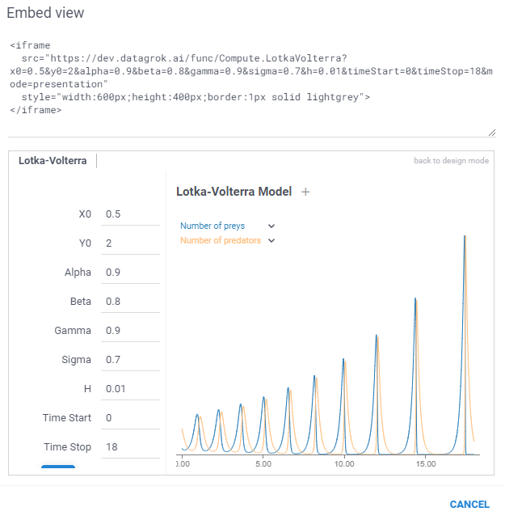

```mdx-code-block
import Tabs from '@theme/Tabs';
import TabItem from '@theme/TabItem';
import BrowserWindow from '@site/src/components/browser-window';
```

Sometimes, an app has to be included in the external web page.
The simplest way to achieve it is via the [iframe](https://www.w3schools.com/tags/tag_iframe.ASP) element.
To embed a model, click on the hamburger icon in the top left corner and choose `Embed...`.
You will see a dialog with the HTML code on top that you can use to embed this into an external site.
Note that you can change parameter values right in the URL.

<details>
<summary> Embedded iframe preview </summary>
<div>



</div>
</details>