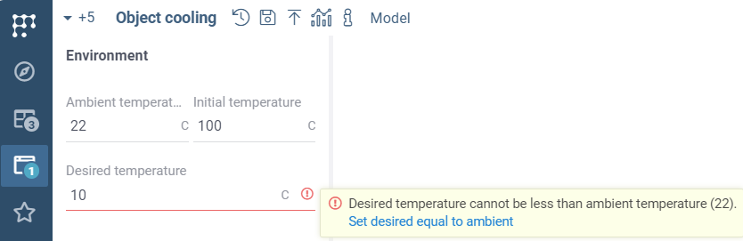

```mdx-code-block
import Tabs from '@theme/Tabs';
import TabItem from '@theme/TabItem';
import BrowserWindow from '@site/src/components/browser-window';
```

## Add complex validations

You can use validator functions to validate inputs, similar to the
[platform validators](/help/datagrok/concepts/functions/func-params-annotation#validation). 
Validation functions have full access to the
UI and to the context of the script. For example, you can create a function to validate min-max values,
assuring that the minimum value is less than the maximum value.

In addition, *RichFunctionView* supports output values validation.

:::caution

Validation functions should be written in JavaScript to avoid client-server communication delays.

:::

Validation functions have a single input and a single output.

- `params` object may have arbitrary data for the validator to behave differently in certain situations.
- `validatorFunc` object is a JS function (e.g. arrow function) that actually will be called each time the input is changed.

Here is an example used in the default [Object cooling](https://public.datagrok.ai/scripts?q=object+cooling) script.  

```mdx-code-block
<Tabs>
<TabItem value="result" label="Result">
```



```mdx-code-block
</TabItem>
<TabItem value="validator" label="Validator function">
```

```javascript title="package.ts"
//name: DesiredTempValidator
//input: object params
//output: object validator
export function DesiredTempValidator(params: any) {
  return (val: number, info: ValidationInfo) => {
    const ambTemp = info.funcCall.inputs['ambTemp'];
    const initTemp = info.funcCall.inputs['initTemp'];
    return makeValidationResult({
      errors: [
        ...(val < ambTemp) ? [makeAdvice(`Desired temperature cannot be less than ambient temperature (${ambTemp}). \n`, [
          {actionName: 'Set desired equal to ambient', action: () => info.funcCall.inputs['desiredTemp'] = ambTemp }
        ])]: [],
        ...(val > initTemp) ? [`Desired temperature cannot be higher than initial temperature (${initTemp})`]: [],
      ]
    });
  };
}
```

```mdx-code-block
</TabItem>
<TabItem value="usage" label="Assigning validator to a param">
```

```javascript title="Your script header"
//input: double desiredTemp = 30 {caption: Desired temperature; units: C; category: Environment; validatorFunc: Compute:DesiredTempValidator; }
```

```mdx-code-block
</TabItem>
</Tabs>
```

This function accesses other inputs' values via the `info` object.
It compares the validated input using contextual information.
If validation fails, it returns an error and possible action to make validation pass
(structure with `actionName` and `action` fields). You may make your validation interactive
and educational using such errors, warnings, and proposed actions.

:::tip

We suggest you using functions from
[packages](../../../develop/develop.md#packages)
instead of scripts for easier code management.

:::

## Use custom inputs

**RichFunctionView** supports custom inputs. You can create your own input and use it via the special `input` tag.
Much like a validator function, custom input also should be returned by Datagrok function.

:::caution

Custom input functions should be written in JavaScript.

:::

Here is an example of a custom input for string values. It behaves exactly the same as the default string input
but has `aqua` background color.

```mdx-code-block
<Tabs>
<TabItem value="result" label="Result">
```


```mdx-code-block
</TabItem>
<TabItem value="validator" label="Custom input">
```

```javascript title="package.ts"
//name: CustomStringInput
//input: object params
//output: object input
export function CustomStringInput(params: any) {
  const defaultInput = ui.input.string('Custom input', {value: ''});
  defaultInput.root.style.backgroundColor = 'aqua';
  defaultInput.input.style.backgroundColor = 'aqua';
  return defaultInput;
}
```

```mdx-code-block
</TabItem>
<TabItem value="usage" label="Using a custom input">
```

```javascript title="Your script header"
//input: string test {input: Compute:CustomStringInput }
```

```mdx-code-block
</TabItem>
</Tabs>
```

## Customize history run comparison

You may provide a Datagrok function to customize the comparison of the historical runs.
For example, you may add particular viewers to your comparison or make additional comparative analysis.

```mdx-code-block
<Tabs>
<TabItem value="result" label="Custom comparison">
```


```mdx-code-block
</TabItem>
<TabItem value="enable custom" label="Enabling custom data upload">
```

```javascript title="Your script header"
//meta.compareCustomizer: Compute:CustomCustomizer
```

```mdx-code-block
</TabItem>
<TabItem value="custom comparator" label="Custom data uploader">
```

```javascript title="package.ts"
//name: CustomCustomizer
//input: object params
export function CustomCustomizer(params: {defaultView: DG.TableView}) {
  const comparisonView = params.defaultView;
  comparisonView.scatterPlot({
    "xColumnName": "Initial temperature",
    "yColumnName": "Time to cool",
  });
}
```

```mdx-code-block
</TabItem>
</Tabs>
```

:::info Customization API

Customizer function should have `//input: object params` in the header.
This object will contain `defaultView` reference to the default-contructed DG.TableView.
Customizations may be applied directly using this reference.

:::

## Customize experimental data upload

You may customize the data upload using Datagrok functions and `meta.uploadFunc` tag.
The function mentioned in this tag will be called on clicking <i class="fas fa-upload"></i> button 
instead of the basic data upload.
You may use it to extract the experimental data from the external resource (e.g., a database).
Extracted data could be saved to the history or could be used directly to compare the computed and experimental results.

```mdx-code-block
<Tabs>
<TabItem value="enable custom" label="Enabling custom data upload">
```

```javascript title="Your script header"
//meta.uploadFunc: Compute:CustomUploader
```

```mdx-code-block
</TabItem>
<TabItem value="widget function" label="Widget generator">
```

```javascript title="package.ts"
//name: CustomUploader
//input: object params
//output: widget uploadWidget
//output: funccall uploadFuncCall
export async function CustomUploader(params: {func: DG.Func}) {
  const uploadFunc = await grok.functions.eval('Compute:DataExtractor') as DG.Func;
  const uploadFuncCall = uploadFunc.prepare({func: params.func})
  const uploadBtn = ui.bigButton('Click me to get mock calls', () => uploadFuncCall.call());

  const dummyWidget = DG.Widget.fromRoot(ui.panel([ui.divV([
    ui.label('This part of dialog comes from my custom data uploader'),
    ui.divH([uploadBtn], {style: {'justify-content': 'center'}})
  ])]));  

  const setLoadingSub = grok.functions.onBeforeRunAction.pipe(
    filter((call) => call.id === uploadFuncCall.id)
  ).subscribe(() => {
    ui.setUpdateIndicator(uploadBtn, true);
  })

  const unsetLoadingSub = grok.functions.onAfterRunAction.pipe(
    filter((call) => call.id === uploadFuncCall.id)
  ).subscribe(() => {
    ui.setUpdateIndicator(uploadBtn, false);
  })

  dummyWidget.subs.push(setLoadingSub, unsetLoadingSub)

  return {uploadWidget: dummyWidget, uploadFuncCall};
}
```

```mdx-code-block
</TabItem>
<TabItem value="Data extraction function" label="Data extractor">
```

```javascript title="package.ts"
//name: DataExtractor
//input: func func
//output: object uploadedCalls
export async function DataExtractor(func: DG.Func) {
  await new Promise((r) => setTimeout(r, 1000));

  const dummyFunccall = await func.prepare({
    'ambTemp': 22,
    'initTemp': 100,
    'desiredTemp': 30,
    'area': 0.06,
    'heatCap': 4200,
    'heatTransferCoeff': 8.3,
    'simTime': 21600,
    }).call();
    
  return [dummyFunccall]
}
```

```mdx-code-block
</TabItem>
</Tabs>
```

:::info

The custom upload funcion should return `uploadWidget` (of type DG.Widget) and `uploadFuncCall` (of type DG.FuncCall).
`uploadWidget` will be shown on the UI; `uploadFuncCall`, in turn, should return the experimental runs typed as array of DG.FuncCalls.

:::
