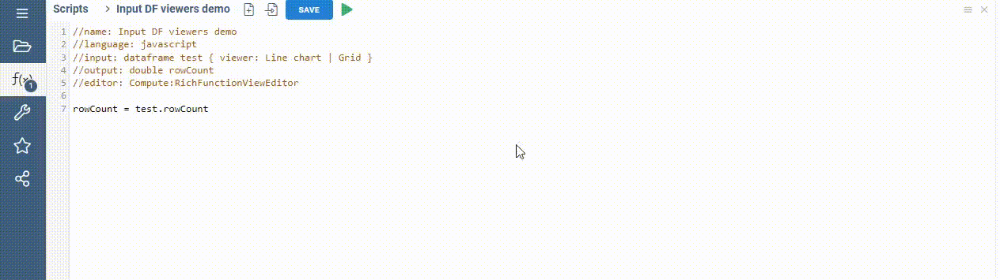
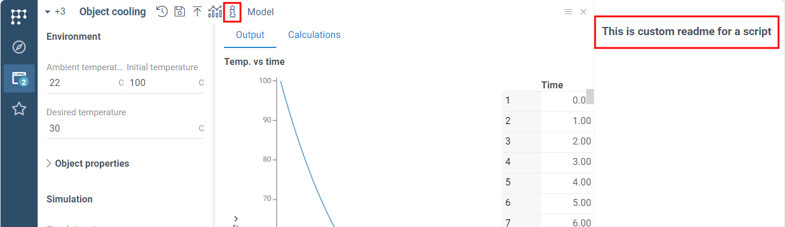
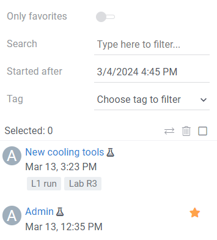
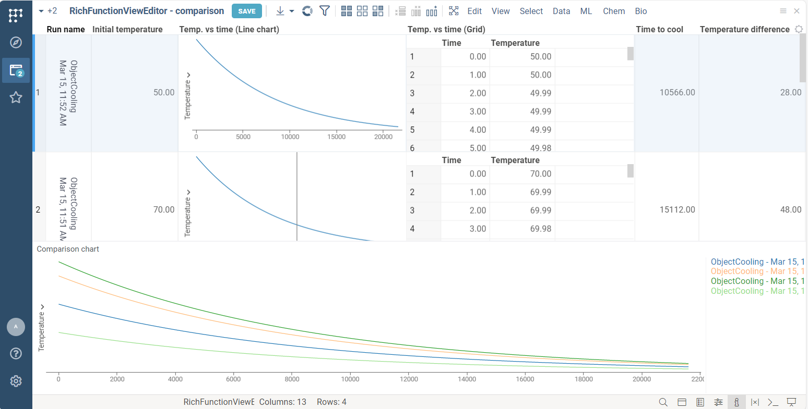
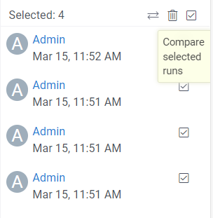

```mdx-code-block
import Tabs from '@theme/Tabs';
import TabItem from '@theme/TabItem';
import BrowserWindow from '@site/src/components/browser-window';
```

**RichFunctionView** is an advanced UI editor to create a complex full-featured interface for your script.

It has all the features of the [basic scripting](../scripting-features/scripting-features.md). In addition, it allows you to:
* [Enhance inputs and outputs](#enhance-inputs-and-outputs)
* [Review historical script runs](#review-and-compare-historical-script-runs)
* [Provide custom docs and export](#provide-custom-docs-and-export-data)
* Use [model parameters optimization](#model-parameters-optimization) capabilities with your script
  without a single line of the code.
* Integrate into [workflows](../../workflows)

:::caution Package dependency

The `RichFunctionViewEditor` is a part of the `Compute2` package.
Ensure that the `Compute2` package is installed before working with `RichFunctionViewEditor`

:::


## Enabling RichFunctionView UI editor

To enable **RichFunctionView**, add `editor: Compute2:RichFunctionViewEditor` tag
to your following code as it is shown:

```mdx-code-block
<Tabs>
<TabItem value="result" label="Result" default>
```


```mdx-code-block
</TabItem>
<TabItem value="python" label="Python / R / Octave / Julia">
```

```python title="Your script header"
#editor: Compute2:RichFunctionViewEditor
```

```mdx-code-block
</TabItem>
<TabItem value="js" label="Javascript / NodeJS">
```

```javascript title="Your script header"
//editor: Compute2:RichFunctionViewEditor
```

```mdx-code-block
</TabItem>
</Tabs>
```

:::tip Ensure computations are correct

Features of the RichFunctionView affect GUI only and do not affect computations.
Use the RichFunctionView only when you are sure that the script works as expected.

:::

## Enhance inputs and outputs

### Visualize input data

You can add viewers for input dataframes to review input data before starting computations,
same way as for
[output viewers](../scripting-features/scripting-features.md).

```mdx-code-block
<Tabs>
<TabItem value="result" label="Result">
```



```mdx-code-block
</TabItem>
<TabItem value="short" label="Short sample">
```

```javascript title="Your script header"
//input: dataframe test { viewer: Line chart | Grid }
```

```mdx-code-block
</TabItem>
<TabItem value="full" label="Full sample">
```

```javascript title="https://public.datagrok.ai/scripts"
//name: Viewer properties demo
//language: javascript
//sample: demog.csv
//input: dataframe test { viewer: Line chart | Grid }
//output: dataframe test2
//editor: Compute2:RichFunctionViewEditor
test2 = test.clone();
```

```mdx-code-block
</TabItem>
</Tabs>
```

You can specify input viewer's properties to control their appearance.
Viewer's properties are listed in the braces right after the viewer's name.
A full list of the viewer's properties may be found by right-clicking on it and selecting the `Properties...` menu item.

RichFunctionView supports the `block` option to control the viewer's width.
By default, any viewer occupies all available space.

```mdx-code-block
<Tabs>
<TabItem value="result" label="Result">
```


```mdx-code-block
</TabItem>
<TabItem value="short" label="Short sample">
```

```javascript title="Your script header"
//input: dataframe demog { viewer: Line chart(block: 75) | Filters(block: 25) }
```

```mdx-code-block
</TabItem>
<TabItem value="full" label="Full sample">
```

```javascript title="https://public.datagrok.ai/scripts"
//name: Viewer block option demo
//language: javascript
//input: dataframe demog { viewer: Line chart | Filters }
//output: dataframe test2
//editor: Compute2:RichFunctionViewEditor
test2 = demog.clone();
```

```mdx-code-block
</TabItem>
</Tabs>
```
### Group scalar outputs

You can use the `category` keyword to group scalar output parameters.
In the case of output parameters, the `category` tag specifies
the output tab used to show the output parameter values.
The following code generates UI with three output tabs:

```mdx-code-block
<Tabs>
<TabItem value="result" label="Result">
```


:::tip

The view includes 4 tabs in total since there is a separate tab for input dataframe viewers.

:::

```mdx-code-block
</TabItem>
<TabItem value="short" label="Short sample">
```

```javascript title="Your script header"
//output: dataframe tempOnTime4 { viewer: Line chart }
//output: dataframe tempOnTime5 { viewer: Line chart }
//output: double IC3 { category: Tab #3}
//output: double IC4 { category: Tab #3}
```

```mdx-code-block
</TabItem>
<TabItem value="full" label="Full sample">
```

```javascript title="https://public.datagrok.ai/scripts"
//name: Grouping outputs
//language: javascript
//input: dataframe test { viewer: Line chart }
//input: double S1 = 50 { caption: S1 }
//output: dataframe tempOnTime4 { viewer: Line chart }
//output: double IC1 { category: Experimental data }
//output: dataframe tempOnTime5 { viewer: Line chart }
//output: double IC2 { category: Simulation data }
//output: double IC3 { category: Tab #3 }
//output: double IC4 { category: Tab #3 }
//editor: Compute2:RichFunctionViewEditor

tempOnTime4 = test;
tempOnTime5 = test;

IC1 = 10;
IC2 = 20;
IC3 = test.rowCount * 2;
IC4 = test.rowCount;
```

```mdx-code-block
</TabItem>
</Tabs>
```


### Automatic script rerun

You can run scripts automatically on UI opening and/or on any input change.
This feature is useful for fast prototyping. We recommend using it only
on fast `Javascript` scripts only to avoid repeatable runs of computational-heavy code.

The automatic function calls are not saved,
so to save results to the [run history](#review-and-compare-historical-script-runs)
you should press **the Save** button manually.

```mdx-code-block
<Tabs>
<TabItem value="result" label="Result">
```


```mdx-code-block
</TabItem>
<TabItem value="short" label="Short sample">
```

```javascript title="Your script header"
//meta.runOnInput: true
```

```mdx-code-block
</TabItem>
<TabItem value="full" label="Full sample">
```

```javascript title="https://public.datagrok.ai/scripts"
//name: Data stats
//language: javascript
//tags: demo
//input: dataframe inputDf {caption: Input dataframe; viewer: Grid(); category: Input data}
//output: dataframe outputDf {caption: Output dataframe; viewer: Line chart | Scatter plot | Statistics; category: Stats}
//editor: Compute2:RichFunctionViewEditor
//meta.runOnInput: true

outputDf = inputDf.clone();
```

```mdx-code-block
</TabItem>
</Tabs>
```

## Provide custom docs and export data

### Add the readme

You can add a customized readme file to your script.
The linked Markdown file will be available by clicking <i class="fal fa-info"></i> icon on the ribbon panel.
The readme file will appear inside the panel on the right side.

```mdx-code-block
<Tabs>
<TabItem value="result" label="Result">
```




```mdx-code-block
</TabItem>
<TabItem value="short" label="Short sample">
```

Following code will search for the help file in your Datagrok's Home folder.

```javascript title="Your script header (w/ personal file)"
//meta.help: readme.md
```

The following code will search for the help file in the particular package (e.g., `Compute`).
See the details about packages in the
[convert script to a package function](convert-script-to-package-function.mdx) section

```javascript title="Your script header (w/ package file)"
//meta.help: Compute/readme.md
```

```mdx-code-block
</TabItem>
<TabItem value="full" label="Full sample">
```

```javascript title="https://public.datagrok.ai/scripts"
//name: Data stats
//language: javascript
//tags: demo
//input: dataframe inputDf {caption: Input dataframe; viewer: Grid(); category: Input data}
//output: dataframe outputDf {caption: Output dataframe; viewer: Line chart(block: 50) | Scatter plot(block: 50) | Statistics(block: 100); category: Stats}
//editor: Compute2:RichFunctionViewEditor
//meta.runOnInput: true

outputDf = inputDf.clone();
```

```mdx-code-block
</TabItem>
</Tabs>
```

### Export results

You can use the one-click export feature to save the entire script run to a local file.
To generate the export file,
Select <i class="fas fa-arrow-to-bottom"></i> **Export** icon on the top panel.
Automatic export saves all input and output values with their captions,
units, and even viewers' screenshots.

This feature is available for all scripts using the RichFunctionView.
To disable it, add the `meta.features` tag to the script header.

```mdx-code-block
<Tabs>
<TabItem value="result" label="Result">
```


```mdx-code-block
</TabItem>
<TabItem value="javascript" label="Disable export">
```

```javascript title="Your script header"
//meta.features: {"export": false}
```

```mdx-code-block
</TabItem>
</Tabs>
```

### Customize export

You can customize export using the following annotation:

```javascript
//meta.customExports: [{"name": "pdf", "function": "MyPackage:MyPDFExport"}]
```

The export function will recieve the following arguments:

* `funcCall`: DG.FuncCall, current call.
* `startDownload`: bool, true if the function should start a file download or just return results.
* `isOutputOutdated`: bool, true if the function output is outdated.
* `validationState`: `Record<string, ValidationResult>`, avialiable only if run inside a [workflows](../../workflows/workflows.mdx).
* `consistencyState`: `Record<string, ConsistencyInfo>`, avialiable only if run inside a [workflows](../../workflows/workflows.mdx).


## Review and compare historical script runs

### Save and access run history

When enabled (by default), the server saves each script run.
The saved script run includes both the input and output values of the run.
To review the history of runs, click on the <i class="fas fa-history"></i>
**History** button on the top panel.

The history panel appears on the right side. To load the run into the UI, click on the corresponding card.
The historical runs are immutable. Thus, if you load a historical run,
change input values, and then rerun it,
the platform will create a new historical run.




To disable history, add the following line to your code:

```javascript title="Your script header"
//meta.features: {"history": false}
```

### Compare historical runs

You may compare historical runs using history panel. Select the historical runs of the interest
and click <i class="fas fa-exchange"></i> icon to open the comparison view.

Datagrok provides defauls set of viewers to compare all kinds of the output data.

:::tip

Click on the column header with table data (e.g. `Temp. vs time`) to see convenient comparison chart.

:::


```mdx-code-block
<Tabs>
<TabItem value="result" label="Comparison">
```



```mdx-code-block
</TabItem>
<TabItem value="short" label="How to compare">
```



```mdx-code-block
</TabItem>
</Tabs>
```

## Model parameters optimization

With **RichFunctionView** you can use the powerful built-in optimization functions.

### Sensitivity analysis

[Sensitivity analysis](../../function-analysis.md#sensitivity-analysis)  automatically runs the computation multiple times with varying inputs,
and analyzes the relationship between inputs and outputs.

Enable this feature and click **<i class="fas fa-analytics"></i> SA** icon on the top panel.

```mdx-code-block
<Tabs>
<TabItem value="result" label="Result">
```


```mdx-code-block
</TabItem>
<TabItem value="short" label="Short sample">
```

```javascript title="Your script header"
//meta.features: {"sens-analysis": true}
```

```mdx-code-block
</TabItem>
<TabItem value="full" label="Full sample">
```

```javascript title="https://public.datagrok.ai/scripts"
//name: Object cooling
//description: Uses Newton's law of cooling to simulate object cooling process. Default values are for cube of boiling water in air.
//language: javascript
//tags: simulation, demo
//input: double ambTemp = 22 {caption: Ambient temperature; units: C; category: Environment }
//input: double initTemp = 100 {caption: Initial temperature; units: C; category: Environment }
//input: double desiredTemp = 30 {caption: Desired temperature; units: C; category: Environment }
//input: double area = 0.06 {caption: Surface area; units: m²; category: Object properties}
//input: double heatCap = 4200 {caption: Heat capacity; units: J/C; category: Object properties }
//input: double heatTransferCoeff = 8.3 {caption: Heat transfer coefficient; units: W/(m² * C); category: Object properties}
//input: int simTime = 21600 {caption: Simulation time; units: sec; category: Simulation }
//output: dataframe simulation {caption: Temp. vs time; category: Output; viewer: Line chart | Grid}
//output: double timeToCool {caption: Time to cool; units: sec.; category: Output}
//output: double coolingFactor {caption: Cooling factor; units: 1 / sec.; category: Calculations}
//output: double tempDiff {caption: Temperature difference; units: C; category: Calculations}
//editor: Compute2:RichFunctionViewEditor
//meta.features: {"sens-analysis": true}

timeToCool = undefined;

const tempDiff = initTemp - ambTemp;
const coolingFactor = heatTransferCoeff * area / heatCap;

const timeStamps = new Float32Array(simTime).map((_, idx) => idx);
const simulatedTemp = timeStamps.map((timeStamp) => {
  const currentTemp = ambTemp + (tempDiff * (Math.E ** -(coolingFactor * timeStamp)));

  if (!timeToCool && currentTemp < desiredTemp) {
    timeToCool = timeStamp;
  }

  return currentTemp;
});

simulation = DG.DataFrame.fromColumns([
  DG.Column.fromFloat32Array('Time', timeStamps),
  DG.Column.fromFloat32Array('Temperature', simulatedTemp),
]);
```

```mdx-code-block
</TabItem>
</Tabs>
```


### Parameters fitting

The parameters fitting solves an inverse problem to the
[sensitivity analysis](../../function-analysis.md#sensitivity-analysis):
finding the input conditions that lead to a specified output of the model.
It computes inputs minimizing deviation measured by loss function.

:::warning High-intensity computation

Both **Sensitivity** analysis and **Parameter optimization**
trigger many simultaneous runs of the model.
We recommend using these features
on fast `Javascript` and `WebAssembly` scripts to avoid repeatable
running of heavy server-side code.
