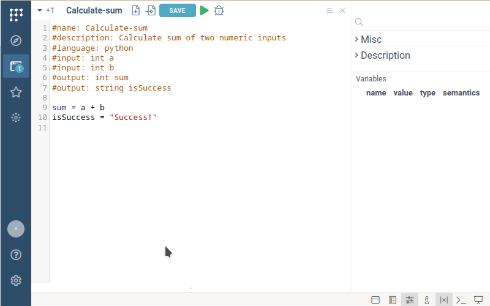

```mdx-code-block
import Tabs from '@theme/Tabs';
import TabItem from '@theme/TabItem';
```

This section explains the basic concepts of scripting in Datagrok.
Code examples are provided in **Python** and **JavaScript**,
but the concepts apply to all supported languages.

:::tip Consider JavaScript

In Datagrok, JavaScript offers unique benefits compared to traditional
data science languages like Python or R. JavaScript script executes right in your browser, leading to:

* shorter spin-up time,
* keeping server resources,
* and better debugging experience.

:::

## Prerequisites

* Sign up and log in to [public server of Datagrok](https://public.datagrok.ai/).
* Alternatively, set up a [local Datagrok environment](../../deploy/docker-compose/docker-compose.md).

## Create a script

* Open Datagrok (e.g. [public homepage](https://public.datagrok.ai/))
* Select `Browse` icon on the left toolbar.
* Select Datagrok's [Scripts section](https://public.datagrok.ai/scripts).
* Click on the **New** button. Supported languages list appears
* Click on **Javascript** item.
  We're starting with Javascript since it is the simplest script we can make. 
  In next sessions we will see how Datagrok works with Python code.  


The code editor appears with the following code inside.

```javascript title="Default javascript script"
//name: Template
//description: Hello world script
//language: javascript

alert('Hello World!');
```

## Review the script header

Each Datagrok script has a **header** \-
a special multi-line comment annotation used by Datagrok to: 
- determine script name,
- specify the scripting language,
- pass to the script input parameters,
- capture script output,
- provide script metadata.

By adding this annotation, you turn your script into a Datagrok function 
that seamlessly integrates with other functions and Datagrok UI components (that are also functions), 
regardless of the language they use.

To learn more about Datagrok functions, visit the 
[Function annotations](../../datagrok/concepts/functions/func-params-annotation) page. 

The template script has the following ones:

* `name: Template`: The short name of the script.
* `description: Hello world script`: The human-readable description.
* `language: javascript`: The script language. Supported: *Python*, *R*, *Octave*, *Julia*, *JavaScript*.


## Run the script

Let's run the script and see how it works.
The built-in editor has the **Run** <i class="fas fa-play"></i> button on the top panel.
Press it to run a script. You will see the following:


## Add inputs

Template script only shows the alert message. Let's edit the script to calculate the sum of the numeric inputs.
We will implement this script in Python to demonstrate Datagrok capabilities 
in working with different programming languages.

Create a new Python script, delete the default code (we will explore it later) 
and insert the following lines to the [header](#review-the-script-header) of the script:

```mdx-code-block
<Tabs>
<TabItem value="python" label="Python" default>
```
```python
#name: Calculate-sum
#description: Calculate sum of two numeric inputs
#language: python
#input: int a
#input: int b
```
```mdx-code-block
</TabItem>
<TabItem value="javascript" label="Javascript">
```
```javascript
//name: Calculate-sum
//description: Calculate sum of two numeric inputs
//language: javascript
//input: int a
//input: int b
```
```mdx-code-block
</TabItem>
</Tabs>
```
Save and [Run](#run-the-script) the script. Datagrok will automatically create the form for your script.


## Add outputs

It is time to add actual calculations and specify the expected outputs.

Datagrok automatically injects *input* parameters' values before the script starts
and captures *output* parameters' values when the script finishes.
Datagrok natively supports standard scalar data types:
`int`, `double`, `bool`, `string`.
For tabular data, see the section [Process a dataframe](#process-a-dataframe).

Add the actual calculation in the script body, and specify the outputs of the script in the [header](#review-the-script-header).


```mdx-code-block
<Tabs>
<TabItem value="python" label="Python" default>
```
```python
#output: int sum
#output: string isSuccess

sum = a + b
isSuccess = "Success!"
```
```mdx-code-block
</TabItem>
<TabItem value="javascript" label="Javascript">
```
```javascript
//output: int sum
//output: string isSuccess

let sum = a + b;
let isSuccess = "Success!"
```
```mdx-code-block
</TabItem>
</Tabs>
```

## Review the results

[Run](#run-the-script) the script. Fill the input form by arbitrary numbers 
and click on the "OK" button.

Datagrok will run the script, parse the output, and return the results. In this case, 
the result consists of the decimal number `sum` and the string `isSuccess`.



:::note

You might notice that Python scripts take some time to return the result, unlike the instant execution of JavaScript. 
This delay occurs because Python runs on the server side, and the interpreter needs a few seconds to start up.

:::

## Interact with Datagrok from Python

For Python scripts, Datagrok provides a pre-initialized global `grok` object. This object is an instance of the `DatagrokClient` from the `datagrok-api` package (see [Python API](https://datagrok.ai/api/py/)), and it's already initialized
with the current user's token and correct server URL.

This allows you to interact with the platform (download tables, upload files, call other functions) without any setup:

```python
# Download a specific table from the platform
df = grok.tables.download("Project:MyTable")

# Call another platform function
res = grok.functions.call("Package:MyFunction", {"a": 1})
```

:::note

You don't need to import `DatagrokClient` or initialize it manually; `grok` is available in the global scope of every Python script.

:::

## Customize the input UI

You can add custom captions for your inputs and default values. To do this,
change input headers as follows:

```mdx-code-block
<Tabs>
<TabItem value="python" label="Python" default>
```

```python
#input: int a = 3 {caption: First component}
#input: int b = 6 {caption: Second component}
```

```mdx-code-block
</TabItem>
<TabItem value="javascript" label="Javascript">
```

```javascript
//input: int a = 3 {caption: First component}
//input: int b = 6 {caption: Second component}
```

```mdx-code-block
</TabItem>
</Tabs>
```


:::tip Pro tip

Depending on the metadata associated with the parameters, the editor can be
enriched by [validators](../../datagrok/concepts/functions/func-params-annotation.md#validation), [choices](../../datagrok/concepts/functions/func-params-annotation.md#choices),
and [suggestions](../../datagrok/concepts/functions/func-params-annotation.md#autocomplete). Validators, choices, and suggestions are
[functions](../../datagrok/concepts/functions/functions.md), that means they can be implemented in different ways
(database query, script, etc.), and reused.

:::


## Process a dataframe

For table data, Datagrok supports **Dataframe** as input/output parameters.

Change the script header to have:
- single input of the `dataframe` type and 
- single output of `int` type.

Also, change the code to handle an input dataframe and count the number of cells in it.
For Python scripts, Datagrok automatically converts its internal dataframes 
to [Pandas](https://pandas.pydata.org/) dataframes.

```mdx-code-block
<Tabs>
<TabItem value="python" label="Python" default>
```

```python
#input: dataframe myData
#output: int cellCount

cellCount = myData.shape[0] * myData.shape[0]
```

```mdx-code-block
</TabItem>
<TabItem value="javascript" label="Javascript">
```

```javascript
//input: dataframe myData
//output: int cellCount

let cellCount = myData.rowCount * myData.columns.length;
```

```mdx-code-block
</TabItem>
</Tabs>
```


Run this script and provide any dataframe as the input.
You can use any dataframe formerly opened in Datagrok, 
upload file from your local machine, 
or use any dataframe from the Datagrok server.

You will get the result in the **Variables** panel:


To learn more about using complex data types in scripts, see the 
[Complex input/output](scripting-features/complex-input-output.md) page.


## Handle an error

Datagrok properly handles errors happened during the script execution.
For example, let's chand the type of `MyData` variable to `int`.

```python
#input: int myData
#output: int cellCount
cellCount = myData.shape[0] * myData.shape[0]
```
Running the script shows you an error balloon in the right-upper corner.


Also, at the bottom part of the scree you will see the log window 
containing information about what went wrong.


## Delete a script

* Find your script in [Scripts section](https://public.datagrok.ai/scripts).
* Right-click on it. The context menu opens.
* Choose **Delete** option.

:::warning Deletion is irreversible

This action is irreversible!
Your collaborators will lose access to it, and all historical runs will become inaccessible.

:::

## Where to go from here

To learn additional scripting features, like UI and visualization of the output data,
visit the [Scripting features](scripting-features) page.

To learn how to make an advanced UI for your scripts, 
add scripts to packages, and integrate it with the Datagrok platform, visit the
[Advanced scripting](scripting-features) page.