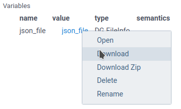

```mdx-code-block
import Tabs from '@theme/Tabs';
import TabItem from '@theme/TabItem';
import BrowserWindow from '@site/src/components/browser-window';
```

## Working with dataframes

For table data, Datagrok supports **Dataframe** as input/output parameters.
You can pass to the script the whole dataframe (`dataframe` type), 
dataframe column (`column`), or list of columns (`column_list`).

A simple example of a dataframe usage is available on the 
[Getting started with scripting](../getting-started.md#process-a-dataframe) page.

Let's modify the default example to accept and return both dataframes and scalars.
We copy the original dataframe and add a new ID column to it.
Also, we return the number of rows in the table.

```mdx-code-block
<Tabs>
<TabItem value="result" label="Result" default>
```

When you run the script, you will see the following dialog:


Datagrok created the script UI,
populated default values, and created popups with help text.


```mdx-code-block
</TabItem>
<TabItem value="python" label="Python">
```

```python
#name: DataframeIdDemo
#description: Adding ID column to a dataframe
#language: python
#tags: demo, dataframe
#input: dataframe table [Data table]
#input: string id_column = 'ID' [Name of ID column]
#input: string id_prefix = 'id_' [Prefix for ID column]
#output: dataframe new_table [New table with additional column]
#output: int last_row [number of last row]

new_table = table.copy()
l = len(new_table)
new_table[id_column] = [f"{id_prefix}{n:04}" for n in range(l)]
last_row = len(new_table)
```


```mdx-code-block
</TabItem>
<TabItem value="r" label="R">
```


```R
#name: DataframeDemo
#description: Adding a new column to a dataframe
#language: r
#tags: demo, dataframe
#input: dataframe table [Data table]
#input: string id_column = 'ID' [Name of ID column]
#input: string id_prefix = 'id_' [Prefix for ID column]
#output: dataframe new_table [New table with additional column]
#output: int last_row [number of last row]

new_table <- table
new_table[id_column] <- paste0(id_prefix, 1:nrow(new_table))
last_row <- nrow(new_table)
```


```mdx-code-block
</TabItem>
<TabItem value="javascript" label="JavaScript">
```

```javascript
//name: DataframeIdDemo
//description: Adding ID column to a dataframe
//language: javascript
//tags: demo, dataframe
//sample: cars.csv
//input: dataframe table [Data table]
//input: string id_column = 'model' [Name of ID column]
//input: string id_prefix = 'id_' [Prefix for ID column]
//output: dataframe new_table [New table with additional column]
//output: int last_row [number of last row]

const new_table = table.clone();
const last_row = new_table.rowCount;
new_table.col(id_column).init((i) => `${id_prefix}${i}`);
```

```mdx-code-block
</TabItem>
</Tabs>
```

After running this script, Datagrok automatically opens the new dataframe.
It will contain an additional column **ID** with the generated row ID.

:::note

Datagrok's dataframe converts to:

* Pandas [dataframe](https://pandas.pydata.org/docs/reference/api/pandas.DataFrame.html) for Python,
* Native [data frames](https://www.rdocumentation.org/packages/base/versions/3.6.2/topics/data.frame) for R,
* [Cell arrays](https://docs.octave.org/v8.4.0/Cell-Arrays.html) for Octave
* [DataFrame](https://dataframes.juliadata.org/stable/man/getting_started/#The-DataFrame-Type) for Julia
* [DG.DataFrame](https://datagrok.ai/help/develop/advanced/data-frame) for JavaScript

:::

:::caution Case-insensitive column names

In Datagrok, unlike `Python`/`R` dataframes, column names are case-insensitive.
If you return a dataframe with columns whose names differ only by letter case,
Datagrok will automatically add a number to the column header to differentiate them.

To prevent any confusion or issues with column names,
we recommend using unique names that are distinct regardless of case.

:::

### Column inputs for dataframe

Datagrok provides you with data inputs to select one or multiple columns from a dataframe.

* The `column` input parameter allows you to select one column from the dataframe.
  In the script, the `column` parameter is a string variable containing header name of the selected column.
* The `column_list` input parameter allows you to select multiple columns from the dataframe.
  In the script, the `column_list` parameter is a list of strings containing header names of the selected columns.

Both of these selectors require at least one **Dataframe** input
to choose a dataframe.

```mdx-code-block
<Tabs>
<TabItem value="result" label="Result" default>
```


```mdx-code-block
</TabItem>
<TabItem value="python" label="Python">
```

```python
#name: ColumnSelectorDemo
#description: Using column selectors
#language: python
#tags: demo, dataframe, column_selector
#input: dataframe table [Data table]
#input: column id_column [Fill this column with auto-d=generated ID]
#input: column_list data_columns [Keep this column and drop all others]
#output: dataframe new_table [New table with additional column]

new_table = table.copy()
l = len(new_table)
new_table[id_column] = [f"id_{n:04}" for n in range(l)]
new_table = new_table[ [id_column] + data_columns ]
```

```mdx-code-block
</TabItem>
<TabItem value="javascript" label="JavaScript">
```

```javascript
//name: ColumnSelectorDemo
//description: Using column selectors
//language: javascript
//tags: demo, dataframe, column_selector
//input: dataframe table [Data table]
//input: column id_column [Fill this column with auto-d=generated ID]
//input: column_list data_columns [Keep this column and drop all others]
//output: dataframe new_table [New table with additional column]

const new_table = table.clone();
const l = new_table.rowCount;
new_table.col('model').init((i) => `${id_column.get(i)}_${i}`);
```

```mdx-code-block
</TabItem>
</Tabs>
```


##  File I/O
You can use files as input or output parameters
using `file` and `blob` annotations.

The `file` parameter type allows you to read and write a file.
Inside the `Python`/`R` script this parameter will be a string variable
containing a path to the local file.

### Reading files

When you use the `file` annotation for the input parameter,
Datagrok creates an interface to load the file.

```mdx-code-block
<Tabs>
<TabItem value="result" label="Result" default>
```


```mdx-code-block
</TabItem>
<TabItem value="python" label="Python">
```

```python
#name: DfFromJSON
#description: Loads a dataframe from JSON file
#language: python
#tags: template, demo, FileIo
#input: file json_file {caption:JSON file} [A JSON file to load a dataframe]
#output: dataframe df 

df = pd.read_json(json_file)
```

```mdx-code-block
</TabItem>
<TabItem value="javascript" label="JavaScript">
```

```javascript
//name: DfFromJSON
//description: Loads a file and returns first sheet name
//language: javascript
//tags: template, demo, FileIo
//input: file uploadedFile {caption:Excel file}
//output: string first_sheet_name 

const importWb = new ExcelJS.Workbook();
await importWb.xlsx.load(uploadedFile.data);

first_sheet_name = importWb.worksheets[0].name;
```

```mdx-code-block
</TabItem>
</Tabs>
```

You can upload the file from your computer, choose it from Datagrok file storage,
or use any of the file connectors supported by Datagrok.


The `blob` input works in a very similar way but provides the binary stream instead of a file name.

```python
#name: BlobTest
#description: Example of Blob usage
#language: python
#tags: template, demo
#input: blob array_blob 
#output: string typeofblob

typeofblob = type(array_blob)
```

You can use this capability to effectively transfer a large set of data
from one Datagrok function/script to another.


### Saving data to files

You can use both `file` and `blob` annotations. for output files.
For example, let's save a dataframe to a JSON file:

```mdx-code-block
<Tabs>
<TabItem value="result" label="Result" default>
```



```mdx-code-block
</TabItem>
<TabItem value="python" label="Python">
```

```python
#name: DfToJSON
#description: Saves a dataframe to JSON file
#language: python
#tags: template, demo, FileIo
#input: dataframe df [Dataframe to convert to JSON]
#output: file json_file

df.to_json(json_file)
```

```mdx-code-block
</TabItem>
</Tabs>
```

When you run this script, Datagrok will return the `FileInfo` object in the scalar variables panel.
To save the file, right-click on the highlighted file link and choose the **Download** option.
The file name *always* matches the output variable name.

:::info
Some Python functions
(for example, Numpy [Save](https://numpy.org/doc/stable/reference/generated/numpy.save.html))
automatically add an extension to the file name if it is provided without an extension.
In this case, Datagrok won't be able to locate output file,
and you'll see empty file in the Datagrok output.

To override this behavior, you can open the file via the Python `open` function,
and use the file object instead of the file name.

```python
#output: file array_file_binary
...
with open(array_file_binary, 'wb') as npfile:
 np.save(npfile, array)
...
```

## Return graphical objects

Datagrok supports the special data type to transfer graphical data.

For Python, this variable can contain any graph created by the
`matplotlib` library (the `matplotlib.figure.Fugure` class).
When you run the script manually, Datagrok captures the graphics object
and creates a separate tab to view the results.
Datagrok can also save the `graphics` output in a dataframe,
or display it in the cell properties.

:::tip Datagrok Viewers
Out-of-the-box Datagrok contains many blaze-fast flexible interactive
[viewers](../../../visualize/viewers/viewers.md),
suitable for almost all data visualization tasks.

We suggest you exploring it before using graphical libraries
of your programming language.
:::

