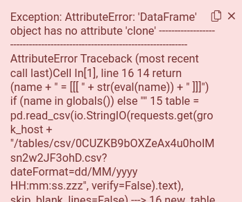
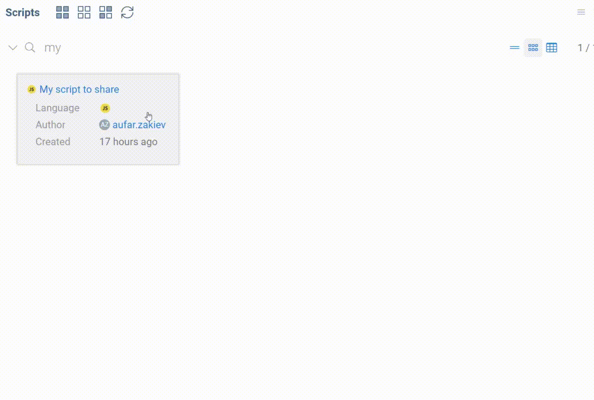

```mdx-code-block
import Tabs from '@theme/Tabs';
import TabItem from '@theme/TabItem';
import BrowserWindow from '@site/src/components/browser-window';
```

 ## Create a script

The simple way to open script described on the
[Getting started with scripting](../getting-started.md#create-a-script) page.

Alternatively, you can do the following:

* Enable extended **Main menu** in the **Window** icon on the right toolbar
* Open **Main menu > Tools > Scripting**.
* Choose the language for the script

## Debug a script

When you run a script, Datagrok catches all log messages
and displays it in the log panel below the script.
If the script throws an unhandled exception,
Datagrok catches it and displays an error popup.



To include additional debug information in the log,
run the script using **Debug script** button in the ribbon menu.

Alternatively, run the script normally and press the
**Debug** button on the bottom part of the input parameter window.


For big and complicated scripts, we recommend you develop them locally in your IDE,
and then integrate them into Datagrok.

## Execute a script

First of all, a script can be executed right from the script editor,
as described in [run script section](datagrok-script-editor.md#find-a-script).

Script is Datagrok [function](../../../datagrok/concepts/functions/functions.md), 
and can be invoked in different ways:

- From the [Datagrok console](../../../datagrok/navigation/panels/panels.md#console)
- From the data job
- From the [transformations editor](../../../transform/recipe-editor.md)
- From the [function browser](https://public.datagrok.ai/functions)

Registered scripts can be called via [JavaScript API](../../../develop/packages/js-api.md) in the following manner:

```javascript
const result = grok.functions.call(
  "<PACKAGE_NAME>:<SCRIPT_NAME>", 
  { 
    <INPUT_NAME>: <INPUT_VALUE>,
    <INPUT_NAME_2>: <INPUT_VALUE_2>
  }
);
```

:::caution

The single output will be assigned to `result` directly. Multiple outputs will be united into a single object.
You can retrieve any output value by accessing `result` object fields (e.g. `result['<MY_OUTPUT>']`).

:::

To see it in action, open this
[code snippet](https://public.datagrok.ai/js/samples/scripting/scripting) from our samples gallery.


# Find a script

To find and edit an existing script:

* Find it in the [Scripts section](https://public.datagrok.ai/scripts).
* Right-click on the script card. The context menu appears.
* Choose the **Edit** action. Built-in editor with script code opens.

You can use smart search to filter scripts.

## Share a script

All sharing features are in the **Sharing** dialog.

* To open it, find your script in [Scripts section](https://public.datagrok.ai/scripts) and right-click on it.
* Choose the "Share..." option in the context menu.
In the dialog, you will see groups and users with their privileges.
* You may edit the list of collaborators and grant or revoke privileges at any moment.




