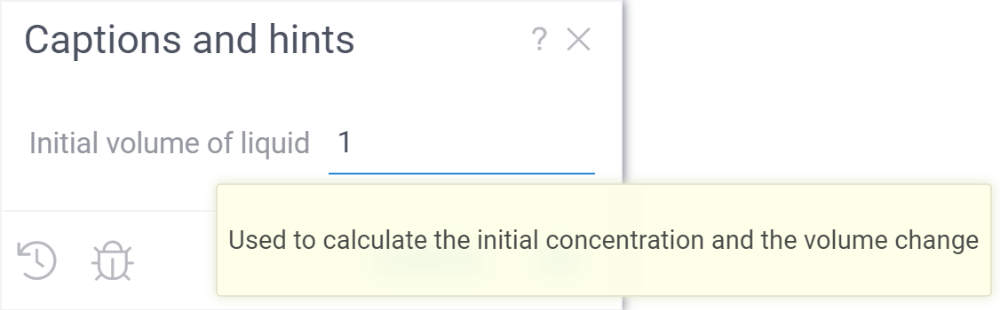
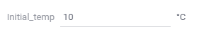

```mdx-code-block
import Tabs from '@theme/Tabs';
import TabItem from '@theme/TabItem';
import BrowserWindow from '@site/src/components/browser-window';
```

You may customize the script view using additional GUI-related options.
Most of them are hints to improve the interface for your scripts.
You should list options in curly braces in corresponding header lines.
The order of the hints makes no difference. All options are optional.


## Add captions and hints

You can add a custom caption for an input parameter.
Proper caption helps the user to understand the meaning of the parameter.
Caption will be rendered in the script input form.

Additinally, you can add a hint. To do that, place the hint text in the square brackets
after the parameter annotation.

```mdx-code-block
<Tabs>
<TabItem value="result" label="Result" default>
```



```mdx-code-block
</TabItem>
<TabItem value="code" label="Code">
```

```python
#input: double V1 { caption: Initial volume of liquid } [Used to calculate the initial concentration and the volume change]
```

```mdx-code-block
</TabItem>
</Tabs>
```

## Add units

You can add a proper unit label for an input parameter.
The unit label will appear in the input form next to the input field.

```mdx-code-block
<Tabs>
<TabItem value="result" label="Result" default>
```



```mdx-code-block
</TabItem>
<TabItem value="code" label="Code">
```

```python
#input: double initialTemp { units: °С }
```

```mdx-code-block
</TabItem>
</Tabs>
```

## Group inputs into categories

You can group script inputs into categories using the `category` tag.

```mdx-code-block
<Tabs>
<TabItem value="result" label="Result">
```


```mdx-code-block
</TabItem>
<TabItem value="short" label="Short sample">
```

```python
#input: double initialPressure { caption: Initial pressure; category: Experimental data }
#input: double desiredPressure { caption: Goal pressure; category: Goals }
```

```mdx-code-block
</TabItem>
<TabItem value="full" label="Full sample">
```

```python
#name: InputGroupingDemo
#language: python
#input: dataframe tempData { caption: Temperature data; category: Experimental data }
#input: double initialPressure { caption: Initial pressure; category: Experimental data }
#input: double desiredPressure { caption: Goal pressure; category: Goals }
#input: double desiredHumidity { caption: Goal humidity; category: Goals }
```

```mdx-code-block
</TabItem>
</Tabs>
```

## Choices

Datagrok natively support the `choices` capability for primitive input types.
You can use it to pass to the script one value from a pre-populated list or a list of selected values.

```mdx-code-block
<Tabs>
<TabItem value="single" label="Single choice" default>
```


```mdx-code-block
</TabItem>
<TabItem value="multiple" label="Multiple choices" default>
```


```mdx-code-block
</TabItem>
</Tabs>
```

You can define choices using a list of fixed values,  
a CSV file,
a name of another function,
or a direct SQL query.
For details, visit the page 
[Function annotations](../../../datagrok/concepts/functions/func-params-annotation.md#choices).