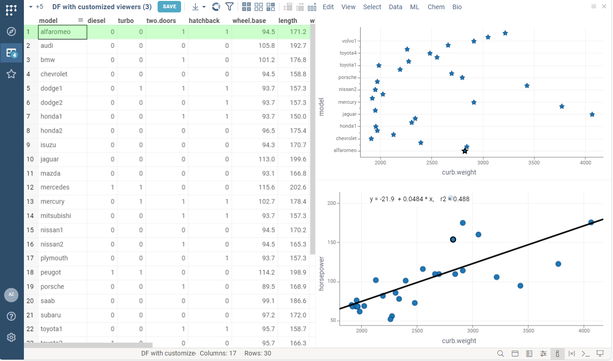

```mdx-code-block
import Tabs from '@theme/Tabs';
import TabItem from '@theme/TabItem';
import BrowserWindow from '@site/src/components/browser-window';
```

## Add viewers for dataframe

You can specify viewers to review output dataframes in a human-friendly way.
Each dataframe parameter may have a list of viewers.

You may see all available viewers opening
[demo dataframe](https://public.datagrok.ai/f/Demo.TestJobs.Files.DemoFiles/demog.csv)
and opening the toolbox on the left.

<details>
<summary> Fantastic viewers and where to find them </summary>
<div>


</div>
</details>

The following code adds `Scatter plot`
and `Line chart` viewers on the input dataframe.

```mdx-code-block
<Tabs>
<TabItem value="result" label="Result">
```


```mdx-code-block
</TabItem>
<TabItem value="code" label="Code">
```

```python
#name: Adding viewer on output dataframe
#language: javascript
#sample: demog.csv
#input: dataframe inputDF
#output: dataframe outputDF { viewer: Line chart | Scatter plot }

outputDF = inputDF.copy()
```

```mdx-code-block
</TabItem>
</Tabs>
```

:::tip

The default script view supports viewers for *output* dataframes only.
You may specify viewers *input* dataframes using
[advanced UI editor](../advanced-scripting/rich-function-view.md#visualize-input-data)

:::

## Customize viewers for dataframe

Each viewer has a list of customizable properties.
They control how the viewer is rendered and how it behaves.
For instance, you may specify the dataframe column used as the X-axis on the scatter plot.

The list of available properties differs for each type of viewer.
You may right-click on the viewer and select `Properties` item in the context menu.
In the `viewer` tag, you can specify any property listed in the opened property panel.

:::caution only camelCase is accepted

You should enter the viewer property in camelCase format.
For example, here "Show regression line" property
of the scatterplot becomes `showRegressionLine`.

:::

For example, the following code:

* specifies marker type and size for linechart
* enables regression line rendering for scatterplot

```mdx-code-block
<Tabs>
<TabItem value="result" label="Result">
```




```mdx-code-block
</TabItem>
<TabItem value="code" label="Code">
```

```python
#name: Viewers customization
#language: javascript
#sample: cars.csv
#input: dataframe inputDF
#output: dataframe outputDF { viewer: Scatter plot(y: "model", markerType: star, markerSize: 15) | Scatter plot(showRegressionLine: true) }

outputDF = inputDF.copy()
```

```mdx-code-block
</TabItem>
</Tabs>
```

:::tip More customization

The default script view shows all viewers at once.
You may divide viewers by different tabs using
[advanced UI editor](../advanced-scripting/rich-function-view.md#group-outputs).

:::

