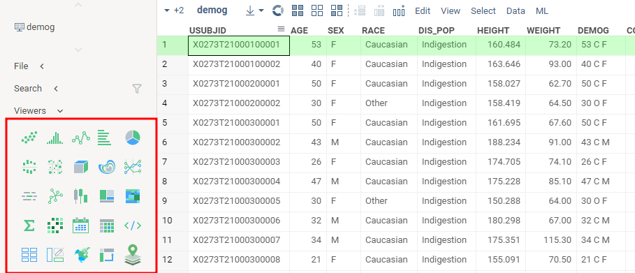
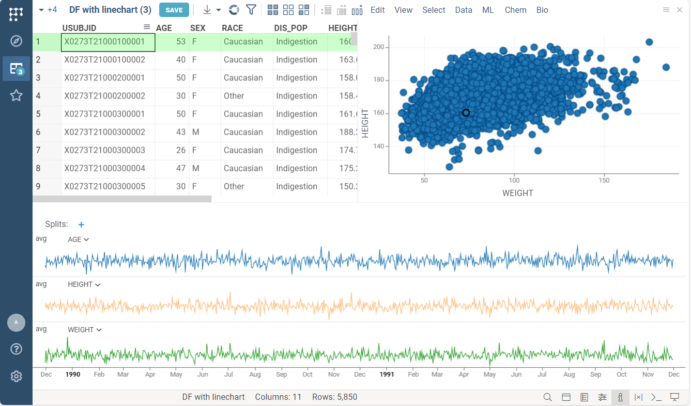
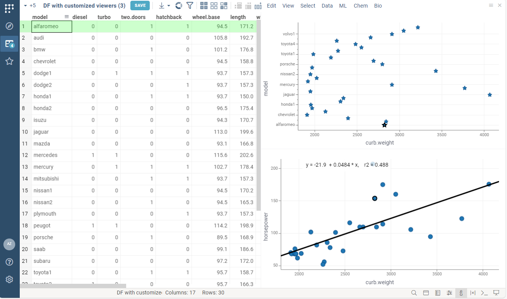

```mdx-code-block
import Tabs from '@theme/Tabs';
import TabItem from '@theme/TabItem';
import BrowserWindow from '@site/src/components/browser-window';
```

## Add viewers for dataframe

You can specify viewers to review output dataframes in a human-friendly way.
Each dataframe parameter may have a list of viewers.

To see all available viewers, open the
[demo dataframe](https://public.datagrok.ai/f/Demo.TestJobs.Files.DemoFiles/demog.csv)
and expand the toolbox on the left.

<details>
<summary> Fantastic viewers and where to find them </summary>
<div>



</div>
</details>

The following code adds `Scatter plot`
and `Line chart` viewers on the input dataframe.

```mdx-code-block
<Tabs>
<TabItem value="result" label="Result">
```



```mdx-code-block
</TabItem>
<TabItem value="code" label="Code">
```

```python
#name: Adding viewer on output dataframe
#language: python
#sample: demog.csv
#input: dataframe inputDF
#output: dataframe outputDF { viewer: Line chart | Scatter plot }

outputDF = inputDF.copy()
```

```mdx-code-block
</TabItem>
</Tabs>
```

## Where viewers appear

The viewers appear wherever the result opens:

* In the function view, with the results, after you run the function.
* In the table view that opens for the result, for example when you run a script from the
  **Scripts** browser.
* In the workspace, when you add a result table with **Add to workspace** (**+**) in the function
  view.

Input dataframes can have viewers too. In the function view, they appear above the results, so the
page reads as the form, the table it received, and what came out of it:

```python
#input: dataframe inputDF { viewer: Scatter plot | Grid }
```

If you close a viewer in the results, press <kbd>Ctrl+Z</kbd> to bring it back to the same place.

## Customize viewers for dataframe

Each viewer has a list of customizable properties.
They control how the viewer is rendered and how it behaves.
For instance, you can specify the dataframe column used as the X-axis on the scatter plot.

The list of available properties differs for each type of viewer.
Right-click the viewer and select `Properties` in the context menu.
In the `viewer` tag, you can specify any property listed in the opened property panel.

:::caution only camelCase is accepted

You should enter the viewer property in camelCase format.
For example, here "Show regression line" property
of the scatterplot becomes `showRegressionLine`.

:::

For example, the following code:

* specifies marker type and size for linechart
* enables regression line rendering for scatterplot

```mdx-code-block
<Tabs>
<TabItem value="result" label="Result">
```




```mdx-code-block
</TabItem>
<TabItem value="code" label="Code">
```

```python
#name: Viewers customization
#language: python
#sample: cars.csv
#input: dataframe inputDF
#output: dataframe outputDF { viewer: Scatter plot(y: "model", markerType: star, markerSize: 15) | Scatter plot(showRegressionLine: true) }

outputDF = inputDF.copy()
```

```mdx-code-block
</TabItem>
</Tabs>
```

A few shortcuts and rules apply to the values:

* Column properties take the short name: `x: time` sets the X column (`xColumnName`), and
  `y: temperature` sets the Y column.
* `title` sets the viewer title: `Scatter plot(title: Growth over time)`.
* Numbers and booleans are written as is, including decimals and negatives: `xMax: 25.5`,
  `yMin: -1`, `showRegressionLine: true`.
* Quote a value that contains a comma, a semicolon, parentheses, or a vertical bar:
  `title: "Growth (mg/L)"`.
* Viewers from packages take options the same way, for example `Forms(colorCode: false)`.

## Arrange viewers

By default, the viewers are docked next to the table's grid. To lay them out yourself, give each
viewer a `block`: its share of a row, in percent. A row fills up to 100, and the next viewer starts
a new row. Rows share the height equally.

```python
#output: dataframe result { viewer: Line chart(block: 60) | Scatter plot(block: 40) | Bar chart(block: 50) | Grid(block: 50) }
```

This puts the line chart and the scatter plot in the first row, 60/40, and the bar chart and the
grid in the second row, 50/50.

To place the grid, list it like any other viewer, as in the example above. If you leave it out,
the grid takes the rest of the last row, or a row of its own when the last row is full.

:::note

`block` applies to the platform's function view and table views. The
[rich function view](../advanced-scripting/rich-function-view.md) editor arranges viewers with its
own options.

:::

