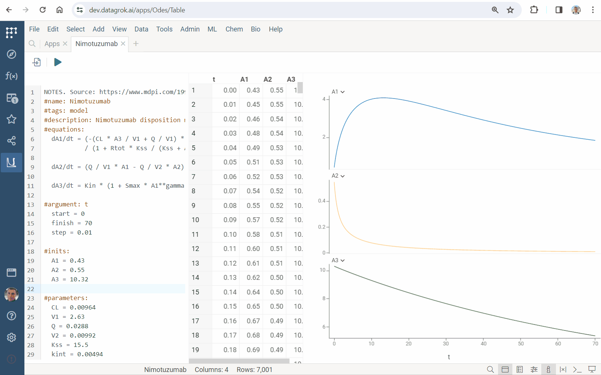
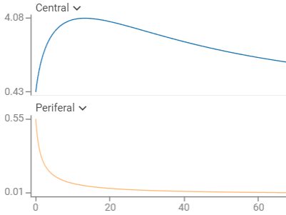

**Datagrok Solver** is an innovative tool 
allowing you to define and solve ordinary differential equations (ODEs) 
right within your web browser. 

Differential equations play a crucial role in modeling complex systems in diverse fields, 
from chemical engineering and drug design to environmental studies and financial modeling. 
Using **Datagrok Solver**, you can easily create mathematical models,
tune and optimize it, use interactive [visualizations](../visualize/viewers) and other features of the Datagrok platform.
Moreover, in a single click you can turn your model into the [Datagrok script](scripting.md),
run it as standalone data processing unit, or include in an [application](../develop/how-to/build-an-app.md).

**Key benefits and features**:

* **Enhanced mathematical modeling:** Datagrok Solver can model and analyse complex multi-equation systems.
* **Ease of use:** The Solver intuitive interface makes it accessible and useful to both beginners and experts in mathematical modeling.
* **Rapid design:** The collection of built-in project templates and use cases speed up model design.
* **Streamlined Integration:** In just one click, you can convert formulas to the platform script, implementing no-code development.
* **Broad application scope:** The Solver usage ranges from [pharmacokinetics](https://en.wikipedia.org/wiki/Pharmacokinetics) and [hybrid antibody formation](https://doi.org/10.1073/pnas.1220145110) simulation to [queues](https://en.wikipedia.org/wiki/Queueing_theory) modeling.

## Using Solver

### Running Solver

To run **Solver**:

* Go to **Functions > Apps** and run **EquaSleek X**. 
  You will see the default code template with one simple differential equation.
* Press <i class="fas fa-play"></i> **Run** button on the top panel. 
  You will immediately see the table and the graph with the resulting function.
* Edit formulas or add new ones
* Click **F5** or <i class="fas fa-play"></i> **Run** button to re-run Solver and see updated data.


### Loading and saving data

To save formulas in a local file:

* Right click on the code editor area and select **Save...**
* Find the file in Downloads

Load equations from a local file:

* Right click on the code editor area and select **Load...**
* Select a file with formulas

### Loading templates and use-cases

To load a template, right-click on the code editor area, 
select **Templates** and choose one of the following templates:

| Template   | Features                                                                                             |
|------------|------------------------------------------------------------------------------------------------------|
| `Basic`    | the minimum required project                                                                         |
| `Advanced` | extra math features, including *expressions*, *constants*, *parameters* and *tolerance* specification|
| `Extended` | the *annotating* feature for extended UI generation                                                  |

To load a use-case, right-click on the code editor area, 
select **Use sases** and choose a one.

## Creating a custom defferental equation model

### Basic structure

A minimal project defining and solving ordinary differential equations (ODEs) contains
*name*, *differential equations*, *initial values* and *argument* specifications.

Use the `#name` keyword to define the name of your model:

```python
#name: Problem1
```

Place differential equations in the `#equations`-block. You can add as many equations as you want. 
Solver automatically recognizes all identifiers that you use.
You can use one-letter or multi-letter identifiers

```python
#equations:
  dx/dt = x + y + exp(t)
  dy/dt = x - y - cos(t)
```

Define the argument, its *initial* value, *final* value, and grid *step* in the `#argument`-block.
Datagrok provides a numerical solution within the range *[initial, final]* with the specified grid *step*.

```python
#argument: t
  initial = 0
  final = 1
  step = 0.01
```

Define initial values of the functions in the `#inits`-block:

```python
#inits:
  x = 2
  y = 5
```

### Advances

Use the advanced features to improve your model:

Specify constants in the `#constants`-block

```python
#constants:
  C1 = 1
  C2 = 3
```

Set parameters in the `#parameters`-block:

```python
#parameters:
  P1 = 1
  P2 = -1
```

Define auxiliary computations in the `#expressions`-block:
Use expressions to simplify equations.
They may depend on constants, parameters and the argument.

```python
#expressions:
  E1 = C1 * t + P1
  E2 = C2 * cos(2 * t) + P2
```

To customize the computation output, select columns and their captions in the `output`-block:

```python
#output:
  t {caption: Time, h}
  A1 {caption: Central}
  A2 {caption: Periferal}
```



Set [tolerance](https://pythonnumericalmethods.berkeley.edu/notebooks/chapter19.02-Tolerance.html) of the numerical method in the `#tolerance`-line:

```python
#tolerance: 0.00005
```

### Multi-stage modeling

The multi-stage model is a model where parameters and function values can vary for different 
ranges of argument values.

Datagrok provides a special capabilities for multi-stage simulation. 

Use the `#loop`-feature to specify several modeling cycles. 
Define the number of repetitions and the updates of inputs:

```python
#loop:
  count = 3
  y += 0.4
```


Apply the `#stage` feature to obtain acyclic simulation. 
Set the length of the modeling stage and the updates of inputs:

```python
#update:
  length = 6
  y = 1
```

Use any valid expression, when specifying the updates of inputs.

## Platform applications

You can convert any solver project to the Datagrok script:

* Press <i class="fa-file-import"></i> **Export** button on the top panel
* Press **SAVE** button

Find the created Javascript script in the platform `Scripts`.

The export feature provides an extension of your project with [scripting](scripting.md) tools. 

### Usability improvements

For all Solver parameters, you can add annotations described in
[functional annotations](../datagrok/concepts/functions/func-params-annotation.md).
When you convert your model into the Datagrok script,
Solver converts it to the script input annotations, 
allowing Datagrok to automatically create rich and self-explaining UI.

. Use `#tags: model` to add your model to `Model Catalog`. 
Provide a description in the `#description`-line:

```python
#name: Bioreaction
#tags: model
#description: Complex bioreaction simulation
```

Define the desired captions for the input parameters:

```python
#argument: t
  start = 0 {caption: Initial}
  finish = 2 {caption: Final}
  step = 0.01 {caption: Step}
```

Group inputs by specifying their `category`:

```python
#parameters:
  P1 = 1 {category: Parameters}
  P2 = -1 {category: Parameters}
```

Add `units`:

```python
#inits:
  x = 2 {units: C; category: Initial values}
  y = 0 {units: C; category: Initial values}
```

Provide hints in brackets `[ ]`:

```python
  P1 = 1 {category: Parameters} [P1 parameter tooltip]
```


Use the following `meta`-s:

|<div style={{ width:400 }}></div>|Annotation|Feature|
|----------|---------|----------------------------------|
||`#meta.runOnOpen: true`|Provides computations immediately upon model launch.|
||`#meta.runOnInput: true`|Updates results immediately upon input changes.|


## Use cases

The solver has built-in use cases. Get access to them via the context menu and use as a template.

|<div style={{ width:400 }}></div> |Use case|Features|
|----------------------------------|--------|--------|
||`Chem reactions`|- simulates [mass-action kinetics](https://en.wikipedia.org/wiki/Law_of_mass_action)<br/> <br/>- illustrates annotation of inputs|
||`Robertson's model`|- Robertson’s chemical reaction model<br/> <br/>- [stiff equations](https://en.wikipedia.org/wiki/Stiff_equation) example<br/> <br/>- shows how Datagrok solves complicated ODEs|
||`Fermentation`|- models the kinetics of the biochemical reactions in [fermentation](https://en.wikipedia.org/wiki/Fermentation)<br/> <br/>- shows the usage of the `runOnOpen` and  `runOnInput` meta-features|
||`PK-PD`|- simulates pharmacokinetics (PK), pharmacodynamics (PD), and their [relationship](https://www.ncbi.nlm.nih.gov/pmc/articles/PMC7348046)<br/> <br/>- illustrates the usage of the `loop` feature for dosing specification|
||`Acid production`|- models gluconic acid [production](https://oatao.univ-toulouse.fr/9919/1/Elqotbi_9919.pdf) by Aspergillus niger<br/> <br/>- shows the usage of the `update` feature for multi-stage simulation|
||`Nimotuzumab`|- models population pharmacokinetic for [nimotuzumab](https://www.mdpi.com/1999-4923/12/12/1147)<br/> <br/>-demonstrates the `output` feature|

Datagrok's ODEs suite has tools for solving both stiff and non-stiff equations. Combine the solver with [viewers](../visualize/viewers/viewers.md) and [compute](compute.md) tools to explore complex models.

## See also:

* [Numerical methods for ODEs](https://en.wikipedia.org/wiki/Numerical_methods_for_ordinary_differential_equations)
* [Stiff equations](https://en.wikipedia.org/wiki/Stiff_equation)
