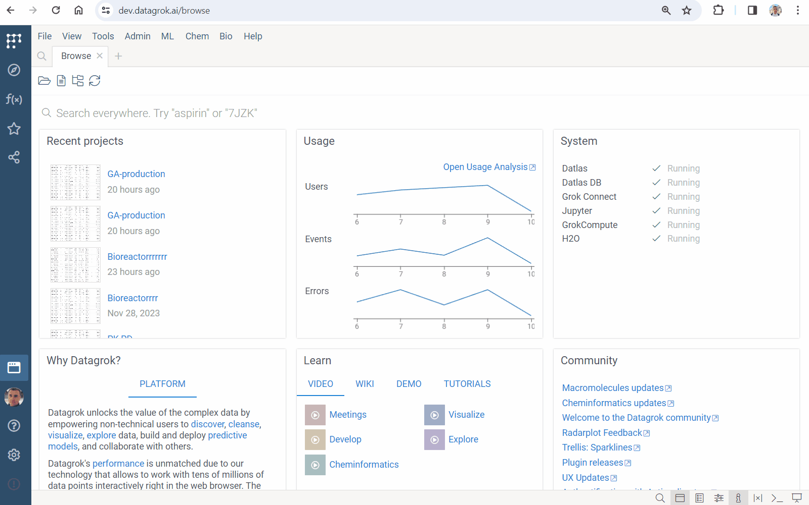
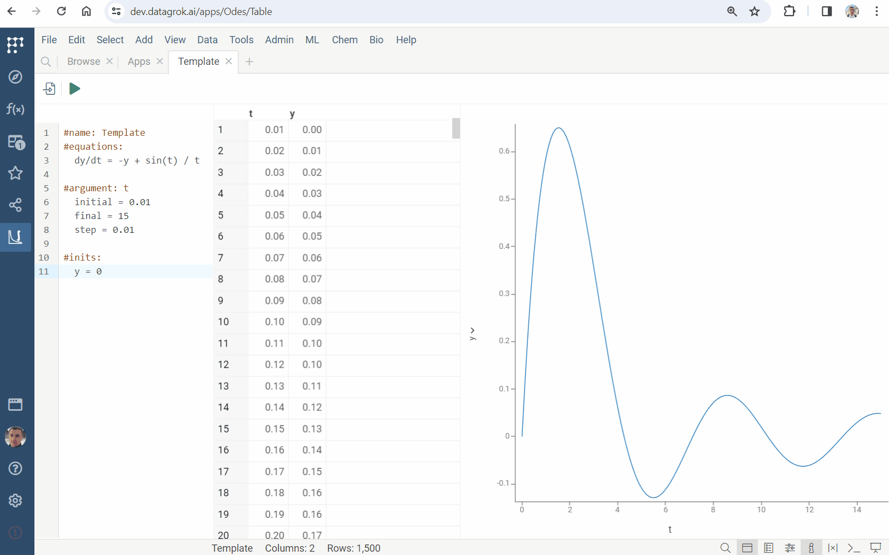
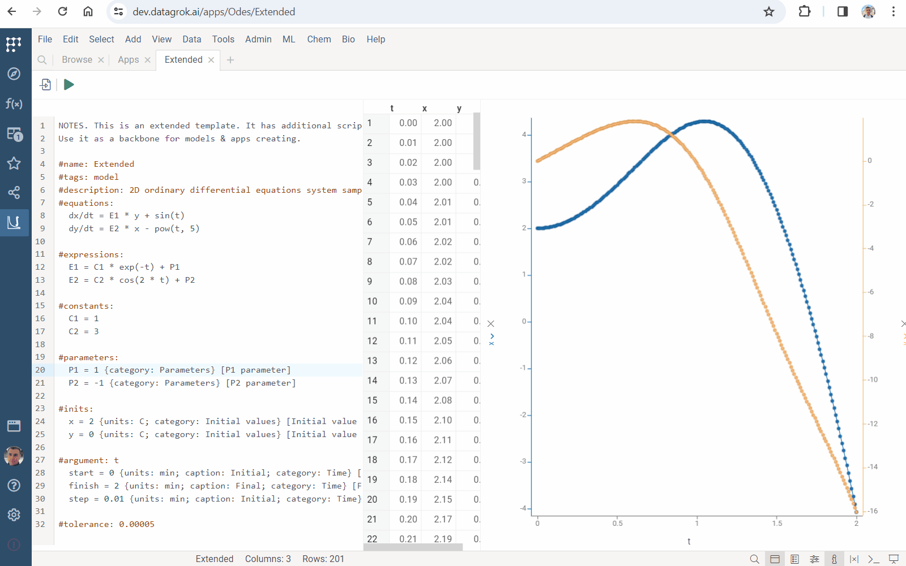
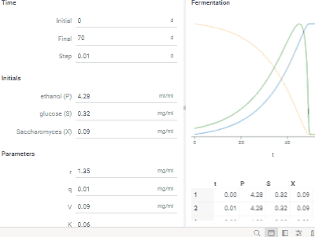
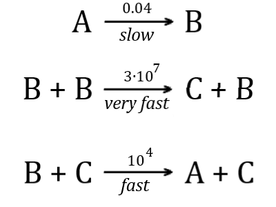
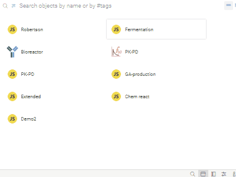
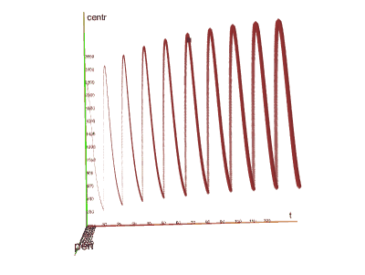
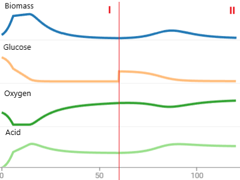

Datagrok lets you solve [initial value problem](https://en.wikipedia.org/wiki/Initial_value_problem) for ordinary differential equations (ODEs) in the browser. It provides the modeling and comprehension of complex systems across various fields, including chemical engineering, drug design and discovery.

Key features:

* **Ease of use:** The solver is designed with an intuitive interface, making it accessible for users with varying levels of expertise in mathematical modeling.
* **Rapid design:** It has built-in project templates and a collection of use cases that speed up model design.
* **Advanced mathematical modeling:** It enables the analysis and prediction of complex dynamic systems, which is essential in research and development sectors.
* **Auto-generated UI with advanced visualizations:** It ensures the automatic export of the formulas to the platform applications, implementing no-code development.
* **Broad application scope:** Its usage ranges from [pharmacokinetics](https://en.wikipedia.org/wiki/Pharmacokinetics) and [controlled fab-arm exchange](https://doi.org/10.1073/pnas.1220145110) simulation to [queues](https://en.wikipedia.org/wiki/Queueing_theory) modeling.

## Using Solver

To run Solver:

* Go to **Apps** and run **EquaSleek X**
* Press <i class="fas fa-play"></i> **Run** button on the top panel
* Edit formulas or add new ones
* Click **F5** or <i class="fas fa-play"></i> **Run** button

Datagrok provides the creation of an ODEs project in a few clicks:



Apply built-in templates as a backbone of your project. Rigth click, select **Templates** and choose one of the following:

| Template   | Features                                                                                             |
|------------|------------------------------------------------------------------------------------------------------|
| `Basic`    | the minimum required project                                                                         |
| `Advanced` | extra math features, including *expressions*, *constants*, *parameters* and *tolerance* specification|
| `Extended` | the *annotating* feature for extended UI generation                                                  |

Save formulas in a local file:

* Rigth click and select **Save...**
* Find the file in Downloads

Load equations from a local file:

* Rigth click and select **Load...**
* Select a file with formulas

## Creating a custom model

### Basic structure

A project defines [initial value problem](https://en.wikipedia.org/wiki/Initial_value_problem). It contains *name*, *differential equations*, *initial values* and *argument* specifications.

Start with the line defining a name:

```python
#name: Problem1
```

Place differential equations in the `#equations`-block:

```python
#equations:
  dx/dt = x + y + exp(t)
  dy/dt = x - y - cos(t)
```

Set variable, its *initial*, *final* and *step* in the `#argument`-block:

```python
#argument: t
  initial = 0
  final = 1
  step = 0.01
```

Datagrok provides a numerical solution within the range *[initial, final]* with the specified grid *step*.

Define initial values in the `#inits`-block:

```python
#inits:
  x = 2
  y = 5
```

### Advances

The solver supports the use of *constants*, *parameters*, *expressions* and *tolerance* setting.

Specify constants in the `#constants`-block

```python
#constants:
  C1 = 1
  C2 = 3
```

Set parameters in the `#parameters`-block:

```python
#parameters:
  P1 = 1
  P2 = -1
```

Define auxiliary compuations in the `#expressions`-block:

```python
#expressions:
  E1 = C1 * t + P1
  E2 = C2 * cos(2 * t) + P2
```

Use expressions to simplify equations. They may depend on constants, parameters and the argument. 

Set [tolerance](https://pythonnumericalmethods.berkeley.edu/notebooks/chapter19.02-Tolerance.html) of the numerical method in the `#tolerance`-line:

```python
#tolerance: 0.00005
```

### Multi-stage modeling

Datagrok provides a multi-stage simulation. 

Use the `#loop`-feature to get the required number of modeling cycles. Define the number of repetitions and the updates of inputs:

```python
#loop:
  count = 3
  y += 0.4
```



Apply the `#update`-feature to obtain acyclic simulation. Set the length of the modeling stage and the updates of inputs:

```python
#update:
  length = 6
  y = 1
```

Use any valid expression, when specifying the updates of inputs.

### Platform applications

Datagrok provides an export of each solver project to JavaScript script:

* Press <i class="fa-file-import"></i> **Export** button on the top panel
* Press **SAVE** button

Find the created script in the platform `Scripts`.

Improve usability. Use `#tags: model` to add your model to `Model Catalog`. Provide a description in the `#description`-line:

```python
#name: Bioreaction
#tags: model
#description: Complex bioreaction simulation
```

Apply annotations in your project to get better UI. Append them, when defining *parameters*, *initial values* and *argument*.

Group inputs by specifying their `category`:

```python
#parameters:
  P1 = 1 {category: Parameters}
  P2 = -1 {category: Parameters}
```

Add `units`:

```python
#inits:
  x = 2 {units: C; category: Initial values}
  y = 0 {units: C; category: Initial values}
```

Define the desired `caption`:

```python
#argument: t
  start = 0 {caption: Initial; units: min; category: Time}
  finish = 2 {caption: Final; units: min; category: Time}
  step = 0.01 {caption: Initial; units: min; category: Time}
```

Provide hints in brackets `[ ]`:

```python
  P1 = 1 {category: Parameters} [P1 parameter tooltip]
```



Use the following `meta`-s:

|<div style={{ width:400 }}></div>|Annotation|Feature|
|----------|---------|----------------------------------|
||`#meta.runOnOpen: true`|Provides computations immediately upon model launch.|
||`#meta.runOnInput: true`|Updates results immediately upon input changes.|

The export feature provides an extension of your project with [scripting](scripting.md) tools. You can add the desired functionality:

* results visualization
* non-elementary and special functions use
* Datagrok packages functions call

## Use cases

The solver has built-in use cases. Get access to them via the context menu and use as a template.

|<div style={{ width:400 }}></div> |Use case|Features|
|----------------------------------|--------|--------|
||`Chem reactions`|- simulates [mass-action kinetics](https://en.wikipedia.org/wiki/Law_of_mass_action)<br/> <br/>- illustrates annotation of inputs|
||`Robertson's model`|- Robertson’s chemical reaction model<br/> <br/>- [stiff equations](https://en.wikipedia.org/wiki/Stiff_equation) example<br/> <br/>- shows how Datagrok solves complicated ODEs|
||`Fermentation`|- models the kinetics of the biochemical reactions in [fermentation](https://en.wikipedia.org/wiki/Fermentation)<br/> <br/>- shows the usage of the `runOnOpen` and  `runOnInput` meta-features|
||`PK-PD`|- simulates pharmacokinetics (PK), pharmacodynamics (PD), and their [relationship](https://www.ncbi.nlm.nih.gov/pmc/articles/PMC7348046)<br/> <br/>- illustrates the usage of the `loop` feature for dosing specification|
||`Acid production`|- models gluconic acid [production](https://oatao.univ-toulouse.fr/9919/1/Elqotbi_9919.pdf) by Aspergillus niger<br/> <br/>- shows the usage of the `update` feature for multi-stage simulation|

Datagrok's ODEs suite has tools for solving both stiff and non-stiff equations. Combine the solver with [viewers](../visualize/viewers/viewers.md) and [compute](compute.md) tools to explore complex models.

See also

* [Numerical methods for ODEs](https://en.wikipedia.org/wiki/Numerical_methods_for_ordinary_differential_equations)
* [Stiff equations](https://en.wikipedia.org/wiki/Stiff_equation)
