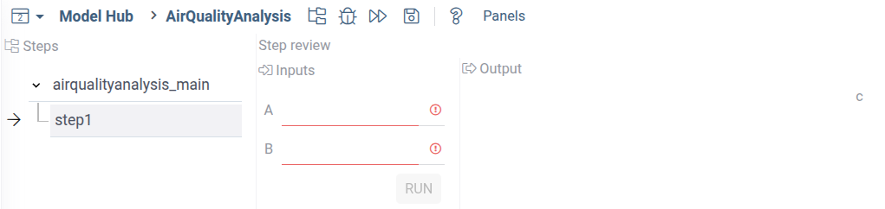
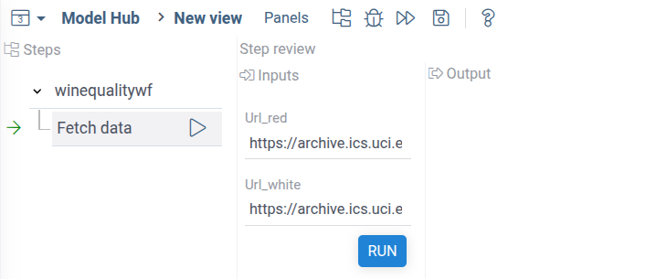

Let's make some multistep analysis using the low-code workflows.
For example, let's analyze the standard Wine Quality dataset.

We'll make a workflow that can make the following:

1. Load the public dataset),
2. Perform two separate calculations:
    * Regression to predict wine quality.
    * Clustering wines based on chemical profile.
3. Combine: Highlight which clusters have best average quality.


## Development setup and minimal workflow

Setup a dev environment as described
[here](../develop/dev-process/set-up-environment).

To create a package for workflow, run the following commands:

```shell
grok create winequalitywf
cd winequalitywf
npm i @datagrok-libraries/compute-api
```

### Dependencies

Go to the `package.json` file and change the dependencies section:

```json
"dependencies": {
    "@datagrok-libraries/compute-api": "^0.6.3",
    "@datagrok-libraries/utils": "^4.4.0",
    "cash-dom": "^8.1.4",
    "datagrok-api": "^1.21.3",
    "dayjs": "=1.11.10"
  },
```

### Minimal workflow script

Place the following code to the `src/package.ts` file:
```typescript
/* Do not change these import lines to match external modules in webpack configuration */
import * as grok from 'datagrok-api/grok';
import * as ui from 'datagrok-api/ui';
import * as DG from 'datagrok-api/dg';
import type { PipelineConfiguration } from '@datagrok-libraries/compute-api';
import dayjs from 'dayjs';
import utc from 'dayjs/plugin/utc';
import timezone from 'dayjs/plugin/timezone';

dayjs.extend(utc);
dayjs.extend(timezone);

export const _package = new DG.Package();

//tags: model
//editor: Compute2:TreeWizardEditor
//input: object params
//output: object result
export async function WineQualityWf(params: any) {
  const c: PipelineConfiguration = {
    id: 'winequalitywf',
    nqName: 'winequalitywf:WineQualityWf',
    version: '1.0',
    type: 'static',
    steps: [{
      id: 'step1',
      nqName: 'winequalitywf:MyAddScript',
    }]
  };
  return c;
}

//input: double a
//input: double b
//output: double c
export function MyAddScript(a: number, b: number) {
  return a + b;
}
```

The imports of `utc`, `timezone` and `daysjs` are required for the `TreeWizardEditor` to work.

Tn the main part of scripts we define the `WineQualityWf` function, that created and returns
a big JSON with the `PipelineConfiguration` type, that defines our workflow.
The `nqName:` key of the configuration should always contain the name of the main function and main script.
In our case this is `winequalitywf:WineQualityWf`

The `steps` array defines steps of our workflow.
For now, this is a mock step that adds two numbers.
The `nqName: 'winequalitywf:MyAddScript'` key maps the workflow step 1
to the custom function `MyAddScript`.

After run the following from the package root directory (change local to
the actual Datagrok instance if needed).

```shell
npm i && npm run build && grok publish local --release
```

Note that publish `--release` flag is mandatory for workflow.

Reload Datagrok page, open the **ModelHub** in the **Apps->Compute** sections,
and run the `MyWorkflow` model.
You will see the following interface:



## Using scripts for workflow steps

Now, let's make our workflow useful - add to it logic.
Since Datagrok supports multi-language development,
we can implement computational logic using any supported language.
For this example, we'll use Python as the most used data science language.

Make the folder `scripts` inside your package and add
the file `fetchwinedata.py` with the following code:

```python
#name: fetchwinedata
#description: Fetch Wine quality dataset from web
#language: python
#input: string url_red = "https://archive.ics.uci.edu/ml/machine-learning-databases/wine-quality/winequality-red.csv"
#input: string url_white = "https://archive.ics.uci.edu/ml/machine-learning-databases/wine-quality/winequality-white.csv"
#output: dataframe df_wine
#output: int total_lines

# URLs for red and white wine datasets


# Load datasets
df_red = pd.read_csv(url_red, sep=';')
df_white = pd.read_csv(url_white, sep=';')

# Add a column to distinguish wine types
df_red["wine_type"] = "red"
df_white["wine_type"] = "white"

# Combine both datasets
df_wine = pd.concat([df_red, df_white], ignore_index=True)
total_lines = df_wine.shape[0]
```

Make changes to the main `package.ts` file to chage the step function:

```typescript
  const c: PipelineConfiguration = {
    id: 'winequalitywf',
    nqName: 'winequalitywf:WineQualityWf',
    version: '1.0',
    type: 'static',
    steps: [{
      id: 'step1',
      nqName: 'winequalitywf:fetchwinedata',
    }]
  };

```

Compile and publish the package:

```shell
npm i && npm run build && grok publish local --release
```

Now you can

Open the workflow and run the first Let's run the workflow. You will see the following:



Datagrok recognizes declared inputs and automatically creates UI for it.


