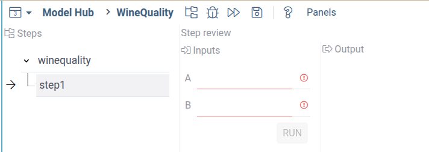

### Development setup and test

Setup a dev environment as described
[here](../develop/dev-process/set-up-environment).

To create a demo package, run the following commands:

```shell
grok create myworkflowpackage
cd myworkflowpackage
npm i @datagrok-libraries/compute-api
```

Place the following code into `src/package.ts`
```typescript
/* Do not change these import lines to match external modules in webpack configuration */
import * as grok from 'datagrok-api/grok';
import * as ui from 'datagrok-api/ui';
import * as DG from 'datagrok-api/dg';
import type { PipelineConfiguration } from '@datagrok-libraries/compute-api';
import dayjs from 'dayjs';
import utc from 'dayjs/plugin/utc';
import timezone from 'dayjs/plugin/timezone';

dayjs.extend(utc);
dayjs.extend(timezone);

export const _package = new DG.Package();

//tags: model
//editor: Compute2:TreeWizardEditor
//input: object params
//output: object result
export async function MyWorkflow(params: any) {
  const c: PipelineConfiguration = {
    id: 'my_workflow',
    nqName: 'myworkflowpackage:MyWorkflow',
    version: '1.0',
    type: 'static',
    steps: [{
      id: 'step1',
      nqName: 'myworkflowpackage:MyAddScript',
    }]
  };
  return c;
}

//input: double a
//input: double b
//output: double c
export function MyAddScript(a: number, b: number) {
  return a + b;
}
```

The imports of `utc`, `timezone` and `daysjs` are required for the `TreeWizardEditor` to work.

Tn the main part of scripts we define the `MyWorkflow` fucntion, that created and returns
a big JSON with the `PipelineConfiguration` type, that defines our workflow.
the `nqName: 'myworkflowpackage:MyAddScript'` part maps the workflow step 1
to the custom function `MyAddScript`, defined after the main one.

After run the following from the package root directory (change local to
the actual Datagrok instance if needed).

```shell
npm i && npm run build && grok publish local --release
```

Note that publish `--release` flag is mandatory for workflow.

Reload Datagrok page, open the **ModelHub** in the **Apps->Compute** sections,
and run the `MyWorkflow` model.
You will see the following interface:




### Making workflow useful

__TODO More real examples__
