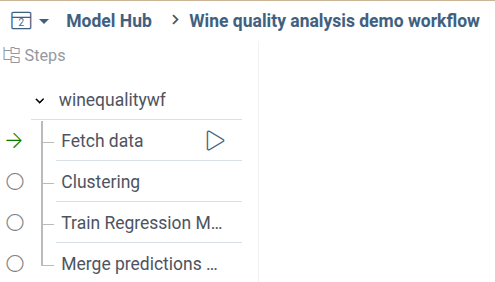
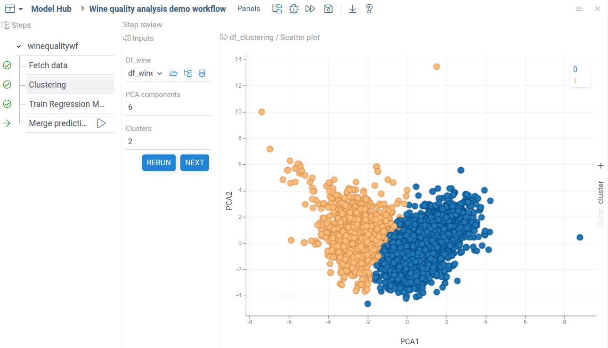
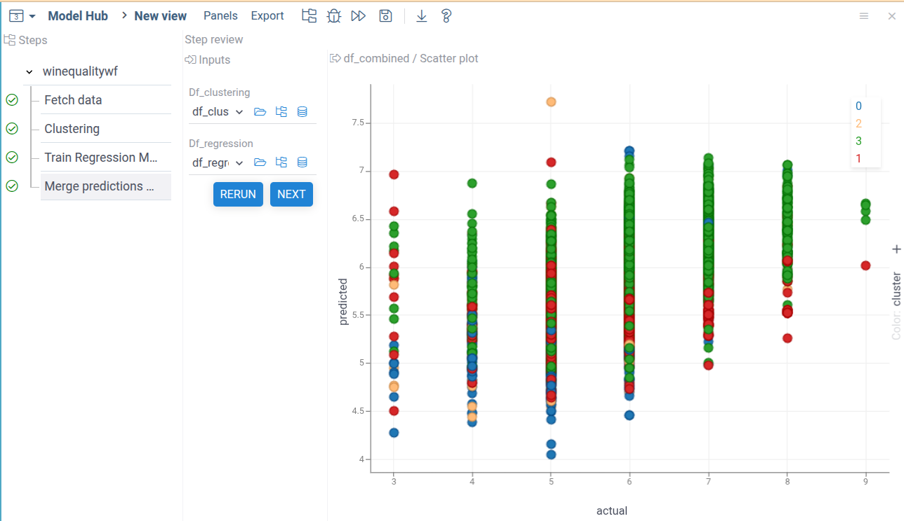
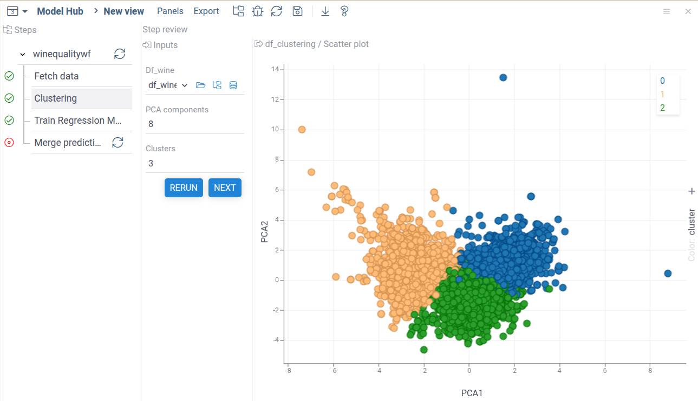

Let's create a multi-step analysis using low-code workflows.
We'll analyze the standard Wine Quality dataset as an example.

We'll make a workflow that can make the following:

1. Load the public dataset,
2. Perform two separate calculations:
    * Regression to predict wine quality.
    * Clustering wines based on chemical profile.
3. Combine: Highlight which clusters have best average quality.

The final code of the package can be found in the
[GitHub repository](https://github.com/GennadiyZakharov/winequalitywf)

## Development setup and minimal workflow

Setup a dev environment as described
[here](../../develop/dev-process/set-up-environment).

To create a package for workflow, run the following commands:

```shell
grok create winequalitywf
cd winequalitywf
npm i @datagrok-libraries/compute-api
```

### Dependencies

Go to the `package.json` file and change the dependencies section:

```json
"dependencies": {
    "@datagrok-libraries/compute-api": "^0.6.3",
    "@datagrok-libraries/utils": "^4.4.0",
    "cash-dom": "^8.1.4",
    "datagrok-api": "^1.21.3",
    "dayjs": "=1.11.10"
  },
```

### Minimal workflow script

Place the following code to the `src/package.ts` file:
```typescript
/* Do not change these import lines to match external modules in webpack configuration */
import * as grok from 'datagrok-api/grok';
import * as ui from 'datagrok-api/ui';
import * as DG from 'datagrok-api/dg';
import type { PipelineConfiguration } from '@datagrok-libraries/compute-api';
import dayjs from 'dayjs';
import utc from 'dayjs/plugin/utc';
import timezone from 'dayjs/plugin/timezone';

dayjs.extend(utc);
dayjs.extend(timezone);

export const _package = new DG.Package();

//tags: model
//editor: Compute2:TreeWizardEditor
//input: object params
//output: object result
export async function WineQualityWf(params: any) {
  const c: PipelineConfiguration = {
    id: 'winequalitywf',
    nqName: 'winequalitywf:WineQualityWf',
    version: '1.0',
    type: 'static',
    steps: [{
      id: 'step1',
      nqName: 'winequalitywf:MyAddScript',
    }]
  };
  return c;
}

//input: double a
//input: double b
//output: double c
export function MyAddScript(a: number, b: number) {
  return a + b;
}
```

The imports of `utc`, `timezone` and `daysjs` are required for the `TreeWizardEditor` to work.

In the main part of the script, we define the `WineQualityWf` function that creates and returns
a JSON object with the `PipelineConfiguration` type that defines our workflow.
The `nqName:` key of the configuration should always contain the name of the main function and main script.
In our case this is `winequalitywf:WineQualityWf`

The `steps` array defines steps of our workflow.
For now, this is a mock step that adds two numbers.
The `nqName: 'winequalitywf:MyAddScript'` key maps the workflow step 1
to the custom function `MyAddScript`.

After run the following from the package root directory (change local to
the actual Datagrok instance if needed).

```shell
npm i && npm run build && grok publish local --release
```

Note that publish `--release` flag is mandatory for workflow.

Reload Datagrok page, open the **ModelHub** in the **Apps->Compute** sections,
and run the `MyWorkflow` model.
You will see the following interface:


## Using scripts for workflow steps

Now, let's make our workflow useful — add to it some logic.
Since Datagrok supports multi-language development,
we can implement computational logic using any supported language.
For this example, we'll use Python as the most used data science language.

Make the folder `scripts` inside your package and add
the file `fetchwinedata.py` with the following code:

```python
#name: fetchwinedata
#description: Fetch Wine quality dataset from web
#language: python
#input: string url_red = "https://archive.ics.uci.edu/ml/machine-learning-databases/wine-quality/winequality-red.csv"
#input: string url_white = "https://archive.ics.uci.edu/ml/machine-learning-databases/wine-quality/winequality-white.csv"
#output: dataframe df_wine
#output: int total_lines

# Load datasets
df_red = pd.read_csv(url_red, sep=';')
df_white = pd.read_csv(url_white, sep=';')

# Add a column to distinguish wine types
df_red["wine_type"] = "red"
df_white["wine_type"] = "white"

# Combine both datasets
df_wine = pd.concat([df_red, df_white], ignore_index=True)
df_wine.reset_index(drop=True, inplace=True)
total_lines = df_wine.shape[0]
```

Change the step function in the main `package.ts` file:


```typescript
  const c: PipelineConfiguration = {
    id: 'winequalitywf',
    nqName: 'winequalitywf:WineQualityWf',
    version: '1.0',
    type: 'static',
    steps: [{
      id: 'fetchdata',
          friendlyName: 'Fetch data',
          nqName: 'winequalitywf:fetchwinedata',
    }]
  };

```

Compile and publish the package:

```shell
npm i && npm run build && grok publish local --release
```

Open the workflow and run the first Let's run the workflow. You will see the following:


Datagrok recognized declared inputs in the Python script
and automatically created UI for it.

## Connecting steps

Now, let's add a step that performes some calculations with the fetched data.
For example, try to cluster different wine data based on the wine characteristics.

Add to the scripts the second file `clusterwinedata.py` with the following content:

```python
#name: clusterwinedata
#description: Cluster fetched data
#language: python
#input: dataframe df_wine
#input: int n_pca = 8 { caption: PCA components } [Number of PCA components to cluster]
#input: int n_clusters = 4 {caption: Clusters} [Number of clusters for K-means]
#output: dataframe df_clustering { viewer: scatterPlot(x:"PCA1", y:"PCA2", color:"cluster")}

import pandas as pd
from sklearn.preprocessing import StandardScaler
from sklearn.decomposition import PCA
from sklearn.cluster import KMeans

# --- Step 1: Preprocessing ---
features = df_wine.drop(labels=["quality", "wine_type"], axis=1)
scaler = StandardScaler()
X_scaled = scaler.fit_transform(features)

# --- Step 2: PCA for visualization ---
pca = PCA(n_components=n_pca)
X_pca = pca.fit_transform(X_scaled)

# --- Step 3: K-means clustering ---
kmeans = KMeans(n_clusters=n_clusters, random_state=42)
clusters = kmeans.fit_predict(X_scaled).astype(str)

# --- Step 4: Plotting ---
df_clustering = pd.DataFrame({
    "PCA1": X_pca[:, 0],
    "PCA2": X_pca[:, 1],
    "cluster": clusters,
    "wine_type": df_wine["wine_type"]
}, index=df_wine.index)
```

This script runs PCA and then simple k-means clustering on the all wine characteristics,
excluding quality and type.

Now, we need to add the clustering step to the pipeline.

Add the data clustering step to the pipeline configuration

```typescript
steps: [
        {
          id: 'fetchdata',
          friendlyName: 'Fetch data',
          nqName: 'winequalitywf:fetchwinedata',
        },
        {
          id: 'clusterwinedata',
          friendlyName: 'Clustering',
          nqName: 'winequalitywf:clusterwinedata',
        }
]
```

After the `steps` section add the `links` list,
describing the data link between steps:

```typescript
links: [
      {
        id: 'winedatatoclustering',
        type: 'data',
        from: [
          'value_in:fetchdata/df_wine',
        ],
        to: [
          'value_out:clusterwinedata/df_wine',
        ],
      }
]
```

The `id` field is a user-specified name of the link.
The fields `from` and `to` contain description of inputs and outputs of steps,
that the link can use.

For now, we're using a simple notation defining a static link between two steps.
Lists `from` and `to` contain only one value, defined in the format
`<direction>:<step><parameter>`
Please, not that here `<step>` name refers to the name defined in the pipeline configuration,
not the name of the script itself.
This allows you to create several steps with different input using the same script
defining step logic.

Inputs and outputs are described using the **Link Query Language**.
Links system of the low-code workflow is very flexible and allows dynamic matching
of step inputs and outputs for dynamically added steps,
and even between different workflows.
To find more information about link capabilities,
see the [Link types](./link-types.mdx) section of the documentation.


Publish the package:

```shell
npm i && npm run build && grok publish local --release
```

Open the workflow pachage in Datagrok and run the first step.
On the second step you'll see the following:


AS you can see, the fetched dataframe with wine data was automatically
feeded into the step input.

### Adding output visualization

Let's improve the clustering step input and output.
First, we can add a visualization to the output data.
The best way to do it is use **Datagrok Scatterplot** — a high-performant and customixable
scatterplot viewer.
To do it, modify the output declaration of the clustering script:

```python
#output: dataframe df_clustering { viewer: scatterPlot(x:"PCA1", y:"PCA2", color:"cluster")}
```

Here we specified dataframe columns for x, y, and color.
You can here use all scatterplot properties.
To fine mode about output viewer, visit the page
[Visualize output data](../scripting/scripting-features/visualize-output-data.md) section

Publish and run the workflow. You'll get the following:


### Adding input parameters

To make the clusterign step configurable,
let's add number of clusters and PCA components to the script inputs.

Add parameters to the input declaration:

```python
#input: int n_pca = 6 { caption: PCA components } [Number of PCA components to cluster]
#input: int n_clusters = 2 {caption: Clusters} [Number of clusters for K-means]
```

And modify the PCA and clustering code like this:

```python
pca = PCA(n_components=n_pca)
...
kmeans = KMeans(n_clusters=n_clusters, random_state=42)
```

Now you can change the number of clusters and PCA components.


## Adding the regression step

Now, let's add one more step to our workflow.
Now we want to create a regression model to predict wine quality based on the numeric data.

Add the file `trainregression.py` to the `scripts` folder:

```python
#name: trainregression
#description: Train regression on wine quality data
#language: python
#input: dataframe df_wine
#input: double test_size = 0.2 {caption: Fraction of test data; min:0.1; max:0.5 }
#output: dataframe df_regression { viewer: scatterPlot(x:"actual", y:"predicted")}

import pandas as pd
from sklearn.model_selection import train_test_split
from sklearn.linear_model import LinearRegression
from sklearn.metrics import mean_squared_error, r2_score

# --- Prepare features and target ---
X = df_wine.drop(columns=["quality", "wine_type"])  # features
y = df_wine["quality"]  # target

# --- Train/test split ---
X_train, X_test, y_train, y_test = train_test_split(X, y, test_size=0.2, random_state=42)

# --- Train model ---
model = LinearRegression()
model.fit(X_train, y_train)

# --- Predict and evaluate on the test data ---
y_pred = model.predict(X_test)
mse = mean_squared_error(y_test, y_pred)
r2 = r2_score(y_test, y_pred)
print(f"R2 score: {r2:.2f}")

# --- Make dataframe actual vs predicted for full-zise data ---
df_regression = pd.DataFrame({
    'actual': y,
    'predicted': model.predict(X),
}, index=df_wine.index)
```

Add to the `package.ts` the new step:

```typescript
steps: [
        ...
        {
          id: 'clusterwinedata',
          friendlyName: 'Clustering',
          nqName: 'winequalitywf:clusterwinedata',
        },
        {
          id: 'trainregression',
          friendlyName: 'Train Regression Model',
          nqName: 'winequalitywf:trainregression',
        }
]
```

Add the new connection:

```typescript
links: [
      ...
      {
        id: 'winedatatoregression',
        type: 'data',
        from: [
          'value_in:fetchdata/df_wine',
        ],
        to: [
          'value_out:trainregression/df_wine',
        ],
      }
]
```

Publish the package and run the model.
Now you can see the regression step in the workflow.
Both computational steps use data from the data fetch step.


## Combining outputs

The final step is to combine clusterign and refression data in one step.

To do this, first create a simple Python script for the data combining logic.
The script receives two dataframes and return one combined dataframe,
containign regression data, and cluster id from the clusterign dataframe.

```python
#name: mergepredictions
#description: Merge linear regression and clustering data
#language: python
#input: dataframe df_clustering
#input: dataframe df_regression
#output: dataframe df_combined { viewer: scatterPlot(x:"actual", y:"predicted", color:"cluster")}

import pandas as pd

df_combined = df_regression.copy()
df_combined["cluster"] = df_clustering["cluster"]
```

Next, add to the `steps` the description of the new step,
and two static links to the `links` section:

```javascript
const c: PipelineConfiguration = {
    steps: [
        ...
        {
          id: 'mergepredictions',
          friendlyName: 'Merge predictions of two models',
          nqName: 'winequalitywf:mergepredictions',
        }
        ], // we nned comma here because after it we'll have the `links` section
    links: [
      ...
      {
        id: 'regressindatatomerge',
        type: 'data',
        from: [
          'value_in:trainregression/df_regression',
        ],
        to: [
          'value_out:mergepredictions/df_regression',
        ],
      },
      {
        id: 'clusteringtomerge',
        type: 'data',
        from: [
          'value_in:clusterwinedata/df_clustering',
        ],
        to: [
          'value_out:mergepredictions/df_clustering',
        ],
      }
     ]
}
```

Publish and run the model.

```shell
npm i && npm run build && grok publish local --release
```


You'll see the following pipeline tree:



When you fetch the wine quality dataset,
both analysis steps will be automatically marked by green arrows, as ready for execution:


After you run both analysis steps,
the final dat merge step will be marked as ready for execution.


Run it to see the final results.



As you can see, the quality of our prediction is not good.
We have only a slight correlation between the predicted and actual wine quality.
Color by clustering also shows no distribution between classes.

However, the provided examples demonstrate the key capabilities of the
Datagrok Low-code workflows.
A simple Javascript code allows you to assemble your scripts in the workflow buildign blocks,
combining the flexibility of Python/R with the
automated UI construction and blaze-fast interactive viewers.

## Automatic data consistency check

The Datagrok workflow engine also applies an extended set of validations,
ensuring reproducibility of your workflow.
For example, try to run the data merging step,
then change number of clusters and rerun the clustering step.



As you can see, now we have only three clusters,
and the final dama merging step was immediately marked by the red circle.

The workflow engine found input data inconsistency and notified us.
Now the data merge step shows us the **Rerun** buton,
suggesting tu rerun the step.

The Low-code workflow engine provides many advanced tools to
combine flexible data analysis with the ability to
tightly manage workflow state and ensure stable and reproducible results.


